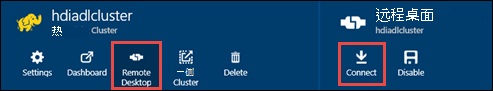

<properties
   pageTitle="使用 Azure 数据湖存储区使用资源管理器模板创建 HDInsight 群集 |Microsoft Azure"
   description="使用 Azure 资源管理器模板来创建和使用 Azure 数据湖存储区使用 HDInsight 群集"
   services="data-lake-store,hdinsight"
   documentationCenter=""
   authors="nitinme"
   manager="jhubbard"
   editor="cgronlun"/>

<tags
   ms.service="data-lake-store"
   ms.devlang="na"
   ms.topic="article"
   ms.tgt_pltfrm="na"
   ms.workload="big-data"
   ms.date="10/21/2016"
   ms.author="nitinme"/>

# <a name="create-an-hdinsight-cluster-with-data-lake-store-using-azure-resource-manager-template"></a>创建与使用 Azure 资源管理器模板数据湖商店 HDInsight 群集

> [AZURE.SELECTOR] - [使用门户网站](data-lake-store-hdinsight-hadoop-use-portal.md) - [使用 PowerShell](data-lake-store-hdinsight-hadoop-use-powershell.md) - [使用资源管理器](data-lake-store-hdinsight-hadoop-use-resource-manager-template.md)

了解如何使用 Azure 资源管理器模板配置 HDInsight 群集到 Azure 数据湖存储区的访问。 此版本的一些重要的注意事项︰

-   **为触发群集 (Linux) 和 Hadoop/风暴群集 （Windows 和 Linux）**、 数据湖商店只能作为一个额外的存储帐户。 此类群集的默认存储帐户仍将 Azure 存储 Blob (WASB)。

-   **对 HBase 群集 （Windows 和 Linux）**、 数据湖商店可以用作默认存储或其他存储。

> [AZURE.NOTE] 注意的一些要点。
>
> - 创建有权访问数据湖商店 HDInsight 群集选项可仅为 3.2 和 3.4 （对于 Windows 以及 Linux 的 Hadoop，HBase 和风暴簇） 的 HDInsight 版本。 对于 Linux 上的触发群集，此选项才可用 HDInsight 3.4 群集上。
>
> - 正如前面提到的数据湖存储在某些群集类型 (HBase) 的默认存储和附加存储空间，对于其他群集类型 Hadoop，触发 （冲击） 是可用的。 作为一个额外的存储帐户使用数据湖存储区不会影响性能或读/写存储从群集的能力。 在数据湖商店用作附加存储空间的情况下，与群集相关的文件 （如日志等） 将写入默认存储 (Azure Blob)，而您想要处理的数据可以存储在一个数据湖存储帐户。
>

在本文中，我们作为额外的存储配置 Hadoop 群集数据湖存储区。

## <a name="prerequisites"></a>系统必备组件

在开始本教程之前，您必须具有以下︰

-   **Azure 订阅**。 请参阅[获取 Azure 免费试用版](https://azure.microsoft.com/pricing/free-trial/)。

-   **Azure PowerShell 1.0 或更高版本**。 了解[如何安装和配置 Azure PowerShell](../powershell-install-configure.md)。

- **Azure 主动目录服务主体**。 在本教程中的步骤介绍了如何在 Azure AD 中创建服务主体。 但是，您必须是 Azure AD 管理员能够创建服务主体。 如果是 Azure AD 管理员，您可以跳过此先决条件，继续本教程。
    
    **如果您不是 Azure AD 管理员**，您将不能执行创建服务主体所需的步骤。 在这种情况下，Azure AD 管理员必须先创建服务主体与数据湖商店创建 HDInsight 群集之前。 此外，服务主体必须使用创建一个证书，在[创建服务主体与证书](../resource-group-authenticate-service-principal.md#create-service-principal-with-certificate)所述。

## <a name="create-an-hdinsight-cluster-with-azure-data-lake-store"></a>使用 Azure 数据湖存储创建一个 HDInsight 群集

[部署具有新数据湖商店 HDInsight Linux 群集](https://github.com/Azure/azure-quickstart-templates/tree/master/201-hdinsight-datalake-store-azure-storage)在 GitHub 上有资源管理器模板中，并使用该模板，先决条件。 按照在此链接中提供的说明来使用 Azure 数据湖其他存储系统的存储区创建 HDInsight 群集。

在上面提到的链接的说明要求 PowerShell。 您使用这些指令启动之前，请确保在您登录到您的 Azure 帐户。 从您的桌面，打开一个新的 Azure PowerShell 窗口，并输入下面的代码段。 当系统提示您登录，请确保作为一个订阅 admininistrators/所有者登录︰

```
# Log in to your Azure account
Login-AzureRmAccount

# List all the subscriptions associated to your account
Get-AzureRmSubscription

# Select a subscription
Set-AzureRmContext -SubscriptionId <subscription ID>
```

## <a name="upload-sample-data-to-the-azure-data-lake-store"></a>将示例数据上载到 Azure 数据湖存储区

资源管理器模板创建新的数据湖存储帐户，并将其与 HDInsight 群集。 现在必须将一些示例数据上载到数据湖商店。 教程从 HDInsight 群集访问数据湖存储中的数据运行作业中以后，您将需要此数据。 有关如何上载数据的说明，请参阅[上载到数据湖存储区文件](data-lake-store-get-started-portal.md#uploaddata)。 如果您正在寻找一些示例数据上载，可以从[Azure 数据湖 Git 存储库](https://github.com/Azure/usql/tree/master/Examples/Samples/Data/AmbulanceData)获取**急救数据**文件夹。

## <a name="set-relevant-acls-on-the-sample-data"></a>一组相关 Acl 的示例数据

若要确保您上载示例数据，可以从 HDInsight 群集访问，您必须确保 Azure 的广告应用程序，用于建立 HDInsight 群集数据湖存储之间的标识能够访问您试图访问的文件/文件夹。 若要执行此操作，请执行以下步骤。

1.  查找的 Azure AD 应用程序与 HDInsight 群集和数据湖存储相关联的名称。 若要查找该名称的一种方法是打开 HDInsight 群集刀片式服务器使用资源管理器模板创建，**群集 AAD 标识**选项卡，然后查找**服务主体显示名称**的值。

2.  现在，您想从 HDInsight 群集访问的文件/文件夹提供访问此 Azure AD 的应用程序。 数据存储中存储湖文件/文件夹上设置适当的 Acl，请参阅[保护数据湖存储区中的数据](data-lake-store-secure-data.md#assign-users-or-security-group-as-acls-to-the-azure-data-lake-store-file-system)。

## <a name="run-test-jobs-on-the-hdinsight-cluster-to-use-the-data-lake-store"></a>在 HDInsight 群集使用数据湖存储上运行测试作业

配置 HDInsight 群集后，您可以测试 HDInsight 群集可以访问数据湖存储在群集上运行测试作业。 为此，我们将运行创建表使用的示例数据来早上载到数据存储区湖泊的示例配置单元作业。

### <a name="for-a-linux-cluster"></a>对于 Linux 群集

在本部分将 SSH 到群集并运行示例配置单元查询。 Windows 不提供内置的 SSH 客户端。 我们建议使用**PuTTY**，这可以从[http://www.chiark.greenend.org.uk/~sgtatham/putty/download.html](http://www.chiark.greenend.org.uk/~sgtatham/putty/download.html)下载。

使用 PuTTY 的详细信息，请参阅[使用 SSH 在从 Windows HDInsight 基于 Linux 的 Hadoop 使用](../hdinsight/hdinsight-hadoop-linux-use-ssh-windows.md)。

1.  建立连接后，使用下面的命令启动配置单元 CLI:

    ```
    hive
    ```

2.  使用 CLI，输入下列语句来创建新的表名**车辆**为数据存储中存储湖中使用的示例数据︰

    ```
    DROP TABLE vehicles;
    CREATE EXTERNAL TABLE vehicles (str string) LOCATION 'adl://<mydatalakestore>.azuredatalakestore.net:443/';
    SELECT * FROM vehicles LIMIT 10;
    ```

    您应该看到类似于下面的输出︰

    ```
    1,1,2014-09-14 00:00:03,46.81006,-92.08174,51,S,1
    1,2,2014-09-14 00:00:06,46.81006,-92.08174,13,NE,1
    1,3,2014-09-14 00:00:09,46.81006,-92.08174,48,NE,1
    1,4,2014-09-14 00:00:12,46.81006,-92.08174,30,W,1
    1,5,2014-09-14 00:00:15,46.81006,-92.08174,47,S,1
    1,6,2014-09-14 00:00:18,46.81006,-92.08174,9,S,1
    1,7,2014-09-14 00:00:21,46.81006,-92.08174,53,N,1
    1,8,2014-09-14 00:00:24,46.81006,-92.08174,63,SW,1
    1,9,2014-09-14 00:00:27,46.81006,-92.08174,4,NE,1
    1,10,2014-09-14 00:00:30,46.81006,-92.08174,31,N,1
    ```

### <a name="for-a-windows-cluster"></a>对于 Windows 群集

使用以下 cmdlet 以运行该配置单元查询。 在此查询中我们从数据湖存储区中的数据创建一个表，然后运行选择查询创建的表。

```
$queryString = "DROP TABLE vehicles;" + "CREATE EXTERNAL TABLE vehicles (str string) LOCATION 'adl://$dataLakeStoreName.azuredatalakestore.net:443/';" + "SELECT * FROM vehicles LIMIT 10;"

$hiveJobDefinition = New-AzureRmHDInsightHiveJobDefinition -Query $queryString

$hiveJob = Start-AzureRmHDInsightJob -ResourceGroupName $resourceGroupName -ClusterName $clusterName -JobDefinition $hiveJobDefinition -ClusterCredential $httpCredentials

Wait-AzureRmHDInsightJob -ResourceGroupName $resourceGroupName -ClusterName $clusterName -JobId $hiveJob.JobId -ClusterCredential $httpCredentials
```

这会产生下面的输出。 **ExitValue**的输出中的 0 表示作业已成功完成。

```
Cluster         : hdiadlcluster.
HttpEndpoint    : hdiadlcluster.azurehdinsight.net
State           : SUCCEEDED
JobId           : job_1445386885331_0012
ParentId        :
PercentComplete :
ExitValue       : 0
User            : admin
Callback        :
Completed       : done
```

通过使用以下 cmdlet 检索作业的输出︰

```
Get-AzureRmHDInsightJobOutput -ClusterName $clusterName -JobId $hiveJob.JobId -DefaultContainer $containerName -DefaultStorageAccountName $storageAccountName -DefaultStorageAccountKey $storageAccountKey -ClusterCredential $httpCredentials
```

作业输出如下所示︰

```
1,1,2014-09-14 00:00:03,46.81006,-92.08174,51,S,1
1,2,2014-09-14 00:00:06,46.81006,-92.08174,13,NE,1
1,3,2014-09-14 00:00:09,46.81006,-92.08174,48,NE,1
1,4,2014-09-14 00:00:12,46.81006,-92.08174,30,W,1
1,5,2014-09-14 00:00:15,46.81006,-92.08174,47,S,1
1,6,2014-09-14 00:00:18,46.81006,-92.08174,9,S,1
1,7,2014-09-14 00:00:21,46.81006,-92.08174,53,N,1
1,8,2014-09-14 00:00:24,46.81006,-92.08174,63,SW,1
1,9,2014-09-14 00:00:27,46.81006,-92.08174,4,NE,1
1,10,2014-09-14 00:00:30,46.81006,-92.08174,31,N,1
```

## <a name="access-data-lake-store-using-hdfs-commands"></a>访问数据湖存储区使用 HDFS 命令

一旦配置 HDInsight 群集使用数据湖商店，可以使用 HDFS 外壳命令来访问存储区。

### <a name="for-a-linux-cluster"></a>对于 Linux 群集

通过本节，您将 SSH 到群集并运行 HDFS 的命令。 Windows 不提供内置的 SSH 客户端。 我们建议使用**PuTTY**，这可以从[http://www.chiark.greenend.org.uk/~sgtatham/putty/download.html](http://www.chiark.greenend.org.uk/~sgtatham/putty/download.html)下载。

使用 PuTTY 的详细信息，请参阅[使用 SSH 在从 Windows HDInsight 基于 Linux 的 Hadoop 使用](../hdinsight/hdinsight-hadoop-linux-use-ssh-windows.md)。

建立连接后，使用以下 HDFS 文件系统命令列出数据湖存储中的文件。

```
hdfs dfs -ls adl://<Data Lake Store account name>.azuredatalakestore.net:443/
```

这应列出前面到数据湖存储上载的文件。

```
15/09/17 21:41:15 INFO web.CaboWebHdfsFileSystem: Replacing original urlConnectionFactory with org.apache.hadoop.hdfs.web.URLConnectionFactory@21a728d6
Found 1 items
-rwxrwxrwx   0 NotSupportYet NotSupportYet     671388 2015-09-16 22:16 adl://mydatalakestore.azuredatalakestore.net:443/mynewfolder
```

您还可以使用`hdfs dfs -put`命令来将某些文件上载到数据湖存储器内，然后使用`hdfs dfs -ls`来验证是否已成功上载文件。

### <a name="for-a-windows-cluster"></a>对于 Windows 群集

1.  登录到新[Azure 门户](https://portal.azure.com)。

2.  单击**浏览**， **HDInsight 群集**，请单击，然后单击创建 HDInsight 群集。

3.  在群集刀片式服务器，单击**远程桌面**，然后在**远程桌面**刀片式服务器，单击**连接**。

    

    出现提示时，输入您的远程桌面用户提供的凭据。

4.  在远程会话中，启动 Windows PowerShell 并使用 HDFS 文件系统命令列出 Azure 数据湖存储区中的文件。

    ```
    hdfs dfs -ls adl://<Data Lake Store account name>.azuredatalakestore.net:443/
    ```

    这应列出前面到数据湖存储上载的文件。

    ```
    15/09/17 21:41:15 INFO web.CaboWebHdfsFileSystem: Replacing original urlConnectionFactory with org.apache.hadoop.hdfs.web.URLConnectionFactory@21a728d6
    Found 1 items
    -rwxrwxrwx   0 NotSupportYet NotSupportYet     671388 2015-09-16 22:16 adl://mydatalakestore.azuredatalakestore.net:443/vehicle1_09142014.csv
    ```

    您还可以使用`hdfs dfs -put`命令来将某些文件上载到数据湖存储器内，然后使用`hdfs dfs -ls`来验证是否已成功上载文件。

## <a name="next-steps"></a>下一步行动

-   [将数据复制到数据湖商店 Azure 存储 Blob](data-lake-store-copy-data-wasb-distcp.md)
