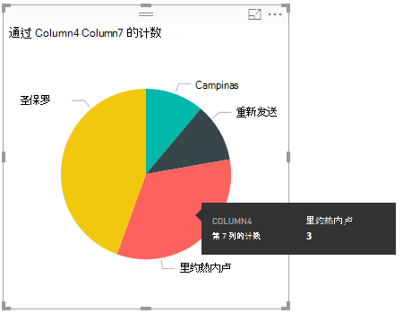

<properties
   pageTitle="使用电源 BI 分析数据湖存储区中的数据 |Microsoft Azure"
   description="使用电源 BI Azure 数据湖存储中的数据进行分析"
   services="data-lake-store" 
   documentationCenter=""
   authors="nitinme"
   manager="jhubbard"
   editor="cgronlun"/>

<tags
   ms.service="data-lake-store"
   ms.devlang="na"
   ms.topic="article"
   ms.tgt_pltfrm="na"
   ms.workload="big-data"
   ms.date="10/05/2016"
   ms.author="nitinme"/>

# 使用电源 BI 分析数据湖存储区中的数据

在本文中，您将学习如何使用电源双桌面来分析和可视化 Azure 数据湖存储区中存储的数据。

## 系统必备组件

在开始本教程之前，您必须具有以下︰

- **Azure 订阅**。 请参阅[获取 Azure 免费试用版](https://azure.microsoft.com/pricing/free-trial/)。

- **Azure 数据湖存储帐户**。 按照在[学习如何使用 Azure 数据湖存储区使用 Azure 门户](data-lake-store-get-started-portal.md)的说明。 本文假定已经创建了一个数据湖存储帐户，称为**mybidatalakestore**，并向其上载示例数据文件 (**Drivers.txt**)。 此示例文件是从[Azure 数据湖 Git 存储库](https://github.com/Azure/usql/tree/master/Examples/Samples/Data/AmbulanceData/Drivers.txt)下载。

- **电源双桌面**。 您可以从[Microsoft 下载中心](https://www.microsoft.com/en-us/download/details.aspx?id=45331)下载这。 

## 在电源 BI 桌面上创建报表

1. 在您的计算机上启动电源双桌面。

2. 从**主**功能区中，单击**获取数据**，然后单击更多。 在**获取数据**对话框中，单击**Azure**， **Azure 数据湖存储区**，请单击，然后单击**连接**。

    

3. 如果您看到有关连接器处于开发阶段的对话框中，选择继续。

4. 在**Microsoft Azure 数据湖存储**对话框中，提供个人数据湖存储的 URL，然后单击**确定**。

    

5. 在下一个对话框中，单击**登录**登录到数据湖存储帐户。 您将被重定向到您的组织的登录页面。 按照提示登录到该帐户。

    

6. 成功登录后，请单击**连接**。

    

7. 下一个对话框显示您上载到数据湖存储帐户的文件。 验证信息，然后单击**加载**。

    

8. 数据已成功地加载到双电源后，您将看到以下字段的**字段**选项卡中。

    

    但是，可视化和分析数据，我们愿意为每以下字段可用的数据

    

    在下面的步骤中，我们将更新查询进行转换所需的格式中导入的数据。

9. 从**主**功能区中，单击**编辑查询**。

    

10. 在查询编辑器中，在**内容**列，单击**二进制文件**。

    

11. 您将看到一个文件图标，表示您上载的**Drivers.txt**文件。 右键单击该文件，然后单击**CSV**。  

    

12. 您会看到输出，如下所示。 您的数据现已在一种可用来创建可视化项的格式提供。

    

13. 从**主**功能区中，单击**关闭和应用**，然后单击**关闭并应用**。

    

14. 一旦更新查询时，**字段**选项卡将显示可用于可视化的新字段。

    

15. 让我们创建一个饼图来表示每个给定的国家/地区的城市中的驱动程序。 若要执行此操作，请选择下列选项。

    1. 从可视化效果选项卡，单击饼图的符号。

        

    2. 我们要使用的列的**列 4** （城市名） 和**列 7** （国家/地区的名称）。 从选项卡中**的字段**拖到**可视化效果**选项卡的这些列，如下所示。

        

    3. 饼形图应类似如下所示类似。

        

16. 通过从页面级筛选器中选择特定的国家，现在可以看到所选国家/地区每个城市中的驱动程序的数量。 例如，在**可视化效果**选项卡上，在**页面级别进行筛选**，选择**巴西**。

    

17. 饼图图表将自动更新以显示驱动程序，在巴西的城市。

    

18. 从**文件**菜单上，单击**保存**以保存为电源双桌面文件的可视化。

## 将报表发布到电源 BI 服务

一旦在电源 BI 桌面上创建可视化项，则您可以通过将其发布到电源 BI 服务而与其他人进行共享。 有关如何执行此操作的说明，请参阅[从电源双桌面发布](https://powerbi.microsoft.com/documentation/powerbi-desktop-upload-desktop-files/)。

## 请参见

* [分析使用数据湖分析数据湖存储区中的数据](../data-lake-analytics/data-lake-analytics-get-started-portal.md)
