<properties 
   pageTitle="保护数据存储在 Azure 数据湖存储 |Microsoft Azure" 
   description="了解如何安全使用组 Azure 数据湖存储区中的数据以及访问控制列表" 
   services="data-lake-store" 
   documentationCenter="" 
   authors="nitinme" 
   manager="jhubbard" 
   editor="cgronlun"/>
 
<tags
   ms.service="data-lake-store"
   ms.devlang="na"
   ms.topic="article"
   ms.tgt_pltfrm="na"
   ms.workload="big-data" 
   ms.date="09/29/2016"
   ms.author="nitinme"/>

# 在 Azure 数据湖存储区中存储的数据保护

保护 Azure 数据湖存储区中的数据是一种三步的方法。

1. 首先在 Azure 活动目录 (AAD) 创建安全组。 这些安全组用于在 Azure 门户中实现基于角色的访问控制 (RBAC)。 有关详细信息，请参阅[Microsoft Azure 中基于角色的访问控制](../active-directory/role-based-access-control-configure.md)。

2. 分配到 Azure 数据湖存储帐户 AAD 安全组。 此参数控制访问到数据湖存储帐户从门户或 Api 的门户和管理操作。

3. 作为访问控制列表 (Acl) 数据湖存储文件系统在分配 AAD 安全组。

4. 此外，还可以为客户端可以访问数据湖存储区中的数据设置 IP 地址范围。

本文说明如何使用 Azure 的门户网站来执行上述任务。 数据湖商店如何实现安全级别的帐户和数据的详细信息，请参阅[Azure 数据湖存储区中的安全](data-lake-store-security-overview.md)。 Acl Azure 数据湖存储区中的实现方式的深入的信息，请参阅[概述的访问控制数据湖存储区中](data-lake-store-access-control.md)。

## 系统必备组件

在开始本教程之前，您必须具有以下︰

- **Azure 订阅**。 请参阅[获取 Azure 免费试用版](https://azure.microsoft.com/pricing/free-trial/)。
- **Azure 数据湖存储帐户**。 有关如何创建一个的说明，请参阅[开始使用 Azure 数据湖存储区](data-lake-store-get-started-portal.md)

## 在 Azure Active Directory 中创建安全组

有关如何创建 AAD 安全组以及如何将用户添加到组的说明，请参阅[在 Azure Active Directory 管理安全组](../active-directory/active-directory-accessmanagement-manage-groups.md)。

## 对 Azure 数据湖存储帐户分配用户或安全组

到 Azure 数据湖存储帐户分配用户或安全组，您可以控制访问帐户使用 Azure 门户和 Azure 资源管理器 Api 的管理操作。 

1. 打开 Azure 数据湖存储帐户。 从左窗格中，单击**浏览**，单击**数据湖存储区**，然后从数据湖商店刀片式服务器，单击您想要分配用户或安全组的帐户名。

2. 在您数据湖存储帐户刀片式服务器，单击**设置**。 从**设置**刀片式服务器，请单击**用户**。

    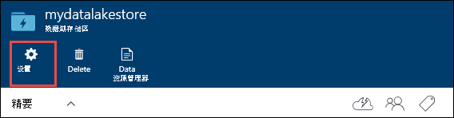

3. 默认情况下**用户**刀片式服务器作为所有者列出**订阅管理员**组。 

    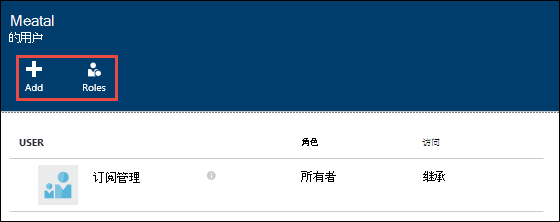
 
    有两种方法来添加一个组和分配相关的角色。

    * 添加用户/组帐户，然后将分配一个角色，或
    * 添加一个角色，然后将用户/用户组分配给角色。

    在本节中，我们看第一种方法，添加组，然后将分配角色。 您可以执行类似的步骤，首先选择角色，然后将组分配到该角色。
    
4. 在**用户**刀片式服务器，请单击**添加**以打开**添加访问**刀片式服务器。 中**添加访问**刀片式服务器，单击**选择一个角色**，然后选择用户组的角色。

     

    **所有者**和**参与者**角色数据湖帐户提供对各种管理功能的访问。 对于将与数据湖中的数据进行交互的用户，可以将它们添加到**读者**角色。 这些角色的范围仅限于与 Azure 数据湖商店客户管理操作。

    对于数据操作单个文件系统权限定义用户可以执行哪些操作。 因此，具有读者角色的用户可以仅查看与帐户相关联的管理设置，但可以有可能读取和写入数据基于文件系统的权限分配给他们。 在[分配到 Azure 数据湖存储文件系统 Acl 作为安全组](#filepermissions)介绍了数据湖存储文件系统权限。

5. 在**添加访问**刀片式服务器，单击**添加用户**打开**添加用户**刀片。 在此刀片，查找在 Azure Active Directory 的前面部分中创建的安全组。 如果您有大量的组中搜索，使用顶部的文本框中要作为筛选依据的组名称。 单击**选择**。

    

    如果您想要添加未列出的组/用户，可以通过使用**邀请**图标并指定用户组的电子邮件地址来邀请他们。

6. 单击**确定**。 您应该看到如下所示添加安全组。

    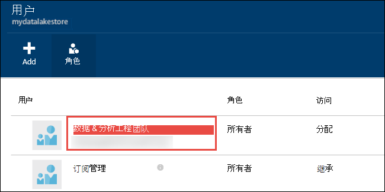

7. 您的用户/安全组现在有 Azure 数据湖存储帐户的访问权限。 如果您想要为特定用户提供访问权限，可以将它们添加到安全组。 同样，如果要撤销用户的访问权限，您可以从安全组中删除它们。 您还可以向客户分配多个安全组。 

## 将用户或安全组作为 Acl 分配给 Azure 数据湖存储文件系统

通过对 Azure 数据湖文件系统分配用户/安全组，您可以设置 Azure 数据湖存储区中存储的数据的访问控制。

1. 在您数据湖存储帐户刀片式服务器，单击**数据资源管理器**。

    

2. 在**数据资源管理器**刀片式服务器，该文件或文件夹，您要为其配置 ACL，请单击，然后单击**访问**。 要将 ACL 分配给文件，必须从**文件预览**刀片式服务器单击**访问**。

    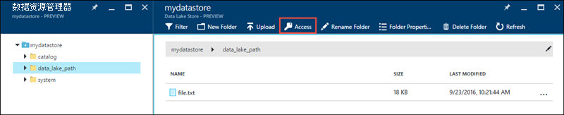

3. **访问**刀片式服务器列出的标准访问和自定义访问已分配给根。 单击**添加**图标可添加自定义级别的 Acl。

    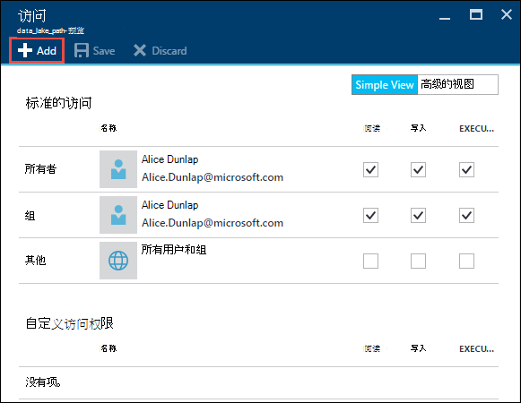

    * **标准访问**是 UNIX 样式的访问，您可以在其中指定读取、 写入、 执行三个不同的用户类 (rwx): 所有者、 组以及其他人。
    * **自定义访问权限**对应 POSIX Acl，您可以为特定的已命名的用户或组，并不只该文件的所有者或组设置权限。 
    
    有关详细信息，请参阅[HDFS Acl](https://hadoop.apache.org/docs/current/hadoop-project-dist/hadoop-hdfs/HdfsPermissionsGuide.html#ACLs_Access_Control_Lists)。 Acl 数据存储中存储湖泊中如何实现的详细信息，请参阅[数据湖存储区中的访问控制](data-lake-store-access-control.md)。

4. 单击**添加**图标以打开**添加自定义访问**刀片式服务器。 在此刀片式服务器，单击**选择用户或组**，然后**选择用户或组**刀片，在查找 Azure Active Directory 在前面创建的安全组。 如果您有大量的组中搜索，使用顶部的文本框中要作为筛选依据的组名称。 单击添加，然后单击**选择**您要的组。

    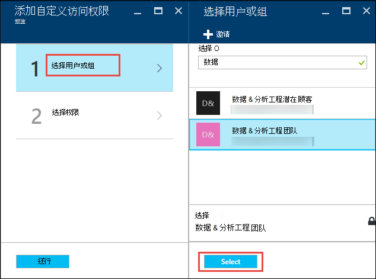

5. 单击**选择权限**选择权限，是否要将权限分配的默认 ACL，访问和 / 或 ACL。 单击**确定**。

    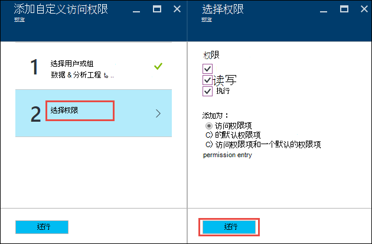

    有关数据湖存储和默认值中的访问 Acl 中的权限的详细信息，请参阅[数据湖存储区中的访问控制](data-lake-store-access-control.md)。

6. 在**添加自定义访问**刀片式服务器，请单击**确定**。 新添加的组中，使用相关联的权限，现在将列入**访问**刀片式服务器。

    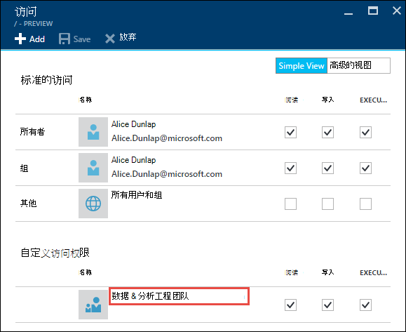

    > [AZURE.IMPORTANT] 在当前版本中，只能有**自定义访问权限**下的 9 项。 如果您想要添加 9 个以上的用户，您应该创建安全组，请将用户添加到安全组中，添加为数据湖存储帐户访问这些安全组。

7. 如有必要，您还可以修改访问权限，添加组之后。 清除或选中每种权限类型 （读取、 写入、 执行） 根据您是否删除，或将该权限分配给安全组的复选框。 单击**保存**以保存更改，或**放弃**撤消所做的更改。

## 设置用于数据访问的 IP 地址范围

Azure 数据湖存储使您能够进一步锁定数据存储在网络级别的访问。 您可以启用防火墙、 指定 IP 地址，或定义为受信任的客户端的 IP 地址范围。 一旦启用，只有具有已定义范围内的 IP 地址的客户端可以连接到存储区。

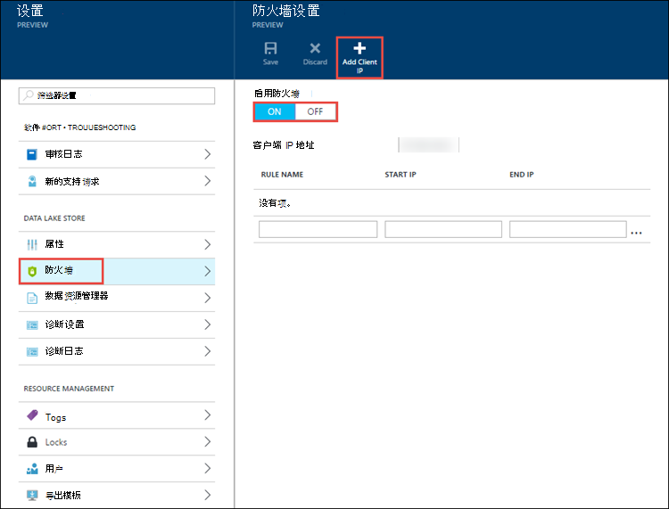

## Azure 数据湖存储帐户的安全组中删除

从 Azure 数据湖存储帐户删除安全组时，您只需要更改访问帐户使用 Azure 门户和 Azure 资源管理器 Api 的管理操作。

1. 在您数据湖存储帐户刀片式服务器，单击**设置**。 从**设置**刀片式服务器，请单击**用户**。

    

2. **用户**刀片式服务器中单击您要删除的安全组。

    

3. 在刀片式服务器中的安全组，请单击**删除**。

    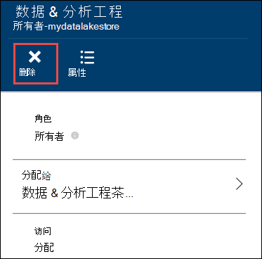

## 从 Azure 数据湖存储文件系统中删除安全组的 Acl

从 Azure 数据湖存储文件系统中删除安全组的 Acl 时，不会更改对数据湖存储区中的数据的访问。

1. 在您数据湖存储帐户刀片式服务器，单击**数据资源管理器**。

    

2. 在**数据资源管理器**刀片式服务器，请单击该文件或文件夹，您要为其删除 ACL，然后在您的帐户刀片式服务器，单击**访问**图标。 若要删除文件的 ACL，您必须单击从**文件预览**刀片式服务器**访问**。

    

3. 在**访问**刀片式服务器，从**自定义访问权限**部分中，单击要删除的安全组。 在**自定义访问**刀片式服务器，单击**删除**，然后单击**确定**。

    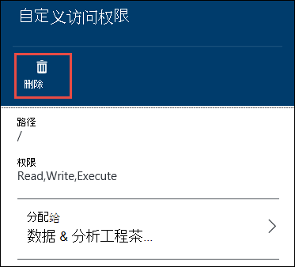

## 请参见

- [Azure 湖存储数据的概览](data-lake-store-overview.md)
- [将数据复制到数据湖商店 Azure 存储 Blob](data-lake-store-copy-data-azure-storage-blob.md)
- [与数据湖商店使用 Azure 数据湖分析](../data-lake-analytics/data-lake-analytics-get-started-portal.md)
- [与数据湖商店使用 Azure HDInsight](data-lake-store-hdinsight-hadoop-use-portal.md)
- [学习如何使用数据使用 PowerShell 的湖泊存储区](data-lake-store-get-started-powershell.md)
- [数据使用.NET SDK 的湖商店开始](data-lake-store-get-started-net-sdk.md)
- [数据湖商店访问诊断日志](data-lake-store-diagnostic-logs.md)
