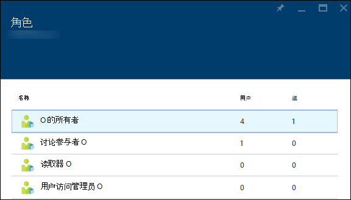
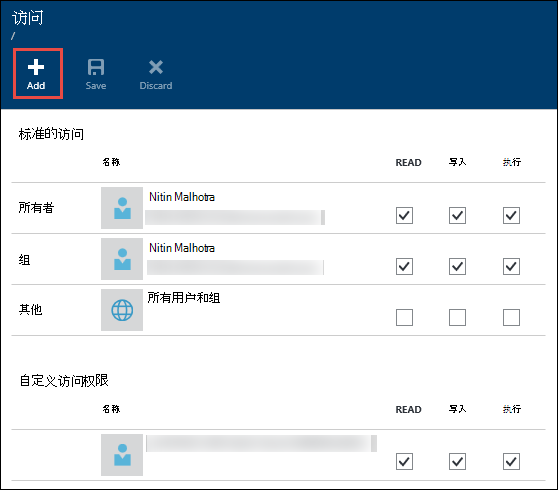
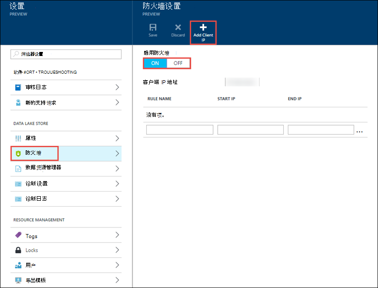
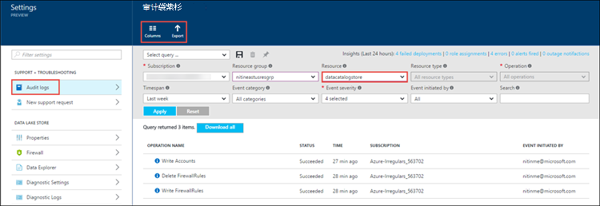
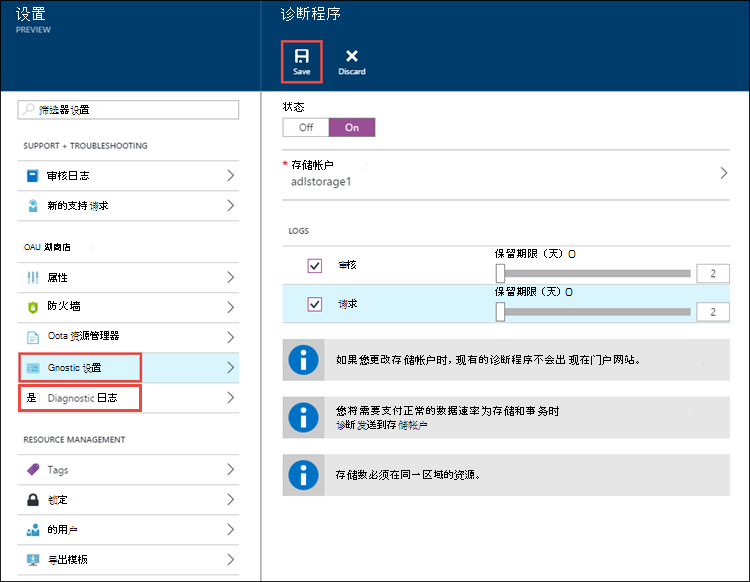

<properties
   pageTitle="数据湖存储区中的安全概述 |Microsoft Azure"
   description="了解如何 Azure 数据湖存储区是一个更安全的大数据存储区"
   services="data-lake-store"
   documentationCenter=""
   authors="nitinme"
   manager="jhubbard"
   editor="cgronlun"/>

<tags
   ms.service="data-lake-store"
   ms.devlang="na"
   ms.topic="article"
   ms.tgt_pltfrm="na"
   ms.workload="big-data"
   ms.date="08/02/2016"
   ms.author="nitinme"/>

# 在 Azure 数据湖存储的安全性

许多企业都利用大数据分析的业务洞察力，帮助他们做出明智的决策。 一个组织可能具有复杂且受管制的环境，与越来越多的不同用户。 这一点至关重要，以确保具有正确的访问权限授予单个用户级别更安全地存储关键业务数据的企业。 Azure 数据湖商店旨在帮助满足这些安全要求。 在本文中，了解数据湖存储区的安全功能包括︰

* 身份验证
* 授权
* 网络隔离
* 数据保护
* 审核

## 身份验证和身份管理

身份验证是按其在用户交互与湖存储数据或连接到数据湖存储任何服务时验证用户的身份的过程。 身份管理和身份验证，数据湖商店使用[Azure Active Directory](../active-directory/active-directory-whatis.md)、 综合性的身份和访问管理云解决方案，它简化了用户和组的管理。

每个 Azure 订阅可以与 Azure Active Directory 的实例相关联。 只有用户和服务身份在 Azure Active Directory 服务中定义通过使用 Azure 的门户中，命令行工具，可以访问数据湖存储帐户，或您的组织使用 Azure 数据湖商店 SDK 通过客户端应用程序的生成。 使用 Azure Active Directory 作为集中式的访问控制机制的主要优点是︰

* 简化的身份生命周期管理。 可以快速创建和快速通过简单地删除或禁用的帐户目录中吊销用户或服务 （服务主体身份） 的身份。

* 多因素身份验证。 [多因素身份验证](../multi-factor-authentication/multi-factor-authentication.md)提供了额外的用户登录和交易的安全。

* 从任何客户机通过开放标准的协议，如 OAuth 或 OpenID 身份验证。

* 与企业目录服务和云标识提供商的联盟。

## 授权和访问控制

Azure Active Directory 进行用户身份验证，以便用户可以访问 Azure 数据湖商店之后，授权控制访问数据湖存储区的权限。 数据湖商店按以下方式分隔为客户相关和数据相关活动的授权︰

* [基于角色的访问控制](../active-directory/role-based-access-control-what-is.md)(RBAC) 由 Azure 帐户管理
* POSIX ACL 访问数据存储区中

### RBAC 的帐户管理

默认情况下，四个基本的角色定义为数据湖商店。 角色允许通过 Azure 门户、 PowerShell cmdlet 和 REST Api 的数据湖存储帐户不同的操作。 所有者和参与者角色可以执行各种管理功能的帐户上。 可以只与数据进行交互的用户分配读者角色。

注意，帐户管理分配角色，尽管某些角色影响对数据的访问。 您需要使用 Acl 来控制访问权限的用户可以在文件系统执行的操作。 下表显示了管理权限和数据访问权限的默认角色的摘要。

| 角色                    | 管理权限               | 数据访问权限 | 解释 |
| ------------------------ | ------------------------------- | ------------------ | ----------- |
| 没有分配角色         | 无                            | 受 ACL    | 用户不能使用 Azure 门户或 Azure PowerShell cmdlet 以浏览数据湖商店。 用户可以使用命令行工具只。
| 所有者  | 所有  | 所有  | 所有者角色是超级用户。 此角色可以管理一切，并有数据的完全访问权限。
| 读取器   | 只读的  | 受 ACL    | 读者角色可以查看所有内容与帐户管理，例如，哪些用户被分配到哪个角色有关。 读者角色不能进行任何更改。   |
| 参与者              | 除添加和删除角色 | 受 ACL    | 参与者角色可以管理一个帐户，如部署以及如何创建和管理通知的某些方面。 参与者角色不能添加或删除角色。
| 用户访问管理员 | 添加和删除角色            | 受 ACL    | 用户访问管理员角色可以管理用户帐户的访问。 |

有关说明，请参阅[分配用户或安全组添加到数据湖存储帐户](data-lake-store-secure-data.md#assign-users-or-security-groups-to-azure-data-lake-store-accounts)。

### 使用 Acl 的文件系统上的操作

数据湖商店是分层文件系统如 Hadoop 分布式文件系统 (HDFS)，并且支持[POSIX Acl](https://hadoop.apache.org/docs/current/hadoop-project-dist/hadoop-hdfs/HdfsPermissionsGuide.html#ACLs_Access_Control_Lists)。 它控制读取 (r)、 写 (w) 和执行 (x) 的资源所有者角色、 所有者组，以及为其他用户和组的权限。 在数据湖商店公共预览 （当前版本），对根文件夹、 子文件夹和单个文件启用 Acl。 应用于根文件夹的 Acl 也将应用于所有子文件夹和文件。

我们建议您定义 Acl 为多个用户使用[的安全组](../active-directory/active-directory-accessmanagement-manage-groups.md)。 将用户添加到安全组，然后将文件或文件夹的 Acl 分配到该安全组。 当您希望提供自定义访问权限，因为您仅限于添加的自定义访问九个条目最多，这很有用。 有关如何更好地保护数据存储在数据湖存储使用 Azure Active Directory 安全组的详细信息，请参阅[分配用户或安全组到 Azure 数据湖存储文件系统 acl](data-lake-store-secure-data.md#filepermissions)。

## 网络隔离

使用数据湖保存到数据存储在网络级别来控制访问。 您可以建立防火墙，并定义为受信任的客户端的 IP 地址范围。 IP 地址范围，仅有的定义范围内的 IP 地址的客户端可以连接到湖边的数据存储。

## 数据保护

组织希望确保其关键业务数据的整个生命周期安全。 数据在传输过程中，数据湖存储使用业界标准的传输层安全性 (TLS) 协议来保护客户端和数据湖存储之间移动的数据。

用于静态数据的数据保护将在将来的版本中可用。

## 审核和诊断日志

您可以使用审核或诊断日志，具体取决于您是否查看日志管理相关的活动或与数据相关的活动。

*  管理相关的活动使用 Azure 资源管理器 Api，并通过审核日志出现在 Azure 的门户。
*  与数据相关的活动使用 WebHDFS REST Api，并通过诊断日志出现在 Azure 的门户。

### 审核日志

为遵守管理法规，组织可能需要足够的审计线索，是否需要深入研究特定的事件。 数据湖商店有内置监视和审核，并且它将记录所有帐户管理活动。

帐户管理审核用于查看和选择要记录的列。 您还可以导出审核日志到 Azure 存储。

### 诊断日志

可以在 Azure 门户 （在诊断设置） 审核跟踪设置数据访问和创建存储日志的 Azure Blob 存储帐户。

配置诊断设置后，您可以在**诊断日志**选项卡上查看日志。

使用 Azure 数据湖存储诊断日志的详细信息，请参阅[为数据湖商店访问诊断日志](data-lake-store-diagnostic-logs.md)。

## 摘要

企业客户要求是安全且易于使用的数据分析云平台。 Azure 数据湖商店旨在帮助标识管理和身份验证通过 Azure Active Directory 集成、 基于 ACL 的授权、 网络隔离和数据加密传输过程中和通过这些要求停留 （今年将来，） 的地址和审核。

如果您想要查看数据湖存储区中的新功能，发送您的反馈[数据存储 UserVoice 湖论坛](https://feedback.azure.com/forums/327234-data-lake)中。

## 请参见

- [Azure 湖存储数据的概览](data-lake-store-overview.md)
- [学习如何使用数据湖存储区](data-lake-store-get-started-portal.md)
- [保护数据湖存储区中的数据](data-lake-store-secure-data.md)
