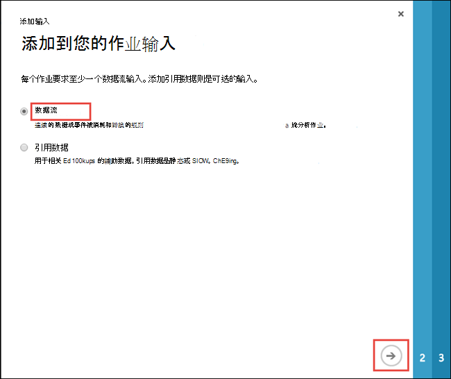
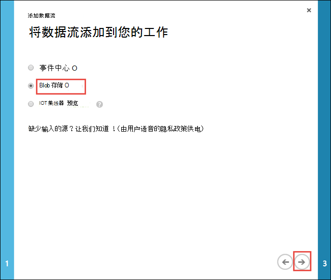
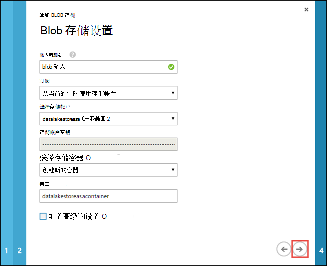
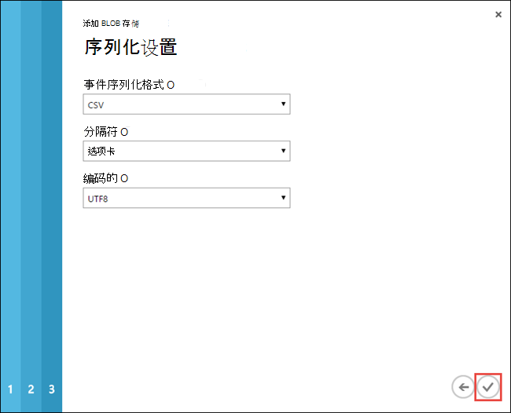
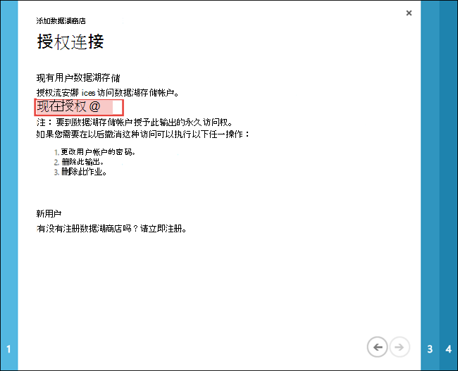
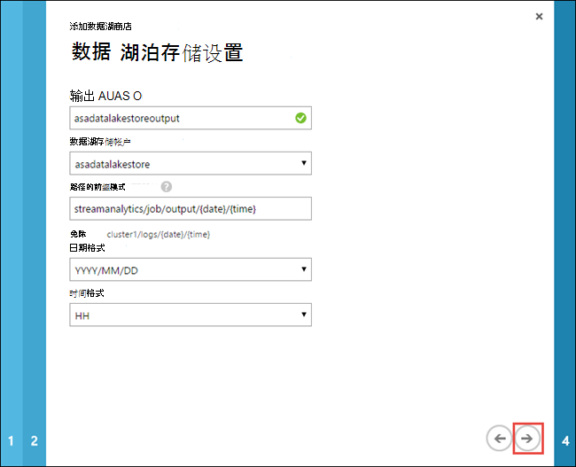
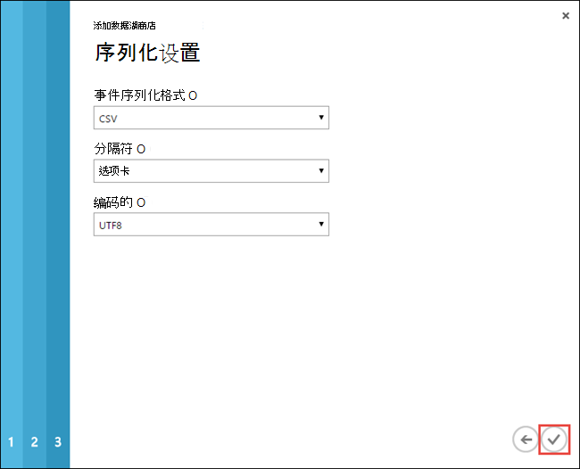
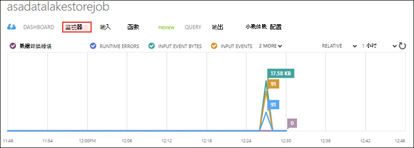
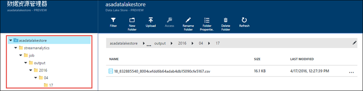

<properties
   pageTitle="流中流分析的数据处理到数据湖商店 |Azure"
   description="使用流数据到 Azure 数据湖存储 Azure 流分析"
   services="data-lake-store,stream-analytics" 
   documentationCenter=""
   authors="nitinme"
   manager="jhubbard"
   editor="cgronlun"/>

<tags
   ms.service="data-lake-store"
   ms.devlang="na"
   ms.topic="article"
   ms.tgt_pltfrm="na"
   ms.workload="big-data"
   ms.date="07/07/2016"
   ms.author="nitinme"/>

# 流数据从数据到数据湖商店 Azure 存储 Blob 使用 Azure 流分析

在本文中，您将学习如何使用 Azure 数据湖商店作为输出 Azure 流分析作业。 本文介绍一个简单的方案，从 Azure 存储 blob （输入） 读取数据和将数据写入数据湖商店 （输出）。

>[AZURE.NOTE] 到目前为止，仅在[Azure 经典门户](https://manage.windowsazure.com)支持创建和配置数据湖存储输出流分析的。 因此，本教程中的某些部分将使用 Azure 经典门户。

## 系统必备组件

在开始本教程之前，您必须具有以下︰

- **Azure 订阅**。 请参阅[获取 Azure 免费试用版](https://azure.microsoft.com/pricing/free-trial/)。

- **启用 Azure 的订阅**数据湖商店公共预览。 请参阅[说明](data-lake-store-get-started-portal.md#signup)。

- **Azure 存储帐户**。 您将使用此帐户从一个 blob 容器输入流分析作业的数据。 对于本教程，假定您创建了一个名为**datalakestoreasa**和称为**datalakestoreasacontainer**的帐户内的容器存储帐户。 一旦创建容器、 向其上载示例数据文件。 您可以从[Azure 数据湖 Git 存储库](https://github.com/Azure/usql/tree/master/Examples/Samples/Data/AmbulanceData/Drivers.txt)获得的示例数据文件。 不同的客户端，如[Azure 存储浏览器](http://storageexplorer.com/)，可用于将数据上载到 blob 容器。

    >[AZURE.NOTE] 如果从 Azure 门户创建帐户时，请确保您使用**经典**部署模型创建。 这样可确保存储帐户可从 Azure 的传统门户网站，是因为这是我们用于创建流分析作业。 有关如何从 Azure 门户使用传统部署创建存储帐户的说明，请参阅[创建 Azure 存储帐户](../storage/storage-create-storage-account/#create-a-storage-account)。
    >
    > 或者，您可以从 Azure 传统门户创建存储帐户。

- **Azure 数据湖存储帐户**。 按照在[学习如何使用 Azure 数据湖存储区使用 Azure 门户](data-lake-store-get-started-portal.md)的说明。  

## 创建一个流分析作业

首先创建一个流分析作业，包括一个输入的源和输出目标。 对于本教程，来源是 Azure blob 容器，目标是数据湖存储区。

1. 登录到[Azure 的传统门户网站](https://manage.windowsazure.com)。

2. 从屏幕的左下方，单击**新建**、**数据服务**、**流分析**、**快速创建**。 提供的值，如下所示，然后单击**创建流分析作业**。

    

## 创建作业的 Blob 输入

1. 打开的页面流分析作业，单击**输入**选项卡，然后单击**添加输入**启动向导。

2. 在**添加作业的输入**页面上，选择**数据流**，，然后单击向前箭头。

    

3. 在**添加数据到您的工作流**页上选择**Blob 存储**，然后单击向前箭头。

    

4. 在**Blob 存储设置**页上，您将使用作为输入的数据源的 blob 存储提供详细信息。

    

    * **输入输入别名**。 这是您输入的作业提供一个唯一的名称。
    * **选择存储帐户**。 请确保存储帐户处于同一个地区作为流分析作业或将会对地区之间移动数据的附加成本。
    * **提供存储容器**。 您可以选择创建新的容器或选择一个现有容器。

    单击向前箭头。

5. 在**序列设置**页上为**CSV**，分隔符为**选项卡**，为**UTF8**，编码设置的序列化格式，然后单击复选标记。

    

6. 一旦您完成向导时，将**输入**选项卡下添加的 blob 输入和**诊断**列应显示**确定**。 可以通过使用**测试连接**按钮，底部还明确测试连接到输入。

## 创建作业数据湖存储输出

1. 打开的页面流分析作业，单击**输出**选项卡，然后单击**添加输出**以启动向导。

2. 在**添加到您的作业输出**页上，选择**数据湖商店**，并再单击向前箭头。

    

3. 在**授权连接**页面上，如果您已经创建一个数据湖存储帐户，请单击**立即授权**。 否则，单击**立即注册**以创建一个新帐户。 对于本教程，让我们假设您已经创建 （如系统必备组件中所述） 的数据湖存储帐户。 您将自动获得授权使用的凭据登录到 Azure 传统门户网站的。

    

4. 在**湖的数据存储区设置**页上，输入相应的信息，如下面的屏幕抓图中所示。

    

    * **输入输出别名**。 这是您的作业输出提供一个唯一的名称。
    * **指定数据湖存储帐户**。 应该已经创建，系统必备组件中所述。
    * **指定路径的前缀模式**。 这是确定输出文件写入数据湖存储流分析作业所必需的。 由于在 GUID 格式的输出写入作业标题，包括前缀将帮助确定写入的输出。 如果您想要作为前缀的一部分包含日期和时间戳请确保包含了`{date}/{time}`前缀模式中。 如果包括此操作时，**日期格式**和**时间格式**将启用字段并且可以选择选择的格式。

    单击向前箭头。

5. 在**序列设置**页上为**CSV**，分隔符为**选项卡**，为**UTF8**，编码设置的序列化格式，然后单击复选标记。

    

6. 一旦您完成向导时，将在**输出**选项卡下添加数据湖存储输出和**诊断**列应显示**确定**。 可以通过使用**测试连接**按钮，底部还明确测试到输出的连接。

## 运行流分析作业

要运行流分析作业，您必须运行查询从查询选项卡。 对于本教程，您可以通过将占位符替换输入该作业运行示例查询和输出别名，如下面的屏幕抓图中所示。

单击从屏幕底部的**保存**，然后单击**开始**。 从对话框中，选择**自定义时间**，并从过去，如**1/1/2016年**然后选择一个日期。 单击复选标记以启动该作业。 它可以需要几分钟启动作业。

作业启动后，单击**监视器**选项卡以查看如何处理数据。

最后，可以使用[Azure 门户](https://portal.azure.com)来打开数据湖存储帐户，并验证是否已成功将数据写入到该帐户。

在数据资源管理器窗格中，请注意，输出写入指定存储文件夹中数据湖输出设置 (`streamanalytics/job/output/{date}/{time}`)。  

## 请参见

* [创建用于数据湖商店 HDInsight 群集](data-lake-store-hdinsight-hadoop-use-portal.md)
