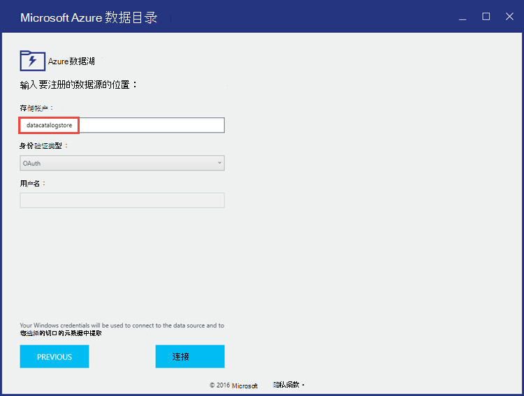
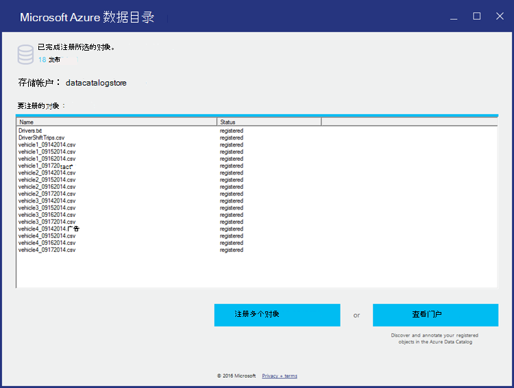

<properties
   pageTitle="在 Azure 数据目录中注册数据湖存储区 |Microsoft Azure"
   description="在 Azure 数据目录中注册数据湖存储区"
   services="data-lake-store,data-catalog" 
   documentationCenter=""
   authors="nitinme"
   manager="jhubbard"
   editor="cgronlun"/>

<tags
   ms.service="data-lake-store"
   ms.devlang="na"
   ms.topic="article"
   ms.tgt_pltfrm="na"
   ms.workload="big-data"
   ms.date="10/28/2016"
   ms.author="nitinme"/>

# 在 Azure 数据目录中注册数据湖存储区

在本文中，您将学习如何使用 Azure 数据目录，以使数据可在组织内发现通过将其集成与数据目录集成 Azure 数据湖商店。 编目数据的详细信息，请参阅[Azure 数据目录](../data-catalog/data-catalog-what-is-data-catalog.md)。 若要了解您可以在其中使用数据目录的情况下，请参阅[Azure 数据目录的常见方案](../data-catalog/data-catalog-common-scenarios.md)。

## 系统必备组件

在开始本教程之前，您必须具有以下︰

- **Azure 订阅**。 请参阅[获取 Azure 免费试用版](https://azure.microsoft.com/pricing/free-trial/)。

- **启用 Azure 的订阅**数据湖商店公共预览。 请参阅[说明](data-lake-store-get-started-portal.md#signup)。

- **Azure 数据湖存储帐户**。 按照在[学习如何使用 Azure 数据湖存储区使用 Azure 门户](data-lake-store-get-started-portal.md)的说明。 对于本教程，让我们创建一个名为**datacatalogstore**数据湖存储帐户。 

    一旦您创建了帐户、 向其上载示例数据集。 对于本教程，我们将[Azure 数据湖 Git 存储库](https://github.com/Azure/usql/tree/master/Examples/Samples/Data/AmbulanceData/)中的**AmbulanceData**文件夹下的所有.csv 文件都上载。 不同的客户端，如[Azure 存储浏览器](http://storageexplorer.com/)，可用于将数据上载到 blob 容器。

- **Azure 数据目录**。 您的组织必须已为您的组织创建 Azure 数据目录。 对于每个组织，允许只有一个目录。

## 注册数据湖作为源数据目录存储区

>[AZURE.VIDEO adcwithadl] 

1. 转到`https://azure.microsoft.com/services/data-catalog`，然后单击**开始**。

2. 登录到 Azure 数据目录门户，然后单击**发布数据**。

    

3. 在下一页上，单击**启动应用程序**。 这将下载您的计算机上的应用程序清单文件。 双击要启动应用程序的清单文件。

4. 在欢迎页上，单击**登录**，并输入您的凭据。

    

5. 在选择数据源页上，选择**Azure 数据湖**，，然后单击**下一步**。

    

6. 在下一页上，提供要在数据目录中注册的数据湖存储帐户名。 将其他选项保留为默认值，然后单击**连接**。

    

7. 下一页上可以划分为以下领域。

    一。 **服务器层次结构**中表示数据湖存储帐户文件夹结构。 **$Root**表示数据湖存储帐户根，而**AmbulanceData**表示数据湖存储帐户的根目录中创建的文件夹。

    b。 **可用对象**框中列出的文件和文件夹的**AmbulanceData**文件夹下。

    c。 **对象若要注册框中**列出的文件和文件夹，您想要在 Azure 数据目录中注册。

    

8. 对于本教程，应该在目录中注册的所有文件。 请单击 （） 按钮以将所有文件都移至**要注册的对象**框。 

    由于将在组织范围内的数据目录中注册的数据，它是建议的方法来添加一些以后可用于快速定位数据的元数据。 例如，可以为数据所有者 （例如，一个人上载数据） 添加电子邮件地址或添加一个标记以标识的数据。 下面的屏幕抓图显示了添加到数据标记。

    

    单击**注册**。

8. 下面的屏幕抓图表示数据已成功注册在数据目录中。

    

9. 单击**查看门户**到数据目录入口回去确认，现在可以从门户访问注册的数据。 若要搜索数据，可以使用注册数据时使用的标记。

    

10. 现在，您可以执行操作，如添加注释和文档的数据。 有关详细信息，请参阅下面的链接。
    * [批注在数据目录中的数据源](../data-catalog/data-catalog-how-to-annotate.md)
    * [在数据目录中的文档的数据源](../data-catalog/data-catalog-how-to-documentation.md)

## 请参见

* [批注在数据目录中的数据源](../data-catalog/data-catalog-how-to-annotate.md)
* [在数据目录中的文档的数据源](../data-catalog/data-catalog-how-to-documentation.md)
* [与其他 Azure 服务集成数据湖存储区](data-lake-store-integrate-with-other-services.md)
