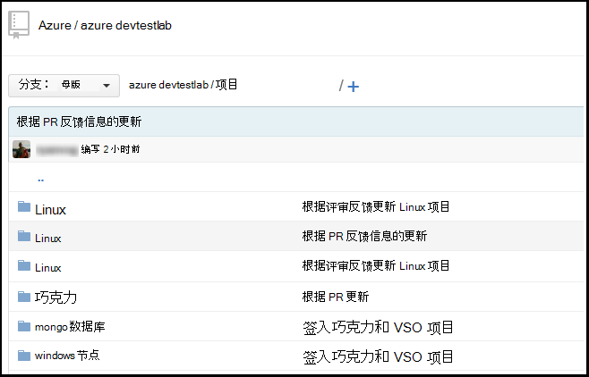
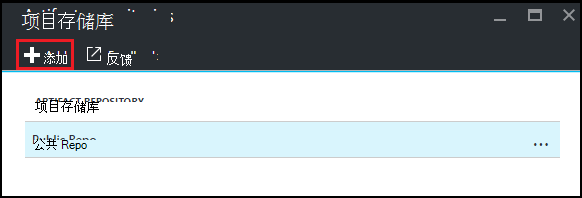
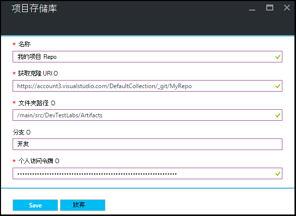

<properties
    pageTitle="将一个 Git 项目存储库添加到 Azure DevTest 实验室中的实验室 |Microsoft Azure"
    description="在 Azure DevTest 实验中添加您的自定义项目源的 GitHub 或 Visual Studio 团队服务 Git 存储库"
    services="devtest-lab,virtual-machines,visual-studio-online"
    documentationCenter="na"
    authors="tomarcher"
    manager="douge"
    editor=""/>

<tags
    ms.service="devtest-lab"
    ms.workload="na"
    ms.tgt_pltfrm="na"
    ms.devlang="na"
    ms.topic="article"
    ms.date="09/06/2016"
    ms.author="tarcher"/>

# 将一个 Git 项目存储库添加到 Azure DevTest 实验室中的实验室

> [AZURE.VIDEO how-to-add-your-private-artifacts-repository-in-a-devtest-lab]

在 Azure DevTest 实验室中，则*操作*— 例如，当创建一个 VM 安装软件或运行脚本和命令-工件。 默认情况下，实验室包括官方 Azure DevTest 实验项目资源库中的项目。 Git 项目存储库可以添加您的实验室，包括您的团队创建的项目。 在[GitHub](https://github.com)上或在[Visual Studio 团队服务 (VSTS)](https://visualstudio.com)，可以承载存储库。

- 若要了解如何创建 GitHub 存储库，请参阅[GitHub 营](https://help.github.com/categories/bootcamp/)。
- 若要了解如何创建团队服务项目使用 Git 存储库，请参阅[连接到 Visual Studio 团队服务](https://www.visualstudio.com/get-started/setup/connect-to-visual-studio-online)。

下面的屏幕快照显示了存储库中包含的项目可能在 GitHub 的显示方式的示例︰  

## 获取存储库信息和凭据

若要将项目存储库添加到您的实验室，必须先从您的存储库中获取特定的信息。 以下各节将指导您获取此信息，以便在 GitHub 和 Visual Studio 团队服务承载项目资料库。

### 获取的 GitHub 资料库克隆 URL 和个人访问令牌

URL 和个人访问令牌获取 GitHub 存储库的克隆，请执行以下步骤︰

1. 浏览到 GitHub 存储库中包含的项目定义的主页。

1. 选择**克隆或下载**。

1. 选择将复制到剪贴板， **HTTPS 克隆的 url**的按钮并保存以供以后使用的 URL。

1. 在 GitHub，右上角选择的配置文件映像并选择**设置**。

1. 在左侧的**个人设置**菜单中，选择**个人的访问令牌**。

1. 选择**生成新的标记**。

1. 在**新的个人访问令牌**页上，输入**标记说明**，接受默认的项目中**选择范围**，，然后选择**生成令牌**。

1. 保存生成的标记，因为稍后需要。

1. 现在，您可以关闭 GitHub。   

1. 继续[连接您实验室的项目存储库的](#connect-your-lab-to-the-artifact-repository)一部分。

### 获取标记的 Visual Studio 团队服务存储库克隆 URL 和个人访问权限

若要获取的 Visual Studio 团队服务存储库的克隆 URL 和个人访问令牌，请执行以下步骤︰

1. 打开主页的您的团队集合 (例如， `https://contoso-web-team.visualstudio.com`)，然后选择项目的项目。

1. 在项目的主页上，选择**代码**。

1. 若要查看所克隆的 URL，项目**代码**页上，选择**克隆**。

1. 将 URL 保存所需本教程的后面。

1. 若要创建个人访问令牌，请从用户帐户下拉列表菜单选择**我的配置文件**。

1. 在模板信息页中，选择**安全**。

1. 在**安全**选项卡上，选择**添加**。

1. 在**创建一个个人访问令牌**页中︰

    - 输入标记的**说明**。
    - 从**到期时间**列表中选择**180 天**。
    - 从**帐户**列表中选择**所有可访问帐户**。
    - 选择**所有的作用域**选项。
    - 选择**创建令牌**。

1. 完成后，**个人的访问令牌**列表中将出现新的标记。 选择**复制令牌**，然后再保存供以后使用的标记值。

1. 继续[连接您实验室的项目存储库的](#connect-your-lab-to-the-artifact-repository)一部分。

##连接您的实验室项目存储库

1. 登录到[Azure 的门户](http://go.microsoft.com/fwlink/p/?LinkID=525040)。

1. 选择**其他服务**，然后从列表中选择**DevTest 实验室**。

1. 从实验室的列表中，选择所需的实验室。   

1. 在实验室的刀片式服务器，选择**配置**。

1. 在实验室的**配置**刀片式服务器，选择**项目资料库**。

1. 在**项目资料库**刀片式服务器，选择**+ 添加**。

    
 
1. 在第二个**项目资料库**刀片式服务器，指定以下项︰

    - **名称**-输入存储库中的名称。
    - **Git 克隆 Url** -输入先前复制从 GitHub 或 Visual Studio 团队服务的 Git HTTPS 克隆 URL。 
    - **文件夹路径**-输入文件夹路径相对于包含项目定义的克隆 URL。
    - **分支**-输入要获取项目定义的分支。
    - **个人访问令牌**-输入之前获得从 GitHub 或 Visual Studio 团队服务的个人的访问令牌。 
     
    

1. 选择**保存**。

[AZURE.INCLUDE [devtest-lab-try-it-out](../../includes/devtest-lab-try-it-out.md)]

## 相关的博客张贴内容
- [如何排查故障 AzureDevTestLabs 中的项目](http://www.visualstudiogeeks.com/blog/DevOps/How-to-troubleshoot-failing-artifacts-in-AzureDevTestLabs)
- [将虚拟机加入到现有的 AD 域在 Azure 开发测试实验室使用 ARM 模板](http://www.visualstudiogeeks.com/blog/DevOps/Join-a-VM-to-existing-AD-domain-using-ARM-template-AzureDevTestLabs)