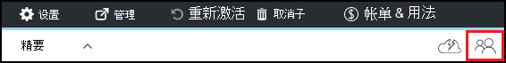

<properties
    pageTitle="在 Azure DevTest 实验中添加所有者和用户 |Microsoft Azure"
    description="在 Azure DevTest 实验室使用 Azure 门户或 PowerShell 添加所有者和用户"
    services="devtest-lab,virtual-machines"
    documentationCenter="na"
    authors="tomarcher"
    manager="douge"
    editor=""/>

<tags
    ms.service="devtest-lab"
    ms.workload="na"
    ms.tgt_pltfrm="na"
    ms.devlang="na"
    ms.topic="article"
    ms.date="09/12/2016"
    ms.author="tarcher"/>

# 在 Azure DevTest 实验中添加所有者和用户

> [AZURE.VIDEO how-to-set-security-in-your-devtest-lab]

在 Azure DevTest 实验室中的访问受[Azure Role-Based 的访问控制 (RBAC)](../active-directory/role-based-access-control-what-is.md)。 使用 RBAC，则可以隔离职责内团队到*角色*在授予用户执行其作业所必需的访问量。 这些 RBAC 角色的三个*所有者*、 *DevTest 实验室用户*和*参与者*。 在本文中，您将学习在每三个主要的 RBAC 角色可以执行的操作。 从那里，您将了解如何将用户添加到一个实验室的同时通过门户和通过 PowerShell 脚本，以及如何订阅级别添加用户。

## 每个角色可以执行的操作

有三个主要角色，您可以分配用户︰

- 所有者
- DevTest 实验室用户
- 参与者

下表说明了每个角色中的用户可以执行的操作︰

| **操作在此角色中的用户可以执行** | **DevTest 实验室用户**            | **所有者** | **参与者** |
|---|---|---|---|
| **实验室的任务**                          |                              |       |             |
| 将用户添加到一个实验室                     | 不                           | 是的   | 不          |
| 更新成本设置                   | 不                           | 是的   | 是的         |
| **虚拟机的基本任务**                      |                              |       |             |
| 添加和移除自定义图像           | 不                           | 是的   | 是的         |
| 添加、 更新和删除公式       | 是的                          | 是的   | 是的         |
| 白名单 Azure 市场图像     | 不                           | 是的   | 是的         |
| **VM 的任务**                           |                              |       |             |
| 创建虚拟机                             | 是的                          | 是的   | 是的         |
| 启动、 停止和删除虚拟机            | 仅由该用户创建的虚拟机 | 是的   | 是的         |
| 更新虚拟机策略                     | 不                           | 是的   | 是的         |
| 添加或删除对虚拟机的数据磁盘      | 仅由该用户创建的虚拟机 | 是的   | 是的         |
| **项目任务**                     |                              |       |             |
| 添加和移除项目的存储库   | 不                           | 是的   | 是的         |
| 应用项目                        | 是的                          | 是的   | 是的         |

> [AZURE.NOTE] 当用户创建一个虚拟机时，该用户自动分配给创建的虚拟机的**所有者**角色。

## 在实验室级别添加所有者或用户

可以在实验室级别通过 Azure 门户添加所有者和用户。 这包括具有有效[Microsoft 帐户 (MSA)](devtest-lab-faq.md#what-is-a-microsoft-account)的外部用户。
以下步骤将指导您完成将所有者或用户添加到 Azure DevTest 实验室中的实验室的过程︰

1. 登录到[Azure 的门户](http://go.microsoft.com/fwlink/p/?LinkID=525040)。

1. 选择**更多的服务**，然后从列表中选择**DevTest 实验室**。

1. 从实验室的列表中，选择所需的实验室。

1. 在实验室的刀片式服务器，选择**配置**。 

1. 在**配置**刀片式服务器，选择**用户**。

1. 在**用户**刀片式服务器，选择**+ 添加**。

    

1. **选择一个角色**刀片式服务器，选择所需的角色。 部分[中每个角色可以执行的操作](#actions-that-can-be-performed-in-each-role)列表所有者、 DevTest 用户和参与者角色中的用户可以执行的各种操作。

1. **添加用户**刀片式服务器，请输入电子邮件地址或您希望在您指定的角色中添加用户名称。 如果不能找到该用户，则错误消息解释问题。 如果找到该用户，则该用户被列出并选中。 

1. 选择**选择**。

1. 选择**确定**以关闭**添加访问**刀片式服务器。

1. 当您返回至**用户**刀片式服务器时，用户已添加。  

## 将外部用户添加到使用 PowerShell 的实验室

除了在 Azure 的门户网站中添加用户，还可以在实验室使用 PowerShell 脚本中添加外部用户。 在以下示例中，只需修改的**值来更改**注释下的参数值。
您可以检索`subscriptionId`， `labResourceGroup`，和`labName`Azure 门户中实验室刀片式服务器中的值。

> [AZURE.NOTE]
> 脚本示例假定指定的用户作为来宾添加到 Active Directory，和如果不是这种情况将会失败。 要不在 Active Directory 中的用户添加到一个实验室，使用 Azure 的门户网站将用户分配给角色，如本文所述的部分中，[添加所有者或用户级别的实验室](#add-an-owner-or-user-at-the-lab-level)。   

    # Add an external user in DevTest Labs user role to a lab
    # Ensure that guest users can be added to the Azure Active directory:
    # https://azure.microsoft.com/en-us/documentation/articles/active-directory-create-users/#set-guest-user-access-policies

    # Values to change
    $subscriptionId = "<Enter Azure subscription ID here>"
    $labResourceGroup = "<Enter lab's resource name here>"
    $labName = "<Enter lab name here>"
    $userDisplayName = "<Enter user's display name here>"

    # Log into your Azure account
    Login-AzureRmAccount
    
    # Select the Azure subscription that contains the lab. 
    # This step is optional if you have only one subscription.
    Select-AzureRmSubscription -SubscriptionId $subscriptionId
    
    # Retrieve the user object
    $adObject = Get-AzureRmADUser -SearchString $userDisplayName
    
    # Create the role assignment. 
    $labId = ('subscriptions/' + $subscriptionId + '/resourceGroups/' + $labResourceGroup + '/providers/Microsoft.DevTestLab/labs/' + $labName)
    New-AzureRmRoleAssignment -ObjectId $adObject.Id -RoleDefinitionName 'DevTest Labs User' -Scope $labId

## 订阅级别添加所有者或用户

Azure 的权限将从父作用域传播到 Azure 中的子范围。 因此，包含实验 Azure 订阅的所有者自动将这些实验室的负责人。 他们还拥有虚拟机和其他实验室的用户，和 Azure DevTest 实验室服务创建的资源。 

通过实验室的刀片在[Azure 门户](http://go.microsoft.com/fwlink/p/?LinkID=525040)实验室中可以添加其他所有者。 但是，添加的所有者范围是管理的比预订所有者范围更窄。 例如，添加的所有者没有对某些订阅中由 DevTest 实验室服务的资源的完全访问权限。 

要添加到 Azure 的订阅的所有者，请执行以下步骤︰

1. 登录到[Azure 的门户](http://go.microsoft.com/fwlink/p/?LinkID=525040)。

1. 选择**其他服务**，然后从列表中选择**的订阅**。

1. 选择所需的预订。

1. 选择**访问权限**图标。 

    

1. 在**用户**刀片式服务器，选择**添加**。

    

1. **选择一个角色**刀片式服务器，选择**所有者**。

1. 在**添加用户**刀片式服务器，请输入电子邮件地址或您想要添加为所有者的用户名称。 如果不能找到该用户，您将收到错误信息解释问题。 如果找到该用户，则该用户在**用户**文本框中列出。

1. 选择找到的用户名。

1. 选择**选择**。

1. 选择**确定**以关闭**添加访问**刀片式服务器。

1. 当您返回至**用户**刀片式服务器时，用户添加为所有者。 此用户是现在下此订阅，创建任何实验室的负责人，因此，能够执行任务的所有者。 

[AZURE.INCLUDE [devtest-lab-try-it-out](../../includes/devtest-lab-try-it-out.md)]
