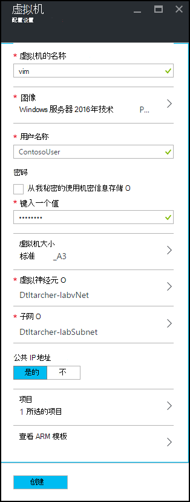
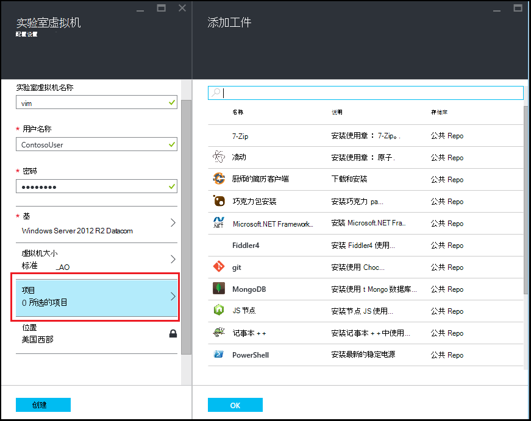
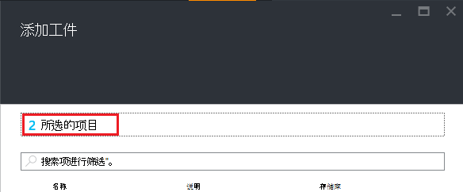

<properties
    pageTitle="将工件与虚拟机添加到 Azure DevTest 实验室中的实验室 |Microsoft Azure"
    description="了解如何添加虚拟机与工件在 Azure DevTest 实验室"
    services="devtest-lab,virtual-machines"
    documentationCenter="na"
    authors="tomarcher"
    manager="douge"
    editor=""/>

<tags
    ms.service="devtest-lab"
    ms.workload="na"
    ms.tgt_pltfrm="na"
    ms.devlang="na"
    ms.topic="article"
    ms.date="08/30/2016"
    ms.author="tarcher"/>

# 将工件与虚拟机添加到 Azure DevTest 实验室中的实验室

> [AZURE.VIDEO how-to-create-vms-with-artifacts-in-a-devtest-lab]

在实验室中，从*基本*的[自定义图像](./devtest-lab-create-template.md)、[公式](./devtest-lab-manage-formulas.md)或[市场上图像](./devtest-lab-configure-marketplace-images.md)中创建虚拟机。

DevTest 实验室*的项目*，可以指定创建 VM 时所执行的*操作*。 

项目操作可以执行如运行 Windows PowerShell 脚本，运行 Bash 命令和安装软件的过程。 

项目*参数*允许您自定义适合您的特定方案的项目。

本文介绍了如何在实验室中使用的项目创建一个虚拟机。

## 将工件与 VM

1. 登录到[Azure 的门户](http://go.microsoft.com/fwlink/p/?LinkID=525040)。

1. 选择**其他服务**，然后从列表中选择**DevTest 实验室**。

1. 从实验室的列表中，选择要在其中创建虚拟机的实验室。  

1. 在实验室**概述**刀片式服务器，选择**虚拟机 +**。  
    

1. **选择基**刀片式服务器，选择 VM 基。

1. **虚拟机**刀片上的**虚拟机的名称**文本框中输入新的虚拟机的名称。

    

1. 输入将被授予虚拟计算机上的具有管理员特权的**用户名称**。  

1. 如果您想要使用您的*密钥存储区*中存储的密码，选择**使用我的密钥存储区中的机密信息**，并指定的值对应于机密 （密码）。 否则，标记**类型值**的文本字段中只需输入密码。
 
1. 选择**虚拟机大小**并选择一个预定义的项目指定处理器内核、 内存大小和创建 VM 的硬盘容量。

1. 选择**虚拟网络**并选择所需的虚拟网络。

1. 选择**子网**并选择子网。

1. 如果实验室策略设置以允许所选子网的公用 IP 地址，指定是否要通过选择**是**或**否**公用 IP 地址。 否则为此选项被禁用并且选择**否**。 

1. 选择**的项目**的列表中的项目的选择和配置您想要添加到基本映像的项目。 
**注意︰**如果您是新手 DevTest 实验室或配置项目，到[添加现有项目到一个虚拟机](#add-an-existing-artifact-to-a-vm)部分中，跳过，然后在完成后返回这里。

1. 如果您想要查看或复制 Azure 资源管理器模板、 跳到[保存的 Azure 资源管理器模板](#save-arm-template)部分中，和完成后，请返回这里。

1. 选择**创建**将指定的 VM 添加到该实验室。

1. 实验室刀片式服务器显示状态的 VM 的创建;第一次作为**创建**，然后作为 VM 之后**运行**已启动。

1. 请转到[后续步骤](#next-steps)部分。 

## 将现有项目添加到虚拟机

在创建虚拟机，您可以添加现有项目。 每个实验室包括公用 DevTest 实验项目资料库以及您创建并添加到您自己的项目存储库中的项目中的工件。
若要了解如何创建项目，请参阅文章，[了解如何创作您自己使用 DevTest 实验室的项目](devtest-lab-artifact-author.md)。

1. 在**虚拟机**刀片式服务器，选择**项目**。 

1. **工件添加**刀片式服务器，请选择所需的项目。  

    

1. 输入所需的参数值和所需的任何可选参数。  

1. 选择**添加**可将工件添加并返回到**工件添加**刀片式服务器。

1. 继续根据需要为您的虚拟机添加项目。

1. 添加您的项目后，您可以[更改项目的运行的顺序](#change-the-order-in-which-artifacts-are-run)。 此外，还可以返回到[查看或修改项目](#view-or-modify-an-artifact)。

## 更改项目的运行的顺序

默认情况下，给 VM 添加顺序执行的项目的操作。 以下步骤说明如何更改项目的运行的顺序。

1. 顶部的**项目添加**刀片式服务器，选择已添加到虚拟机的项目的数目的链接。

    

1. 若要指定这些项目的运行的顺序，拖放到所需的顺序的项目。 **注意︰**如果在拖动该项目时遇到问题，请确保您正在拖动项目的左边。 

1. 请选择**确定**完成操作。  

## 查看或修改项目

下面的步骤说明了如何查看或修改项目的参数︰

1. 顶部的**项目添加**刀片式服务器，选择已添加到虚拟机的项目的数目的链接。

    

1. 在**所选项目**刀片式服务器，选择您想要查看或编辑的项目。  

1. 在**项目中添加**刀片式服务器，进行必要的更改，并选择**确定**以关闭刀片式服务器**添加项目**。

1. 选择**确定**以关闭**选定项目**刀片式服务器。

## 保存 Azure 资源管理器模板

Azure 资源管理器模板提供任何声明性的方式来定义可重复的部署。 以下步骤说明如何将 Azure 资源管理器模板保存为正在创建的虚拟机。
保存之后，您可以使用 Azure 资源管理器模板[部署新虚拟机使用 Azure PowerShell](../azure-resource-manager/resource-group-overview.md#template-deployment)。

1. 在**虚拟机**刀片式服务器，请选择**视图 ARM 模板**。

1. 在**视图 Azure 资源管理器模板刀片式服务器**，选择模板文本。

1. 将所选的文本复制到剪贴板。

1. 选择**确定**以关闭**视图 Azure 资源管理器模板刀片式服务器**。

1. 打开一个文本编辑器。

1. 在模板文本从剪贴板中粘贴。

1. 保存的文件以供以后使用。

[AZURE.INCLUDE [devtest-lab-try-it-out](../../includes/devtest-lab-try-it-out.md)]

## 下一步行动

- 一旦创建虚拟机，您可以选择虚拟机的刀片式服务器上的**连接**连接到 VM。
- 了解如何[创建自定义项目的 DevTest 实验室 VM](devtest-lab-artifact-author.md)。
- 探讨[DevTest 实验室 ARM 快速启动模板库](https://github.com/Azure/azure-devtestlab/tree/master/ARMTemplates)