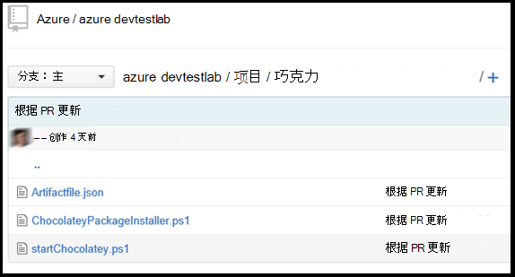

<properties 
    pageTitle="为您的 DevTest 实验室虚拟机创建自定义的项目 |Microsoft Azure"
    description="了解如何创作您自己使用 DevTest 实验室的项目"
    services="devtest-lab,virtual-machines"
    documentationCenter="na"
    authors="tomarcher"
    manager="douge"
    editor=""/>

<tags
    ms.service="devtest-lab"
    ms.workload="na"
    ms.tgt_pltfrm="na"
    ms.devlang="na"
    ms.topic="article"
    ms.date="08/25/2016"
    ms.author="tarcher"/>

#为您的 DevTest 实验室虚拟机创建自定义的项目

> [AZURE.VIDEO how-to-author-custom-artifacts] 

## 概述
**项目**用于部署和配置应用程序之后配置虚拟机。 项目包括项目的定义文件和其他 git 存储库中的文件夹中存储的脚本文件。 项目定义文件包含 JSON 和可用于指定您要在虚拟机上安装的表达式。 例如，您可以定义项目，运行命令，便可运行该命令的参数的名称。 您可以按名称引用其他项目定义文件中的脚本文件。

##项目定义文件格式
下面的示例演示定义文件的基本结构所构成的节。

    {
      "$schema": "https://raw.githubusercontent.com/Azure/azure-devtestlab/master/schemas/2015-01-01/dtlArtifacts.json",
      "title": "",
      "description": "",
      "iconUri": "",
      "targetOsType": "",
      "parameters": {
        "<parameterName>": {
          "type": "",
          "displayName": "",
          "description": ""
        }
      },
      "runCommand": {
        "commandToExecute": ""
      }
    }

| 元素名称 | 必填？ | 说明
| ------------ | --------- | -----------
| $schema      | 不        | JSON 架构文件有助于测试有效性的定义文件的位置。
| 标题        | 是的       | 在实验室中显示项目的名称。
| 说明  | 是的       | 在实验室中显示的项目的描述。
| iconUri      | 不        | 在实验室中显示的图标的 Uri。
| targetOsType | 是的       | 工件的安装位置的虚拟机的操作系统。 受支持的选项是︰ Windows 和 Linux。
| 参数   | 不        | 工件安装命令的计算机上运行时提供的值。 这有助于自定义您的项目。
| runCommand   | 是的       | 工件安装在虚拟机执行的命令。

###项目参数

在定义文件参数部分中，您可以指定安装项目时，用户可以输入哪些值。 您可以引用这些值中的工件安装命令。

定义参数将以下结构。

    "parameters": {
        "<parameterName>": {
          "type": "<type-of-parameter-value>",
          "displayName": "<display-name-of-parameter>",
          "description": "<description-of-parameter>"
        }
      }

| 元素名称 | 必填？ | 说明
| ------------ | --------- | -----------
| 类型         | 是的       | 参数值的类型。 请参阅下面的列表中允许的类型︰
| 显示名称是       | 在实验室中的用户显示参数的名称。
| 说明  | 是的       | 在实验室中显示参数的说明。

允许的类型为︰

- 字符串--任何有效的 JSON 字符串
- int – JSON 的任何有效整数
- 布尔值 – 任何有效的 JSON 布尔
- 阵列 – 任何有效的 JSON 数组

##项目表达式和函数

您可以使用表达式和函数来构造工件安装命令。
表达式的两边添加方括号 （[和]），和安装项目后评估。 表达式可以出现在 JSON 字符串值中的任意位置，并始终返回另一个 JSON 值。 如果您需要使用原义字符串开头方括号 [，必须使用两个方括号 [[。
通常，您使用表达式与函数构造一个值。 就像在 JavaScript 中，函数调用的格式设置为 functionName(arg1,arg2,arg3)

下面的列表显示了常见的功能。

- parameters(parameterName)-返回项目命令运行时提供参数值。
- concat arg1、 arg2 (arg3，）-将多个字符串值组合在一起。 此函数可以执行任意数量的参数。

下面的示例演示如何使用表达式和函数来构造一个值。

    runCommand": {
         "commandToExecute": "[concat('powershell.exe -File startChocolatey.ps1'
    , ' -RawPackagesList ', parameters('packages')
    , ' -Username ', parameters('installUsername')
    , ' -Password ', parameters('installPassword'))]"
    }

##创建自定义的项目

通过按照下面的步骤创建自定义的项目︰

1. 安装一个 JSON 编辑器-您需要一个 JSON 编辑器来处理的项目定义文件。 我们建议使用[Visual Studio 代码](https://code.visualstudio.com/)，这可用于 Windows、 Linux 和 OS X。

1. 获取示例 artifactfile.json-检出由 Azure DevTest 实验室团队在我们已创建了项目将有助于丰富库我们[GitHub 存储库中](https://github.com/Azure/azure-devtestlab)创建的项目创建您自己的项目。 下载项目定义文件并对其以创建您自己的项目进行更改。

1. 请使用 IntelliSense-利用 IntelliSense 查看可用于构造一个项目定义文件中的有效元素。 您还可以查看元素的值的不同选项。 例如，IntelliSense 向您展示两种选择的 Windows 或 Linux 编辑**targetOsType**元素时。

1. 将项目存储在一个 git 存储库
    1. 创建一个单独的目录，每个项目目录名称所在的项目名称相同。
    1. 您创建的目录中存储的项目定义文件 (artifactfile.json)。
    1. 将存储从工件安装命令中引用的脚本。

    以下是可能的项目文件夹的显示方式的示例︰

    

1. 添加的项目存储库到实验室-请参阅文章，[添加到一个实验室项目 Git 存储库](devtest-lab-add-artifact-repo.md)。

[AZURE.INCLUDE [devtest-lab-try-it-out](../../includes/devtest-lab-try-it-out.md)]

## 相关的博客张贴内容
- [如何排查故障 AzureDevTestLabs 中的项目](http://www.visualstudiogeeks.com/blog/DevOps/How-to-troubleshoot-failing-artifacts-in-AzureDevTestLabs)
- [将虚拟机加入到现有的 AD 域在 Azure 开发测试实验室使用 ARM 模板](http://www.visualstudiogeeks.com/blog/DevOps/Join-a-VM-to-existing-AD-domain-using-ARM-template-AzureDevTestLabs)

## 下一步行动

- 了解如何[添加到一个实验室项目 Git 存储库](devtest-lab-add-artifact-repo.md)。
