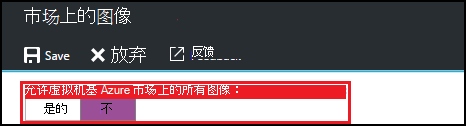
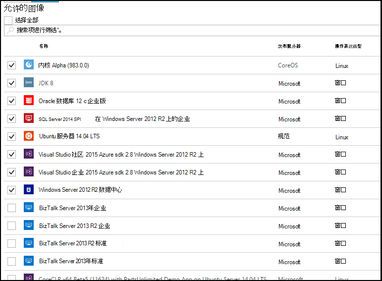

<properties
    pageTitle="在 Azure DevTest 实验室配置 Azure 市场图像设置 |Microsoft Azure"
    description="配置时在 Azure DevTest 实验室中创建一个虚拟机可以使用哪个 Azure 市场图像"
    services="devtest-lab,virtual-machines"
    documentationCenter="na"
    authors="tomarcher"
    manager="douge"
    editor=""/>

<tags
    ms.service="devtest-lab"
    ms.workload="na"
    ms.tgt_pltfrm="na"
    ms.devlang="na"
    ms.topic="article"
    ms.date="09/06/2016"
    ms.author="tarcher"/>

# 在 Azure DevTest 实验室配置 Azure 市场图像设置

DevTest 实验室支持创建虚拟机基于 Azure 市场图像，具体取决于您配置 Azure 市场图像的方式，在实验室中使用。 本文介绍如何指定它，如果有的话，可以是 Azure 市场图像时在实验室中创建虚拟机使用。

## 请选择允许哪些 Azure 市场图像时创建虚拟机

1. 登录到[Azure 的门户](http://go.microsoft.com/fwlink/p/?LinkID=525040)。

1. 选择**其他服务**，然后从列表中选择**DevTest 实验室**。

1. 从实验室的列表中，选择所需的实验室。 

1. 在实验室的刀片式服务器，选择**配置**。
    
1. 在实验室的**配置**刀片式服务器，选择**市场图像**

1. 指定是否希望所有合格的 Azure 市场图像可用于为新虚拟机的基础。 如果您选择**是**，然后在实验室中允许在满足所有以下条件的所有 Azure 市场图像︰

    - 图像创建一个 VM，**并**
    - 图像设置虚拟机，**并**使用 Azure 资源管理器
    - 图像不需要购买额外的许可计划
    
    如果您想要允许没有图像或您想要指定要使用的图像，则选择**否**。
 
    
 
1. 如果选择**否**返回上一步，**允许图像选择所有**复选框将启用。 可以使用此选项和搜索框中，要快速选中或取消选择列表中显示的所有项目。
您还可以选择您想要允许 VM 创建单独通过检查每个图像的对应复选框的 Azure 市场图像。
不从列表中选择如果您不想允许任何 Azure 市场图像实验室中使用。

    

[AZURE.INCLUDE [devtest-lab-try-it-out](../../includes/devtest-lab-try-it-out.md)]

## 下一步行动

配置如何允许 Azure 市场图像时创建虚拟机后下, 一步是[添加到您的实验室的 VM](./devtest-lab-add-vm-with-artifacts.md)。