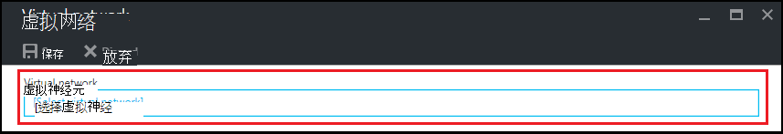
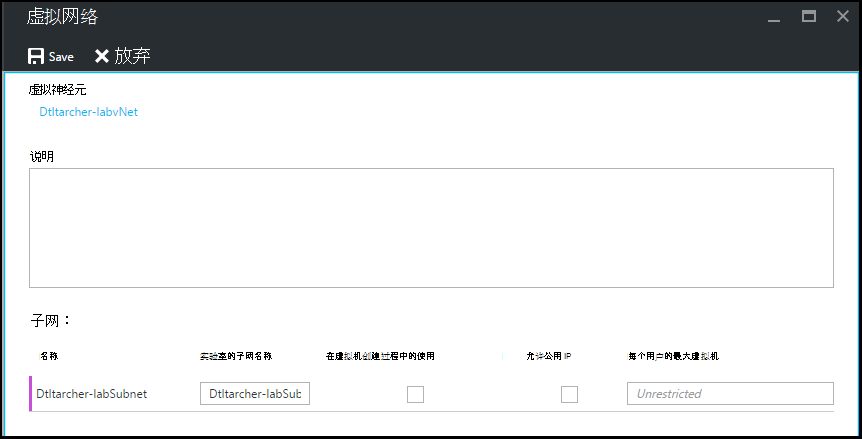

<properties
    pageTitle="在 Azure DevTest 实验室中配置虚拟网络 |Microsoft Azure"
    description="了解如何配置现有虚拟网络和子网，并在 Azure DevTest 实验与虚拟机中使用它们"
    services="devtest-lab,virtual-machines"
    documentationCenter="na"
    authors="tomarcher"
    manager="douge"
    editor=""/>

<tags
    ms.service="devtest-lab"
    ms.workload="na"
    ms.tgt_pltfrm="na"
    ms.devlang="na"
    ms.topic="article"
    ms.date="09/06/2016"
    ms.author="tarcher"/>

# 在 Azure DevTest 实验室中配置虚拟网络

根据文中所述，[添加虚拟机与实验室的项目](devtest-lab-add-vm-with-artifacts.md)，在实验室中，创建一个虚拟机可以指定配置的虚拟网络。 对于这样一种情况是如果您需要从您的 Vm 使用虚拟网络配置使用 ExpressRoute 或站点到站点 VPN 访问 corpnet 资源。 以下各节说明了如何将现有的虚拟网络添加到实验室的虚拟网络设置，以便它可用于创建 Vm 时选择。

## 配置虚拟网络实验室使用 Azure 门户
以下步骤将引导您完成添加到实验室现有的虚拟网络 （和子网），以便在同一实验室中创建 VM 时，可以使用它。 

1. 登录到[Azure 的门户](http://go.microsoft.com/fwlink/p/?LinkID=525040)。

1. 选择**其他服务**，然后从列表中选择**DevTest 实验室**。

1. 从实验室的列表中，选择所需的实验室。 

1. 在实验室的刀片式服务器，选择**配置**。

1. 在实验室的**配置**刀片式服务器，选择**虚拟网络**。

1. **虚拟网络**刀片式服务器，请参阅为当前实验室，以及为您的实验室创建的默认虚拟网络配置的虚拟网络的列表。 

1. 选择**添加**。

    
    
1. 在**虚拟网络**刀片式服务器，选择**[选择虚拟网络]**。

    
    
1. 在**选择虚拟网络**刀片式服务器，选择所需的虚拟网络。 刀片式服务器显示下同一区域实验室作为订阅中的所有虚拟网络。  

1. 选择后的虚拟网络，您将返回到**虚拟网络**刀片式服务器并启用了多个字段。  

    

1. 指定虚拟网络的描述 / 实验室组合。

1. 若要允许在实验室中虚拟机创建要使用的子网，请选择**使用中的虚拟机创建**。

1. 若要允许子网中的公用 IP 地址，请选择**允许公用 IP**。

1. 在**每个用户的最大虚拟机**字段中，指定每个用户的每个子网最大的虚拟机。 如果希望不无限制的数量的虚拟机，请将此字段留空。

1. 选择**保存**。

1. 现在，虚拟的网络配置，可以创建一个 VM 时选择它。 若要了解如何创建一个虚拟机和指定虚拟网络，请参阅文章，[添加虚拟机与实验室的项目](devtest-lab-add-vm-with-artifacts.md)。 

[AZURE.INCLUDE [devtest-lab-try-it-out](../../includes/devtest-lab-try-it-out.md)]

## 下一步行动

一旦您添加了所需的虚拟网络实验室下, 一步是[添加到您的实验室的 VM](devtest-lab-add-vm-with-artifacts.md)。