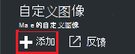
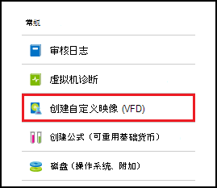
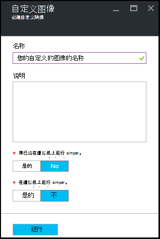

<properties
    pageTitle="管理 Azure DevTest 实验室自定义映像创建虚拟机 |Microsoft Azure"
    description="了解如何从一个 VHD 文件，或在 Azure DevTest 实验室现有虚拟机创建的自定义图像"
    services="devtest-lab,virtual-machines"
    documentationCenter="na"
    authors="tomarcher"
    manager="douge"
    editor=""/>

<tags
    ms.service="devtest-lab"
    ms.workload="na"
    ms.tgt_pltfrm="na"
    ms.devlang="na"
    ms.topic="article"
    ms.date="09/07/2016"
    ms.author="tarcher"/>

# 管理 Azure DevTest 实验室自定义映像创建虚拟机

在 Azure DevTest 实验室中，可以使用自定义图像快速创建虚拟机，而无需等待所有必需的软件安装在目标计算机上。 自定义映像允许您预安装 VHD 文件，在您需要的所有软件，然后使用 VHD 文件来创建一个虚拟机。 已安装该软件，因为 VM 创建时间是快得多。 此外，自定义图像用于克隆虚拟机从一个虚拟机创建的自定义图像，然后从该自定义映像创建虚拟机。

在本文中，您将学习如何︰

- [创建自定义映像从一个 VHD 文件](#create-a-custom-image-from-a-vhd-file)，然后可以从该自定义映像创建虚拟机。 
- [创建自定义映像从一个虚拟机](#create-a-custom-image-from-a-vm)的快速虚拟机克隆。

## 从 VHD 文件创建的自定义图像

在本节中，您将了解如何从一个 VHD 文件创建自定义图像。
您需要访问有效的 VHD 文件，此部分中执行的所有步骤。   

1. 登录到[Azure 的门户](http://go.microsoft.com/fwlink/p/?LinkID=525040)。

1. 选择**更多的服务**，然后从列表中选择**DevTest 实验室**。

1. 从实验室的列表中，选择所需的实验室。  

1. 在实验室的刀片式服务器，选择**配置**。 

1. 在实验室**配置**刀片式服务器，选择**自定义图像**。

1. **自定义图像**刀片式服务器，选择**自定义图像 +**。

    

1. 输入自定义映像的名称。 此名称显示在基准图像列表创建一个 VM 时。

1. 输入自定义图像的描述。 创建一个 VM 时，此说明将显示基图像的列表中。

1. 选择**VHD 文件**。

1. 如果可以访问到的 VHD 文件中未列出，将其添加在[上载 VHD 文件](#upload-a-vhd-file)部分中的说明，完成后返回这里。

1. 选择所需的 VHD 文件。

1. 选择**确定**以关闭**VHD 文件**刀片式服务器。

1. 选择**操作系统配置**。

1. **OS 配置**选项卡上，选择**Windows**或**Linux**。

1. 如果选中**窗口**，则指定通过该复选框是否已在计算机上运行*Sysprep* 。

1. 选择**确定**以关闭刀片式服务器**OS 配置**。

1. 选择**确定**以创建自定义图像。

1. 请转到[后续步骤](#next-steps)部分。

###将上载 VHD 文件

若要添加自定义图像，您需要有权访问 VHD 文件。

1. 在**VHD 文件**刀片式服务器，选中**上载 VHD 文件使用 PowerShell**。

    

1. 下一步的刀片将显示有关修改和运行 PowerShell 脚本将 VHD 文件上载到 Azure 订购说明。 
**注意︰**此过程可能很长的 VHD 文件，您的连接速度大小。

## 从虚拟机中创建的自定义图像
如果您有一个已配置的虚拟机，可以从该虚拟机，创建自定义图像和以后使用该自定义映像创建其他相同的虚拟机。 下面的步骤说明了如何从一个虚拟机创建的自定义图像︰

1. 登录到[Azure 的门户](http://go.microsoft.com/fwlink/p/?LinkID=525040)。

1. 选择**更多的服务**，然后从列表中选择**DevTest 实验室**。

1. 从实验室的列表中，选择所需的实验室。  

1. 在实验室的刀片式服务器，选择**我的虚拟机**。
 
1. 在**我的虚拟机**刀片式服务器，选择虚拟的机想要创建自定义图像。

1. 虚拟机的刀片在选择**创建自定义图像 (VHD)**。

    

1. **创建图像**刀片式服务器，请输入名称和说明的自定义映像。 此信息显示的库列表中，当您创建一个虚拟机。

    

1. 选择是否在 VM 上运行 sysprep。 如果未在 VM 上运行 sysprep，指定是否通过该自定义映像创建一个 VM 时运行 sysprep。

1. 请选择**确定**完成后若要创建自定义映像。

[AZURE.INCLUDE [devtest-lab-try-it-out](../../includes/devtest-lab-try-it-out.md)]

## 相关的博客张贴内容

- [自定义图像或公式？](https://blogs.msdn.microsoft.com/devtestlab/2016/04/06/custom-images-or-formulas/)
- [将自定义图像 Azure DevTest 实验室之间复制](http://www.visualstudiogeeks.com/blog/DevOps/How-To-Move-CustomImages-VHD-Between-AzureDevTestLabs#copying-custom-images-between-azure-devtest-labs)

##下一步行动

一旦添加使用的自定义图像创建一个 VM 时下, 一步是[添加到您的实验室的 VM](./devtest-lab-add-vm-with-artifacts.md)。