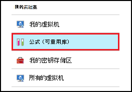
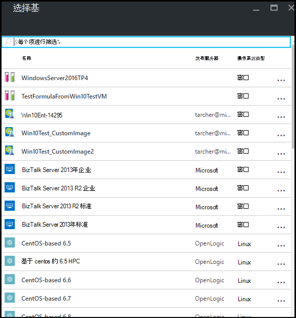
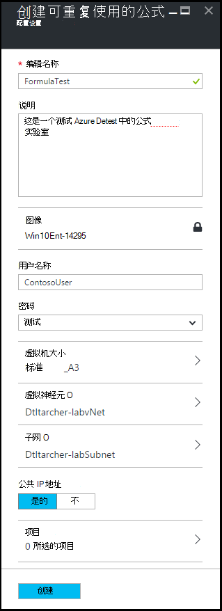
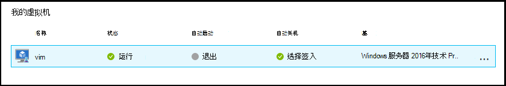
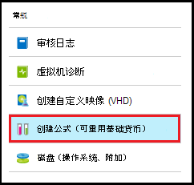
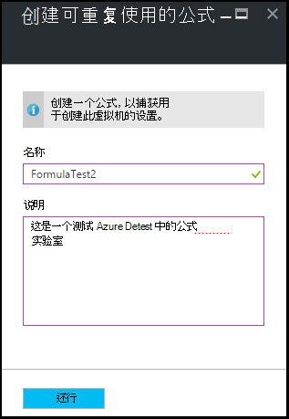
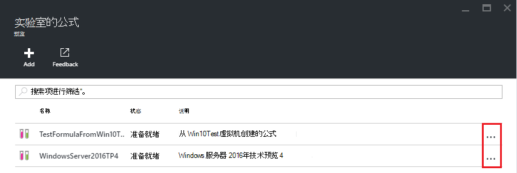
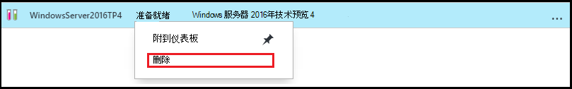

<properties
    pageTitle="管理 Azure DevTest 实验室创建的虚拟机中的公式 |Microsoft Azure"
    description="了解如何创建、 更新和删除 Azure DevTest 实验公式和使用它们来创建新的虚拟机。"
    services="devtest-lab,virtual-machines"
    documentationCenter="na"
    authors="tomarcher"
    manager="douge"
    editor=""/>

<tags
    ms.service="devtest-lab"
    ms.workload="na"
    ms.tgt_pltfrm="na"
    ms.devlang="na"
    ms.topic="article"
    ms.date="08/30/2016"
    ms.author="tarcher"/>

# 管理 DevTest 实验公式来创建虚拟机

在 Azure DevTest 实验公式是用来创建虚拟机 (VM) 的默认属性值的列表。 当创建一个虚拟机从一个公式，可用作默认值-，或者修改。 [自定义图像](./devtest-lab-create-template.md)和[市场上的图像](./devtest-lab-configure-marketplace-images.md)，如公式提供快速虚拟机资源调配的机制。  

在本文中，您将学习如何执行以下任务︰

- [创建公式](#create-a-formula)
- [使用一个公式来配置虚拟机](#use-a-formula-to-provision-a-vm)
- [修改公式](#modify-a-formula)
- [删除公式](#delete-a-formula)

> [AZURE.NOTE] 公式的[自定义图像](./devtest-lab-create-template.md)的像使您能够从 VHD 文件中创建的基本映像。 基本图像然后可以用于配置新的虚拟机。 帮助您确定哪种适合您的特定环境，请参阅文章，[进行比较自定义图像和 DevTest 实验中的公式](./devtest-lab-comparing-vm-base-image-types.md)。

## 创建公式
DevTest 实验室*用户*权限的任何人都能创建使用公式为基础的虚拟机。 有两种方法可以创建公式︰ 

- 从基本的使用时您要定义公式的所有特征。
- 从现有实验室虚拟机的使用当您想要创建的公式基于现有的虚拟机的设置。

### 从创建公式
以下步骤将指导您完成自定义图像，市场上的图像，或另一个公式创建一个公式的过程。

1. 登录到[Azure 的门户](http://go.microsoft.com/fwlink/p/?LinkID=525040)。

1. 选择**其他服务**，然后从列表中选择**DevTest 实验室**。

1. 从实验室的列表中，选择所需的实验室。  

1. 实验室的刀片式服务器，请选择**公式 （可重用库）**。

    

1. 在**实验室公式**刀片式服务器，选择**+ 添加**。

    

1. **选择基**刀片式服务器，选择要从中创建公式的基础 （自定义图像、 市场图像或公式）。

    

1. 在**创建公式**刀片式服务器，指定以下值︰

    - **公式名称**-输入公式的名称。 当您创建一个 VM 将基图像的列表中显示此值。 随着您键入它，和如果无效，将有消息提示的要求一个有效的名称，名称进行验证。
    - **说明**-输入公式的意义的说明。 当您创建一个虚拟机，则此值为公式的上下文菜单中可用。
    - **用户名称**-输入将被授予管理员权限的用户名。
    - **密码**-输入-或从下拉列表中选择的值与您要使用指定用户的机密 （密码）。  
    - **图像**-此字段显示以前刀片式服务器上所选的基图像的名称。 
    - **虚拟机大小**--选择一种预定义的项目指定处理器内核、 内存大小和创建 VM 的硬盘容量。
    - **虚拟网络**-指定所需的虚拟网络。
    - **子网**-指定所需的子网。
    - **公共 IP 地址**-如果实验室策略设置为允许所选子网的公用 IP 地址，指定是否要通过选择**是**或**否**公用 IP 地址。 否则为此选项被禁用并且选择**否**。
    - **项目**的选择和配置您想要添加到基本映像的项目。 保护与公式不保存值的字符串。 因此，不显示项目安全字符串的参数。 

        

1. 选择**创建**来创建公式。

### 从虚拟机中创建的公式
以下步骤将指导您完成创建基于现有的 VM 公式的过程。 

> [AZURE.NOTE] 若要从虚拟机中创建的公式，VM 必须之后创建 3 月 30，2016年。 

1. 登录到[Azure 的门户](http://go.microsoft.com/fwlink/p/?LinkID=525040)。

1. 选择**其他服务**，然后从列表中选择**DevTest 实验室**。

1. 从实验室的列表中，选择所需的实验室。  

1. 在实验室的**概述**刀片式服务器，选择虚拟机想要创建公式。

    

1. 虚拟机的刀片在选择**创建公式 （可重用的基础）**。

    

1. 在**创建公式**刀片式服务器，输入**名称**和**说明**新的公式。

    

1. 选择**确定**以创建公式。

## 使用一个公式来配置虚拟机
一旦您已经创建了一个公式，您可以创建一个基于该公式的虚拟机。 [添加虚拟机与工件](devtest-lab-add-vm-with-artifacts.md#add-a-vm-with-artifacts)节将指导您完成该过程。

## 修改公式
若要修改公式，请执行以下步骤︰

1. 登录到[Azure 的门户](http://go.microsoft.com/fwlink/p/?LinkID=525040)。

1. 选择**其他服务**，然后从列表中选择**DevTest 实验室**。

1. 从实验室的列表中，选择所需的实验室。  

1. 实验室的刀片式服务器，请选择**公式 （可重用库）**。

    

1. 在**实验室公式**刀片式服务器，选择要修改的公式。

1. **更新公式**刀片式服务器，使所需的编辑，并选择**更新**。

## 删除公式 
若要删除公式，请执行以下步骤︰

1. 登录到[Azure 的门户](http://go.microsoft.com/fwlink/p/?LinkID=525040)。

1. 选择**其他服务**，然后从列表中选择**DevTest 实验室**。

1. 从实验室的列表中，选择所需的实验室。  

1. 在实验室**设置**刀片式服务器，选择**公式**。

    

1. **实验室公式**刀片式服务器，请选择您想要删除的公式右边的省略号。

    

1. 在公式的上下文菜单中，选择**删除**。

    

1. 删除确认对话框时，选择**是**。

[AZURE.INCLUDE [devtest-lab-try-it-out](../../includes/devtest-lab-try-it-out.md)]

## 相关的博客张贴内容

- [自定义图像或公式？](https://blogs.msdn.microsoft.com/devtestlab/2016/04/06/custom-images-or-formulas/)

## 下一步行动
一旦您创建用于公式创建一个 VM 时下, 一步是[添加到您的实验室的 VM](./devtest-lab-add-vm-with-artifacts.md)。