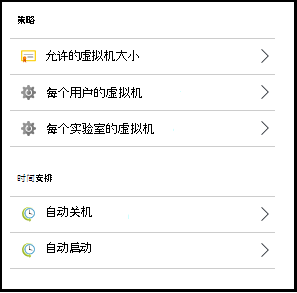
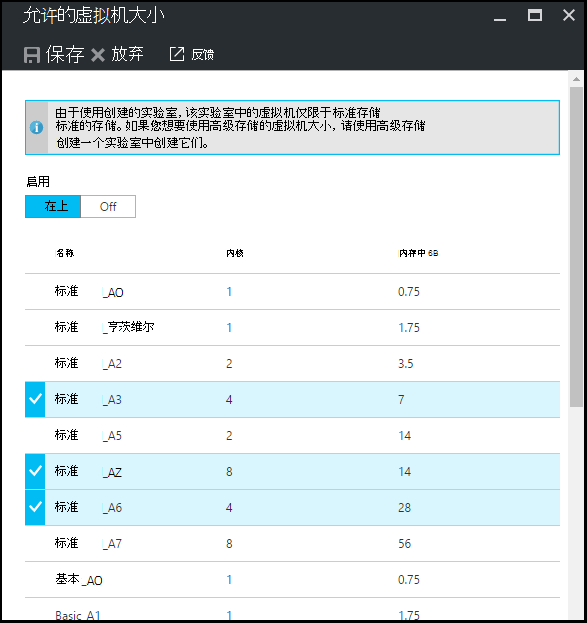
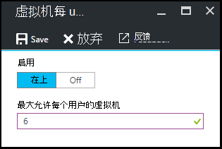
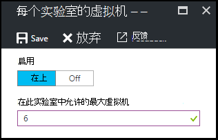
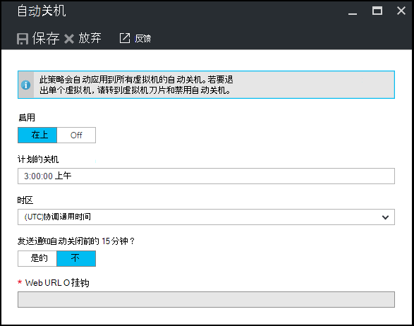
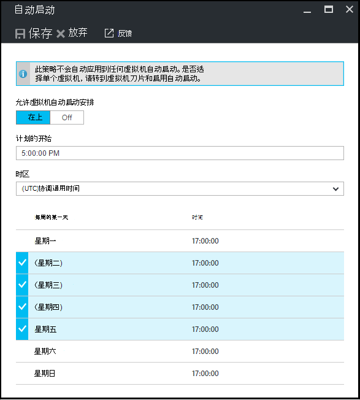

<properties
    pageTitle="在 Azure DevTest 实验室中定义实验室策略 |Microsoft Azure"
    description="了解如何定义例如 VM 大小，最大的虚拟机，每个用户和关闭自动化实验室策略。"
    services="devtest-lab,virtual-machines"
    documentationCenter="na"
    authors="tomarcher"
    manager="douge"
    editor=""/>

<tags
    ms.service="devtest-lab"
    ms.workload="na"
    ms.tgt_pltfrm="na"
    ms.devlang="na"
    ms.topic="article"
    ms.date="09/12/2016"
    ms.author="tarcher"/>

# 在 Azure DevTest 实验室中定义实验室策略

> [AZURE.VIDEO how-to-set-vm-policies-in-a-devtest-lab]

Azure DevTest 实验室使您能够指定有助于控制成本，尽量减少在您的实验室废物的主要策略。 这些实验室策略包括每个用户和每个实验室中和各种自动关机和自动启动选项创建的虚拟机的最大数量。 

## 访问一个实验室在 Azure DevTest 实验室的策略

以下步骤将指导您完成设置 Azure DevTest 实验室中的实验室的策略︰

若要查看 （和更改） 实验室的策略，请执行以下步骤︰

1. 登录到[Azure 的门户](http://go.microsoft.com/fwlink/p/?LinkID=525040)。

1. 选择**更多的服务**，然后从列表中选择**DevTest 实验室**。

1. 从实验室的列表中，选择所需的实验室。   

1. 选择**策略的设置**。

1. **策略设置**刀片式服务器包含设置，您可以指定一个的菜单︰ 

    

    若要了解有关设置策略的详细信息，请从以下列表选择︰

    - [允许虚拟机大小](#set-allowed-virtual-machine-sizes)的选择允许在实验室中的虚拟机大小的列表。 用户可从该列表中仅创建虚拟机。

    - [每个用户的虚拟机](#set-virtual-machines-per-user)-指定用户可以创建的虚拟机的最大数量。 

    - [每个实验室的虚拟机](#set-virtual-machines-per-lab)-指定可为实验室创建的虚拟机的最大数量。 

    - [自动关机](#set-auto-shutdown)-指定在当前实验室的虚拟机自动关闭的时间。

    - [自动启动](#set-auto-start)的指定当前实验室虚拟机自动启动的时间。

## 设置允许虚拟机大小

设置允许的 VM 大小的策略可帮助使您可以指定哪些虚拟机大小可在实验室中进行实验室废物最小化。 如果激活此策略，则 VM 大小仅从该列表可用于创建虚拟机。

1. 在实验室的**策略设置**刀片式服务器，选择**虚拟机允许的大小**。

    
 
1. 选择**在**启用该策略，和**关闭**以将其禁用。

1. 如果启用该策略，选择一个或多个可以在实验室中创建的虚拟机大小。

1. 选择**保存**。

## 每个用户的一组虚拟机

**虚拟机，每个用户**的策略允许您指定可以由个人用户创建的虚拟机的最大数量。 如果用户试图创建一个虚拟机，在满足用户限制时，将会出现错误消息，指示无法创建虚拟机。 

1. 在实验室的**策略设置**刀片式服务器，选择**每个用户的虚拟机**。

    

1. 选择**在**启用该策略，和**关闭**以将其禁用。

1. 如果您启用此策略，请输入数值，指示可以由用户创建的虚拟机的最大数量。 如果您输入的数字无效，用户界面会显示此字段允许的最大数目。

1. 选择**保存**。

## 每个实验室的一组虚拟机

**每个实验室的虚拟机**的策略允许您指定可以为当前的实验室创建的虚拟机的最大数量。 如果用户试图创建一个虚拟机，在满足实验室限制时，将会出现错误消息，指示无法创建虚拟机。 

1. 在实验室的**策略设置**刀片式服务器，选择**虚拟机，每个实验室**。

    

1. 选择**在**启用该策略，和**关闭**以将其禁用。

1. 如果您启用此策略，请输入数值，该值不能为当前的实验室创建的虚拟机的最大数量。 如果您输入的数字无效，用户界面会显示此字段允许的最大数目。

1. 选择**保存**。

## 设置自动关机

自动关机策略有助于实验室废弃物通过允许您指定此实验室虚拟机关闭的时间降至最低。

1. 在实验室的**策略设置**刀片式服务器，选择**自动关机**。

    

1. 选择**在**启用该策略，和**关闭**以将其禁用。

1. 如果您启用这个策略，指定本地时间关闭当前实验室中的所有虚拟机。

1. 选择**保存**。

1. 默认情况下，一旦启用，此策略适用于当前的实验室中的所有虚拟机。 要从一个特定的虚拟机删除此设置，打开 VM 的刀片式服务器并将其**自动关机**设置更改 

## 设置自动启动

自动启动策略可以指定应启动当前实验室中的虚拟机。  

1. 在实验室的**策略设置**刀片式服务器，选中**自动启动**。

    

1. 选择**在**启用该策略，和**关闭**以将其禁用。

1. 如果您启用这个策略，指定本地计划开始时间和时间所适用的星期数。 

1. 选择**保存**。

1. 一旦启用，此策略不自动应用于任何当前实验室中的虚拟机。 若要将此设置应用于一个特定的虚拟机，打开 VM 的刀片式服务器并将其**自动启动**设置更改 

[AZURE.INCLUDE [devtest-lab-try-it-out](../../includes/devtest-lab-try-it-out.md)]

## 下一步行动

已定义并应用于实验室的各种虚拟机策略设置后，就接下来尝试的一些事项︰

- [配置成本管理](./devtest-lab-configure-cost-management.md)-阐释了如何使用**每月估计成本趋势**图表  
若要查看当前月份的估计成本为日期和计划的结束月份支出。
- [创建自定义图像](./devtest-lab-create-template.md)-当您创建一个虚拟机，您指定的基础，可以为自定义图像或市场图像。 本文说明了如何从一个 VHD 文件创建的自定义图像。
- [配置市场图像](./devtest-lab-configure-marketplace-images.md)-Azure DevTest 实验室支持创建基于 Azure 市场图像的虚拟机。 本文说明了如何指定它，如果有的话，可以是 Azure 市场图像时在实验室中创建虚拟机使用。
- [创建一个在实验室中的虚拟机](./devtest-lab-add-vm-with-artifacts.md)的说明了如何从基本映像创建虚拟机 (或者自定义或市场)，以及如何使用您的 VM 中的项目。
