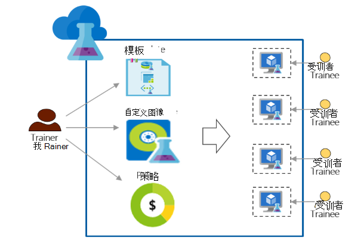

<properties
    pageTitle="培训使用 Azure DevTest 实验室 |Microsoft Azure"
    description="了解如何使用 Azure DevTest 实验室的培训方案。"
    services="devtest-lab,virtual-machines"
    documentationCenter="na"
    authors="steved0x"
    manager="douge"
    editor=""/>

<tags
    ms.service="devtest-lab"
    ms.workload="na"
    ms.tgt_pltfrm="na"
    ms.devlang="na"
    ms.topic="article"
    ms.date="09/12/2016"
    ms.author="sdanie"/>

# 培训使用 Azure DevTest 实验室

Azure DevTest 实验室可以用于实现开发/测试以及许多关键方案。 这些方案之一是建立培训实验室。 Azure DevTest 实验室，可创建一个实验室中，您可以提供自定义模板，每个受训者可以使用它来创建相同的和独立的环境培训。 您可以确保培训环境都提供给每个学员，只有当他们需要它们并且包含足够的资源的虚拟机-所需的培训等。 最后，您可以轻松地使用教材，它们可以一键访问共享实验室。   

Azure DevTest 实验室满足进行任何虚拟环境中的训练所需的以下要求︰ 

-   教材不能看到其他教材所创建的虚拟机
-   每个培训机应该是一样的
-   教材可以快速提供其培训环境
-   通过确保教材不能获得更多 Vm 不是他们不使用时需要培训以及关闭虚拟机来控制成本
-   轻松地分享每个受训者的培训实验室
-   一次次地重复使用培训实验室

在本文中，您还需要了解各个 Azure DevTest 实验室功能，可用于满足前面所述的培训需要和可以按照设置培训实验室的详细的步骤。  

## 实现使用 Azure DevTest 实验室的培训

1. **创建实验室** 

    实验是在 Azure DevTest 实验室的起点。 一旦您创建了一个实验室中，您可以执行任务如实验室、 向中添加用户 （教材） 设置策略以控制成本、 定义 VM 映像，可以快速创建，和更多。   

    通过单击下表中的链接了解更多信息︰

  	| 任务                                                            | 您的学习                                                    |
|-----------------------------------------------------------------|----------------------------------------------------------------------|
| [在 Azure DevTest 实验室中创建一个实验室](devtest-lab-create-lab.md) | 了解如何创建在 Azure DevTest 实验室在 Azure 门户的实验室。 |

2. **在几分钟内使用现成市场图像和自定义映像创建培训虚拟机** 
    
    可以在 Azure 市场挑选现成图像从各种不同的图像并使其可用于实验室中教材。 现成的图像不能满足您的需求，您可以通过创建一个实验室从 Azure 的市场上，安装所有软件，您需要培训，并将虚拟机保存为自定义图像在实验室中使用的现成的映像的虚拟机创建的自定义图像。 

    通过单击下表中的链接了解更多信息︰

  	| 任务                                                                              | 您的学习                                                                                                                                  |
|-----------------------------------------------------------------------------------|-------------------------------------------------------------------------------------------------------------------------------------------------|
| [配置 Azure 市场图像](devtest-lab-configure-marketplace-images.md) | 了解您可以怎样白名单 Azure 市场图像;使可供选择的图像所需的培训。                 |
| [创建自定义映像](devtest-lab-create-template.md)                           | 通过预安装所需的软件的培训，使教材可以快速创建一个使用自定义图像的虚拟机中创建的自定义图像。 |

3. **创建可重复使用的模板，以便培训机** 

    在 Azure DevTest 实验公式是用来创建一个虚拟机的默认属性值的列表。 选择图像、 一个 VM 大小 （CPU 和内存的组合） 和一个虚拟的网络，可以在实验室中创建一个公式。 每个学员可以查看实验室中的公式，并使用它来创建一个虚拟机。 

    通过单击下表中的链接了解更多信息︰

  	| 任务                                                                         | 您的学习                                                                                                          |
|------------------------------------------------------------------------------|-------------------------------------------------------------------------------------------------------------------------|
| [管理 DevTest 实验公式来创建虚拟机](devtest-lab-manage-formulas.md) | 了解通过提取图像、 VM 大小 （CPU 和内存的组合） 和一个虚拟的网络，您就可以创建一个公式。 |

4. **控制成本**

    Azure DevTest 实验室可以在实验室中以指定可以由受训者在实验室中创建的虚拟机的最大数量设置策略。 

    如果您要进行多天的培训，希望在一天中的某一特定时间停止所有 Vm，然后自动重新启动它们下一天可以轻松地实现这一点通过设置自动关机并自动启动策略，在实验室中。 

    最后，训练完毕后可以删除所有 Vm 同时通过运行一个 PowerShell 脚本。 

    通过单击下表中的链接了解更多信息︰

  	| 任务                                                                                                                                    | 您的学习                                                      |
|-----------------------------------------------------------------------------------------------------------------------------------------|---------------------------------------------------------------------|
| [定义实验室的策略](devtest-lab-set-lab-policy.md)                                                                                    | 通过在实验室中设置策略来控制成本。                       |
| [删除所有实验室虚拟机使用 PowerShell 脚本](devtest-lab-faq.md#how-can-i-automate-the-process-of-deleting-all-the-vms-in-my-lab) | 培训完成后，请删除在一个操作中的所有实验。 |

5. **与每个受训者共享实验室**

    可以使用与您教材共享的链接直接访问实验室。 您教材甚至不必有 Azure 帐户，只要他们有[Microsoft 帐户](devtest-lab-faq.md#what-is-a-microsoft-account)。 教材不能看到其他教材所创建的虚拟机。  

    通过单击下表中的链接了解更多信息︰

  	| 任务                                                                                                                                | 您的学习                                                   |
|-------------------------------------------------------------------------------------------------------------------------------------|------------------------------------------------------------------|
| [受训者加入 Azure DevTest 实验室中的实验室](devtest-lab-add-devtest-user.md)                                                     | 使用 Azure 门户网站添加到您的培训实验室教材。       |
| [向实验室使用 PowerShell 脚本添加教材](devtest-lab-add-devtest-user.md#add-an-external-user-to-a-lab-using-powershell) | 使用 PowerShell 自动添加到您的培训实验室的教材。 |
| [可以链接到实验室](devtest-lab-faq.md#how-do-i-share-a-direct-link-to-my-lab)                                                  | 了解如何实验室可以直接通过访问超链接。        |

6. **一次次地重复使用实验室** 

    您可以自动化实验室的创建，包括通过创建资源管理器模板并使用它来创建完全相同的实验，一次又一次自定义设置。 

    通过单击下表中的链接了解更多信息︰

  	| 任务                                                                                                                               | 您的学习                                                      |
|------------------------------------------------------------------------------------------------------------------------------------|---------------------------------------------------------------------|
| [创建实验室使用资源管理器模板](devtest-lab-faq.md#how-do-i-create-a-lab-from-an-azure-resource-manager-template) | 在 Azure DevTest 实验室使用资源管理器模板创建实验室。 |

[AZURE.INCLUDE [devtest-lab-try-it-out](../../includes/devtest-lab-try-it-out.md)]  

