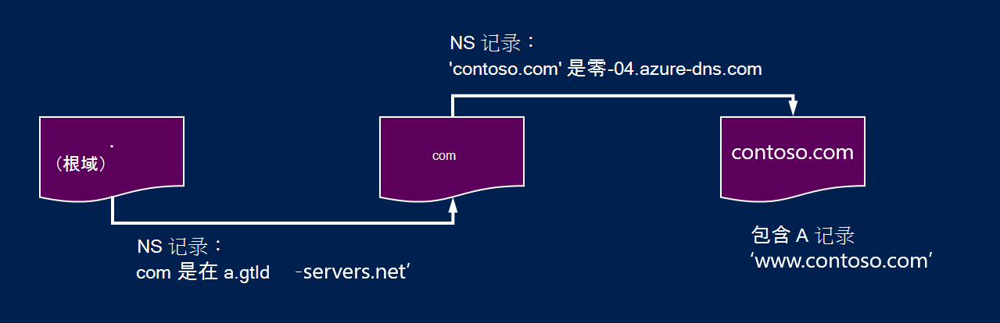
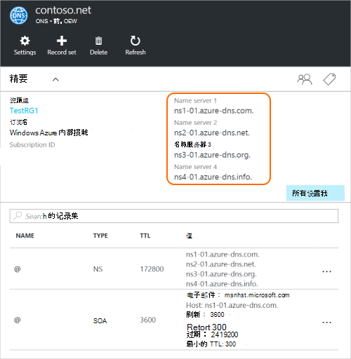

<properties
   pageTitle="委派到 Azure DNS 域 |Microsoft Azure"
   description="了解如何更改域委派和 Azure DNS 名称服务器用于提供域承载。"
   services="dns"
   documentationCenter="na"
   authors="sdwheeler"
   manager="carmonm"
   editor=""/>

<tags
   ms.service="dns"
   ms.devlang="na"
   ms.topic="get-started-article"
   ms.tgt_pltfrm="na"
   ms.workload="infrastructure-services"
   ms.date="06/30/2016"
   ms.author="sewhee"/>

# 委派到 Azure DNS 域

Azure DNS 可承载 DNS 区域和管理 Azure 中的域的 DNS 记录。 为了到达 Azure DNS 域的 DNS 查询时，不得不从父域中被委派到 Azure DNS 域。 请记住 Azure DNS 不是域注册。 本文介绍了域委派的工作原理以及如何委派到 Azure DNS 域。

## DNS 委派的工作原理

### 域和区域

域名系统是域的层次结构。 在层次结构开始从根域中，其名称就是**.**。  在此之下是顶级域，例如 com，净、 组织、 英国或 jp。  下面这些是第二层域，例如 org.uk 或 co.jp'。  等等等等。 使用独立的 DNS 区域承载 DNS 层次结构中的域。 全球分布在这些区域，由世界各地的 DNS 名称服务器。

**DNS 区域**

域是域名系统，例如 'contoso.com' 中的唯一名称。 DNS 区域用于承载特定域的 DNS 记录。 例如，域 'contoso.com' 可能包含大量的如 mail.contoso.com （用于邮件服务器） 和 www.contoso.com （某网站） 的 DNS 记录。

**域注册**

域注册商是一家公司可以提供互联网域名。 如果您要使用的 Internet 域可用，并允许您购买它，他们将验证。 域名注册后，您将域名的合法所有者。 如果您已经有 Internet 域，将使用当前的域注册到 Azure DNS 委派。

>[AZURE.NOTE] 要找出谁拥有一个给定的域名，或有关如何购买某个域的信息的详细信息，请参阅[Internet 域管理 Azure 的广告中](https://msdn.microsoft.com/library/azure/hh969248.aspx)。

### 分辨率和委派

有两种类型的 DNS 服务器︰

- _权威_的 DNS 服务器承载 DNS 区域。 它只在这些区域中的记录回答 DNS 查询。
- _递归_DNS 服务器不承载 DNS 区域。 它通过调用来收集的数据，它所需要的权威 DNS 服务器应答所有 DNS 查询。

>[AZURE.NOTE] Azure DNS 提供一个具有权威性的 DNS 服务。  它不提供递归 DNS 服务。

> 云服务和 Azure 中的虚拟机自动配置为提供递归 DNS 服务分别用作 Azure 的基础结构的一部分。  有关如何更改这些 DNS 设置的信息，请参阅[在 Azure 中的名称解析](../virtual-network/virtual-networks-name-resolution-for-vms-and-role-instances.md#name-resolution-using-your-own-dns-server)。

通常，DNS 客户端 Pc 或移动设备中的调用递归 DNS 服务器以执行客户端应用程序需要的任何 DNS 查询。

当递归 DNS 服务器收到查询的 DNS 记录，如 www.contoso.com 时，它首先需要找到主持 'contoso.com' 域的区域的名称服务器。 要做到这一点，它开始在根名称服务器中，并从那里找到主持的 com 区域的名称服务器。 然后查询来查找主持 'contoso.com' 区域的名称服务器的 com 名称服务器。  最后，它是能够查询 www.contoso.com 这些名称服务器。

这被称为 DNS 名称解析。 严格地讲，DNS 解析包括其他步骤，如以下 Cname，但不是重要的了解 DNS 委派的工作原理。

如何 does 父区域 '点' 到子区域的名称服务器？ 它是使用一种特殊类型的称为 NS 记录 （NS 代表名称服务器） 的 DNS 记录。 例如，根区域包含 com NS 记录并显示 com 区域的名称服务器。 反过来，com 区域包含 'contoso.com'，显示了 'contoso.com' 区域的名称服务器 NS 的记录。 设置的父区域中的子区域的 NS 记录被称为委派的域。

每个委托实际上有两个副本的 NS 记录。一个指向子，和另一个在本身的子区域的父区域中。 'Contoso.com' 区域包含 'contoso.com' （不包括在 com 的 NS 记录） 的 NS 的记录。 这些叫做权威 NS 记录和他们坐在子区域的顶点。

## 委派到 Azure DNS 域

一旦在 Azure DNS 创建 DNS 区域，您需要设置在父区域的 NS 记录以使 Azure DNS 进行名称解析，为您的区域的权威来源。 对于从注册购买的域，您的注册商将提供选项以设置这些 NS 记录。

>[AZURE.NOTE] 您不需要拥有创建 DNS 区域在 Azure DNS 域同名的域。 但是，您需要设置与注册器到 Azure DNS 委派的域拥有。

例如，假设您购买 'contoso.com' 的域和创建在 Azure DNS 名称 'contoso.com' 一个区域。 作为域的所有者，您的注册商将为您提供配置名称服务器的地址 （也就是说，NS 记录） 的选项为您的域。 注册器将存储在父域中，在.com 这种情况下这些 NS 记录。 尝试解决 'contoso.com' 中的 DNS 记录时，世界各地的客户端将再定向到您在 Azure DNS 区域的域。

### 查找名称服务器名称

可以将您的 DNS 区域到 Azure DNS 委派之前，您首先需要知道您的区域的名称服务器名称。 Azure DNS 分配名称服务器库中的每次创建区域时。

若要查看分配给您的区域的名称服务器的最简单方法是通过 Azure 的门户。  在此示例中，contoso.net 的区域具有已分配的名称服务器 ns1-01.azure-dns.com'，'ns2 01.azure dns.net，ns3-01.azure-dns.org，和 ns4-01.azure-dns.info:

 

Azure DNS 区域包含分配的名称服务器会自动创建具有权威性的 NS 记录。  若要查看通过 Azure PowerShell 或 Azure CLI 的名称服务器名称，您只需检索这些记录。

使用 Azure PowerShell，权威的 NS 记录可以进行检索，如下所示。 请注意，记录名称“@”用来指区域的顶点处的记录。

    PS> $zone = Get-AzureRmDnsZone –Name contoso.net –ResourceGroupName MyResourceGroup
    PS> Get-AzureRmDnsRecordSet –Name “@” –RecordType NS –Zone $zone

    Name              : @
    ZoneName          : contoso.net
    ResourceGroupName : MyResourceGroup
    Ttl               : 3600
    Etag              : 5fe92e48-cc76-4912-a78c-7652d362ca18
    RecordType        : NS
    Records           : {ns1-01.azure-dns.com, ns2-01.azure-dns.net, ns3-01.azure-dns.org,
                        ns4-01.azure-dns.info}
    Tags              : {}

您还可以使用跨平台 Azure CLI 检索的权威的 NS 记录，并因此发现分配给您的区域的名称服务器︰

    C:\> azure network dns record-set show MyResourceGroup contoso.net @ NS
    info:    Executing command network dns record-set show
        + Looking up the DNS Record Set "@" of type "NS"
    data:    Id                              : /subscriptions/.../resourceGroups/MyResourceGroup/providers/Microsoft.Network/dnszones/contoso.net/NS/@
    data:    Name                            : @
    data:    Type                            : Microsoft.Network/dnszones/NS
    data:    Location                        : global
    data:    TTL                             : 172800
    data:    NS records
    data:        Name server domain name     : ns1-01.azure-dns.com.
    data:        Name server domain name     : ns2-01.azure-dns.net.
    data:        Name server domain name     : ns3-01.azure-dns.org.
    data:        Name server domain name     : ns4-01.azure-dns.info.
    data:
    info:    network dns record-set show command OK

### 若要设置委派

每个注册器都有自己的 DNS 管理工具来更改域的名称服务器记录。 在教务主任的 DNS 管理页面，编辑的 NS 记录并使用 Azure DNS 创建替换的 NS 记录。

当委派到 Azure DNS 域，必须使用提供的 Azure DNS 名称服务器名。  应始终使用所有 4 名称服务器名称，而不考虑您的域的名称。  域委派不需要使用同一个顶级域为您的域的名称服务器名称。

不应使用粘附记录指向 Azure DNS 名称服务器的 IP 地址，因为可能会在将来更改这些 IP 地址。 在 Azure DNS 中当前不支持委派自己有时也称为虚荣名称服务器的区域中使用名称的服务器名称。

### 若要验证名称解析工作

完成后委派，您可以验证正在使用 'nslookup 之类的工具来查询您的区域，（它还会自动创建该区域时创建） 的 SOA 记录的名称解析。

请注意，您不必指定 Azure DNS 名称服务器，因为正常的 DNS 解析过程将自动地查找名称服务器，如果已正确设置委派。

    nslookup –type=SOA contoso.com

    Server: ns1-04.azure-dns.com
    Address: 208.76.47.4

    contoso.com
    primary name server = ns1-04.azure-dns.com
    responsible mail addr = msnhst.microsoft.com
    serial = 1
    refresh = 900 (15 mins)
    retry = 300 (5 mins)
    expire = 604800 (7 days)
    default TTL = 300 (5 mins)

## 在 Azure DNS 中的子域的委派

如果您想要设置一个单独的子区域，您可以委派在 Azure DNS 使用子域名。 例如，具有设置并在 Azure DNS 委派 'contoso.com' 假设您想要设置一个单独的子区域，partners.contoso.com。

设置子域作为正常委派遵循类似的过程。 唯一的区别是，在步骤 3 的 NS 记录必须创建父区域 'contoso.com' 在 Azure DNS 而不是通过域注册设置。

1. 在 Azure DNS 中创建子区域 'partners.contoso.com'。
2. 获取承载 Azure DNS 中的子区域的名称服务器的子区域中的权威 NS 记录中查找。
3. 通过配置中指向该子区域的父区域的 NS 记录委托的子区域。

### 若要委派子域

下面的 PowerShell 示例演示该方法的原理。 通过 Azure 门户网站，或通过跨平台 Azure CLI 可执行相同的步骤。

#### 第 1 步。 创建父和子区域

首先，我们创建的父和子区域。 这可能是同一个资源组或不同的资源组中。

    $parent = New-AzureRmDnsZone -Name contoso.com -ResourceGroupName RG1
    $child = New-AzureRmDnsZone -Name partners.contoso.com -ResourceGroupName RG1

#### 第 2 步。 检索 NS 记录

接下来，我们检索从接下来的示例中所示的子区域的权威的 NS 记录。  此属性包含分配到子区域的名称服务器。

    $child_ns_recordset = Get-AzureRmDnsRecordSet -Zone $child -Name "@" -RecordType NS

#### 第 3 步。 委托的子区域

创建相应设置的父区域中完成委派的 NS 记录。 请注意记录集名称的父区域中与子区域名称，在这种情况下匹配"合作伙伴"。

    $parent_ns_recordset = New-AzureRmDnsRecordSet -Zone $parent -Name "partners" -RecordType NS -Ttl 3600
    $parent_ns_recordset.Records = $child_ns_recordset.Records
    Set-AzureRmDnsRecordSet -RecordSet $parent_ns_recordset

### 若要验证名称解析工作

您可以验证一切都已正确设置了通过查找的子区域的 SOA 记录。

    nslookup –type=SOA partners.contoso.com

    Server: ns1-08.azure-dns.com
    Address: 208.76.47.8

    partners.contoso.com
        primary name server = ns1-08.azure-dns.com
        responsible mail addr = msnhst.microsoft.com
        serial = 1
        refresh = 900 (15 mins)
        retry = 300 (5 mins)
        expire = 604800 (7 days)
        default TTL = 300 (5 mins)

## 下一步行动

[管理 DNS 区域](dns-operations-dnszones.md)

[管理 DNS 记录](dns-operations-recordsets.md)

