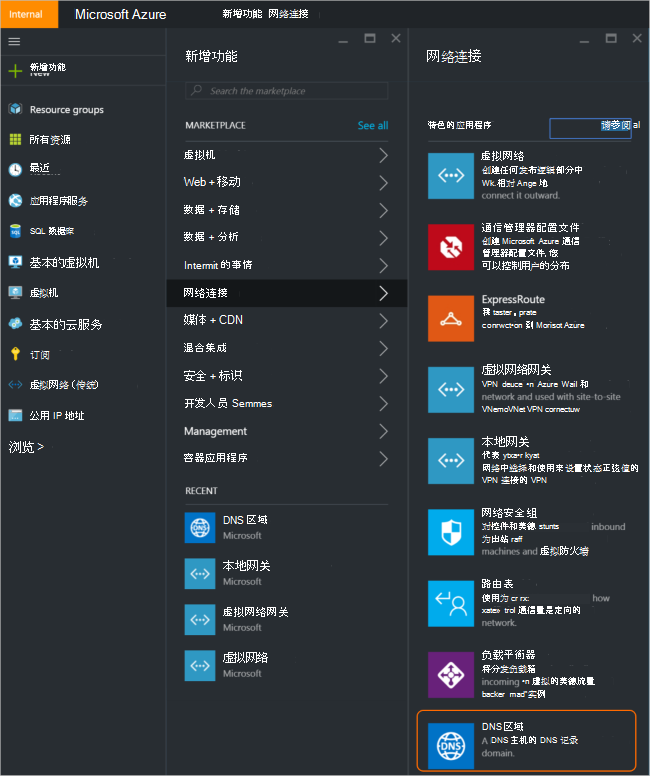
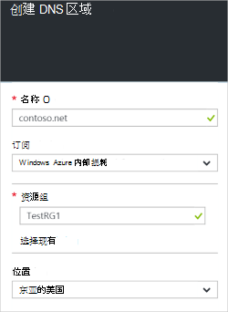
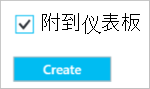
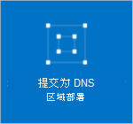
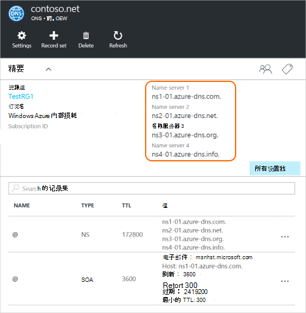
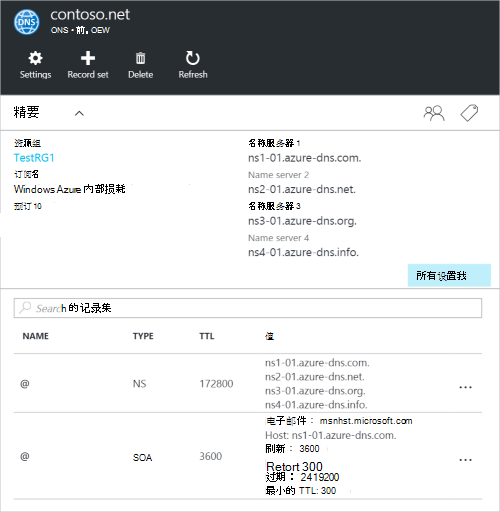

<properties
   pageTitle="如何创建和管理 DNS 区域的 Azure 门户 |Microsoft Azure"
   description="了解如何为 Azure DNS 创建 DNS 区域。 这是一个分步指南，以创建和管理您的第一个 DNS 并开始主持 DNS 域使用 Azure 的门户。"
   services="dns"
   documentationCenter="na"
   authors="sdwheeler"
   manager="carmonm"
   editor=""
   tags="azure-resource-manager"/>

<tags
   ms.service="dns"
   ms.devlang="na"
   ms.topic="article"
   ms.tgt_pltfrm="na"
   ms.workload="infrastructure-services"
   ms.date="08/16/2016"
   ms.author="sewhee"/>

# 在 Azure 门户创建 DNS 区域

> [AZURE.SELECTOR]
- [Azure 门户](dns-getstarted-create-dnszone-portal.md)
- [PowerShell](dns-getstarted-create-dnszone.md)
- [Azure CLI](dns-getstarted-create-dnszone-cli.md)

这篇文章将引导您完成步骤使用 Azure 门户创建 DNS 区域。 您还可以创建使用 PowerShell 或 CLI 的 DNS 区域。

[AZURE.INCLUDE [dns-create-zone-about](../../includes/dns-create-zone-about-include.md)]

### 有关标记的 Azure DNS

标记的名称-值对列表，并且使用 Azure 资源管理器标签的资源进行计费或分组。 有关标记的详细信息，请参阅文章[使用标签来组织您的 Azure 资源](../resource-group-using-tags.md)。

通过使用您的 DNS 区域**设置**刀片式服务器，可以在 Azure 的门户网站中添加标记。

## 创建 DNS 区域

1. 登录到 Azure 门户

2. 在集线器菜单上，单击，单击**新建 > 网络 >** ，然后单击要打开 DNS 区域刀片式服务器的**DNS 区域**。

    

3. 在**DNS 区域**刀片式服务器，请单击底部的**创建**。 这将打开刀片式服务器**创建 DNS 区域**。

    

4. **创建 DNS 区域**刀片式服务器，您的 DNS 区域的名称。 例如， *contoso.com*。 请参阅上一节中[有关 DNS 区域的名称](#names)。

5. 接下来，指定您要使用的资源组。 您可以创建新的资源组，或选择一个已经存在。

6. 从**位置**下拉列表，指定该资源组的位置。 请注意，此设置是指资源组，不为 DNS 区域的位置的位置。 实际的 DNS 区域资源自动"全局"并不是一个可以 （或者需要） 指定的门户。

7. 您可以保留此**附到仪表板**复选框如果您想要轻松地找到您在您的仪表板上的新区域。 然后单击**创建**。

    

8. 单击创建后，您将看到您正在配置仪表板上的新区域。

    

9. 已创建新的区域，将在仪表板上打开刀片式服务器将新区域。

## 查看记录

创建 DNS 区域还会创建如下的记录︰

- "起始授权机构"(SOA) 记录。 SOA 是存在于每个 DNS 区域根目录。
- 授权的名称服务器 (NS) 记录。 这些显示哪些名称服务器承载的区域。 Azure 的 DNS 使用的名称服务器池，因此不同名称服务器可能会分配到 Azure DNS 中的不同区域。 有关更多信息，请参见[委托到 Azure DNS 域](dns-domain-delegation.md)。

您可以查看从 Azure 门户的记录

1. 从您的**DNS 区域**刀片式服务器，请单击要打开**刀片式服务器设置**为 DNS 区域的**所有设置**。

    

2. 在精要窗格的下半部分中，您可以看到记录的 DNS 区域设置。

    

## 测试

可以通过使用 DNS 工具例如 nslookup，挖或为[解决 DnsName PowerShell cmdlet](https://technet.microsoft.com/library/jj590781.aspx)来测试您的 DNS 区域。

如果尚没有委托您使用新在 Azure DNS 区域的域，您需要直接直接到您的区域的名称服务器的 DNS 查询。 您的区域的名称服务器中给出了 NS 记录中，通过列出`Get-AzureRmDnsRecordSet`以上。 请确保替换您的区域分成以下命令的正确值。

    nslookup
    > set type=SOA
    > server ns1-01.azure-dns.com
    > contoso.com

    Server: ns1-01.azure-dns.com
    Address:  208.76.47.1

    contoso.com
            primary name server = ns1-01.azure-dns.com
            responsible mail addr = msnhst.microsoft.com
            serial  = 1
            refresh = 900 (15 mins)
            retry   = 300 (5 mins)
            expire  = 604800 (7 days)
            default TTL = 300 (5 mins)

## 删除 DNS 区域

您可以直接从门户网站删除 DNS 区域。 在删除之前在 Azure DNS 的 DNS 区域，将需要删除所有记录集，在该区域的根目录创建区域时自动创建 NS 和 SOA 记录除外。

1. 找到您想要删除该区域的**DNS 区域**刀片式服务器，然后单击顶部的刀片式服务器中**删除**。

2. 将出现一条消息，告知您必须删除所有记录集，自动创建 NS 和 SOA 记录除外。 如果您删除了您的记录集，请单击**是**。 请注意，当从门户中删除 DNS 区域，将不会删除与之关联的 DNS 区域资源组。

## 下一步行动

创建 DNS 区域之后, 创建数据[记录集和记录](dns-getstarted-create-recordset-portal.md)启动 Internet 域的名称解析。
