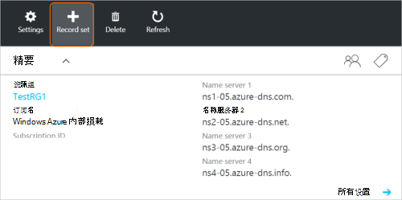
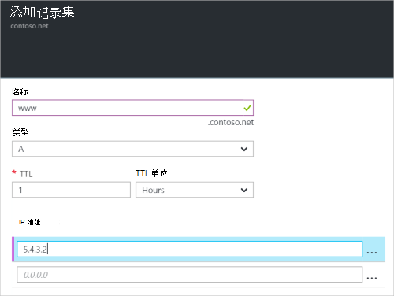

<properties
   pageTitle="创建记录集和记录的 DNS 区域使用 Azure 门户 |Microsoft Azure"
   description="如何创建用于 Azure DNS 主机记录和创建记录集和记录使用 Azure 门户"
   services="dns"
   documentationCenter="na"
   authors="sdwheeler"
   manager="carmonm"
   editor=""
   tags="azure-resource-manager"/>

<tags
   ms.service="dns"
   ms.devlang="na"
   ms.topic="article"
   ms.tgt_pltfrm="na"
   ms.workload="infrastructure-services"
   ms.date="08/16/2016"
   ms.author="sewhee"/>

# 通过使用 Azure 门户创建 DNS 记录集和记录

> [AZURE.SELECTOR]
- [Azure 门户](dns-getstarted-create-recordset-portal.md)
- [PowerShell](dns-getstarted-create-recordset.md)
- [Azure CLI](dns-getstarted-create-recordset-cli.md)

这篇文章将引导您完成创建记录和记录集使用 Azure 门户的过程。 创建 DNS 区域后，您为您的域添加的 DNS 记录。 为此，首先需要了解 DNS 记录和记录集。

[AZURE.INCLUDE [dns-about-records-include](../../includes/dns-about-records-include.md)]

## 创建一个记录集和记录

下面的示例演示使用 Azure 门户创建一个记录集和记录的过程。 我们将使用 DNS"A"记录类型。

1. 登录到门户。

2. 转到要在其中创建记录集**的 DNS 区域**刀片式服务器。

3. 刀片式服务器**的 DNS 区域**的顶部，选择**记录集**打开**添加记录集**刀片。

    

4. **添加记录集**刀片式服务器，您的记录集的名称。 例如，您无法命名您的记录集为"**www**"。

    

5. 选择您想要创建的记录的类型。 例如，选择**一个**。

6. 设置**TTL**。 实时在门户中的默认时间为 1 小时。

7. 添加 IP 地址，每行一个 IP 地址。 使用建议的记录集的名称和上文所述的记录类型，添加 IPv4 地址为 www 记录集的**A**记录。

8. 完成添加 IP 地址后，选择刀片底部的**确定**。 将创建 DNS 记录集。

## 下一步行动

要管理您的记录集和记录，请参阅[管理 DNS 记录和记录集使用 Azure 的门户](dns-operations-recordsets-portal.md)。

有关 Azure DNS 的详细信息，请参阅[Azure DNS 概述](dns-overview.md)。
