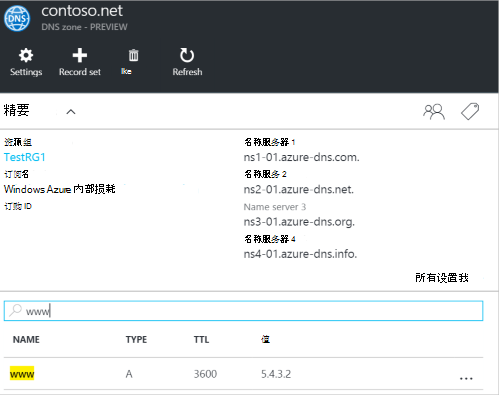
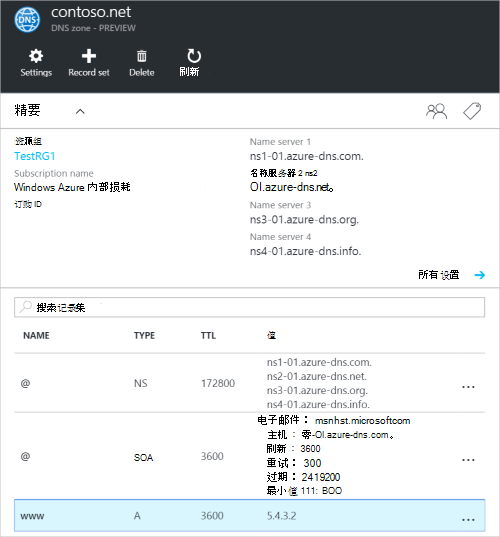
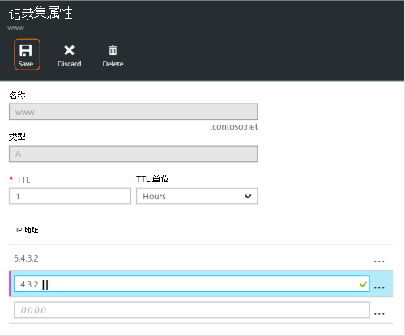
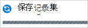
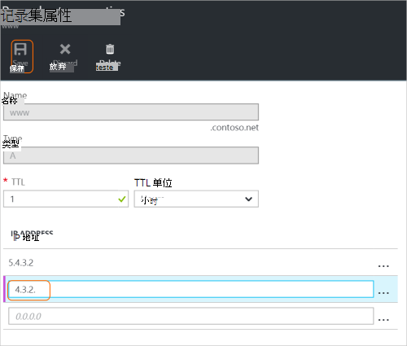
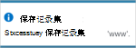
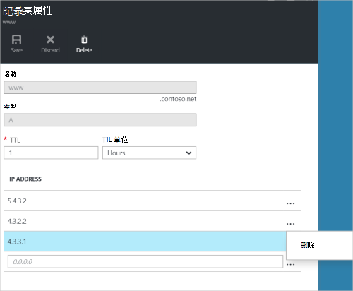
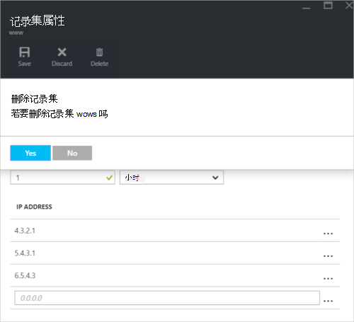

<properties
   pageTitle="管理 DNS 记录集和记录使用 Azure 门户 |Microsoft Azure"
   description="管理 DNS 记录设置和记录承载在 Azure DNS 域时。"
   services="dns"
   documentationCenter="na"
   authors="sdwheeler"
   manager="carmonm"
   editor=""
   tags="azure-resource-manager"/>

<tags
   ms.service="dns"
   ms.devlang="na"
   ms.topic="article"
   ms.tgt_pltfrm="na"
   ms.workload="infrastructure-services"
   ms.date="08/16/2016"
   ms.author="sewhee"/>

# 管理 DNS 记录和记录集使用 Azure 门户

> [AZURE.SELECTOR]
- [Azure 门户](dns-operations-recordsets-portal.md)
- [Azure CLI](dns-operations-recordsets-cli.md)
- [PowerShell](dns-operations-recordsets.md)

本文介绍如何通过使用 Azure 门户管理记录集和记录的 DNS 区域。

请务必了解 DNS 记录集和单个 DNS 记录之间的差异。 记录集是在一个区域中具有相同的名称和类型相同的记录集合。 有关详细信息，请参阅[创建 DNS 记录集和记录使用 Azure 的门户](dns-getstarted-create-recordset-portal.md)。

## 创建一个新的记录集和记录

创建记录集在 Azure 门户，请参见[使用 Azure 门户创建 DNS 记录](dns-getstarted-create-recordset-portal.md)。

## 查看记录集

1. 在 Azure 的门户中，转到**DNS 区域**刀片式服务器。

2. 记录集搜索并选择它。 这将打开的记录集属性。

    

## 向记录集添加新记录

对任何记录集，您可以添加最多 20 个记录。 记录集不能包含两个相同的记录。 （用零记录） 的空记录集可以创建，但并不出现在 Azure DNS 名称服务器。 最多的类型 CNAME 记录集可以包含一个记录。

1. DNS 区域的**记录设置属性**刀片式服务器，请单击您想要添加到的记录的记录集。

    

2. 指定记录集属性通过填写的字段。

    

2. 单击**保存**顶部的刀片式服务器保存您的设置。 然后，关闭刀片式服务器。

3. 在角，您将看到记录保存。

    

在保存记录后， **DNS 区域**刀片式服务器上的值将反映出新的记录。

## 更新记录

更新现有记录集中的记录时，您可以更新的字段取决于您正在使用的记录类型。

1. 在为您的记录集**记录集属性**的刀片，搜索该记录。

2. 修改记录。 在修改记录时，您可以更改记录的可用设置。 在下面的示例中，选择**IP 地址**字段，并且 IP 地址的过程中被修改。

    

3. 单击**保存**顶部的刀片式服务器保存您的设置。 在右上角，您将看到已保存记录的通知。

    

在保存记录后，记录在**DNS 区域**刀片式服务器上设置的值将反映已更新的记录。

## 从记录集中删除记录

您可以使用 Azure 门户从记录集中删除记录。 请注意从记录集中删除的最后一个记录不会删除该记录集。

1. 在为您的记录集**记录集属性**的刀片，搜索该记录。

2. 单击要删除的记录。 然后选择**删除**。

    

3. 单击**保存**顶部的刀片式服务器保存您的设置。

3. 在删除记录后， **DNS 区域**刀片式服务器上的记录的值将反映删除。

## 删除某一记录集

1. 在**记录集属性**刀片式服务器为您的记录集，单击**删除**。

    

2. 出现一条消息，询问您想要删除该记录集。

3. 请验证名称匹配您想要删除，并单击**是**的记录集。

4. 在**DNS 区域**刀片式服务器，请验证记录集已不可见。

## 使用 NS 和 SOA 记录

NS 和 SOA 自动创建的记录与其他记录类型以不同的方式管理。

### 修改 SOA 记录

不能添加或删除在区域 apex 设置自动创建 SOA 记录的记录 (名称 = "@")。 但是，您可以修改任何 SOA 记录 （除"主机"） 中的参数，并且记录设置 TTL。

### 修改的区域顶点处的 NS 记录

不能添加、 删除或修改的区域顶点在设置自动创建 NS 记录中的记录 (名称 = "@")。 允许的唯一更改是修改记录集 TTL。

### 删除 SOA 或 NS 记录集

您不能删除 SOA 和 NS 记录设置区域 apex (名称 ="@")创建区域时自动创建。 当您删除此区域时，它们将自动删除。

## 下一步行动

-   有关 Azure DNS 的详细信息，请参阅[Azure DNS 概述](dns-overview.md)。
-   有关自动 DNS 的详细信息，请参阅[使用.NET SDK 创建 DNS 区域和记录集](dns-sdk.md)。
-   有关反向 DNS 记录的详细信息，请参阅[如何管理您的服务使用 PowerShell 的反向 DNS 记录](dns-reverse-dns-record-operations-ps.md)。
