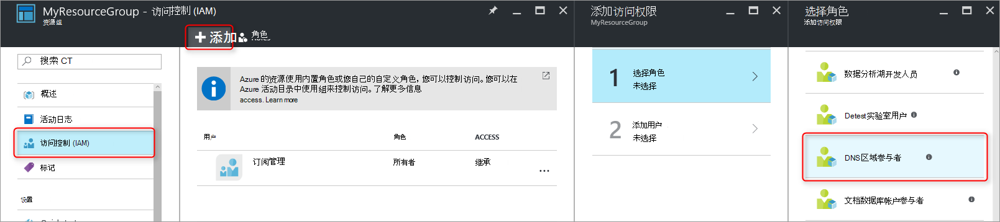
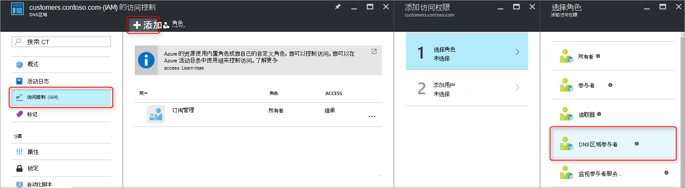
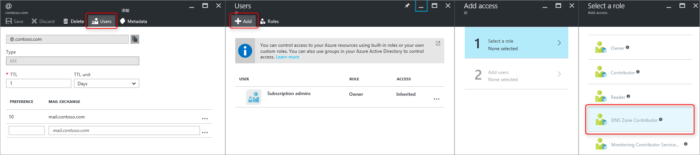
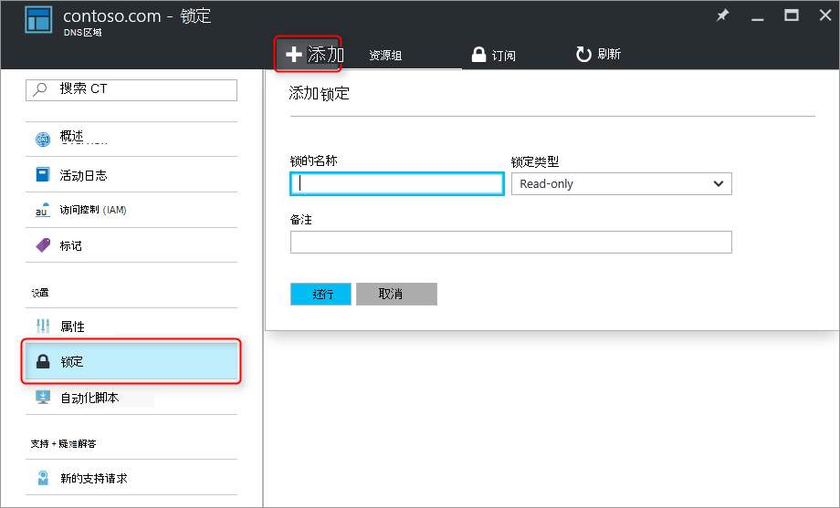

<properties 
   pageTitle="保护 DNS 区域和记录 |Microsoft Azure" 
   description="如何保护 DNS 区域和 Microsoft Azure DNS 中的记录集。" 
   services="dns" 
   documentationCenter="na" 
   authors="jtuliani" 
   manager="carmonm" 
   editor=""/>

<tags
   ms.service="dns"
   ms.devlang="na"
   ms.topic="article"
   ms.tgt_pltfrm="na"
   ms.workload="infrastructure-services" 
   ms.date="10/20/2016"
   ms.author="jtuliani"/>

# 如何保护 DNS 区域和记录

DNS 区域和记录是重要的资源。 删除一个 DNS 区域或甚至只是单个 DNS 记录会导致总的服务中断。  因此，它是重要关键 DNS 区域和记录可以免受未经授权或意外的更改。

本文介绍了 Azure DNS 如何使您能够保护您的 DNS 区域和针对此类更改的记录。  我们应用两种 Azure 资源管理器提供的功能强大的安全功能︰[基于角色的访问控制](../active-directory/role-based-access-control-what-is.md)和[资源锁](../resource-group-lock-resources.md)。

## 基于角色的访问控制

Azure 的基于角色的访问控制 (RBAC) 使细粒度访问 Azure 用户、 组和资源的管理。 使用 RBAC，则可以授予完全访问量用户执行其任务所需。 RBAC 是如何帮助您管理访问权限的详细信息，请参阅[什么是基于角色的访问控制](../active-directory/role-based-access-control-what-is.md)。

### DNS 区域讨论参与者角色

DNS 区域讨论参与者角色是 Azure 用于管理 DNS 资源提供一个内置角色。  将 DNS 区域的讨论参与者的权限分配给用户或组启用该组来管理 DNS 资源，但不是任何其他类型的资源。

例如，假定 Contoso 公司包含五个分区资源组 myzones。 授予的 DNS 管理员对该资源组的 DNS 区域讨论参与者权限，使这些 DNS 区域的完全控制。 它还可以避免授予不必要的权限，例如 DNS 管理员不能创建或停止虚拟机。

分配的 RBAC 权限的最简单方法是[通过 Azure 的门户](../active-directory/role-based-access-control-configure.md)。  打开访问控制 (IAM) 刀片式服务器资源组，然后单击添加，然后选择 DNS 区域参与者角色并选择所需的用户或组授予的权限。

也可以[使用 Azure PowerShell 授予](../active-directory/role-based-access-control-manage-access-powershell.md)权限︰

    # Grant 'DNS Zone Contributor' permissions to all zones in a resource group
    New-AzureRmRoleAssignment -SignInName <user email address> -RoleDefinitionName "DNS Zone Contributor" -ResourceGroupName <resource group name>

等效的命令也是[通过 Azure CLI 可用](../active-directory/role-based-access-control-manage-access-azure-cli.md)︰

    # Grant 'DNS Zone Contributor' permissions to all zones in a resource group
    azure role assignment create --signInName  <user email address> --roleName "DNS Zone Contributor" --resourceGroup <resource group name>

### 区域级别 RBAC

Azure RBAC 规则可以应用到订阅时，资源组或单个资源。 在 Azure DNS 的情况下，资源可以是单个的 DNS 区域或甚至个别的记录集。

例如，假设资源组 myzones 包含区域 'contoso.com' 和 subzone customers.contoso.com 中的每个客户帐户创建 CNAME 记录。  用来管理这些 CNAME 记录的帐户应分配在该 customers.contoso.com 区域中创建记录的权限，它不应与其他区域具有访问权限。

区域级的 RBAC 权限可以授予通过 Azure 的门户。  打开访问控制 (IAM) 刀片式服务器的区域，然后单击添加，然后选择 DNS 区域参与者角色并选择所需的用户或组授予的权限。

也可以[使用 Azure PowerShell 授予](../active-directory/role-based-access-control-manage-access-powershell.md)权限︰

    # Grant 'DNS Zone Contributor' permissions to a specific zone
    New-AzureRmRoleAssignment -SignInName <user email address> -RoleDefinitionName "DNS Zone Contributor" -ResourceGroupName <resource group name> -ResourceName <zone name> -ResourceType Microsoft.Network/DNSZones

等效的命令也是[通过 Azure CLI 可用](../active-directory/role-based-access-control-manage-access-azure-cli.md)︰

    # Grant 'DNS Zone Contributor' permissions to a specific zone
    azure role assignment create --signInName <user email address> --roleName "DNS Zone Contributor" --resource-name <zone name> --resource-type Microsoft.Network/DNSZones --resource-group <resource group name>

### 记录设置级别 RBAC

我们可以更进一步。 请考虑 Contoso 公司需要到 'contoso.com' 区域的顶点处的 MX 和 TXT 记录的访问权限的电子邮件管理员。  她不需要访问任何其他 MX 或 TXT 记录，或任何其他类型的任何记录。  Azure DNS，可以将记录集级别权限分配给准确的电子邮件管理员必须具有访问权限的记录。  邮件管理员授予完全控制她，需要时，并不能进行其他任何更改。
  
通过 Azure 门户，使用记录集刀片式服务器中的用户按钮，可以配置记录设置级别的 RBAC 权限︰

也可以[授予使用 Azure PowerShell](../active-directory/role-based-access-control-manage-access-powershell.md)记录设置级别的 RBAC 权限︰

    # Grant permissions to a specific record set
    New-AzureRmRoleAssignment -SignInName <user email address> -RoleDefinitionName "DNS Zone Contributor" -Scope "/subscriptions/<subscription id>/resourceGroups/<resource group name>/providers/Microsoft.Network/dnszones/<zone name>/<record type>/<record name>" 

等效的命令也是[通过 Azure CLI 可用](../active-directory/role-based-access-control-manage-access-azure-cli.md)︰

    # Grant permissions to a specific record set
    azure role assignment create --signInName <user email address> --roleName "DNS Zone Contributor" --scope "/subscriptions/<subscription id>/resourceGroups/<resource group name>/providers/Microsoft.Network/dnszones/<zone name>/<record type>/<record name>"

### 自定义角色

内置的 DNS 区域讨论参与者角色启用 DNS 资源的完全控制。 它也是可以生成您自己的客户 Azure 角色，以提供更精细的控制。

再次考虑区域 'customers.contoso.com' 中的 CNAME 记录为每个 Contoso 公司客户帐户的示例。  应授予用来管理这些 Cname 帐户权限管理 CNAME 记录。  就不能修改 （如更改 MX 记录） 的其他类型的记录或执行区域级操作，如删除区域。

下面的示例演示自定义角色定义用于管理 CNAME 记录︰

    {
        "Name": "DNS CNAME Contributor",
        "Id": "",
        "IsCustom": true,
        "Description": "Can manage DNS CNAME records only.",
        "Actions": [
            "Microsoft.Network/dnsZones/CNAME/*",
            "Microsoft.Network/dnsZones/read",
            "Microsoft.Authorization/*/read",
            "Microsoft.Insights/alertRules/*",
            "Microsoft.ResourceHealth/availabilityStatuses/read",
            "Microsoft.Resources/deployments/*",
            "Microsoft.Resources/subscriptions/resourceGroups/read",
            "Microsoft.Support/*"
        ],
        "NotActions": [
        ],
        "AssignableScopes": [
            "/subscriptions/ c276fc76-9cd4-44c9-99a7-4fd71546436e"
        ]
    }

操作属性定义以下 DNS 特定权限︰

- `Microsoft.Network/dnsZones/CNAME/*`授予完全控制的 CNAME 记录
- `Microsoft.Network/dnsZones/read`授予的权限来读取 DNS 区域，但不是能修改它们，使您可以在其中创建 CNAME 区域，请参阅。

余下的操作会复制从[DNS 区域参与者内置角色](../active-directory/role-based-access-built-in-roles.md#dns-zone-contributor)。

>[AZURE.NOTE] 使用自定义的 RBAC 角色，以防止删除记录集，虽然仍使他们能够更新并不有效控制。 它可以防止记录将被删除，但它不会阻止它们进行修改。  允许的修改包括添加和删除记录的记录集，其中包括删除所有记录将保留 '空' 的记录集。 这与删除记录集从 DNS 解析视野的效果相同。

当前无法通过 Azure 门户定义自定义角色定义。 可以使用 Azure PowerShell 创建基于此角色定义一个自定义角色︰

    # Create new role definition based on input file
    New-AzureRmRoleDefinition -InputFile <file path>

它也可以创建通过 Azure CLI:

    # Create new role definition based on input file
    azure role create –inputfile <file path>

然后可以为角色指定内置角色相同的方式，如本文前面所述。

了解有关如何创建，管理，和分配自定义角色，请参阅[Azure RBAC 中的自定义角色](../active-directory/role-based-access-control-custom-roles.md)。

## 资源锁

除了 RBAC，Azure 资源管理器还支持其他类型的安全控制，即 '锁定' 资源的能力。 其中 RBAC 规则允许您控制特定用户和组的动作，资源锁应用于资源，并且有效的所有用户和角色。 有关详细信息，请参阅[锁定资源使用 Azure 资源管理器中](../resource-group-lock-resources.md)。

有两种类型的资源锁︰ **DoNotDelete**和**只读**。 它们可以应用到 DNS 区域中，或单独的记录集。  以下各节介绍几种常见方案中，以及如何支持它们使用资源锁。

### 防止所有更改

若要防止所做的任何更改，请向该区域应用只读锁。  这可以防止新记录集被创建和现有被修改或删除的记录集。

可以通过 Azure 门户创建区域级别的资源锁。  从 DNS 区域刀片式服务器，请单击锁定，然后添加:

区域级锁还可以通过 Azure PowerShell 创建的资源︰

    # Lock a DNS zone
    New-AzureRmResourceLock -LockLevel <lock level> -LockName <lock name> -ResourceName <zone name> -ResourceType Microsoft.Network/DNSZones -ResourceGroupName <resource group name> 

不通过 Azure CLI 目前支持配置 Azure 的资源锁。

### 保护的单个记录
若要防止设置避免修改现有的 DNS 记录，记录集应用只读锁定。

>[AZURE.NOTE] 应用 DoNotDelete 锁定的记录集不是有效的控制。 它可以防止记录集被删除，但它不会阻止它被修改。  允许的修改包括添加和删除记录的记录集，其中包括删除所有记录将保留 '空' 的记录集。 这与删除记录集从 DNS 解析视野的效果相同。

记录集级别的资源锁可以目前只能使用 Azure PowerShell 配置。  在 Azure 门户或 Azure CLI 中不支持他们。

    # Lock a DNS record set
    New-AzureRmResourceLock -LockLevel <lock level> -LockName <lock name> -ResourceName <zone name>/<record set name> -ResourceType Microsoft.Network/DNSZones/<record type> -ResourceGroupName <resource group name> 

### 防止删除区域

在 Azure DNS 中删除了某个区域，该区域中的所有记录集也将删除。  此操作无法撤消。  不会意外删除重要的区域就有可能带来巨大的业务影响。  因此，它是非常重要，可以防止意外区域删除。

对区域应用 DoNotDelete 锁可以防止删除该区域。  但是，由于锁由子资源继承的它还可以防止在被删除的区域，它可能并不需要任何记录集。  此外，如以上的注意事项中所述，也是无效后仍然可以从现有的记录集中删除记录。

作为一种替代方法，请考虑应用到记录中区域，如 SOA 记录集设置 DoNotDelete 锁。  由于该区域不能删除而不会同时删除记录集，这样可防止区域删除，同时仍然允许自由地修改区域中的记录集。 如果尝试删除该区域，Azure 资源管理器会检测到这还会删除 SOA 记录集，并阻止调用，因为 SOA 已被锁定。  没有记录集将被删除。

以下 PowerShell 命令创建针对给定区域的 SOA 记录的 DoNotDelete 锁︰

    # Protect against zone delete with DoNotDelete lock on the record set
    New-AzureRmResourceLock -LockLevel DoNotDelete -LockName <lock name> -ResourceName <zone name>/@ -ResourceType Microsoft.Network/DNSZones/SOA -ResourceGroupName <resource group name> 

防止意外区域删除另一个方法是通过使用自定义角色以确保操作员和管理区域所使用的服务帐户不具有删除权限的区域。 要删除区域，可以强制执行两个步骤删除、 第一个授予的区域删除权限 （在区域范围内，以防止删除不正确的区域） 和第二个，删除该区域。

这第二种方法的优点在于它适用于这些帐户中，而无需创建任何锁，请务必访问的所有区域都有。 它具有与区域删除权限，如预订所有者，任何帐户可以仍无意删除关键区域的缺点。

很可能在同一时间，作为 DNS 区域保护的深层防护方法使用这两种方法资源锁和自定义角色。

## 下一步行动

- 关于使用 RBAC 的详细信息，请参阅[开始使用 Azure 门户中访问管理](../active-directory/role-based-access-control-what-is.md)。 
- 有关如何使用资源的锁的详细信息，请参阅[锁定资源使用 Azure 资源管理器中](../resource-group-lock-resources.md)。
- 有关保护您 Azure 的资源的详细信息，请参阅[为 Azure 资源管理器中的安全注意事项](../best-practices-resource-manager-security.md)。
