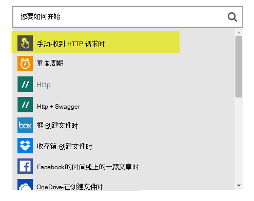
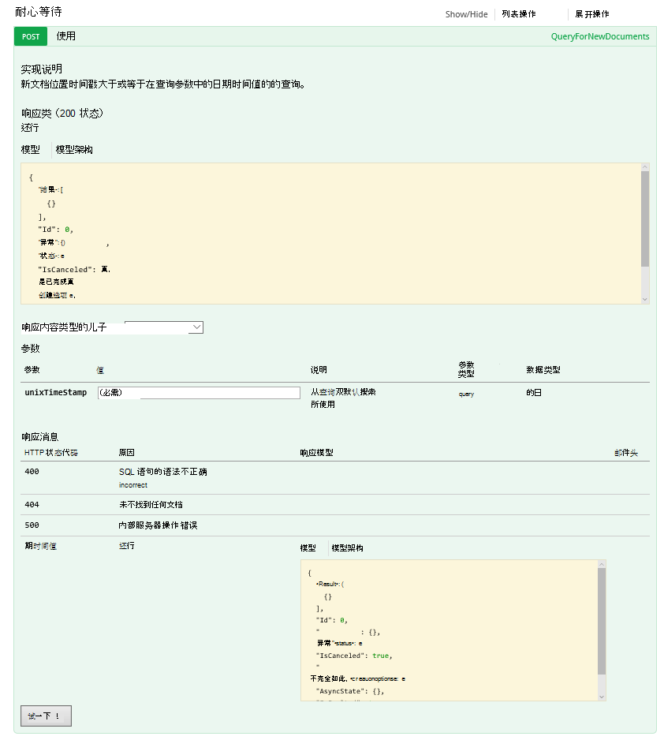

<properties 
    pageTitle="DocumentDB 的更改通知使用逻辑应用程序 |Microsoft Azure" 
    description="." 
    keywords="更改通知"
    services="documentdb" 
    authors="hedidin" 
    manager="jhubbard" 
    editor="mimig" 
    documentationCenter=""/>

<tags 
    ms.service="documentdb" 
    ms.workload="data-services" 
    ms.tgt_pltfrm="na" 
    ms.devlang="rest-api" 
    ms.topic="article" 
    ms.date="09/23/2016" 
    ms.author="b-hoedid"/>

# <a name="notifications-for-new-or-changed-documentdb-resources-using-logic-apps"></a>使用逻辑应用程序的新的或更改 DocumentDB 资源通知

这篇文章来自我看到发布 Azure DocumentDB 社区论坛之一的问题。 问题是**没有 DocumentDB 支持已修改的资源的通知**？

我用过 BizTalk Server 多年，并使用[WCF 的 LOB 适配器](https://msdn.microsoft.com/library/bb798128.aspx)时，这是非常常见的情况。 因此，我决定是否我可以在 DocumentDB 中此功能的新的和/或修改文档，请参阅。

本文概述了解决方案组件的更改通知，其中包括[触发器](documentdb-programming.md#trigger)和[逻辑的应用程序](../app-service-logic/app-service-logic-what-are-logic-apps.md)。 代码段提供了内联和整个解决方案的可用在[GitHub](https://github.com/HEDIDIN/DocDbNotifications)上很重要。

## <a name="use-case"></a>用例

下面的故事是本文中的用例。

DocumentDB 是健康级别的七个国际 (HL7) 快速医疗保健的互操作性资源 (FHIR) 文档的存储库。 让我们假设您的 DocumentDB 数据库结合 HL7 FHIR 服务器您 API 和应用程序逻辑构成。  医疗保健设施将患者的数据存储在 DocumentDB"患者"数据库。 还有几个集合内患者的数据库;临床、 标识等。患者信息属于标识。  您有一个名为"患者"。

心脏病科部门跟踪个人的运行状况和练习数据。 搜索新的或修改的病历非常耗时。 他们要求 IT 部门是否有一种方法，他们可以收到新的或修改的患者记录的通知。  

IT 部门称，它们可以很容易地提供这。 他们还说，他们无法推文档到[Azure Blob 存储](https://azure.microsoft.com/services/storage/)使心脏病科部门可以方便地访问它们。

## <a name="how-the-it-department-solved-the-problem"></a>IT 部门如何解决问题

若要创建此应用程序，IT 部门决定首先建立其模型。  有关使用业务流程模型和符号 (BPMN) 高兴的是，技术和非技术性的人更容易理解它。 此通知整个进程被认为是业务流程。 

## <a name="high-level-view-of-notification-process"></a>通知进程的高级别视图

1. 有一个计时器触发器逻辑应用程序开始。 默认情况下，触发器运行每隔一小时。
2. 下一步执行 HTTP POST 操作到逻辑的应用程序。
3. 逻辑应用程序完成所有工作。


### <a name="lets-take-a-look-at-what-this-logic-app-does"></a>让我们看看这个逻辑应用程序用途
看下图有几个步骤 LogicApp 工作流中。


步骤如下所示︰

1. 您需要从一个 API 应用程序中获取当前 UTC 日期时间。  默认值是一小时以前。

2. UTC 日期时间转换为 Unix 时间戳格式。 这是 DocumentDB 中的时间戳的默认格式。

3. 价值过帐到 API 的应用程序，后者执行 DocumentDB 查询。 在查询中使用的值是。

    ```SQL
        SELECT * FROM Patients p WHERE (p._ts >= @unixTimeStamp)
    ```

    > [AZURE.NOTE] _Ts 表示 DocumentDB 中的所有资源的时间戳的元数据。

4. 如果没有找到文档，响应正文发送到 Azure Blob 存储空间。

    > [AZURE.NOTE] Blob 存储需要的 Azure 存储帐户。 您需要设置 Azure Blob 存储帐户并添加新 Blob 名为患者。 有关详细信息，请参阅[关于 Azure 存储帐户](../storage/storage-create-storage-account.md)，并[开始使用 Azure Blob 存储](../storage/storage-dotnet-how-to-use-blobs.md)。

5. 最后，电子邮件发送的通知数找到文档的收件人。 如果未不找到任何文档，电子邮件正文是"0 文档找到"。 

现在，您已经知道该工作流的作用，让我们看看如何实现。

### <a name="lets-start-with-the-main-logic-app"></a>让我们开始与主逻辑应用程序

如果您尚不熟悉的应用程序逻辑可以在[Azure 市场](https://portal.azure.com/)，您可以了解有关它们在[应用程序的逻辑是什么？](../app-service-logic/app-service-logic-what-are-logic-apps.md)

如果您创建新的逻辑应用程序时，将要求您**您希望如何启动？**

当您单击文本框的内部时，必须选择的事件。 对于此逻辑的应用程序，选择**手动-当 HTTP 请求接收到**如下所示。



### <a name="design-view-of-your-completed-logic-app"></a>已完成的逻辑应用程序的设计视图
让我们跳，看一看逻辑应用程序，名为 DocDB 的已完成的设计视图。


在编辑逻辑应用程序设计器中的操作时，可以选择**输出**从 HTTP 请求或前一个操作 sendMail 操作下面所示的选项。


之前在工作流中的每个操作，您可以做出的决定;**将操作添加**或**添加条件**下图中所示。


如果选择**添加条件**，将会出现与窗体中，显示在下图中，输入您的逻辑。  这从本质上讲，是业务规则。  如果您在一个域内单击，可以选择从先前的操作参数的选择。 您还可以直接输入值。


> [AZURE.NOTE] 此外必须在代码视图中输入的所有信息的能力。

让我们看一看已完成逻辑应用程序在代码视图中。  

```JSON
   
    "$schema": "https://schema.management.azure.com/providers/Microsoft.Logic/schemas/2015-08-01-preview/workflowdefinition.json#",
    "actions": {
        "Conversion": {
            "conditions": [
                {
                    "dependsOn": "GetUtcDate"
                }
            ],
            "inputs": {
                "method": "post",
                "queries": {
                    "currentdateTime": "@{body('GetUtcDate')}"
                },
                "uri": "https://docdbnotificationapi-debug.azurewebsites.net/api/Conversion"
            },
            "metadata": {
                "apiDefinitionUrl": "https://docdbnotificationapi-debug.azurewebsites.net/swagger/docs/v1",
                "swaggerSource": "custom"
            },
            "type": "Http"
        },
        "Createfile": {
            "conditions": [
                {
                    "expression": "@greater(length(body('GetDocuments')), 0)"
                },
                {
                    "dependsOn": "GetDocuments"
                }
            ],
            "inputs": {
                "body": "@body('GetDocuments')",
                "host": {
                    "api": {
                        "runtimeUrl": "https://logic-apis-westus.azure-apim.net/apim/azureblob"
                    },
                    "connection": {
                        "name": "@parameters('$connections')['azureblob']['connectionId']"
                    }
                },
                "method": "post",
                "path": "/datasets/default/files",
                "queries": {
                    "folderPath": "/patients",
                    "name": "Patient_@{guid()}.json"
                }
            },
            "type": "ApiConnection"
        },
        "GetDocuments": {
            "conditions": [
                {
                    "dependsOn": "Conversion"
                }
            ],
            "inputs": {
                "method": "post",
                "queries": {
                    "unixTimeStamp": "@body('Conversion')"
                },
                "uri": "https://docdbnotificationapi-debug.azurewebsites.net/api/Patient"
            },
            "metadata": {
                "apiDefinitionUrl": "https://docdbnotificationapi-debug.azurewebsites.net/swagger/docs/v1",
                "swaggerSource": "custom"
            },
            "type": "Http"
        },
        "GetUtcDate": {
            "conditions": [],
            "inputs": {
                "method": "get",
                "queries": {
                    "hoursBack": "@{int(triggerBody()['GetUtcDate_HoursBack'])}"
                },
                "uri": "https://docdbnotificationapi-debug.azurewebsites.net/api/Authorization"
            },
            "metadata": {
                "apiDefinitionUrl": "https://docdbnotificationapi-debug.azurewebsites.net/swagger/docs/v1",
                "swaggerSource": "custom"
            },
            "type": "Http"
        },
        "sendMail": {
            "conditions": [
                {
                    "dependsOn": "GetDocuments"
                }
            ],
            "inputs": {
                "body": "api_user=@{triggerBody()['sendgridUsername']}&api_key=@{triggerBody()['sendgridPassword']}&from=@{parameters('fromAddress')}&to=@{triggerBody()['EmailTo']}&subject=@{triggerBody()['Subject']}&text=@{int(length(body('GetDocuments')))} Documents Found",
                "headers": {
                    "Content-type": "application/x-www-form-urlencoded"
                },
                "method": "POST",
                "uri": "https://api.sendgrid.com/api/mail.send.json"
            },
            "type": "Http"
        }
    },
    "contentVersion": "1.0.0.0",
    "outputs": {
        "Results": {
            "type": "String",
            "value": "@{int(length(body('GetDocuments')))} Records Found"
        }
    },
    "parameters": {
        "$connections": {
            "defaultValue": {},
            "type": "Object"
        },
        "fromAddress": {
            "defaultValue": "user@msn.com",
            "type": "String"
        },
        "toAddress": {
            "defaultValue": "XXXXX@XXXXXXX.net",
            "type": "String"
        }
    },
    "triggers": {
        "manual": {
            "inputs": {
                "schema": {
                    "properties": {},
                    "required": [],
                    "type": "object"
                }
            },
            "type": "Manual"
        }
    
```

如果您还不熟悉的代码中的不同部分的代表，则可以查看[逻辑应用程序工作流定义语言](http://aka.ms/logicappsdocs)文档。

此工作流正在使用[HTTP Webhook 触发器](https://sendgrid.com/blog/whats-webhook/)。 如果您看一下上面的代码中，您将看到类似于以下示例的参数。

```C#

    =@{triggerBody()['Subject']}

```

`triggerBody()`表示逻辑 REST API，应用程序的其余部分帖子正文中包含的参数。 `()['Subject']`表示该字段。 所有这些参数构成 JSON 格式的正文。 

> [AZURE.NOTE] 通过使用 Web 挂钩，可以有完全访问权限的标头和正文触发器的请求。 在此应用程序所需正文。

如上文所述，可以使用设计器来分配参数或其在代码视图中执行。
如果您做它在代码视图中，您定义哪些属性需要一个值，如下面的代码示例中所示。 

```JSON

    "triggers": {
        "manual": {
            "inputs": {
            "schema": {
                "properties": {
            "Subject": {
                "type" : "String"   

            }
            },
                "required": [
            "Subject"
                 ],
                "type": "object"
            }
            },
            "type": "Manual"
        }
        }
```

所进行的操作将传递一个 JSON 架构创建从 HTTP POST 的主体。
要激发触发器，您将需要回调 URL。  您将学习如何在本教程后面生成它。  

## <a name="actions"></a>操作
让我们看我们的逻辑应用程序中的每个操作的作用。

### <a name="getutcdate"></a>GetUTCDate

**设计器视图**


**代码视图**

```JSON

    "GetUtcDate": {
            "conditions": [],
            "inputs": {
            "method": "get",
            "queries": {
                "hoursBack": "@{int(triggerBody()['GetUtcDate_HoursBack'])}"
            },
            "uri": "https://docdbnotificationapi-debug.azurewebsites.net/api/Authorization"
            },
            "metadata": {
            "apiDefinitionUrl": "https://docdbnotificationapi-debug.azurewebsites.net/swagger/docs/v1"
            },
            "type": "Http"
        },

```

此 HTTP 操作执行 GET 操作。  它调用 API 的应用程序的 GetUtcDate 方法。 Uri 使用 GetUtcDate_HoursBack 属性传递到触发器主体。  第一个逻辑应用程序中设置的 GetUtcDate_HoursBack 值。 在本教程后面部分，您将学习有关触发器逻辑应用程序的详细信息。

此操作将调用您 API 的应用程序返回 UTC 日期的字符串值。

#### <a name="operations"></a>操作

**请求**

```JSON

    {
        "uri": "https://docdbnotificationapi-debug.azurewebsites.net/api/Authorization",
        "method": "get",
        "queries": {
          "hoursBack": "24"
        }
    }

```

**响应**

```JSON

    {
        "statusCode": 200,
        "headers": {
          "pragma": "no-cache",
          "cache-Control": "no-cache",
          "date": "Fri, 26 Feb 2016 15:47:33 GMT",
          "server": "Microsoft-IIS/8.0",
          "x-AspNet-Version": "4.0.30319",
          "x-Powered-By": "ASP.NET"
        },
        "body": "Fri, 15 Jan 2016 23:47:33 GMT"
    }

```

下一步是将 UTC 日期时间值转换为 Unix 时间戳，它是一个.NET 类型。

### <a name="conversion"></a>转换

##### <a name="designer-view"></a>设计器视图


##### <a name="code-view"></a>代码视图

```JSON

    "Conversion": {
        "conditions": [
        {
            "dependsOn": "GetUtcDate"
        }
        ],
        "inputs": {
        "method": "post",
        "queries": {
            "currentDateTime": "@{body('GetUtcDate')}"
        },
        "uri": "https://docdbnotificationapi-debug.azurewebsites.net/api/Conversion"
        },
        "metadata": {
        "apiDefinitionUrl": "https://docdbnotificationapi-debug.azurewebsites.net/swagger/docs/v1"
        },
        "type": "Http"
    },

```

在此步骤中您将从 GetUTCDate 返回的值中。  没有取决于条件，这意味着 GetUTCDate 操作必须成功完成。 如果没有，然后将跳过此操作。 

此操作将调用您 API 的应用程序处理的转换。

#### <a name="operations"></a>操作

##### <a name="request"></a>请求

```JSON

    {
        "uri": "https://docdbnotificationapi-debug.azurewebsites.net/api/Conversion",
        "method": "post",
        "queries": {
        "currentDateTime": "Fri, 15 Jan 2016 23:47:33 GMT"
        }
    }   
```

##### <a name="response"></a>响应

```JSON

    {
        "statusCode": 200,
        "headers": {
          "pragma": "no-cache",
          "cache-Control": "no-cache",
          "date": "Fri, 26 Feb 2016 15:47:33 GMT",
          "server": "Microsoft-IIS/8.0",
          "x-AspNet-Version": "4.0.30319",
          "x-Powered-By": "ASP.NET"
        },
        "body": 1452901653
    }
```

在下一步的操作，您将为我们 API 的应用程序执行 POST 操作。

### <a name="getdocuments"></a>GetDocuments 

##### <a name="designer-view"></a>设计器视图


##### <a name="code-view"></a>代码视图

```JSON

    "GetDocuments": {
        "conditions": [
        {
            "dependsOn": "Conversion"
        }
        ],
        "inputs": {
        "method": "post",
        "queries": {
            "unixTimeStamp": "@{body('Conversion')}"
        },
        "uri": "https://docdbnotificationapi-debug.azurewebsites.net/api/Patient"
        },
        "metadata": {
        "apiDefinitionUrl": "https://docdbnotificationapi-debug.azurewebsites.net/swagger/docs/v1"
        },
        "type": "Http"
    },

```

GetDocuments 操作要在响应正文中传递从转换操作。 这是 Uri 中的参数︰

 
```C#

    unixTimeStamp=@{body('Conversion')}

```

QueryDocuments 操作执行 HTTP POST 操作到 API 的应用程序。 

调用方法是**QueryForNewPatientDocuments**。

#### <a name="operations"></a>操作

##### <a name="request"></a>请求

```JSON

    {
        "uri": "https://docdbnotificationapi-debug.azurewebsites.net/api/Patient",
        "method": "post",
        "queries": {
        "unixTimeStamp": "1452901653"
        }
    }
```

##### <a name="response"></a>响应

```JSON

    {
        "statusCode": 200,
        "headers": {
        "pragma": "no-cache",
        "cache-Control": "no-cache",
        "date": "Fri, 26 Feb 2016 15:47:35 GMT",
        "server": "Microsoft-IIS/8.0",
        "x-AspNet-Version": "4.0.30319",
        "x-Powered-By": "ASP.NET"
        },
        "body": [
        {
            "id": "xcda",
            "_rid": "vCYLAP2k6gAXAAAAAAAAAA==",
            "_self": "dbs/vCYLAA==/colls/vCYLAP2k6gA=/docs/vCYLAP2k6gAXAAAAAAAAAA==/",
            "_ts": 1454874620,
            "_etag": "\"00007d01-0000-0000-0000-56b79ffc0000\"",
            "resourceType": "Patient",
            "text": {
            "status": "generated",
            "div": "<div>\n      \n      <p>Henry Levin the 7th</p>\n    \n    </div>"
            },
            "identifier": [
            {
                "use": "usual",
                "type": {
                "coding": [
                    {
                    "system": "http://hl7.org/fhir/v2/0203",
                    "code": "MR"
                    }
                ]
                },
                "system": "urn:oid:2.16.840.1.113883.19.5",
                "value": "12345"
            }
            ],
            "active": true,
            "name": [
            {
                    "family": [
                        "Levin"
                    ],
                    "given": [
                        "Henry"
                    ]
                }
            ],
            "gender": "male",
            "birthDate": "1932-09-24",
            "managingOrganization": {
                "reference": "Organization/2.16.840.1.113883.19.5",
                "display": "Good Health Clinic"
            }
        },

```

下一步操作是将文档保存到[Azure 博客存储](https://azure.microsoft.com/services/storage/)。 

> [AZURE.NOTE] Blob 存储需要的 Azure 存储帐户。 您需要设置 Azure Blob 存储帐户并添加新 Blob 名为患者。 有关详细信息，请参阅[开始使用 Azure Blob 存储](../storage/storage-dotnet-how-to-use-blobs.md)。

### <a name="create-file"></a>创建文件

##### <a name="designer-view"></a>设计器视图


##### <a name="code-view"></a>代码视图

```JSON

    {
    "host": {
        "api": {
            "runtimeUrl": "https://logic-apis-westus.azure-apim.net/apim/azureblob"
        },
        "connection": {
            "name": "subscriptions/fxxxxxc079-4e5d-b002-xxxxxxxxxx/resourceGroups/Api-Default-Central-US/providers/Microsoft.Web/connections/azureblob"
        }
    },
    "method": "post",
    "path": "/datasets/default/files",
    "queries": {
        "folderPath": "/patients",
        "name": "Patient_17513174-e61d-4b56-88cb-5cf383db4430.json"
    },
    "body": [
        {
            "id": "xcda",
            "_rid": "vCYLAP2k6gAXAAAAAAAAAA==",
            "_self": "dbs/vCYLAA==/colls/vCYLAP2k6gA=/docs/vCYLAP2k6gAXAAAAAAAAAA==/",
            "_ts": 1454874620,
            "_etag": "\"00007d01-0000-0000-0000-56b79ffc0000\"",
            "resourceType": "Patient",
            "text": {
                "status": "generated",
                "div": "<div>\n      \n      <p>Henry Levin the 7th</p>\n    \n    </div>"
            },
            "identifier": [
                {
                    "use": "usual",
                    "type": {
                        "coding": [
                            {
                                "system": "http://hl7.org/fhir/v2/0203",
                                "code": "MR"
                            }
                        ]
                    },
                    "system": "urn:oid:2.16.840.1.113883.19.5",
                    "value": "12345"
                }
            ],
            "active": true,
            "name": [
                {
                    "family": [
                        "Levin"
                    ],
                    "given": [
                        "Henry"
                    ]
                }
            ],
            "gender": "male",
            "birthDate": "1932-09-24",
            "managingOrganization": {
                "reference": "Organization/2.16.840.1.113883.19.5",
                "display": "Good Health Clinic"
            }
        },

```

从设计器中的操作，则生成的代码。 您不需要修改代码。

如果您还不熟悉如何使用 Azure Blob API，请参阅[开始使用 Azure blob 存储 API](../connectors/connectors-create-api-azureblobstorage.md)。

#### <a name="operations"></a>操作

##### <a name="request"></a>请求

```JSON

    "host": {
        "api": {
            "runtimeUrl": "https://logic-apis-westus.azure-apim.net/apim/azureblob"
        },
        "connection": {
            "name": "subscriptions/fxxxxxc079-4e5d-b002-xxxxxxxxxx/resourceGroups/Api-Default-Central-US/providers/Microsoft.Web/connections/azureblob"
        }
    },
    "method": "post",
    "path": "/datasets/default/files",
    "queries": {
        "folderPath": "/patients",
        "name": "Patient_17513174-e61d-4b56-88cb-5cf383db4430.json"
    },
    "body": [
        {
            "id": "xcda",
            "_rid": "vCYLAP2k6gAXAAAAAAAAAA==",
            "_self": "dbs/vCYLAA==/colls/vCYLAP2k6gA=/docs/vCYLAP2k6gAXAAAAAAAAAA==/",
            "_ts": 1454874620,
            "_etag": "\"00007d01-0000-0000-0000-56b79ffc0000\"",
            "resourceType": "Patient",
            "text": {
                "status": "generated",
                "div": "<div>\n      \n      <p>Henry Levin the 7th</p>\n    \n    </div>"
            },
            "identifier": [
                {
                    "use": "usual",
                    "type": {
                        "coding": [
                            {
                                "system": "http://hl7.org/fhir/v2/0203",
                                "code": "MR"
                            }
                        ]
                    },
                    "system": "urn:oid:2.16.840.1.113883.19.5",
                    "value": "12345"
                }
            ],
            "active": true,
            "name": [
                {
                    "family": [
                        "Levin"
                    ],
                    "given": [
                        "Henry"
                    ]
                }
            ],
            "gender": "male",
            "birthDate": "1932-09-24",
            "managingOrganization": {
                "reference": "Organization/2.16.840.1.113883.19.5",
                "display": "Good Health Clinic"
            }
        },….


```

##### <a name="response"></a>响应

```JSON

    {
        "statusCode": 200,
        "headers": {
        "pragma": "no-cache",
        "x-ms-request-id": "2b2f7c57-2623-4d71-8e53-45c26b30ea9d",
        "cache-Control": "no-cache",
        "date": "Fri, 26 Feb 2016 15:47:36 GMT",
        "set-Cookie": "ARRAffinity=29e552cea7db23196f7ffa644003eaaf39bc8eb6dd555511f669d13ab7424faf;Path=/;Domain=127.0.0.1",
        "server": "Microsoft-HTTPAPI/2.0",
        "x-AspNet-Version": "4.0.30319",
        "x-Powered-By": "ASP.NET"
        },
        "body": {
        "Id": "0B0nBzHyMV-_NRGRDcDNMSFAxWFE",
        "Name": "Patient_47a2a0dc-640d-4f01-be38-c74690d085cb.json",
        "DisplayName": "Patient_47a2a0dc-640d-4f01-be38-c74690d085cb.json",
        "Path": "/Patient/Patient_47a2a0dc-640d-4f01-be38-c74690d085cb.json",
        "LastModified": "2016-02-26T15:47:36.215Z",
        "Size": 65647,
        "MediaType": "application/octet-stream",
        "IsFolder": false,
        "ETag": "\"c-g_a-1OtaH-kNQ4WBoXLp3Zv9s/MTQ1NjUwMTY1NjIxNQ\"",
        "FileLocator": "0B0nBzHyMV-_NRGRDcDNMSFAxWFE"
        }
    }
```

最后一步是要发送电子邮件通知

### <a name="sendemail"></a>sendEmail

##### <a name="designer-view"></a>设计器视图


##### <a name="code-view"></a>代码视图

```JSON


    "sendMail": {
        "conditions": [
        {
            "dependsOn": "GetDocuments"
        }
        ],
        "inputs": {
        "body": "api_user=@{triggerBody()['sendgridUsername']}&api_key=@{triggerBody()['sendgridPassword']}&from=@{parameters('fromAddress')}&to=@{triggerBody()['EmailTo']}&subject=@{triggerBody()['Subject']}&text=@{int(length(body('GetDocuments')))} Documents Found",
        "headers": {
            "Content-type": "application/x-www-form-urlencoded"
        },
        "method": "POST",
        "uri": "https://api.sendgrid.com/api/mail.send.json"
        },
        "type": "Http"
    }
```

此操作在您发送电子邮件通知。  您正在使用[SendGrid](https://sendgrid.com/marketing/sendgrid-services?cvosrc=PPC.Bing.sendgrib&cvo_cid=SendGrid%20-%20US%20-%20Brand%20-%20&mc=Paid%20Search&mcd=BingAds&keyword=sendgrib&network=o&matchtype=e&mobile=&content=&search=1&utm_source=bing&utm_medium=cpc&utm_term=%5Bsendgrib%5D&utm_content=%21acq%21v2%2134335083397-8303227637-1649139544&utm_campaign=SendGrid+-+US+-+Brand+-+%28English%29)。   

逻辑应用程序和 SendGrid [101 逻辑应用程序 sendgrid Github 资料库](https://github.com/Azure/azure-quickstart-templates/tree/master/101-logic-app-sendgrid)中使用模板生成的代码。
 
在 HTTP 操作是开机自检。 

授权参数处于触发器属性

```JSON

    },
        "sendgridPassword": {
             "type": "SecureString"
         },
         "sendgridUsername": {
            "type": "String"
         }

        In addition, other parameters are static values set in the Parameters section of the Logic App. These are:
        },
        "toAddress": {
            "defaultValue": "XXXX@XXXX.com",
            "type": "String"
        },
        "fromAddress": {
            "defaultValue": "XXX@msn.com",
            "type": "String"
        },
        "emailBody": {
            "defaultValue": "@{string(concat(int(length(actions('QueryDocuments').outputs.body)) Records Found),'/n', actions('QueryDocuments').outputs.body)}",
            "type": "String"
        },

```

EmailBody 串联"记录找到"查询，可以是"0"或更多一起，从返回的文档数。 其余的参数被从触发器的参数设置。

此操作取决于**GetDocuments**操作。

#### <a name="operations"></a>操作

##### <a name="request"></a>请求
```JSON

    {
        "uri": "https://api.sendgrid.com/api/mail.send.json",
        "method": "POST",
        "headers": {
        "Content-type": "application/x-www-form-urlencoded"
        },
        "body": "api_user=azureuser@azure.com&api_key=Biz@Talk&from=user@msn.com&to=XXXX@XXXX.com&subject=New Patients&text=37 Documents Found"
    }

```

##### <a name="response"></a>响应

```JSON

    {
        "statusCode": 200,
        "headers": {
        "connection": "keep-alive",
        "x-Frame-Options": "DENY,DENY",
        "access-Control-Allow-Origin": "https://sendgrid.com",
        "date": "Fri, 26 Feb 2016 15:47:35 GMT",
        "server": "nginx"
        },
        "body": {
        "message": "success"
        }
    }
```

最后，您想要能够 Azure 门户网站上看到您的逻辑应用程序的结果。 为此，请到输出部分中添加参数。


```JSON

    "outputs": {
        "Results": {
            "type": "String",
            "value": "@{int(length(actions('QueryDocuments').outputs.body))} Records Found"
        }

```

这将返回相同的值，在电子邮件正文中发送。 下图举例说明如何在"29 记录找到"。


## <a name="metrics"></a>指标
您可以配置监视主逻辑应用程序门户中。 这使您可以查看运行滞后时间，并显示在下图中的其他事件。


## <a name="docdb-trigger"></a>DocDb 触发器

此应用程序中的逻辑是在主逻辑应用程序中启动工作流触发器。

下图显示设计器视图。


```JSON

    {
        "$schema": "https://schema.management.azure.com/providers/Microsoft.Logic/schemas/2015-08-01-preview/workflowdefinition.json#",
        "actions": {
        "Http": {
            "conditions": [],
            "inputs": {
            "body": {
                "EmailTo": "XXXXXX@XXXXX.net",
                "GetUtcDate_HoursBack": "24",
                "Subject": "New Patients",
                "sendgridPassword": "********",
                "sendgridUsername": "azureuser@azure.com"
            },
            "method": "POST",
            "uri": "https://prod-01.westus.logic.azure.com:443/workflows/12a1de57e48845bc9ce7a247dfabc887/triggers/manual/run?api-version=2015-08-01-preview&sp=%2Ftriggers%2Fmanual%2Frun&sv=1.0&sig=ObTlihr529ATIuvuG-dhxOgBL4JZjItrvPQ8PV6973c"
            },
            "type": "Http"
        }
        },
        "contentVersion": "1.0.0.0",
        "outputs": {
        "Results": {
            "type": "String",
            "value": "@{body('Http')['status']}"
        }
        },
        "parameters": {},
        "triggers": {
        "recurrence": {
            "recurrence": {
            "frequency": "Hour",
            "interval": 24
            },
            "type": "Recurrence"
        }
        }
    }

```

触发器设置为 24 小时循环。 操作是使用主逻辑应用程序回调 URL 的 HTTP POST。 正文包含 JSON 架构中指定的参数。 

#### <a name="operations"></a>操作

##### <a name="request"></a>请求

```JSON

    {
        "uri": "https://prod-01.westus.logic.azure.com:443/workflows/12a1de57e48845bc9ce7a247dfabc887/triggers/manual/run?api-version=2015-08-01-preview&sp=%2Ftriggers%2Fmanual%2Frun&sv=1.0&sig=ObTlihr529ATIuvuG-dhxOgBL4JZjItrvPQ8PV6973c",
        "method": "POST",
        "body": {
        "EmailTo": "XXXXXX@XXXXX.net",
        "GetUtcDate_HoursBack": "24",
        "Subject": "New Patients",
        "sendgridPassword": "********",
        "sendgridUsername": "azureuser@azure.com"
        }
    }

```

##### <a name="response"></a>响应

```JSON

    {
        "statusCode": 202,
        "headers": {
        "pragma": "no-cache",
        "x-ms-ratelimit-remaining-workflow-writes": "7486",
        "x-ms-ratelimit-burst-remaining-workflow-writes": "1248",
        "x-ms-request-id": "westus:2d440a39-8ba5-4a9c-92a6-f959b8d2357f",
        "cache-Control": "no-cache",
        "date": "Thu, 25 Feb 2016 21:01:06 GMT"
        }
    }
```

现在让我们看一下 API 的应用程序。

## <a name="docdbnotificationapi"></a>DocDBNotificationApi

尽管有几个应用程序中的操作，只打算使用三种。

* GetUtcDate
* ConvertToTimeStamp
* QueryForNewPatientDocuments

### <a name="docdbnotificationapi-operations"></a>DocDBNotificationApi 操作
让我们看看 Swagger 文档

> [AZURE.NOTE] 若要使您可以从外部调用操作，需要添加允许的原始值 CORS"*"（不带引号） API 应用程序下面的图中所示的设置中。


#### <a name="getutcdate"></a>GetUtcDate


#### <a name="converttotimestamp"></a>ConvertToTimeStamp


#### <a name="queryfornewpatientdocuments"></a>QueryForNewPatientDocuments



让我们看一看此操作背后的代码。

#### <a name="getutcdate"></a>GetUtcDate

```C#

    /// <summary>
    /// Gets the current UTC Date value
    /// </summary>
    /// <returns></returns>
    [H ttpGet]
    [Metadata("GetUtcDate", "Gets the current UTC Date value minus the Hours Back")]
    [SwaggerOperation("GetUtcDate")]
    [SwaggerResponse(HttpStatusCode.OK, type: typeof (string))]
    [SwaggerResponse(HttpStatusCode.InternalServerError, "Internal Server Operation Error")]
    public string GetUtcDate(
       [Metadata("Hours Back", "How many hours back from the current Date Time")] int hoursBack)
    {


        return DateTime.UtcNow.AddHours(-hoursBack).ToString("r");
    }
```

此操作只是返回返回当前的 UTC 日期时间减去 HoursBack 值。

#### <a name="converttotimestamp"></a>ConvertToTimeStamp

``` C#

        /// <summary>
        ///     Converts DateTime to double
        /// </summary>
        /// <param name="currentdateTime"></param>
        /// <returns></returns>
        [Metadata("Converts Universal DateTime to number")]
        [SwaggerResponse(HttpStatusCode.OK, null, typeof (double))]
        [SwaggerResponse(HttpStatusCode.BadRequest, "DateTime is invalid")]
        [SwaggerResponse(HttpStatusCode.InternalServerError)]
        [SwaggerOperation(nameof(ConvertToTimestamp))]
        public double ConvertToTimestamp(
            [Metadata("currentdateTime", "DateTime value to convert")] string currentdateTime)
        {
            double result;

            try
            {
                var uncoded = HttpContext.Current.Server.UrlDecode(currentdateTime);

                var newDateTime = DateTime.Parse(uncoded);
                //create Timespan by subtracting the value provided from the Unix Epoch
                var span = newDateTime - new DateTime(1970, 1, 1, 0, 0, 0, 0).ToLocalTime();

                //return the total seconds (which is a UNIX timestamp)
                result = span.TotalSeconds;
            }
            catch (Exception e)
            {
                throw new Exception("unable to convert to Timestamp", e.InnerException);
            }

            return result;
        }

```

此操作将 GetUtcDate 操作响应转换为双精度值。

#### <a name="queryfornewpatientdocuments"></a>QueryForNewPatientDocuments

```C#

        /// <summary>
        ///     Query for new Patient Documents
        /// </summary>
        /// <param name="unixTimeStamp"></param>
        /// <returns>IList</returns>
        [Metadata("QueryForNewDocuments",
            "Query for new Documents where the Timestamp is greater than or equal to the DateTime value in the query parameters."
            )]
        [SwaggerOperation("QueryForNewDocuments")]
        [SwaggerResponse(HttpStatusCode.OK, type: typeof (Task<IList<Document>>))]
        [SwaggerResponse(HttpStatusCode.BadRequest, "The syntax of the SQL Statement is incorrect")]
        [SwaggerResponse(HttpStatusCode.NotFound, "No Documents were found")]
        [SwaggerResponse(HttpStatusCode.InternalServerError, "Internal Server Operation Error")]
        // ReSharper disable once ConsiderUsingAsyncSuffix
        public IList<Document> QueryForNewPatientDocuments(
            [Metadata("UnixTimeStamp", "The DateTime value used to search from")] double unixTimeStamp)
        {
            var context = new DocumentDbContext();
            var filterQuery = string.Format(InvariantCulture, "SELECT * FROM Patient p WHERE p._ts >=  {0}",
                unixTimeStamp);
            var options = new FeedOptions {MaxItemCount = -1};


            var collectionLink = UriFactory.CreateDocumentCollectionUri(DocumentDbContext.DatabaseId,
                DocumentDbContext.CollectionId);

            var response =
                context.Client.CreateDocumentQuery<Document>(collectionLink, filterQuery, options).AsEnumerable();

            return response.ToList();
    }

```

此操作使用[DocumentDB.NET SDK](documentdb-sdk-dotnet.md)来创建文档的查询。 

```C#
     CreateDocumentQuery<Document>(collectionLink, filterQuery, options).AsEnumerable();
```

ConvertToTimeStamp 操作 (unixTimeStamp) 的响应传入的。 操作返回的文档，列表`IList<Document>`。

以前，我们讨论了 CallbackURL。 为了主逻辑应用程序中启动工作流，需要使用 CallbackURL。

## <a name="callbackurl"></a>CallbackURL

从开始，您将需要 Azure AD 标记。  它很难获取此令牌。 我在寻找一种简便方法，Jeff Hollan，是 Azure 逻辑应用程序管理器，建议使用 PowerShell [armclient](http://blog.davidebbo.com/2015/01/azure-resource-manager-client.html) 。  您可以安装它按照提供的说明。

您想要使用的操作是登录和调用 ARM API。
 
登录︰ 可以使用相同的凭据登录到 Azure 门户。 

调用 ARM Api 操作是将生成您的 CallBackURL。

继续，则调用它，如下所示︰  

```powershell

    ArmClient.exe post https://management.azure.com/subscriptions/[YOUR SUBSCRIPTION ID/resourcegroups/[YOUR RESOURCE GROUP]/providers/Microsoft.Logic/workflows/[YOUR LOGIC APP NAME/triggers/manual/listcallbackurl?api-version=2015-08-01-preview

```

您的结果应该如下所示︰

```powershell

    https://prod-02.westus.logic.azure.com:443/workflows/12a1de57e48845bc9ce7a247dfabc887/triggers/manual/run?api-version=2015-08-01-prevaiew&sp=%2Ftriggers%2Fmanual%2Frun&sv=1.0&sig=XXXXXXXXXXXXXXXXXXX

```

如[把邮递员弄](http://www.getpostman.com/)一个工具可用于测试主逻辑应用程序下面的图中所示。


下表中的触发器参数构成的 DocDB 触发器逻辑应用程序部分。

参数 | 说明 
--- | --- 
GetUtcDate_HoursBack | 用于设置搜索的开始日期的小时数
sendgridUsername | 用于设置搜索的开始日期的小时数
sendgridPassword | 网格将发送电子邮件的用户名
EmailTo | 将收到电子邮件通知的电子邮件地址
主题 | 电子邮件的主题

## <a name="viewing-the-patient-data-in-the-azure-blob-service"></a>在 Azure Blob 服务查看患者数据

转到您的 Azure 存储帐户，并选择下服务的 Blob，在下图中所示。

 

您将能够查看患者的 blob 文件信息如下所示。


## <a name="summary"></a>摘要

在本演练中，您学习了下列︰

* 就可以在 DocumentDB 中实现的通知。
* 通过使用逻辑的应用程序，您可以自动化该过程。
* 通过使用应用程序逻辑，可以减少应用程序所需的时间。
* 通过使用 HTTP 可以轻松使用 API 应用程序中的逻辑应用程序。
* 您可以轻松创建替换 HTTP 侦听程序 CallBackURL。
* 与逻辑应用程序设计器，可以轻松创建自定义工作流。

关键是要提前规划和建立工作流模型。

## <a name="next-steps"></a>下一步行动
请下载并使用在[Github](https://github.com/HEDIDIN/DocDbNotifications)上提供的逻辑应用程序代码。 我邀请您生成应用程序并将更改提交到 repo。 

若要了解有关 DocumentDB 的详细信息，请访问[学习路线图](https://azure.microsoft.com/documentation/learning-paths/documentdb/)。
