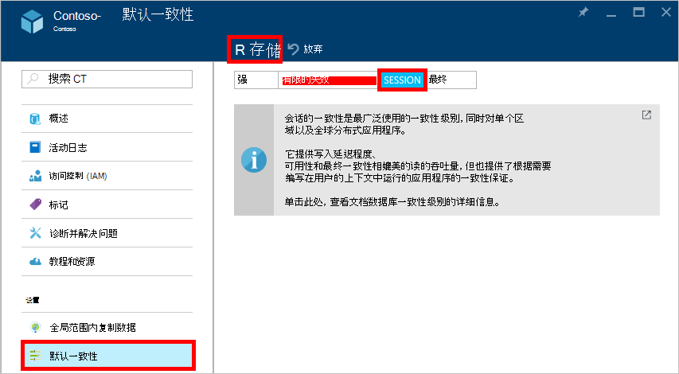

<properties
    pageTitle="在 DocumentDB 中的一致性级别 |Microsoft Azure"
    description="DocumentDB 有四个的一致性级别，以帮助平衡最终一致性、 可用性和滞后时间的利弊。"
    keywords="最终一致性，documentdb，azure，Microsoft azure"
    services="documentdb"
    authors="syamkmsft"
    manager="jhubbard"
    editor="cgronlun"
    documentationCenter=""/>

<tags
    ms.service="documentdb"
    ms.workload="data-services"
    ms.tgt_pltfrm="na"
    ms.devlang="na"
    ms.topic="article"
    ms.date="08/24/2016"
    ms.author="syamk"/>

# 在 DocumentDB 中的一致性级别

Azure DocumentDB 的设计从一开始向上考虑全局通讯组。 它旨在提供可预知的低延迟保证、 99.99%的可用性 SLA 中和多个定义完善的松散的一致性模型。 目前，DocumentDB 提供了四种一致性级别︰ 强、 包围失效会话并最终。 除了**强**和**最终一致性**模型通常由提供的其他 NoSQL 数据库，DocumentDB 还提供了两种仔细系统化并实施了一致性模型 —**包围失效**和**会话**，并根据实际使用情况及其实用性进行了验证。 共同这些四个一致性级别使您能够进行正确合理的权衡一致性、 可用性和滞后时间。 

## 范围内的一致性

一致性的粒度被作用于单个用户请求。 写入请求可能对应于插入、 替换、 upsert，或删除交易记录 （有或没有相关联的前期和后期触发器的执行）。 或写请求可能对应于事务性的分区内的多个文档上运行 JavaScript 存储过程的执行。 与写入、 读取/查询事务还限于单个用户请求。 用户可能需要分页通过大型结果集，跨越多个分区，但每次读取事务是作用于单个页面，从提供单一分区内。

## 一致性级别

您将应用于所有集合 （跨所有数据库） 数据库帐户下的数据库帐户，您可以配置默认的一致性级别。 默认情况下，所有读取和对用户定义资源发出的查询将都使用的数据库帐户上指定的默认一致性级别。 但是，您可以通过指定[[x-ms-一致性-级别]](https://msdn.microsoft.com/library/azure/mt632096.aspx)请求标头放宽特定的读取查询请求的一致性级别。 有四种类型的 DocumentDB 复制协议支持提供特定一致性保证和性能，清除兼顾一致性级别如下所述。

![DocumentDB 提供了多个，很好地定义 （宽松） 一致性模型可供选择的][1]

**强**︰ 

- 强的一致性提供[linearizability](https://aphyr.com/posts/313-strong-consistency-models)保证具有保证返回最新版本的文档的读取。 
- 强一致性保证写只可见后由多数仲裁副本的持久承诺。 写或者同步致力持久的主和次映像，仲裁或中止。 读取被始终承认大多数阅读仲裁，客户端可以永远不会看到未提交或部分写入并始终保证阅读最新确认的写。 
- 配置为使用强一致性的 DocumentDB 帐户无法与他们的 DocumentDB 帐户 Azure 的多个地区。 
- （根据[请求单位](documentdb-request-units.md)消耗） 执行读取操作的成本具有强一致性是高于会话并最终，但有限的失效程度相同。
 

**Bounded 失效**︰ 

- 包围失效一致性保证读取可能会滞后最*K*版本或文档或*t*的前缀通过写入的时间间隔。 
- 因此，当选择绑定失效，"失效"可配置以下两种方式︰ 
    - *K*版本通过它读取滞后于写入的文档数
    - 时间间隔*t* 
- 包围，失效提供全球订单总除"失效窗口"中。 请注意，保证了单调读存在区域内部和外部"失效窗口"内。 
- 有限的失效提供了比会话或最终一致性较强保证一致性。 对于全局分布式应用程序，建议使用限制的失效情况下想要有强的一致性，但还要 99.99%的可用性和低延迟。 
- DocumentDB 帐户配置为限制的失效的一致性可以与他们的 DocumentDB 帐户关联任意数量的 Azure 的地区。 
- 读取操作 （根据消耗的 RUs) 的成本有限失效是高于会话并最终一致性，但强一致性相同。

**会话**︰ 

- 与强和有限失效的一致性级别所提供的全球一致性模型，不同会话一致性范围是客户端会话。 
- 会话的一致性是因为它保证单调性的读、 单调性的写操作和读自己写操作 (RYW) 保证其中涉及设备或用户会话的所有方案的理想选择。 
- 一个会话，会话一致性提供可预测的一致性，最多提供最低的延迟写入和读取时，读取吞吐量。 
- 配置会话一致性的 DocumentDB 帐户可与 DocumentDB 帐户关联任意数量的 Azure 的地区。 
- 读取操作 （根据消耗的 RUs) 的成本与会话一致性级别是小于强和有限失效，但多最终一致性
 

**最后**︰ 

- 最终一致性保证，在没有任何进一步的写入操作时，组内的副本将最终收敛。 
- 最终一致性是一致性的弱形式，客户端可能会早于以前已见过的那些值。
- 最终一致性提供弱读的一致性，但为读取和写入操作提供最低的延迟。
- DocumentDB 帐户配置的最终一致性可以将任意数量的 Azure 地区与 DocumentDB 帐户关联。 
- 读取操作 （根据消耗的 RUs) 的成本与最终的一致性级别为所有 DocumentDB 的一致性水平最低。

## 一致性保证

下表说明了各种一致性保证四个一致性级别相对应。

| 保证                                                         |    强                                       |    有限的失效                                                                           |    会话                                       |    最终                                 |
|----------------------------------------------------------|-------------------------------------------------|------------------------------------------------------------------------------------------------|--------------------------------------------------|--------------------------------------------------|
|    **全球订单合计**                                |    是的                                          |    是的，"失效"窗口之外                                                      |    否，部分"会话"订单                   |    不                                            |
|    **一致的前缀保证**                       |    是的                                          |    是的                                                                                         |    是的                                           |    是的                                           |
|    **单调的读取**                                   |    是的                                          |    是的跨地区失效窗口之外，所有时间的区域内。     |    是的对于给定会话                    |    不                                            |
|    **单调的写操作**                                  |    是的                                          |    是的                                                                                         |    是的                                           |    是的                                           |
|    **读您写**                                  |    是的                                          |    是的                                                                                         |    是 （在写区域中）                      |    不                                            |

## 配置默认的一致性级别

1.  在[Azure 的门户](https://portal.azure.com/)，在 Jumpbar 中，请单击**DocumentDB (NoSQL)**。

2. 在**DocumentDB (NoSQL)**刀片式服务器，选择要修改的数据库帐户。

3. 在帐户刀片式服务器，单击**默认值一致性**。

4. 在**默认一致性**刀片式服务器，选择新的一致性级别，然后单击**保存**。

    

## 查询的一致性级别

对于用户定义的资源，默认情况下查询的一致性级别是一致性级别相同的读取。 默认情况下，对每个插入、 替换或删除的集合的文档同步更新索引。 这使得接受文档读取操作的一致性级别相同的查询。 而 DocumentDB 是写优化并支持持续的增长的文档写入，同步索引维护并提供一致的查询服务，您可以配置某些延迟更新其索引的集合。 惰性索引进一步提高写入性能，非常适合于批量接收方案，主要是读密集型工作负载时。  

索引模式|  读取|  查询  
-------------|-------|---------
一致 （默认值）|   选择从强、 限制失效会话，或最终|    选择从强、 限制失效会话，或最终|
惰性|   选择从强、 限制失效会话，或最终|    最终  

作为与读取请求，您可以降低特定查询请求的一致性级别通过指定[x ms 一致性级别](https://msdn.microsoft.com/library/azure/mt632096.aspx)的请求标头。

## 下一步行动

如果您想要做更多阅读关于一致性级别和权衡，我们建议以下资源︰

-   Doug Terry。 已复制的数据的一致性说明通过棒球 （视频）。   
[https://www.youtube.com/watch?v=gluIh8zd26I](https://www.youtube.com/watch?v=gluIh8zd26I)
-   Doug Terry。 已复制的数据的一致性说明通过棒球。   
[http://research.microsoft.com/pubs/157411/ConsistencyAndBaseballReport.pdf](http://research.microsoft.com/pubs/157411/ConsistencyAndBaseballReport.pdf)
-   Doug Terry。 弱一致的已复制数据的会话保证。   
[http://dl.acm.org/citation.cfm?id=383631](http://dl.acm.org/citation.cfm?id=383631)
-   Daniel Abadi。 现代分布式数据库系统设计中的一致性权衡︰ 帽只是一部分的故事"。   
[http://computer.org/csdl/mags/co/2012/02/mco2012020037-abs.html](http://computer.org/csdl/mags/co/2012/02/mco2012020037-abs.html)
-   Peter Bailis、 Shivaram Venkataraman、 Michael J.富兰克林，Joseph M.Hellerstein、 离子 Stoica。 概率实用部分仲裁包围失效 (PBS)。   
[http://vldb.org/pvldb/vol5/p776_peterbailis_vldb2012.pdf](http://vldb.org/pvldb/vol5/p776_peterbailis_vldb2012.pdf)
-   Werner Vogels。 最终一致-再次访问。    
[http://allthingsdistributed.com/2008/12/eventually_consistent.html](http://allthingsdistributed.com/2008/12/eventually_consistent.html)

[1]: ./media/documentdb-consistency-levels/consistency-tradeoffs.png
