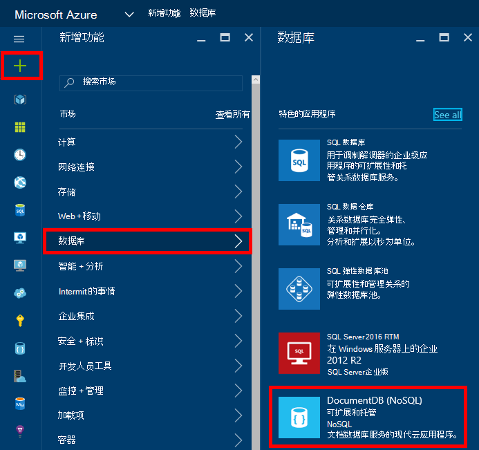
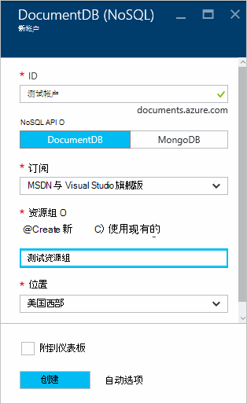
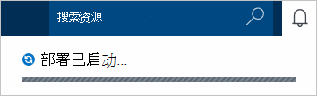
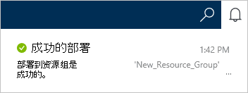
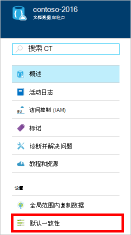
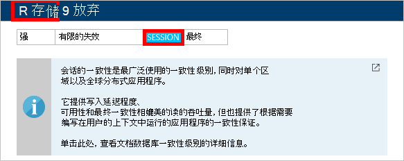

<properties
    pageTitle="如何创建一个 DocumentDB 帐户 |Microsoft Azure"
    description="生成与 Azure DocumentDB 使用 NoSQL 数据库。 请按照以下说明创建 DocumentDB 帐户，并开始构建闪电般快速的、 全球范围内 NoSQL 数据库。" 
    keywords="建立数据库"
    services="documentdb"
    documentationCenter=""
    authors="mimig1"
    manager="jhubbard"
    editor="monicar"/>

<tags
    ms.service="documentdb"
    ms.workload="data-services"
    ms.tgt_pltfrm="na"
    ms.devlang="na"
    ms.topic="get-started-article"
    ms.date="10/17/2016"
    ms.author="mimig"/>

# 如何创建使用 Azure 门户 DocumentDB NoSQL 帐户

> [AZURE.SELECTOR]
- [Azure 门户](documentdb-create-account.md)
- [Azure CLI 和 Azure 的资源管理器](documentdb-automation-resource-manager-cli.md)

若要生成使用 Microsoft Azure DocumentDB 数据库，您必须︰

- 拥有一个 Azure 帐户。 如果您还没有，您可以获得一个[免费的 Azure 帐户](https://azure.microsoft.com/free)。 
- 创建一个 DocumentDB 帐户。  

Azure 门户、 Azure 资源管理器模板或 Azure 的命令行界面 (CLI)，您可以创建一个使用的 DocumentDB 帐户。 本文演示如何创建使用 Azure 门户 DocumentDB 帐户。 若要创建使用 Azure 资源管理器或 Azure CLI 的帐户，请参阅[自动化 DocumentDB 数据库帐户的创建](documentdb-automation-resource-manager-cli.md)。

不熟悉 DocumentDB？ 观看[此](https://azure.microsoft.com/documentation/videos/create-documentdb-on-azure/)四分钟视频由 Scott Hanselman 以了解如何完成在线门户网站的最常见任务。

1.  登录到[Azure 的门户](https://portal.azure.com/)。
2.  在 Jumpbar 中，单击**新建**，单击**数据库**，然后单击**DocumentDB (NoSQL)**。 

      

3. 在**新帐户**刀片式服务器，指定所需的配置为 DocumentDB 帐户。

    

    - 在**ID**框中，输入一个名称来标识的 DocumentDB 帐户。  **ID**进行验证后， **ID**框中将显示一个绿色复选标记。 **ID**值将变为 URI 中的主机名称。 **ID**可以包含仅小写字母、 数字和-字符，并必须在 3 到 50 个字符之间。 请注意， *documents.azure.com*被追加到选择，其结果是将成为您的 DocumentDB 帐户终结点的终结点名称。

    - 在**NoSQL API**中，选择要使用的编程模型︰
        - **DocumentDB**: DocumentDB API 可以通过.NET、 Java、 Node.js，Python 和 JavaScript[的 Sdk](documentdb-sdk-dotnet.md)，以及 HTTP[其余部分](https://msdn.microsoft.com/library/azure/dn781481.aspx)，并提供了对 DocumentDB 的所有功能的编程访问。 
       
        - **MongoDB**: DocumentDB 也为**MongoDB** Api 提供[协议级别的支持](documentdb-protocol-mongodb.md)。 当您选择 MongoDB API 时，可以使用现有 MongoDB Sdk 和[工具](documentdb-mongodb-mongochef.md)可以与 DocumentDB。 可以[移动](documentdb-import-data.md)现有 MongoDB 应用程序以进行[任何所需的代码更改](documentdb-connect-mongodb-account.md)，使用 DocumentDB，并利用具有无限小数位数、 全球复制和其他功能的服务，作为一个完全托管数据库。

    - 对于**订阅**，选择您想要为 DocumentDB 帐户使用 Azure 订阅。 如果只有一个订阅您的帐户，该帐户是默认选中的。

    - 在**资源组**中，选择或创建您的 DocumentDB 帐户的资源组。  默认情况下，创建新的资源组。 有关详细信息，请参阅[使用 Azure 门户管理 Azure 的资源](../articles/azure-portal/resource-group-portal.md)。

    - 使用**位置**指定的地理位置，用来承载您的 DocumentDB 帐户。 

4.  一旦配置了新的 DocumentDB 帐户选项，请单击**创建**。 若要检查部署状态，请检查通知中心。  

      

    

5.  DocumentDB 帐户创建后，就可以使用默认设置。 默认一致性的 DocumentDB 帐户被设置为**会话**。  您可以通过在资源菜单中单击**默认一致性**调整默认一致性。 若要了解有关 DocumentDB 所提供的一致性级别的详细信息，请参阅[DocumentDB 中的一致性级别](documentdb-consistency-levels.md)。

      

      

[How to: Create a DocumentDB account]: #Howto
[Next steps]: #NextSteps
[documentdb-manage]:../articles/documentdb/documentdb-manage.md

## 下一步行动

既然您已经有一个 DocumentDB 帐户下, 一步是创建一个 DocumentDB 集合和数据库。 

可以使用下列方法之一来创建新的收藏集和数据库︰

- Azure 的门户，[创建使用 Azure 门户 DocumentDB 集合](documentdb-create-collection.md)中所述。
- 综合教程，其中包括示例数据︰ [.NET](documentdb-get-started.md)、 [.NET MVC](documentdb-dotnet-application.md)、 [Java](documentdb-java-application.md)、 [Node.js](documentdb-nodejs-application.md)或[Python](documentdb-python-application.md)。
- [.NET](documentdb-dotnet-samples.md#database-examples)， [Node.js](documentdb-nodejs-samples.md#database-examples)，或者[Python](documentdb-python-samples.md#database-examples)代码示例在 GitHub 中可用。
- [.NET](documentdb-sdk-dotnet.md)， [Node.js](documentdb-sdk-node.md)， [Java](documentdb-sdk-java.md)， [Python](documentdb-sdk-python.md)和[其余](https://msdn.microsoft.com/library/azure/mt489072.aspx)Sdk。

创建您的数据库和集合后，您需要向集合[中添加文档](documentdb-view-json-document-explorer.md)。

集合中的文档后，可以对文档[执行查询](documentdb-sql-query.md#executing-queries)到使用[DocumentDB SQL](documentdb-sql-query.md) 。 通过门户网站、 [REST API](https://msdn.microsoft.com/library/azure/dn781481.aspx)，或一个[Sdk](documentdb-sdk-dotnet.md)中[查询资源管理器中](documentdb-query-collections-query-explorer.md)，可以执行查询。

### 了解更多信息

若要了解有关 DocumentDB 的详细信息，请浏览这些资源︰

-   [DocumentDB 的学习路线图](https://azure.microsoft.com/documentation/learning-paths/documentdb/)
-   [DocumentDB 分层资源模型和概念](documentdb-resources.md)
