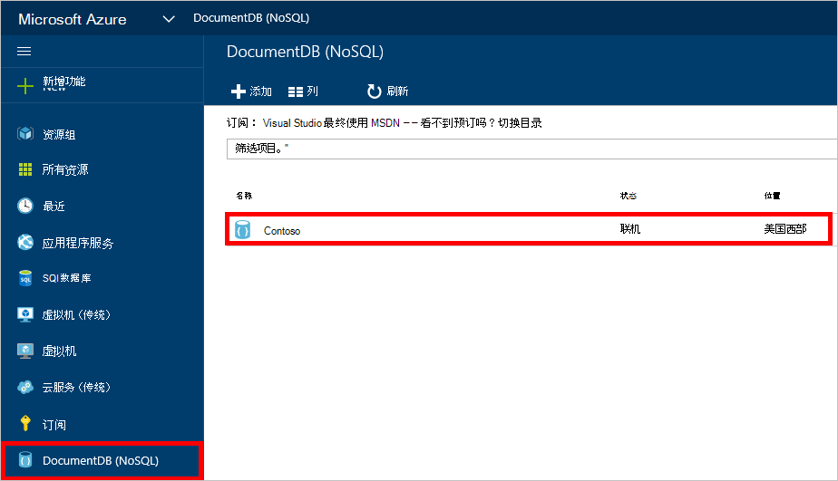
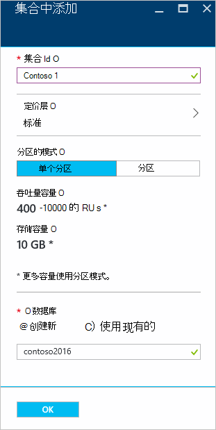
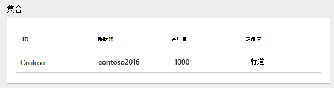
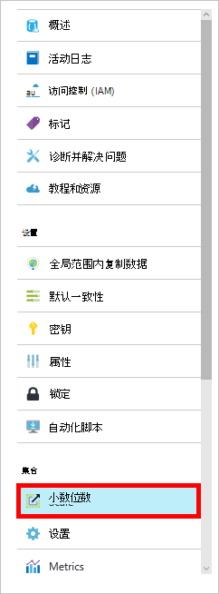

<properties 
    pageTitle="创建集合和 DocumentDB 数据库 |Microsoft Azure" 
    description="了解如何创建 NoSQL 数据库以及使用 Azure DocumentDB 在线服务门户的 JSON 文档集合，基于云的文档数据库。 得到今天的免费试用版。" 
    services="documentdb" 
    authors="mimig1" 
    manager="jhubbard" 
    editor="monicar" 
    documentationCenter=""/>

<tags 
    ms.service="documentdb" 
    ms.workload="data-services" 
    ms.tgt_pltfrm="na" 
    ms.devlang="na" 
    ms.topic="article" 
    ms.date="10/17/2016" 
    ms.author="mimig"/>

# 如何创建一个 DocumentDB 收集和使用 Azure 门户数据库

若要使用 Microsoft Azure DocumentDB，必须具有一个[DocumentDB 帐户](documentdb-create-account.md)、 数据库、 集合和文档。 本主题介绍如何在 Azure 的门户网站中创建的 DocumentDB 集合。 

不清楚是哪一个？ 请参阅[DocumentDB 集合是什么？](#what-is-a-documentdb-collection)

1.  在[Azure 的门户](https://portal.azure.com/)，在 Jumpbar， **DocumentDB (NoSQL)**，请单击，然后在**DocumentDB (NoSQL)**刀片式服务器，选择要在其中添加一个帐户。 如果没有列出任何帐户，您需要[创建一个 DocumentDB 帐户](documentdb-create-account.md)。

    
    
    如果在 Jumpbar 中看不到**DocumentDB (NoSQL)** ，单击**其他服务**，然后单击**DocumentDB (NoSQL)**。 如果没有列出任何帐户，您需要[创建一个 DocumentDB 帐户](documentdb-create-account.md)。

2. 在所选帐户的**帐户 DocumentDB**刀片式服务器，请单击**添加的集合**。

    

3. 在**集合中添加**刀片式服务器，在**ID**框中，输入您的新收藏 ID。 集合名称必须介于 1 和 255 个字符，并且不能包含`/ \ # ?`或尾随空格。 当验证名称时，一个绿色的复选标记将出现在 ID 框中。

    

4. 默认情况下，**定价层**设置为**标准**，使您可以自定义的吞吐量和存储您的收藏。 有关定价层的详细信息，请参阅[DocumentDB 中的性能级别](documentdb-performance-levels.md)。  

5. 选择**一个分区**或**分区**集的**分区模式**。 

    **单个分区**有 10GB，保留的存储容量，可以有 400-10000 台请求设备吞吐量级别/秒 (RU/s)。 一个 RU 对应 1 KB 文档的读吞吐量。 关于申请单位的详细信息，请参阅[请求单位](documentdb-request-units.md)。 

    **分区的集合**可以扩展以处理不限制的数量的存储在多个分区，并且可以有起价 10,100 RU/s 的吞吐量级别。 在门户中，可保留的最大存储 250GB，并且可以保留大多数吞吐量是 250000 RU/s。 若要增加任何配额，文件请求，[请求增加 DocumentDB 帐户配额](documentdb-increase-limits.md)中所述。 有关分区集合的详细信息，请参阅[单个分区和分区集](documentdb-partition-data.md#single-partition-and-partitioned-collections)。

    默认情况下，一个新的单个分区集合的吞吐量设置为 1000年的 RU s，可 10 GB 的存储容量。 对于已分区的集合，集合吞吐量设置为 10100 RU/s 250 GB 的存储容量。 在创建集合后，可以更改吞吐量和存储为集合。 

6. 如果您正在创建一个分区，请选择**分区键**的集合。 选择正确的分区键创建一个性能至关重要。 选择分区键的详细信息，请参阅[分区设计](documentdb-partition-data.md#designing-for-partitioning)。

7. 在**数据库**刀片式服务器，请创建一个新数据库或使用现有。 数据库名称必须介于 1 和 255 个字符，并且不能包含`/ \ # ?`或尾随空格。 若要验证名称，请单击文本框外部。 验证名称时，一个绿色的复选标记将出现在框中。

8. 单击**确定**在屏幕的底部以创建新的收藏集。 

9. 现在新的收藏集将出现在**集合****概述**刀片上镜头。
 
    

10. **可选︰**若要修改集合在门户中的吞吐量，请单击资源菜单中的**比例**。 

    

## DocumentDB 集合是什么？ 

集合是 JSON 文档和关联的 JavaScript 应用程序逻辑的容器。 集合是收费的实体，其[成本](documentdb-performance-levels.md)由集合中的资源调配的吞吐量。 集合可以跨一个或多个分区 / 服务器，并且可以扩展以处理无限的容量的存储和传送率。

集合是自动划分为一个或多个物理服务器的 DocumentDB。 在创建集合时，您可以指定的资源调配的吞吐量，以每秒和分区键属性的请求单元。 此属性的值将通过 DocumentDB，用于分发间分区和类似查询的路由请求的文档。 分区键值还用作存储的过程和触发器的事务边界。 每个集合都有特定于该集合，不共享相同的帐户中的其他集合与吞吐量的保留的金额。 因此，您可以向外扩展应用程序存储和吞吐量方面。 

集合不是关系数据库中的表相同。 集合不会强制使用架构、 事实上 DocumentDB 不会强制任何架构，它是一个无架构的数据库。 因此您可以在同一集合中存储不同类型的文档与不同的架构。 您可以使用集合来存储单一类型的表像的对象。 最佳的模型只取决于数据如何在一起出现在查询和交易。

## 若要创建一个 DocumentDB 集合的其他方法

不必使用门户创建集合，可以使用[DocumentDB Sdk](documentdb-sdk-dotnet.md)和 REST API。 

- C# 代码示例，请参见[C# 集合的示例](documentdb-dotnet-samples.md#collection-examples)。 
- Node.js 代码示例，请参见[Node.js 集合示例](documentdb-nodejs-samples.md#collection-examples)。
- Python 代码示例，请参见[Python 集合示例](documentdb-python-samples.md#collection-examples)。
- REST API 的示例，请参阅[创建集合](https://msdn.microsoft.com/library/azure/mt489078.aspx)。

## 故障排除

如果**添加集合**已禁用在 Azure 的门户，这意味着当前已禁用您的帐户，这是正常的使用所有月份的好处致谢时。   

## 下一步行动

既然您已经有一个集合下, 一步是添加文档或将文档导入集合。 向集合中添加文档时，您有几个选择︰

- 可以通过在门户中使用文档资源管理器[中添加文档](documentdb-view-json-document-explorer.md)。
- 通过使用 DocumentDB 数据迁移工具，该工具使您能够将 JSON 和 CSV 文件导入，以及 SQL Server，MongoDB，Azure 表存储和其他 DocumentDB 集合中的数据可以使用[导入的文档和数据](documentdb-import-data.md)。 
- 也可以通过[DocumentDB Sdk](documentdb-sdk-dotnet.md)中添加文档。 DocumentDB 具有.NET、 Java、 Python，Node.js 和 JavaScript API Sdk。 C# 代码示例演示如何通过使用 DocumentDB.NET SDK 处理文档，请参阅[C# 文档示例](documentdb-dotnet-samples.md#document-examples)。 Node.js 代码示例演示如何通过使用 DocumentDB Node.js SDK 处理文档，请参阅[Node.js 文档示例](documentdb-nodejs-samples.md#document-examples)。

集合中的文档后，可以使用[DocumentDB SQL](documentdb-sql-query.md) [执行查询](documentdb-sql-query.md#executing-queries)到针对文档使用门户、 [REST API](https://msdn.microsoft.com/library/azure/dn781481.aspx)，或一个[Sdk](documentdb-sdk-dotnet.md)中[查询资源管理器](documentdb-query-collections-query-explorer.md)。 
