<properties 
    pageTitle="将 DocumentDB 和 Azure 应用程序服务 Web 应用程序使用 Azure 资源管理器模板部署 |Microsoft Azure" 
    description="了解如何将 DocumentDB 帐户，Azure 应用程序服务 Web 应用程序和使用 Azure 资源管理器模板示例 web 应用程序部署。" 
    services="documentdb, app-service\web" 
    authors="h0n" 
    manager="jhubbard" 
    editor="monicar" 
    documentationCenter=""/>

<tags 
    ms.service="documentdb" 
    ms.workload="data-services" 
    ms.tgt_pltfrm="na" 
    ms.devlang="na" 
    ms.topic="article" 
    ms.date="08/02/2016" 
    ms.author="hawong"/>

# 将 DocumentDB 和 Azure 应用程序服务 Web 应用程序使用 Azure 资源管理器模板部署

本教程展示如何使用 Azure 资源管理器模板部署和集成[Microsoft Azure DocumentDB](https://azure.microsoft.com/services/documentdb/)、 [Azure 应用程序服务](http://go.microsoft.com/fwlink/?LinkId=529714)web 应用程序中和一个示例 web 应用程序。

使用 Azure 资源管理器模板，您可以轻松地自动部署和 Azure 资源的配置。  本教程展示如何将 web 应用程序部署和自动配置 DocumentDB 帐户连接信息。

后学完本教程，您将能够回答以下问题︰  

-   如何使用 Azure 资源管理器模板部署和集成 DocumentDB 帐户，并在 Azure 应用程序服务 web 应用程序？
-   如何使用 Azure 资源管理器模板部署和集成 DocumentDB 帐户、 在应用程序服务 Web 应用程序，web 应用程序和 Webdeploy 应用程序？

## 系统必备组件
> [AZURE.TIP] 虽然本教程不会采用与 Azure 资源管理器模板或 JSON 的经验，您要修改的模板的引用或部署选项，然后每个这些领域的知识将是必需的。

在本教程中按照说明操作之前，确保您具备以下︰

- Azure 的订阅。 Azure 是一个基于订阅的平台。  有关获取订阅的详细信息，请参阅[购买选项](https://azure.microsoft.com/pricing/purchase-options/)，[成员提供](https://azure.microsoft.com/pricing/member-offers/)，或[免费试用版](https://azure.microsoft.com/pricing/free-trial/)。

##步骤 1︰ 下载模板文件 ##
让我们先下载本教程中，我们将使用的模板文件。

1. 将[创建一个 DocumentDB 帐户，Web 应用程序和部署演示应用程序示例](https://portalcontent.blob.core.windows.net/samples/DocDBWebsiteTodo.json)模板下载到本地文件夹 (例如 C:\DocumentDBTemplates)。 此模板将 DocumentDB 帐户和应用程序服务 web 应用程序中，web 应用程序部署。  它还会自动将配置 web 应用程序连接到 DocumentDB 帐户。

2. 下载到本地文件夹中 (例如 C:\DocumentDBTemplates)[创建一个 DocumentDB 帐户和 Web 应用程序的示例](https://portalcontent.blob.core.windows.net/samples/DocDBWebSite.json)模板。 此模板将部署 DocumentDB 帐户，应用程序服务 web 应用程序，并将修改站点的应用程序设置，可方便地表面 DocumentDB 连接信息，但不包含 web 应用程序。  

##步骤 2︰ 将部署的 DocumentDB 帐户、 应用程序服务 web 应用程序和演示应用程序示例

现在让我们将部署我们的第一个模板。

> [AZURE.TIP] 该模板不会验证的 web 应用程序名称和输入下面的 DocumentDB 帐户名称是 a） 有效和 b） 可用。  强烈建议您验证您打算提交部署之前提供的名称的可用性。

1. 登录到[Azure 门户网站](https://portal.azure.com)，请单击新建和搜索"模板部署"。
    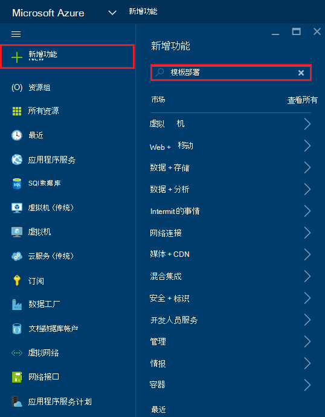

2. 选择模板部署项，然后单击**创建**
    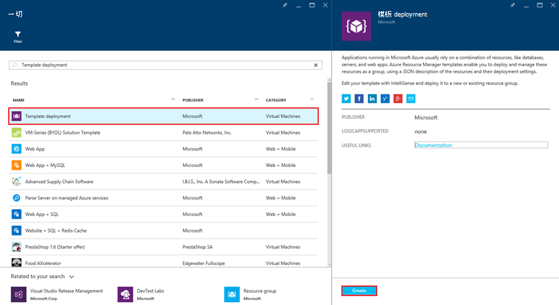

3.  单击**编辑模板**、 粘贴 DocDBWebsiteTodo.json 模板文件的内容，并单击**保存**。
    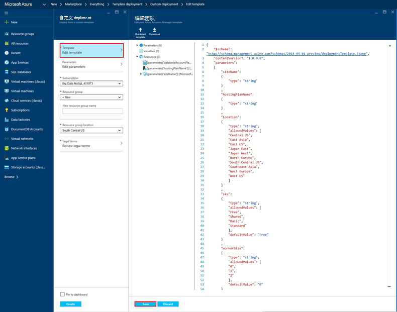

4. 单击**编辑参数**，为每个必需的参数提供的值并单击**确定**。  这些参数如下所示︰

    1. 网站名称︰ 指定的应用程序服务 web 应用程序名称和用于构造 URL 将用来访问 web 应用程序 (例如如果您指定"mydemodocdbwebapp"，然后将所访问的 web 应用程序的 URL 将是 mydemodocdbwebapp.azurewebsites.net)。

    2. HOSTINGPLANNAME︰ 指定应用程序服务创建的托管计划的名称。

    3. 位置︰ 指定要在其中创建的 DocumentDB 和 web 应用程序资源的 Azure 位置。

    4. DATABASEACCOUNTNAME︰ 指定要创建的 DocumentDB 帐户的名称。   

    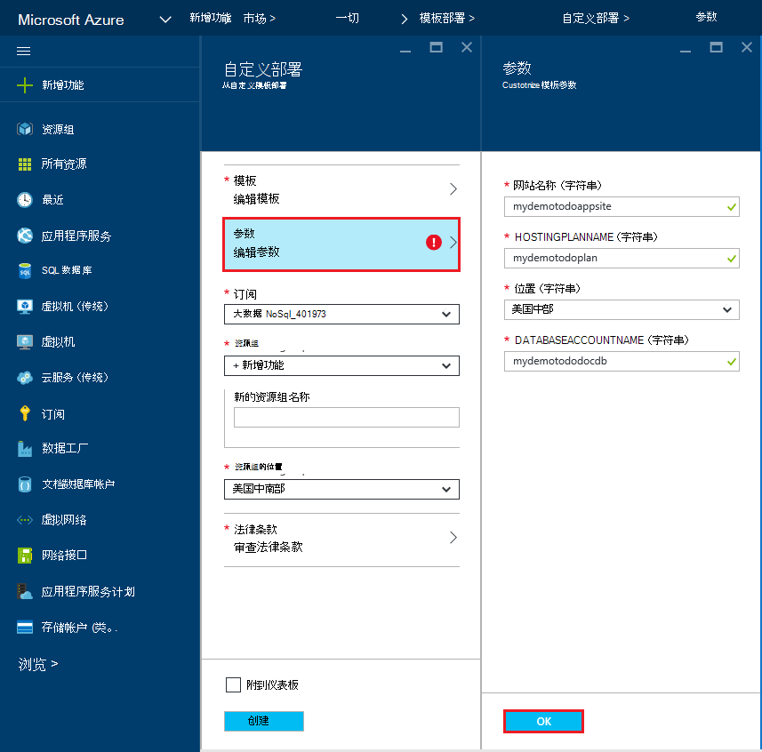

5. 选择现有资源组或者提供一个名称，以使新的资源组，然后选择该资源组的位置。
    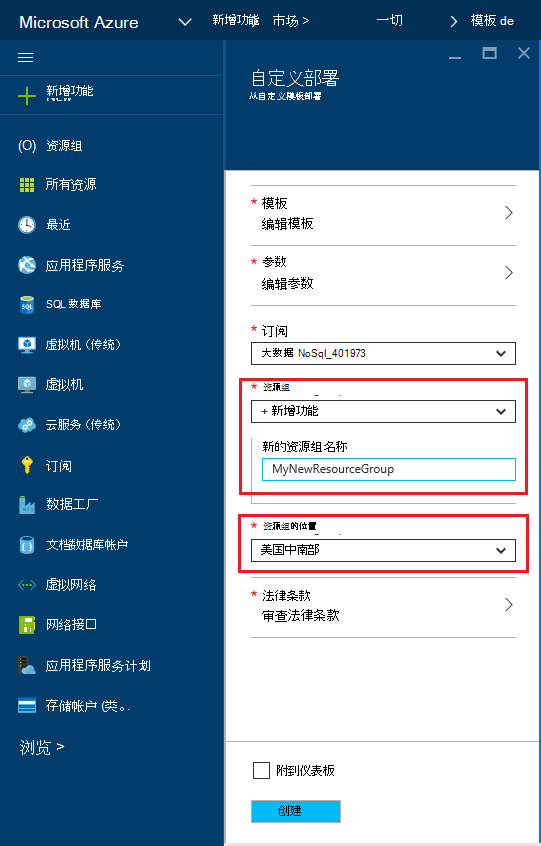
  
6.  **审查法律条款**，**购买**，请单击，然后单击**创建**以开始部署。  选择**固定到仪表板**，以便生成部署是 Azure 门户主页上醒目。
    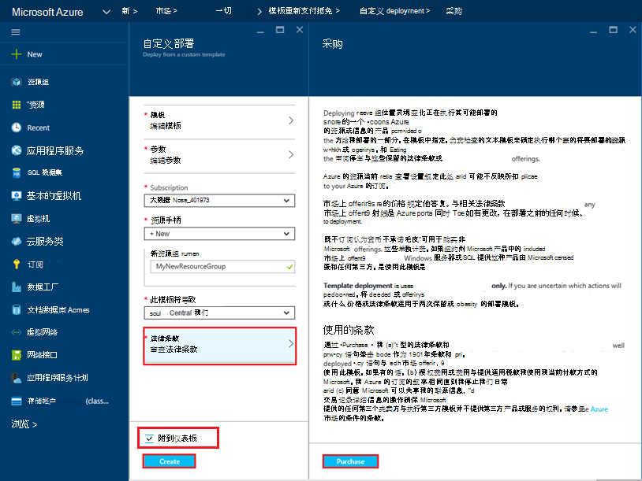

7.  在部署完成后，将打开资源组刀片。
    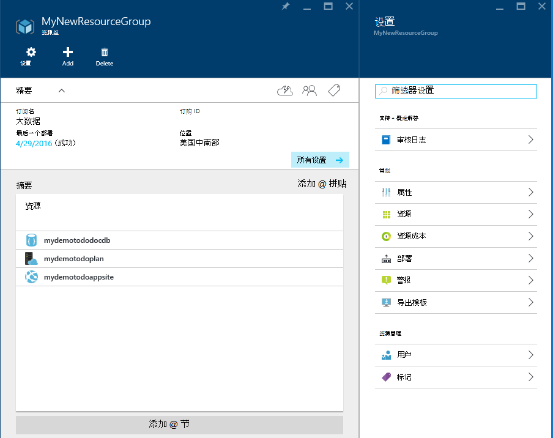  

8.  若要使用该应用程序，只需导航到 web 应用程序 URL （在上面的示例中，URL 是 http://mydemodocdbwebapp.azurewebsites.net）。  您将看到下面的 web 应用程序︰

    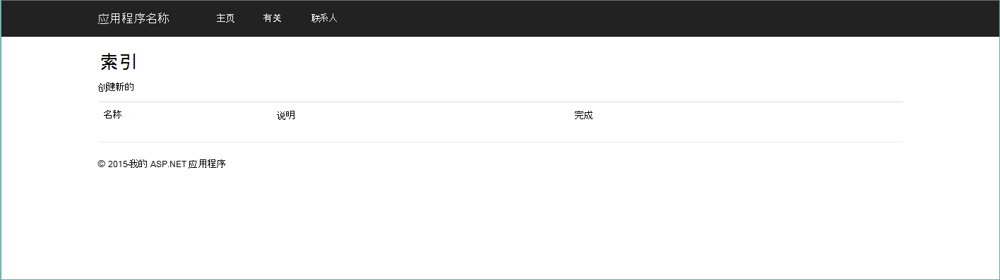

9. 继续和 web 应用程序中创建几个任务，然后返回到资源组刀片式服务器在 Azure 的门户。 单击资源列表中的 DocumentDB 帐户资源，然后单击**查询资源管理器**。
    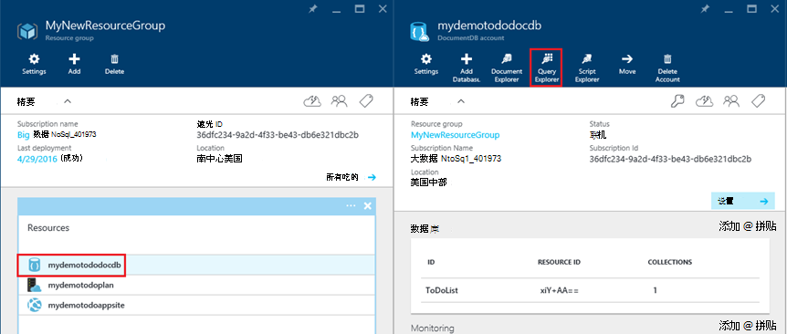  

10. 运行默认查询、"选择*FROM c"，然后检查结果。 请注意查询检索到的 JSON 表示 todo 项 7 以上步骤中创建。 随意的查询;例如，尝试运行选择*从 c WHERE c.isComplete = true 返回所有已标记为已完成的 todo 项目。

    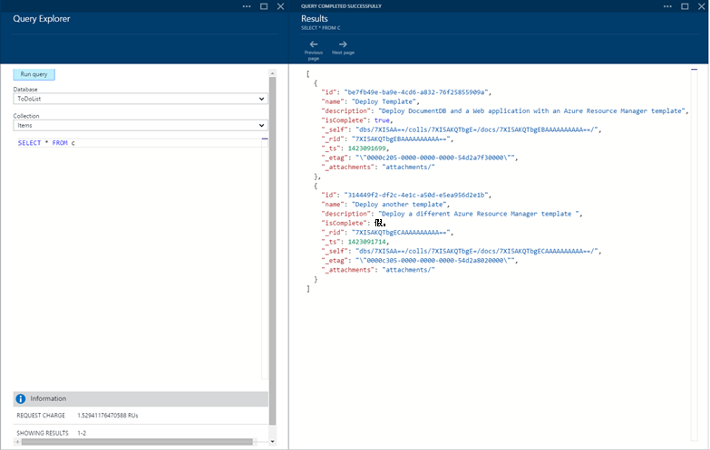

11. 随意浏览 DocumentDB 门户体验或修改示例 Todo 应用程序。  当您准备好时，让我们部署另一个模板。
    
 
## 步骤 3︰ 将部署文档帐户和 web 应用程序示例

现在让我们将部署我们的第二个模板。  此模板可用于显示如何为 web 应用程序插入 DocumentDB 连接信息，例如帐户终结点和主密钥，作为应用程序设置或自定义的连接字符串。 例如，假设您有您自己的 web 应用程序想要部署的 DocumentDB 帐户和将在部署期间自动填充该连接信息。

> [AZURE.TIP] 该模板不会验证的 web 应用程序名称和输入下面的 DocumentDB 帐户名称是 a） 有效和 b） 可用。  强烈建议您验证您打算提交部署之前提供的名称的可用性。

1. 在[Azure 门户网站](https://portal.azure.com)中，请单击新建，然后搜索"模板部署"。
    

2. 选择模板部署项，然后单击**创建**
    

3.  单击**编辑模板**、 粘贴 DocDBWebSite.json 模板文件的内容，并单击**保存**。
    

4. 单击**编辑参数**，为每个必需的参数提供的值并单击**确定**。  这些参数如下所示︰

    1. 网站名称︰ 指定的应用程序服务 web 应用程序名称和用于构造 URL 将用来访问 web 应用程序 (例如如果您指定"mydemodocdbwebapp"，然后将所访问的 web 应用程序的 URL 将是 mydemodocdbwebapp.azurewebsites.net)。

    2. HOSTINGPLANNAME︰ 指定应用程序服务创建的托管计划的名称。

    3. 位置︰ 指定要在其中创建的 DocumentDB 和 web 应用程序资源的 Azure 位置。

    4. DATABASEACCOUNTNAME︰ 指定要创建的 DocumentDB 帐户的名称。   

    

5. 选择现有资源组或者提供一个名称，以使新的资源组，然后选择该资源组的位置。
    
  
6.  **审查法律条款**，**购买**，请单击，然后单击**创建**以开始部署。  选择**固定到仪表板**，以便生成部署是 Azure 门户主页上醒目。
    

7.  在部署完成后，将打开资源组刀片。
      

8. 单击资源列表中的 Web 应用程序资源，然后单击**应用程序设置**
      

9. 请注意如何有存在 DocumentDB 端点和 DocumentDB 主要密钥的每个应用程序设置。
    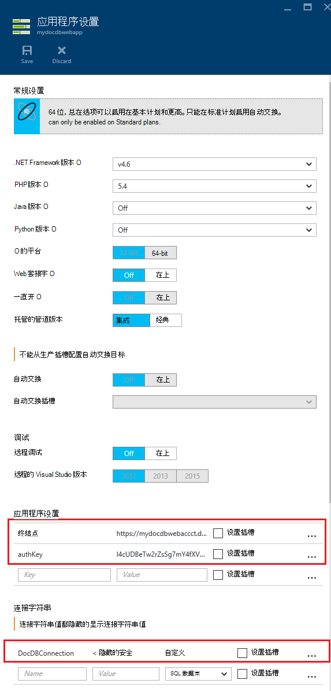  

10. 感觉自由地继续探索 Azure 门户，或者按照我们 DocumentDB[样本](http://go.microsoft.com/fwlink/?LinkID=402386)来创建您自己的 DocumentDB 应用程序之一。

    
    

## 下一步行动

祝贺您 ！ 您已经部署了 DocumentDB，应用程序服务 web 应用程序和使用 Azure 资源管理器模板示例 web 应用程序。

- 若要了解有关 DocumentDB 的详细信息，请单击[此处](http://azure.com/docdb)。
- 若要了解有关 Azure 应用程序服务 Web 应用程序的详细信息，请单击[此处](http://go.microsoft.com/fwlink/?LinkId=325362)。
- 若要了解有关 Azure 资源管理器模板的详细信息，请单击[此处](https://msdn.microsoft.com/library/azure/dn790549.aspx)。

## 会发生什么变化
* 有关更改网站为应用程序服务的指南，请参阅︰ [Azure 应用程序服务，并对现有的 Azure 服务及其影响](http://go.microsoft.com/fwlink/?LinkId=529714)
* 旧的门户与新门户的更改的指南，请参阅︰[用于导航 Azure 传统门户网站的引用](http://go.microsoft.com/fwlink/?LinkId=529715)

>[AZURE.NOTE] 如果您想要怎样的 Azure 帐户之前开始使用 Azure 应用程序服务，请转到[尝试应用程序服务](http://go.microsoft.com/fwlink/?LinkId=523751)，立即可以在此创建短期的初学者 web 应用程序在应用程序服务。 没有信用卡，所需;没有承诺。
 
