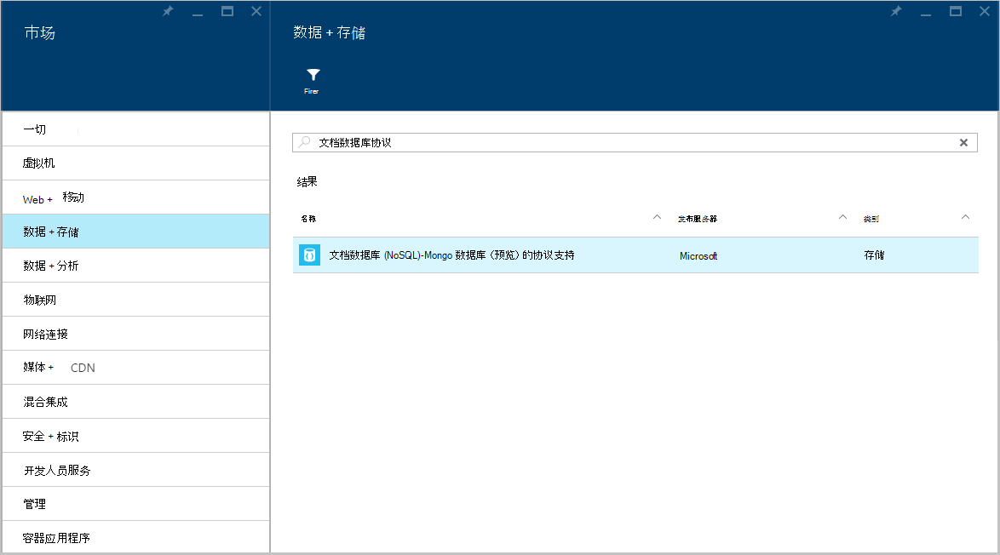
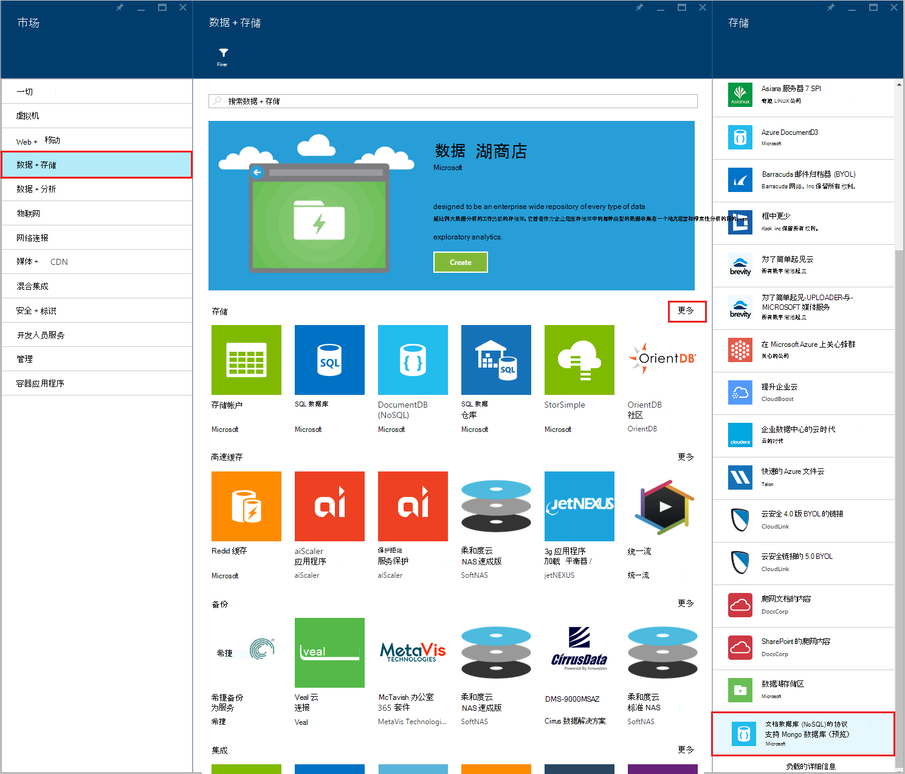
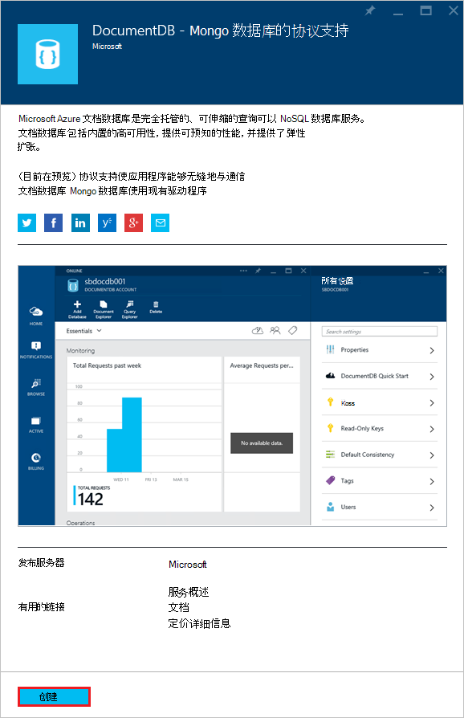
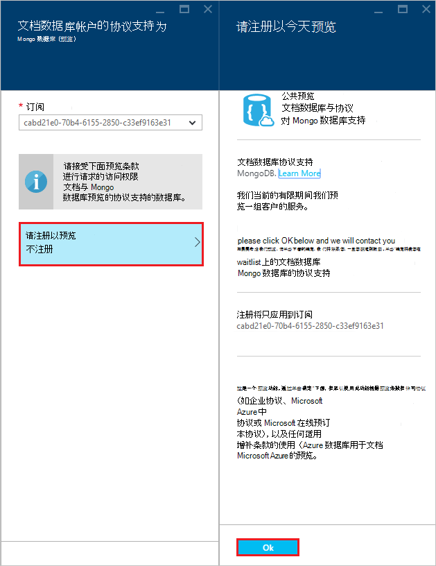
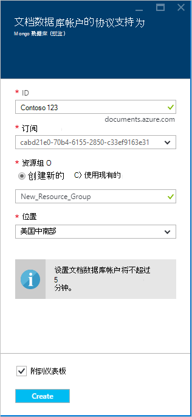
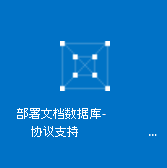
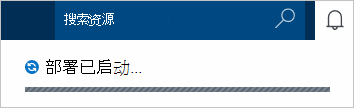
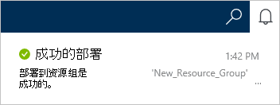
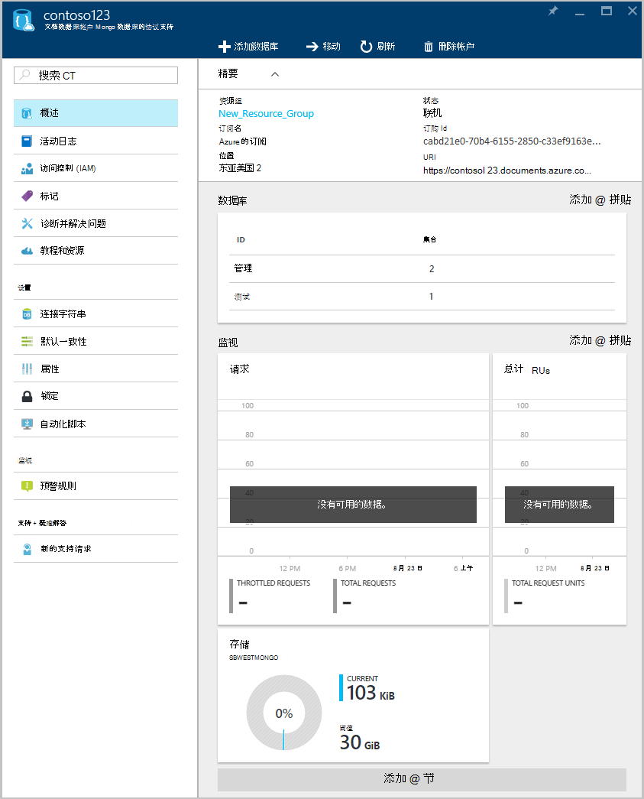

<properties 
    pageTitle="使用 MongoDB 的协议支持创建一个 DocumentDB 帐户 |Microsoft Azure" 
    description="了解如何创建一个 DocumentDB 帐户协议支持 MongoDB，现在可供预览。" 
    services="documentdb" 
    authors="AndrewHoh" 
    manager="jhubbard" 
    editor="" 
    documentationCenter=""/>

<tags 
    ms.service="documentdb" 
    ms.workload="data-services" 
    ms.tgt_pltfrm="na" 
    ms.devlang="na" 
    ms.topic="article" 
    ms.date="10/20/2016" 
    ms.author="anhoh"/>

# 如何创建使用 Azure 门户的 MongoDB 的协议支持 DocumentDB 帐户

若要创建使用 MongoDB 的协议支持 Azure DocumentDB 帐户，您必须︰

- 拥有一个 Azure 帐户。 如果您还没有，您可以获得一个[免费的 Azure 帐户](https://azure.microsoft.com/free/)。

## 创建帐户  

若要创建使用 MongoDB 的协议支持 DocumentDB 帐户，请执行以下步骤。

1. 在新窗口中，登录到[Azure 门户](https://portal.azure.com)。
2. 单击**新建****数据 + 存储**单击**查看所有**，和，然后搜索"DocumentDB 协议"的**数据 + 存储**类别。 单击**DocumentDB-MongoDB 的协议支持**。

    

3. 或者，在**数据 + 存储**类别下，**存储**，单击**更多**，然后单击**更多加载**一个或多个次，显示**DocumentDB-MongoDB 的协议支持**。 单击**DocumentDB-MongoDB 的协议支持**。

    

4. 在**DocumentDB-MongoDB （预览） 的协议支持**刀片式服务器，请单击**创建**启动预览注册流程。

    

5. 在**DocumentDB 帐户**刀片式服务器，请单击**注册，以便预览**。 阅读的信息，然后单击**确定**。

    

6.  后接受预览，您将返回到创建刀片式服务器。  在**DocumentDB 帐户**刀片式服务器，指定的帐户所需的配置。

    

    - 在**ID**框中，输入一个名称来标识帐户。  **ID**进行验证后， **ID**框中将显示一个绿色复选标记。 **ID**值将变为 URI 中的主机名称。 **ID**可以包含仅小写字母、 数字和-字符，并必须在 3 到 50 个字符之间。 请注意， *documents.azure.com*被追加到选择，其结果是将成为您帐户终结点的终结点名称。

    - 对于**订阅**，选择您想要使用的帐户的 Azure 订阅。 如果只有一个订阅您的帐户，该帐户是默认选中的。

    - 在**资源组**中，选择或创建资源组的帐户。  默认情况下，将选择在 Azure 预订下的现有资源组。  但是，您可能选择选择以创建新的资源组，您要将该帐户添加。 有关详细信息，请参阅[使用 Azure 门户管理 Azure 的资源](resource-group-portal.md)。

    - 使用**位置**指定的地理位置，在其中设立帐户。
    
    - 可选︰ 检查**附到仪表板**。 如果固定到仪表板后，请按照下面的**步骤 8**以查看您的新帐户的左侧的导航栏。

7.  一旦配置了新的帐户选项，请单击**创建**。  它可以需要几分钟来创建帐户。  如果固定到仪表板中后，可以监视 Startboard 资源调配的过程。  
      

    如果不固定到仪表板后，您可以监视进度通知集线器。  

      

    

8.  若要访问您的新帐户，请在左侧的菜单上单击**DocumentDB (NoSQL)** 。 在 Mongo 协议支持帐户与常规的 DocumentDB 和 DocumentDB 列表，请单击您的新帐户的名称。

9.  现在是准备好使用具有默认设置的。 

    
    

## 下一步行动

- 学习如何与协议的 DocumentDB 帐户[连接](documentdb-connect-mongodb-account.md)到支持的 MongoDB。

 
