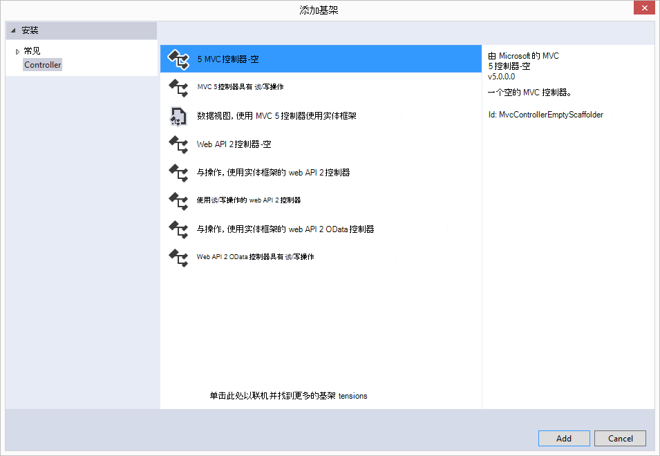

<properties 
    pageTitle="DocumentDB 的 ASP.NET MVC 教程︰ 开发 Web 应用程序 |Microsoft Azure" 
    description="ASP.NET MVC 教程以创建 MVC web 应用程序使用 DocumentDB。 将 JSON 存储并访问位于 Azure 网站-ASP NET MVC 教程步骤的一个 todo 应用程序中的数据。" 
    keywords="asp.net mvc 教程，web 应用程序开发、 mvc web 应用程序中，asp net mvc 教程按部就班"
    services="documentdb" 
    documentationCenter=".net" 
    authors="syamkmsft" 
    manager="jhubbard" 
    editor="cgronlun"/>

<tags 
    ms.service="documentdb" 
    ms.workload="data-services" 
    ms.tgt_pltfrm="na" 
    ms.devlang="dotnet" 
    ms.topic="hero-article" 
    ms.date="08/25/2016" 
    ms.author="syamk"/>

# DocumentDB 与 ASP.NET MVC 教程︰ Web 应用程序开发

> [AZURE.SELECTOR]
- [.NET](documentdb-dotnet-application.md)
- [Node.js](documentdb-nodejs-application.md)
- [Java](documentdb-java-application.md)
- [Python](documentdb-python-application.md) 

要如何高效地利用 Azure DocumentDB 来存储和查询的 JSON 文档中突出显示，本文提供了端到端演练向您展示如何构建托多个应用程序使用 Azure DocumentDB。 这些任务将存储为 Azure DocumentDB 中的 JSON 文档。

此演练演示了如何使用 Azure 的 DocumentDB 服务来存储和从 Azure 上承载 ASP.NET MVC web 应用程序访问数据。 如果您正在寻找的教程，只侧重于 DocumentDB，并不是 ASP.NET MVC 组件，请参阅[生成 DocumentDB C# 控制台应用程序](documentdb-get-started.md)。

> [AZURE.TIP] 本教程假定您已经使用 ASP.NET MVC 和 Azure 网站的经验。 如果您不熟悉 ASP.NET 或[必备的工具](#_Toc395637760)，我们建议从[GitHub][]并在该示例中的说明下载完整的样例项目。 它内置了，您可以查看本文深入了解项目的上下文中的代码。

## 此数据库教程的先决条件

在这篇文章中的说明进行操作之前，应确保您具备以下︰

- 活动的 Azure 帐户。 如果您没有帐户，您可以在几分钟创建免费的试用帐户。 有关详细信息，请参阅[Azure 免费试用版](https://azure.microsoft.com/pricing/free-trial/)。
- [Visual Studio 2015年](http://www.visualstudio.com/)或 4 或更高版本的 Visual Studio 2013年更新。 如果使用 Visual Studio 2013年，您将需要安装[Microsoft.Net.Compilers nuget 程序包](https://www.nuget.org/packages/Microsoft.Net.Compilers/)添加 C# 6.0 支持。 
- Azure SDK.net 2.5.1 版或更高版本，可通过[Microsoft Web 平台安装程序][]。

针对.NET 2.5.1 版更新 4 应用和 Azure SDK 使用 Visual Studio 2013年已采取本文中的所有屏幕抓图。 如果您的系统配置为不同的版本很可能您的屏幕和选项不完全匹配，但如果满足以上的先决条件这一解决方案应工作。

## 步骤 1︰ 创建一个 DocumentDB 数据库帐户

让我们首先创建一个 DocumentDB 帐户。 如果您已经有一个帐户，则可以跳过[创建新的 ASP.NET MVC 应用程序](#_Toc395637762)。

[AZURE.INCLUDE [documentdb-create-dbaccount](../../includes/documentdb-create-dbaccount.md)]

[AZURE.INCLUDE [documentdb-keys](../../includes/documentdb-keys.md)]

 
现在，我们将指导如何创建新的 ASP.NET MVC 应用程序从地面向上。 

## 步骤 2︰ 创建新的 ASP.NET MVC 应用程序

既然您已经有一个帐户，让我们创建我们新的 ASP.NET 项目。

1. 在 Visual Studio 中，在**文件**菜单上，指向**新建**，然后单击**项目**。

    出现**新建项目**对话框。
2. 在**项目类型**窗格中，展开**模板**、 **C#**、 **Web**，然后选择**ASP.NET Web 应用程序**。

    

3. 在**名称**框中，键入项目的名称。 本教程使用"todo"名称。 如果您选择使用此以外，然后只要本教程讨论的 todo 命名空间中，您需要调整提供的代码示例使用任何命名您的应用程序。 

4. 单击**浏览**以浏览到您想要创建项目，然后单击**确定**的文件夹。

    出现**新建 ASP.NET 项目**对话框。

    

5. 在模板窗格中，选择**MVC**。

6. 如果您计划在 Azure 应用程序所在然后选择**主机云中的**右下方有 Azure 托管应用程序。 我们已经选择设立在云中，并运行在 Azure 网站承载的应用程序。 选择此选项将为您 preprovision Azure 网站和最终的工作应用程序部署时使生活容易得多。 如果您希望将在其他位置或不想提前配置 Azure，只需清除**在云环境中的主机**。

7. 单击**确定**，并让其行事周围基架的空的 ASP.NET MVC 模板的 Visual Studio。 

8. 如果您选择在云中承载此您将看到至少一个其他的屏幕，要求您登录到您的 Azure 帐户并为您的新网站提供一些值。 提供所有其他值，然后继续。 

    因为我们这里没有使用 Azure SQL 数据库服务器，我尚未在此处选择"数据库服务器"，我们要创建一个新的 Azure DocumentDB 帐户以后在 Azure 门户。

    有关选择**的应用程序服务计划**和**资源组**的详细信息，请参阅[Azure 应用程序服务计划深度探讨](../app-service/azure-web-sites-web-hosting-plans-in-depth-overview.md)。

    

9. Visual Studio 创建样板 MVC 应用程序完毕后必须空的 ASP.NET 应用程序可以在本地运行。

    我们将跳过运行项目，本地因为我敢肯定我们都看过"Hello World"ASP.NET 应用程序。 让我们直接参加将 DocumentDB 添加到此项目和建立我们的应用程序。

## 步骤 3︰ 将 DocumentDB 添加到 MVC web 应用程序项目

现在，我们有大部分此解决方案我们需要 ASP.NET MVC 管道，让我们开始本教程中，将 Azure DocumentDB 添加到我们的 MVC web 应用程序的真正目的。

1. DocumentDB.NET SDK 进行包装和作为 NuGet 程序包分发。 若要在 Visual Studio 中获取 NuGet 程序包，请右击**解决方案资源管理器**中的项目，然后单击**管理 NuGet 程序包**在 Visual Studio 中使用 NuGet 程序包管理器。

    

    出现**管理 NuGet 程序包**对话框。

2. 在 NuGet**浏览**框中，键入***Azure DocumentDB***。
    
    从结果中，安装**Microsoft Azure DocumentDB 客户端库**包。 这将下载并安装 DocumentDB 软件包，以及所有依赖项，如 Newtonsoft.Json。 请单击**预览**窗口中的**确定**并**接受我****接受许可证**窗口中完成安装。

    

    或者您可以使用程序包管理器控制台来安装包。 为此，请在**工具**菜单上，单击**NuGet 程序包管理器**，然后单击**程序包管理器控制台**。 在提示符下，键入以下命令。

        Install-Package Microsoft.Azure.DocumentDB

3. 一旦安装程序包时，Visual Studio 解决方案应类似于以下两个新的引用和添加，Microsoft.Azure.Documents.Client 和 Newtonsoft.Json。

    

##步骤 4︰ 设置 ASP.NET MVC 应用程序
 
现在让我们到此 MVC 应用程序中添加模型、 视图和控制器︰

- [添加一个模型](#_Toc395637764)。
- [添加一个控制器](#_Toc395637765)。
- [添加视图](#_Toc395637766)。

### 将 JSON 数据模型添加

让我们首先创建在 MVC 中，模型**M** 。 

1. 在**解决方案资源管理器**中用鼠标右键单击**模型**文件夹，单击**添加**，然后单击**类**。

    出现**添加新项**对话框。

2. 命名新类**Item.cs** ，然后单击**添加**。 

3. 在此新的**Item.cs**文件，将以下内容添加最后一个*使用语句*之后。
        
        using Newtonsoft.Json;
    
4. 现在将这段代码 
        
        public class Item
        {
        }

    用下面的代码。

        public class Item
        {
            [JsonProperty(PropertyName = "id")]
            public string Id { get; set; }
             
            [JsonProperty(PropertyName = "name")]
            public string Name { get; set; }

            [JsonProperty(PropertyName = "description")]
            public string Description { get; set; }

            [JsonProperty(PropertyName = "isComplete")]
            public bool Completed { get; set; }
        }

    通过该线路 DocumentDB 中的所有数据，并将其存储为 JSON。 以控制的方式您的对象的序列化/反序列化的 JSON.NET 我们刚才创建的**项目**类中所示，您可以使用**JsonProperty**属性。 您不**具有**执行此，但我想确保我属性按照 JSON 驼峰匹配的命名约定。 
    
    不只是您可以控制属性名称的格式时将它放入 JSON，但正如我所做的**说明**属性可以完全重命名您的.NET 属性。 
    

### 添加控制器

这样就解决了**M**，现在让我们在 MVC 中，控制器类中创建**C** 。

1. 在**解决方案资源管理器**中用鼠标右键单击**控制器**文件夹，单击**添加**，然后单击**控制器**。

    出现**添加构架**对话框。

2. 选择**MVC 5 控制器-空**，然后单击**添加**。

    

3. 命名新的控制器， **ItemController。**

    

    一旦创建此文件时，Visual Studio 解决方案应与**解决方案资源管理器**中的新 ItemController.cs 文件如下所示。 此外会显示先前创建的新 Item.cs 文件。

    

    您可以关闭 ItemController.cs，我们将稍后返回到它。 

### 添加视图

现在，让我们在 MVC 中，在视图中创建**V** :

- [添加的项的索引视图](#AddItemIndexView)。
- [添加一个新项的视图](#AddNewIndexView)。
- [添加编辑项目视图](#_Toc395888515)。

#### 添加的项的索引视图

1. 在**解决方案资源管理器**中展开 [**视图**] 文件夹，右键单击当您前面添加**ItemController** Visual Studio 为您创建空**项目**文件夹，单击**添加**，然后单击**视图**。

    

2. 在**添加视图**对话框中，执行下列操作︰
    - 在**视图名称**框中，键入***索引***。
    - 在**模板**框中，选择***列表***。
    - 在**模型类**框中，选择***项目 (todo。型号）***。
    - 将**数据上下文类**框保留为空。 
    - 在布局页中，键入***~/Views/Shared/_Layout.cshtml***。
    
    

3. 一旦所有这些值，单击**添加**，并让 Visual Studio 创建新模板视图。 完成后，它将打开创建的 cshtml 文件。 随着我们将稍后对它，我们可以关闭该文件在 Visual Studio 中。

#### 添加新项视图

类似于我们创建的**项的索引**视图的方式，我们现在将创建新的视图来创建新**项目**。

1. 在**解决方案资源管理器**中再次右击**项目**文件夹，单击**添加**，然后单击**视图**。

2. 在**添加视图**对话框中，执行下列操作︰
    - 在**视图名称**框中，键入***创建***。
    - 在**模板**框中，选择***创建***。
    - 在**模型类**框中，选择***项目 (todo。型号）***。
    - 将**数据上下文类**框保留为空。
    - 在布局页中，键入***~/Views/Shared/_Layout.cshtml***。
    - 单击**添加**。

#### 添加编辑项目视图

然后最后，添加一个用于编辑**项目**中相同的方式在前的最后一个视图。

1. 在**解决方案资源管理器**中再次右击**项目**文件夹，单击**添加**，然后单击**视图**。

2. 在**添加视图**对话框中，执行下列操作︰
    - 在**视图名称**框中，键入***编辑***。
    - 在**模板**框中，选择***编辑***。
    - 在**模型类**框中，选择***项目 (todo。型号）***。
    - 将**数据上下文类**框保留为空。 
    - 在布局页中，键入***~/Views/Shared/_Layout.cshtml***。
    - 单击**添加**。

完成此操作后，关闭 Visual Studio 中的所有 cshtml 文档，如我们将在以后返回到这些视图。

## 步骤 5: DocumentDB 绑定

现在，负责标准的 MVC 资料，让我们打开添加代码为 DocumentDB。 

在本节中，我们将添加代码以处理如下︰

- [列出未完成的项目](#_Toc395637770)。
- [添加项目](#_Toc395637771)。
- [编辑项目](#_Toc395637772)。

### 列出了 MVC web 应用程序中未完成的项目

来这里做第一件事是添加一个类，包含所有要连接到并使用 DocumentDB 的逻辑。 对于本教程我们将所有此逻辑封装在到一个名为 DocumentDBRepository 的存储库类。 

1. 在**解决方案资源管理器**中右击该项目，单击**添加**，然后单击**类**。 新类**DocumentDBRepository**命名并单击**添加**。
 
2. 在新创建的**DocumentDBRepository**类，并添加以下*使用语句*在*命名空间*声明上方
        
        using Microsoft.Azure.Documents; 
        using Microsoft.Azure.Documents.Client; 
        using Microsoft.Azure.Documents.Linq; 
        using System.Configuration;
        using System.Linq.Expressions;
        using System.Threading.Tasks;

    现在将这段代码 

        public class DocumentDBRepository
        {
        }

    用下面的代码。

        public static class DocumentDBRepository<T> where T : class
        {
            private static readonly string DatabaseId = ConfigurationManager.AppSettings["database"];
            private static readonly string CollectionId = ConfigurationManager.AppSettings["collection"];
            private static DocumentClient client;
    
            public static void Initialize()
            {
                client = new DocumentClient(new Uri(ConfigurationManager.AppSettings["endpoint"]), ConfigurationManager.AppSettings["authKey"]);
                CreateDatabaseIfNotExistsAsync().Wait();
                CreateCollectionIfNotExistsAsync().Wait();
            }
    
            private static async Task CreateDatabaseIfNotExistsAsync()
            {
                try
                {
                    await client.ReadDatabaseAsync(UriFactory.CreateDatabaseUri(DatabaseId));
                }
                catch (DocumentClientException e)
                {
                    if (e.StatusCode == System.Net.HttpStatusCode.NotFound)
                    {
                        await client.CreateDatabaseAsync(new Database { Id = DatabaseId });
                    }
                    else
                    {
                        throw;
                    }
                }
            }
    
            private static async Task CreateCollectionIfNotExistsAsync()
            {
                try
                {
                    await client.ReadDocumentCollectionAsync(UriFactory.CreateDocumentCollectionUri(DatabaseId, CollectionId));
                }
                catch (DocumentClientException e)
                {
                    if (e.StatusCode == System.Net.HttpStatusCode.NotFound)
                    {
                        await client.CreateDocumentCollectionAsync(
                            UriFactory.CreateDatabaseUri(DatabaseId),
                            new DocumentCollection { Id = CollectionId },
                            new RequestOptions { OfferThroughput = 1000 });
                    }
                    else
                    {
                        throw;
                    }
                }
            }
        }

    > [AZURE.TIP] 当创建新的 DocumentCollection 可以提供可选的 RequestOptions 参数的 OfferType，它允许您指定新的集合的性能级别。 如果不传递此参数，则将使用默认的产品类型。 为 DocumentDB 提供类型的详细信息，请参考[DocumentDB 的性能级别](documentdb-performance-levels.md)

3. 我们正在阅读一些值从配置，因此打开您的应用程序的**Web.config**文件，添加以下行下的`<AppSettings>`部分。
    
        <add key="endpoint" value="enter the URI from the Keys blade of the Azure Portal"/>
        <add key="authKey" value="enter the PRIMARY KEY, or the SECONDARY KEY, from the Keys blade of the Azure  Portal"/>
        <add key="database" value="ToDoList"/>
        <add key="collection" value="Items"/>
    
4. 现在，更新为*终结点*和*authKey*使用 Azure 门户的键刀片式服务器的值。 从键刀片式服务器**URI**用作终结点设置的值，用作**主键**或**辅助键**键刀片式服务器中的 authKey 设置的值。

    接受治疗的配线向上 DocumentDB 存储库，现在让我们添加我们的应用程序逻辑。

5. 我们希望能够与一个 todo 列表应用程序的第一件事是显示未完成的项目。  复制并粘贴下面的代码段的**DocumentDBRepository**类中的任何位置。

        public static async Task<IEnumerable<T>> GetItemsAsync(Expression<Func<T, bool>> predicate)
        {
            IDocumentQuery<T> query = client.CreateDocumentQuery<T>(
                UriFactory.CreateDocumentCollectionUri(DatabaseId, CollectionId))
                .Where(predicate)
                .AsDocumentQuery();

            List<T> results = new List<T>();
            while (query.HasMoreResults)
            {
                results.AddRange(await query.ExecuteNextAsync<T>());
            }

            return results;
        }

6. 打开**ItemController**我们前面添加，添加以下*使用语句*在命名空间声明上方。

        using System.Net;
        using System.Threading.Tasks;
        using todo.Models;

    如果您的项目未命名"todo"，则需要更新使用"todo。模型";以反映您的项目的名称。

    现在将这段代码

        //GET: Item
        public ActionResult Index()
        {
            return View();
        }

    用下面的代码。

        [ActionName("Index")]
        public async Task<ActionResult> IndexAsync()
        {
            var items = await DocumentDBRepository<Item>.GetItemsAsync(d => !d.Completed);
            return View(items);
        }
    
7. 打开**Global.asax.cs** ，然后将以下行添加到**Application_Start**方法 
 
        DocumentDBRepository<todo.Models.Item>.Initialize();
    
此时您的解决方案应该能够生成没有任何错误。

如果您运行的应用程序现在，您将转到**HomeController**和控制器的**索引**视图。 这是我们在开始时选择的 MVC 模板项目的默认行为，但我们不希望这样 ！ 让我们来更改此 MVC 应用程序来改变这种现象上的路由。

打开***App\_Start\RouteConfig.cs***和查找开头的行"默认设置:"并将其更改为如下所示。

        defaults: new { controller = "Item", action = "Index", id = UrlParameter.Optional }

这说明如果不在控制**家庭**，相反，它的路由行为的 URL 指定了一个值用作**项目**作为控制器，用户**索引**视图的 ASP.NET MVC。

现在，如果您运行该应用程序时，将调用也不能将存储库类调用 GetItems 方法用于返回到**视图**的所有未完成的项目您**ItemController** \\**项**\\**索引**视图。 

如果生成并运行此项目，现在，您现在应该看到相似这。    

### 添加项

让我们到我们的数据库作出的一些项目，以便我们有东西比看空网格。

让我们添加一些代码，DocumentDBRepository 和 ItemController 来持久保存在 DocumentDB 中的记录。

1.  将下面的方法添加到您的**DocumentDBRepository**类。

        public static async Task<Document> CreateItemAsync(T item)
        {
            return await client.CreateDocumentAsync(UriFactory.CreateDocumentCollectionUri(DatabaseId, CollectionId), item);
        }

    此方法只是将传递给它的对象并将其保持在 DocumentDB 中。

2. 打开 ItemController.cs 文件并添加下面的代码段的类中。 这是 ASP.NET MVC 如何知道要执行的操作的**创建**操作。 在这种情况下只需呈现更早版本创建的关联的 Create.cshtml 视图。

        [ActionName("Create")]
        public async Task<ActionResult> CreateAsync()
        {
            return View();
        }

    现在，我们需要一些更多的代码，将接受从**创建**视图提交此控制器中。

2. 将下一个代码块添加到与窗体过帐此控制器做什么告诉 ASP.NET MVC 的 ItemController.cs 类。
    
        [HttpPost]
        [ActionName("Create")]
        [ValidateAntiForgeryToken]
        public async Task<ActionResult> CreateAsync([Bind(Include = "Id,Name,Description,Completed")] Item item)
        {
            if (ModelState.IsValid)
            {
                await DocumentDBRepository<Item>.CreateItemAsync(item);
                return RedirectToAction("Index");
            }

            return View(item);
        }

    此代码连接到 DocumentDBRepository，并使用 CreateItemAsync 方法来持久保存到数据库的新 todo 项。 
 
    **安全说明**︰ 这里使用**ValidateAntiForgeryToken**特性来帮助保护此应用程序跨站点请求伪造攻击。 没有比只将此特性添加到它更多，您的视图需要使用此的防伪标记。 有关主题和有关如何正确地实现此示例的详细信息，请参阅[防止跨站点请求伪造][]。 在[GitHub][]上提供的源代码拥有完全的实现。

    **安全说明**︰ 我们还使用**绑定**属性对方法参数以帮助防范过度张贴攻击。 有关更多详细信息，请参阅[在 ASP.NET MVC 中基本的 CRUD 操作][]。

将新项添加到我们的数据库所需的代码到此结束。

### 编辑项

没有为我们做，最后一点，那就是添加能够编辑数据库中的**项**并将它们标记为已完成。 编辑视图已添加到项目中，所以我们只需要添加一些代码再次对我们的控制器和**DocumentDBRepository**类。

1. **DocumentDBRepository**类中添加以下。

        public static async Task<Document> UpdateItemAsync(string id, T item)
        {
            return await client.ReplaceDocumentAsync(UriFactory.CreateDocumentUri(DatabaseId, CollectionId, id), item);
        }

        public static async Task<T> GetItemAsync(string id)
        {
            try
            {
                Document document = await client.ReadDocumentAsync(UriFactory.CreateDocumentUri(DatabaseId, CollectionId, id));
                return (T)(dynamic)document;
            }
            catch (DocumentClientException e)
            {
                if (e.StatusCode == HttpStatusCode.NotFound)
                {
                    return null;
                }
                else
                {
                    throw;
                }
            }
        }
    
    第一种方法， **GetItem**提取一个项目从 DocumentDB 传递回**ItemController** ，然后到**编辑**视图。
    
    第二种方法我们刚刚添加的替换**文档**与**文档**的版本的 DocumentDB 中从**ItemController**中传递。

2. **ItemController**类中添加以下。

        [HttpPost]
        [ActionName("Edit")]
        [ValidateAntiForgeryToken]
        public async Task<ActionResult> EditAsync([Bind(Include = "Id,Name,Description,Completed")] Item item)
        {
            if (ModelState.IsValid)
            {
                await DocumentDBRepository<Item>.UpdateItemAsync(item.Id, item);
                return RedirectToAction("Index");
            }

            return View(item);
        }

        [ActionName("Edit")]
        public async Task<ActionResult> EditAsync(string id)
        {
            if (id == null)
            {
                return new HttpStatusCodeResult(HttpStatusCode.BadRequest);
            }

            Item item = await DocumentDBRepository<Item>.GetItemAsync(id);
            if (item == null)
            {
                return HttpNotFound();
            }

            return View(item);
        }
    
    第一种方法处理发生当用户单击**索引**视图中的**编辑**链接上的 Http GET。 此方法从 DocumentDB 中获取[**文档**](http://msdn.microsoft.com/library/azure/microsoft.azure.documents.document.aspx)并将其传递到**编辑**视图。

    **编辑**视图然后将对**IndexController**执行 Http POST。 
    
    我们添加了第二种方法处理将更新后的对象传递给 DocumentDB 来保存在数据库中。

这是而已，这就是我们需要运行我们的应用程序、 未完成的**项目**的列表、 添加新**项目**，和编辑**项目**中的所有。

## 步骤 6︰ 在本地运行应用程序

要测试您的本地计算机上的应用程序，请执行以下操作︰

1. 按 F5 在 Visual Studio 生成该应用程序在调试模式下。 它应生成应用程序，并启动与我们前面看到的空网格页的浏览器︰

    

    如果您使用的 Visual Studio 2013年并收到错误消息"无法等待体内的 catch 子句。" 您需要安装[Microsoft.Net.Compilers nuget 程序包](https://www.nuget.org/packages/Microsoft.Net.Compilers/)。 您还可以比较在[GitHub][]上的样例项目对您的代码。 

2. 单击**新建**链接并将值添加到**名称**和**说明**字段。 请假**完成**复选框处于未选中状态否则为新**项**将添加到已完成状态和将不会显示在初始列表上。

    

3. 单击**创建**和您将重新定向到**索引**视图并显示在列表中您的**项目**。

    

    随意向 todo 列表中添加一些更多的**项目**。

3. 单击列表上的**项**旁边的**编辑**，则会转到**编辑**视图中，您可以更新任何属性的对象，包括**已完成**标志。 如果将**完成**标志标记并单击**保存**，将从的未完成的任务列表中删除**项**。

    

4. 一旦您已测试应用程序中，按 Ctrl + F5 以停止调试应用程序。 您准备好部署 ！

## 第 7 步︰ 将应用部署到 Azure 网站

现在，有了完整的应用程序正确使用 DocumentDB 我们将这个 web 应用程序部署到 Azure 网站。 如果在创建空的 ASP.NET MVC 项目选择**中云主机**Visual Studio 使这真的很简单，并为您完成大部分工作。 

1. 发布此应用程序需要做是项目在**解决方案资源管理器**中右键单击，然后单击**发布**。

    

2. 一切应该已经配置根据您的凭据;事实上该网站已创建在 Azure 中为您的**目标 URL**所示，您需要做的就是单击**发布**。

    

几秒钟后，Visual Studio 将完成 web 应用程序发布和启动浏览器，可以看到在 Azure 中运行方便工作 ！

## 下一步行动

祝贺您 ！ 您只需构建您的第一个 ASP.NET MVC web 应用程序使用 Azure DocumentDB 并将其发布到 Azure 网站。 包括未包括在本教程中的详细信息和删除功能完整的应用程序的源代码可以下载，或者从[GitHub][]克隆。 因此如果你感兴趣，将它添加到您的应用程序，获取代码并将其添加到此应用程序。

若要将其他功能添加到您的应用程序，查看[DocumentDB.NET 库](https://msdn.microsoft.com/library/azure/dn948556.aspx)中可用的 Api 并放心地参与到[GitHub][]上的 DocumentDB.NET 库。 

[\*]: https://microsoft.sharepoint.com/teams/DocDB/Shared%20Documents/Documentation/Docs.LatestVersions/PicExportError
[Visual Studio Express]: http://www.visualstudio.com/products/visual-studio-express-vs.aspx
[Microsoft Web 平台安装程序]: http://www.microsoft.com/web/downloads/platform.aspx
[防止跨站点请求伪造]: http://go.microsoft.com/fwlink/?LinkID=517254
[在 ASP.NET MVC 中的基本的 CRUD 操作]: http://go.microsoft.com/fwlink/?LinkId=317598
[GitHub]: https://github.com/Azure-Samples/documentdb-net-todo-app
