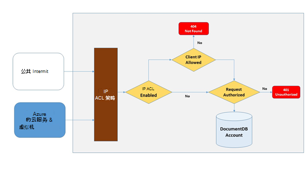
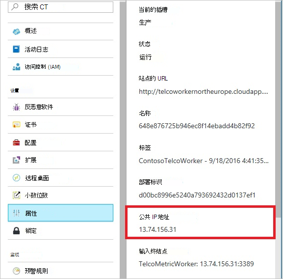
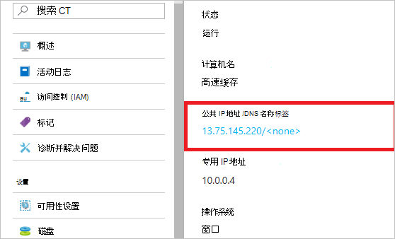
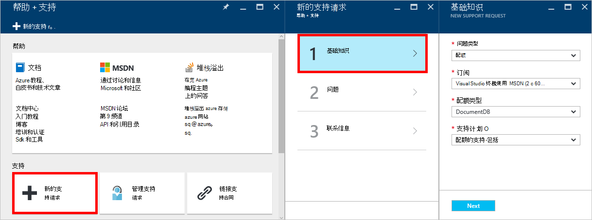
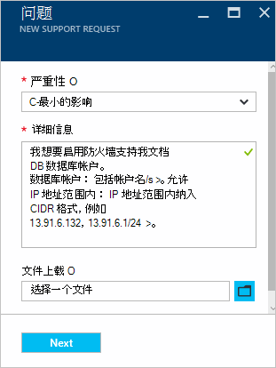

<properties
    pageTitle="防火墙支持 DocumentDB |Microsoft Azure"
    description="了解如何使用 Azure DocumentDB 数据库帐户上的防火墙支持 IP 访问控制策略。"
    keywords="IP 访问控制、 防火墙支持"
    services="documentdb"
    authors="shahankur11"
    manager="jhubbard"
    editor=""
    tags="azure-resource-manager"
    documentationCenter=""/>

<tags 
    ms.service="documentdb" 
    ms.workload="data-services" 
    ms.tgt_pltfrm="na" 
    ms.devlang="na" 
    ms.topic="article" 
    ms.date="10/17/2016" 
    ms.author="ankshah; kraman"/>

# DocumentDB 防火墙支持

要保护存储在 Azure DocumentDB 数据库帐户中的数据，DocumentDB 具有机密根据[授权模型](https://msdn.microsoft.com/library/azure/dn783368.aspx)，它利用一个强大的基于哈希的消息身份验证代码 (HMAC) 提供支持。 现在，除了秘密根据的授权模型中，DocumentDB 还支持策略驱动的入站的防火墙支持基于 IP 的访问控制。 这种模型非常类似于传统数据库系统的防火墙规则，并提供额外的 DocumentDB 数据库帐户的安全性。 与此模型中，您现在可以配置 DocumentDB 数据库帐户可以访问只能从已批准的一组计算机和/或云服务。 从这些已批准的一套机和服务访问 DocumentDB 资源仍要求调用方提供一个有效的授权令牌。

## IP 访问控制概述

默认情况下，DocumentDB 数据库帐户是可以从公用的 internet 访问，只要请求都伴有一个有效的授权令牌。 若要配置 IP 的基于策略的访问控制，用户必须提供 IP 地址或 CIDR 窗体包含为给定的数据库帐户的客户端 Ip 允许列表中的 IP 地址范围的集合。 一旦应用此配置时，服务器将阻止源自机此允许列表外的所有请求。  下图描述了连接的处理流程的基于 IP 的访问控制。

## 从云服务的连接

在 Azure，云服务是非常常见的宿主使用 DocumentDB 的中间层服务逻辑方式。 可以从云服务使 DocumentDB 数据库帐户访问，必须是云服务的公用 IP 地址添加到允许列表中的 IP 地址与您的 DocumentDB 数据库帐户通过[联系 Azure 支持](#configure-ip-policy)。  这将确保云服务的所有角色实例都拥有 DocumentDB 数据库帐户的访问。 下面的屏幕快照中所示，您可以在 Azure 的门户中，云服务检索 IP 地址。 

缩放时出云服务通过添加其他角色实例，这些新实例将自动具有访问 DocumentDB 数据库帐户因为它们都属于同一个云服务。

## 从虚拟机连接

[虚拟机](https://azure.microsoft.com/services/virtual-machines/)或[虚拟机比例设置](../virtual-machine-scale-sets/virtual-machine-scale-sets-overview.md)还可使用 DocumentDB 的中间层服务的宿主。  要配置 DocumentDB 数据库帐户以允许从虚拟机、 虚拟机和/或虚拟机比例设置的公用 IP 地址的访问必须配置为允许的 IP 地址为您的 DocumentDB 数据库帐户之一联系[Azure 支持](#configure-ip-policy)。 下面的屏幕快照中所示，您可以在 Azure 的门户中，虚拟机的 IP 地址。

当您向组中添加额外的虚拟机实例时，它们自动提供为您 DocumentDB 数据库的帐户的访问。

## 来自互联网的连接

在 DocumentDB 数据库帐户访问 internet 上的计算机时，该客户端的 IP 地址或计算机的 IP 地址范围必须添加到允许列表中的 IP 地址为 DocumentDB 的数据库帐户。 

## 配置 IP 访问控制策略

使用 Azure 门户网站文件使用[Azure 支持](https://portal.azure.com/?#blade/Microsoft_Azure_Support/HelpAndSupportBlade)请求启用数据库帐户上，IP 的访问控制策略。

1. 在[帮助 + 支持](https://portal.azure.com/?#blade/Microsoft_Azure_Support/HelpAndSupportBlade)刀片式服务器，选择**新建支持请求**。
2. 在**请求的新支持**刀片式服务器，选择**基础知识**。
3. 在**基本知识**刀片式服务器，选择下列设置︰
    - **问题类型**︰ 配额
    - **订阅**︰ 与要在其中添加 IP 访问控制策略的帐户相关联的订阅。
    - **配额类型**︰ DocumentDB
    - **支持计划**︰ 配额支持-包括。
4. 在**问题**刀片式服务器，请执行以下操作︰
    - **严重等级**︰ 选择 C 的影响降到最低
    - **详细信息**︰ 将以下文本复制到框中，并包含您的帐户名称/s 和 IP 地址/es:"我想要启用防火墙支持我 DocumentDB 数据库帐户。 数据库帐户︰*包含帐户名称/s*。 允许 IP 地址范围内︰*包括 IP 的地址范围，可按 CIDR 格式，例如 13.91.6.132、 13.91.6.1/24*。"
    - 单击**下一步**。 
5. 在**联系信息**刀片，填写您的联系详细信息并单击**创建**。 

一旦收到您的请求时，应在 24 小时内启用 IP 访问控制。 请求完成后，您将收到通知。

## 故障排除 IP 访问控制策略

### 门户操作

通过启用 IP 访问控制策略为您的 DocumentDB 数据库帐户，从外部配置机对 DocumentDB 数据库帐户的所有访问权限允许被阻止的 IP 地址范围的列表。 此模型中，通过浏览数据平面操作从门户网站也将被阻止以确保访问控制的完整性。 

### SDK 和 Rest API

为安全起见，不在允许列表上的计算机通过 SDK 或 REST API 访问将返回一个一般 404 找不到响应的其他详细信息。 请检查以确保正确的策略配置应用到您的 DocumentDB 数据库帐户的 IP 允许列表配置为您的 DocumentDB 数据库帐户。

## 下一步行动

有关网络的信息相关的性能提示和技巧，请参阅[性能提示](documentdb-performance-tips.md)。