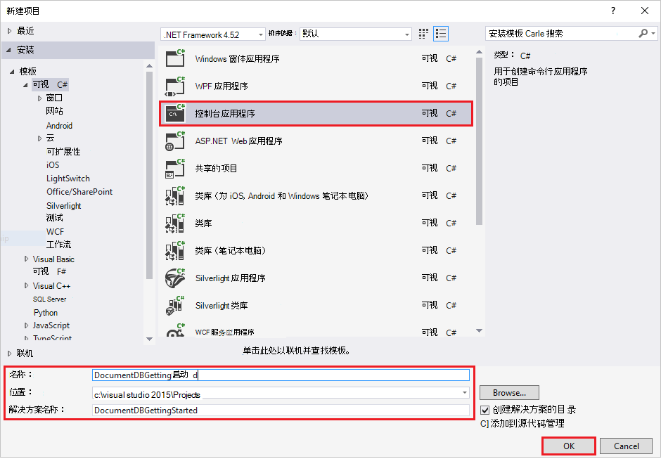
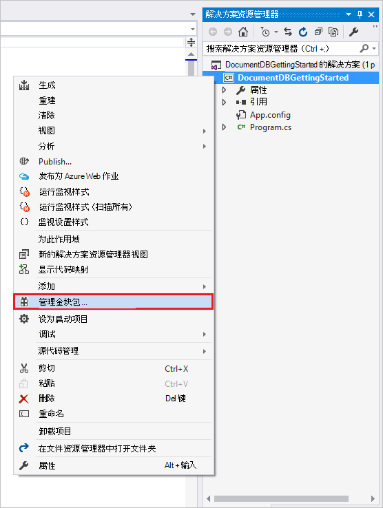
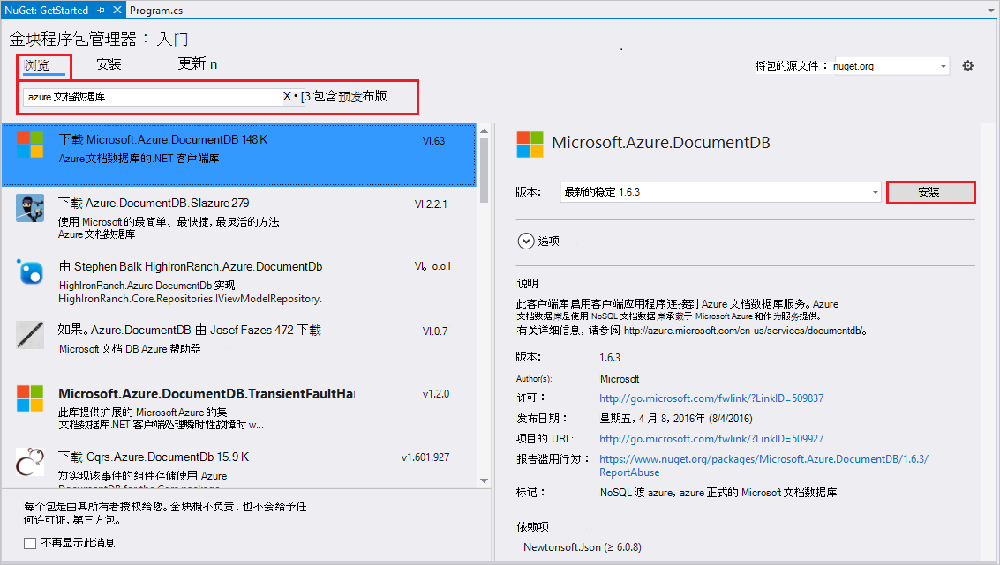
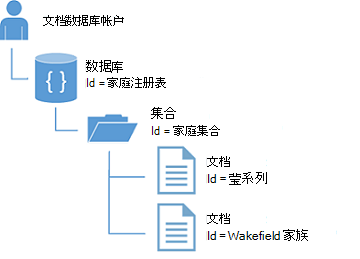
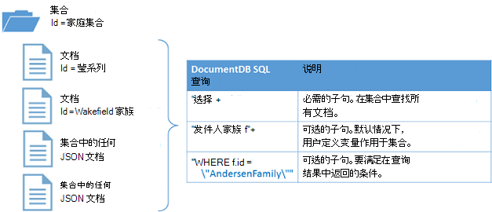

<properties
    pageTitle="NoSQL 教程︰ DocumentDB.NET SDK |Microsoft Azure"
    description="创建联机数据库和 C# 控制台应用程序使用 DocumentDB.NET SDK NoSQL 教程。 DocumentDB 是用于 JSON 使用 NoSQL 数据库。"
    keywords="nosql 教程、 联机数据库，c# 控制台应用程序"
    services="documentdb"
    documentationCenter=".net"
    authors="AndrewHoh"
    manager="jhubbard"
    editor="monicar"/>

<tags
    ms.service="documentdb"
    ms.workload="data-services"
    ms.tgt_pltfrm="na"
    ms.devlang="dotnet"
    ms.topic="hero-article"
    ms.date="08/29/2016"
    ms.author="anhoh"/>

# NoSQL 教程︰ 生成 DocumentDB C# 控制台应用程序

> [AZURE.SELECTOR]
- [.NET](documentdb-get-started.md)
- [Node.js](documentdb-nodejs-get-started.md)

欢迎使用 NoSQL 教程的 Azure DocumentDB.NET sdk ！ 完本教程后，您必须创建一个控制台应用程序和查询 DocumentDB 资源。

我们将介绍︰

- 创建和连接到一个 DocumentDB 帐户
- 配置 Visual Studio 解决方案
- 创建一个在线数据库
- 创建集合
- 创建 JSON 文档
- 查询集合
- 替换文档
- 删除文档
- 删除数据库

没有时间？ 不用担心！ 在[GitHub](https://github.com/Azure-Samples/documentdb-dotnet-getting-started)上提供了完整的解决方案。 跳转到[获得完整的解决方案部分](#GetSolution)的快速说明。

之后，请使用投票按钮的顶部或底部的此页向我们提供反馈。 如果您希望我们直接与您联系，您可以随意在注释中包括您的电子邮件地址。

现在让我们开始吧 ！

## 系统必备组件

请确保您具有下列︰

- 活动的 Azure 帐户。 如果您没有，您可以注册[免费的帐户](https://azure.microsoft.com/free/)。
- [Visual Studio 2013年 / Visual Studio 2015年](http://www.visualstudio.com/)。
- .NET Framework 4.6

## 步骤 1︰ 创建一个 DocumentDB 帐户

让我们创建一个 DocumentDB 帐户。 如果您已经有您想要使用的帐户，您可以跳至[安装 Visual Studio 解决方案](#SetupVS)。

[AZURE.INCLUDE [documentdb-create-dbaccount](../../includes/documentdb-create-dbaccount.md)]

## 步骤 2︰ 设置 Visual Studio 解决方案

1. 在您的计算机上打开**Visual Studio 2015年**。
2. 在**文件**菜单上选择**新建**，然后选择**项目**。
3. 在**新建项目**对话框中，选择**模板** / **C#** / **控制台应用程序**，项目，命名，然后再单击**确定**。

4. 在**解决方案资源管理器**中右键单击新控制台应用程序，即在 Visual Studio 解决方案。
5. 再无需离开菜单上，单击上**管理 NuGet 程序包...**

6. **Nuget**选项卡中，单击**浏览**并在搜索框中键入**azure documentdb** 。
7. 在结果中，发现**Microsoft.Azure.DocumentDB** ，然后单击**安装**。
DocumentDB 客户端库的包 ID 是[Microsoft.Azure.DocumentDB](https://www.nuget.org/packages/Microsoft.Azure.DocumentDB)

很好 ！ 既然我们完成安装程序，让我们开始编写一些代码。 您可以在[GitHub](https://github.com/Azure-Samples/documentdb-dotnet-getting-started/blob/master/src/Program.cs)找到完整的代码项目的本教程。

## 第 3 步︰ 连接到一个 DocumentDB 帐户

首先，在 Program.cs 文件中添加的 C# 应用程序，开始这些引用︰

    using System;
    using System.Linq;
    using System.Threading.Tasks;

    // ADD THIS PART TO YOUR CODE
    using System.Net;
    using Microsoft.Azure.Documents;
    using Microsoft.Azure.Documents.Client;
    using Newtonsoft.Json;

> [AZURE.IMPORTANT] 若要完成本教程中 NoSQL，确保添加上面的依赖关系。

现在，添加这两个常量和公用类*程序*下的*客户端*变量。

    public class Program
    {
        // ADD THIS PART TO YOUR CODE
        private const string EndpointUri = "<your endpoint URI>";
        private const string PrimaryKey = "<your key>";
        private DocumentClient client;

下一步，到[Azure 门户网站](https://portal.azure.com)以检索您的 URI 和主键的头。 DocumentDB 的 URI 和主键都有必要了解在何处可以连接到您的应用程序和 DocumentDB 信任应用程序的连接。

在 Azure 门户中，导航到您的 DocumentDB 帐户，然后单击**项**。

从门户复制 URI，并将其粘贴到`<your endpoint URI>`program.cs 文件中。 从门户复制主键，然后将其粘贴到`<your key>`。

![Azure 门户使用 NoSQL 教程创建一个 C# 控制台应用程序的屏幕抓图。 用突出显示活动中心、 键按钮突出显示在 DocumentDB 帐户刀片式服务器，并突出显示键刀片式服务器上的 URI、 为主键和辅助键值显示的 DocumentDB 帐户，][keys]

我们将通过创建新实例的**DocumentClient**开始获取启动应用程序。

下面**Main**方法中，添加名为**GetStartedDemo**，它将实例化我们新**DocumentClient**这个新的异步任务。

    static void Main(string[] args)
    {
    }

    // ADD THIS PART TO YOUR CODE
    private async Task GetStartedDemo()
    {
        this.client = new DocumentClient(new Uri(EndpointUri), PrimaryKey);
    }

添加以下代码，以从**Main**方法运行异步任务。 **Main**方法将捕捉异常并将它们写到控制台。

    static void Main(string[] args)
    {
            // ADD THIS PART TO YOUR CODE
            try
            {
                    Program p = new Program();
                    p.GetStartedDemo().Wait();
            }
            catch (DocumentClientException de)
            {
                    Exception baseException = de.GetBaseException();
                    Console.WriteLine("{0} error occurred: {1}, Message: {2}", de.StatusCode, de.Message, baseException.Message);
            }
            catch (Exception e)
            {
                    Exception baseException = e.GetBaseException();
                    Console.WriteLine("Error: {0}, Message: {1}", e.Message, baseException.Message);
            }
            finally
            {
                    Console.WriteLine("End of demo, press any key to exit.");
                    Console.ReadKey();
            }

按**F5**以运行应用程序。

祝贺您 ！ 您已成功连接到一个 DocumentDB 帐户，让我们现在看看如何使用 DocumentDB 资源。  

## 步骤 4︰ 创建数据库
添加用于创建数据库的代码之前，添加帮助器方法将写入到控制台。

复制并粘贴下面的**GetStartedDemo**方法的**WriteToConsoleAndPromptToContinue**方法。

    // ADD THIS PART TO YOUR CODE
    private void WriteToConsoleAndPromptToContinue(string format, params object[] args)
    {
            Console.WriteLine(format, args);
            Console.WriteLine("Press any key to continue ...");
            Console.ReadKey();
    }

可以通过使用[CreateDatabaseAsync](https://msdn.microsoft.com/library/microsoft.azure.documents.client.documentclient.createdatabaseasync.aspx)的**DocumentClient**类的方法创建 DocumentDB[数据库](documentdb-resources.md#databases)。 数据库是跨集合分区的 JSON 文档存储的逻辑容器。

复制并粘贴下面的**WriteToConsoleAndPromptToContinue**方法的**CreateDatabaseIfNotExists**方法。

    // ADD THIS PART TO YOUR CODE
    private async Task CreateDatabaseIfNotExists(string databaseName)
    {
            // Check to verify a database with the id=FamilyDB does not exist
            try
            {
                    await this.client.ReadDatabaseAsync(UriFactory.CreateDatabaseUri(databaseName));
                    this.WriteToConsoleAndPromptToContinue("Found {0}", databaseName);
            }
            catch (DocumentClientException de)
            {
                    // If the database does not exist, create a new database
                    if (de.StatusCode == HttpStatusCode.NotFound)
                    {
                            await this.client.CreateDatabaseAsync(new Database { Id = databaseName });
                            this.WriteToConsoleAndPromptToContinue("Created {0}", databaseName);
                    }
                    else
                    {
                            throw;
                    }
            }
    }

复制并粘贴以下代码到您在客户端创建下面的**GetStartedDemo**方法。 这将创建名为*FamilyDB*的数据库。

    private async Task GetStartedDemo()
    {
        this.client = new DocumentClient(new Uri(EndpointUri), PrimaryKey);

        // ADD THIS PART TO YOUR CODE
        await this.CreateDatabaseIfNotExists("FamilyDB_oa");

按**F5**以运行应用程序。

祝贺您 ！ 您已成功创建的 DocumentDB 数据库。  

## 步骤 5︰ 创建集合  

> [AZURE.WARNING] **CreateDocumentCollectionAsync**将创建一个新集合，以保留已定价的含义的吞吐量。 有关详细信息，请访问我们的[定价页](https://azure.microsoft.com/pricing/details/documentdb/)。

可以通过使用**DocumentClient**类的[CreateDocumentCollectionAsync](https://msdn.microsoft.com/library/microsoft.azure.documents.client.documentclient.createdocumentcollectionasync.aspx)方法创建一个[集合](documentdb-resources.md#collections)。 集合是 JSON 文档和关联的 JavaScript 应用程序逻辑的容器。

复制并粘贴您的**CreateDatabaseIfNotExists**方法下的**CreateDocumentCollectionIfNotExists**方法。

    // ADD THIS PART TO YOUR CODE
    private async Task CreateDocumentCollectionIfNotExists(string databaseName, string collectionName)
    {
        try
        {
            await this.client.ReadDocumentCollectionAsync(UriFactory.CreateDocumentCollectionUri(databaseName, collectionName));
            this.WriteToConsoleAndPromptToContinue("Found {0}", collectionName);
        }
        catch (DocumentClientException de)
        {
            // If the document collection does not exist, create a new collection
            if (de.StatusCode == HttpStatusCode.NotFound)
            {
                DocumentCollection collectionInfo = new DocumentCollection();
                collectionInfo.Id = collectionName;

                // Configure collections for maximum query flexibility including string range queries.
                collectionInfo.IndexingPolicy = new IndexingPolicy(new RangeIndex(DataType.String) { Precision = -1 });

                // Here we create a collection with 400 RU/s.
                await this.client.CreateDocumentCollectionAsync(
                    UriFactory.CreateDatabaseUri(databaseName),
                    collectionInfo,
                    new RequestOptions { OfferThroughput = 400 });

                this.WriteToConsoleAndPromptToContinue("Created {0}", collectionName);
            }
            else
            {
                throw;
            }
        }
    }

复制并粘贴以下代码到您数据库创建下面的**GetStartedDemo**方法。 这将创建一个名为*FamilyCollection_oa*的文档集合。

        this.client = new DocumentClient(new Uri(EndpointUri), PrimaryKey);

        await this.CreateDatabaseIfNotExists("FamilyDB_oa");

        // ADD THIS PART TO YOUR CODE
        await this.CreateDocumentCollectionIfNotExists("FamilyDB_oa", "FamilyCollection_oa");

按**F5**以运行应用程序。

祝贺您 ！ 您已成功创建 DocumentDB 文档集合。  

## 第 6 步︰ 创建 JSON 文档
通过使用[CreateDocumentAsync](https://msdn.microsoft.com/library/microsoft.azure.documents.client.documentclient.createdocumentasync.aspx)方法的**DocumentClient**类，可以创建[文档](documentdb-resources.md#documents)。 文档是用户定义的 （任意） JSON 内容。 我们现在可以插入一个或多个文档。 如果您已经有了想要在数据库中存储的数据，您可以使用 DocumentDB 的[数据迁移工具](documentdb-import-data.md)。

首先，我们需要创建一个**家族**类表示存储在 DocumentDB 此示例中的对象。 我们还将创建**父**、**子**、**宠物**、 在**家庭**中使用的**地址**子类。 请注意，文档必须具有**Id**属性序列化为 json 格式的**id** 。 通过**GetStartedDemo**方法后添加以下内部子类创建这些类。

复制并粘贴**系列**、**父**、**子**、**宠物**和**地址**类别下的**WriteToConsoleAndPromptToContinue**方法。

    private void WriteToConsoleAndPromptToContinue(string format, params object[] args)
    {
        Console.WriteLine(format, args);
        Console.WriteLine("Press any key to continue ...");
        Console.ReadKey();
    }

    // ADD THIS PART TO YOUR CODE
    public class Family
    {
        [JsonProperty(PropertyName = "id")]
        public string Id { get; set; }
        public string LastName { get; set; }
        public Parent[] Parents { get; set; }
        public Child[] Children { get; set; }
        public Address Address { get; set; }
        public bool IsRegistered { get; set; }
        public override string ToString()
        {
                return JsonConvert.SerializeObject(this);
        }
    }

    public class Parent
    {
        public string FamilyName { get; set; }
        public string FirstName { get; set; }
    }

    public class Child
    {
        public string FamilyName { get; set; }
        public string FirstName { get; set; }
        public string Gender { get; set; }
        public int Grade { get; set; }
        public Pet[] Pets { get; set; }
    }

    public class Pet
    {
        public string GivenName { get; set; }
    }

    public class Address
    {
        public string State { get; set; }
        public string County { get; set; }
        public string City { get; set; }
    }

复制并粘贴您的**CreateDocumentCollectionIfNotExists**方法下的**CreateFamilyDocumentIfNotExists**方法。

    // ADD THIS PART TO YOUR CODE
    private async Task CreateFamilyDocumentIfNotExists(string databaseName, string collectionName, Family family)
    {
        try
        {
            await this.client.ReadDocumentAsync(UriFactory.CreateDocumentUri(databaseName, collectionName, family.Id));
            this.WriteToConsoleAndPromptToContinue("Found {0}", family.Id);
        }
        catch (DocumentClientException de)
        {
            if (de.StatusCode == HttpStatusCode.NotFound)
            {
                await this.client.CreateDocumentAsync(UriFactory.CreateDocumentCollectionUri(databaseName, collectionName), family);
                this.WriteToConsoleAndPromptToContinue("Created Family {0}", family.Id);
            }
            else
            {
                throw;
            }
        }
    }

然后将两个文档，分别用于莹家族和 Wakefield 的家人。

复制并粘贴以下代码到您创建文档集下的**GetStartedDemo**方法。

    await this.CreateDatabaseIfNotExists("FamilyDB_oa");

    await this.CreateDocumentCollectionIfNotExists("FamilyDB_oa", "FamilyCollection_oa");

    // ADD THIS PART TO YOUR CODE
    Family andersenFamily = new Family
    {
            Id = "Andersen.1",
            LastName = "Andersen",
            Parents = new Parent[]
            {
                    new Parent { FirstName = "Thomas" },
                    new Parent { FirstName = "Mary Kay" }
            },
            Children = new Child[]
            {
                    new Child
                    {
                            FirstName = "Henriette Thaulow",
                            Gender = "female",
                            Grade = 5,
                            Pets = new Pet[]
                            {
                                    new Pet { GivenName = "Fluffy" }
                            }
                    }
            },
            Address = new Address { State = "WA", County = "King", City = "Seattle" },
            IsRegistered = true
    };

    await this.CreateFamilyDocumentIfNotExists("FamilyDB_oa", "FamilyCollection_oa", andersenFamily);

    Family wakefieldFamily = new Family
    {
            Id = "Wakefield.7",
            LastName = "Wakefield",
            Parents = new Parent[]
            {
                    new Parent { FamilyName = "Wakefield", FirstName = "Robin" },
                    new Parent { FamilyName = "Miller", FirstName = "Ben" }
            },
            Children = new Child[]
            {
                    new Child
                    {
                            FamilyName = "Merriam",
                            FirstName = "Jesse",
                            Gender = "female",
                            Grade = 8,
                            Pets = new Pet[]
                            {
                                    new Pet { GivenName = "Goofy" },
                                    new Pet { GivenName = "Shadow" }
                            }
                    },
                    new Child
                    {
                            FamilyName = "Miller",
                            FirstName = "Lisa",
                            Gender = "female",
                            Grade = 1
                    }
            },
            Address = new Address { State = "NY", County = "Manhattan", City = "NY" },
            IsRegistered = false
    };

    await this.CreateFamilyDocumentIfNotExists("FamilyDB_oa", "FamilyCollection_oa", wakefieldFamily);

按**F5**以运行应用程序。

祝贺您 ！ 您已成功创建两个 DocumentDB 文档。  

##第 7 步︰ 查询 DocumentDB 资源

DocumentDB 支持丰富[查询](documentdb-sql-query.md)存储在每个集合中的 JSON 文档。  下面的代码示例显示了各种查询-使用两种 DocumentDB SQL 语法上一步中，我们可以对运行文档我们插入以及 LINQ 的。

复制并粘贴您的**CreateFamilyDocumentIfNotExists**方法下的**ExecuteSimpleQuery**方法。

    // ADD THIS PART TO YOUR CODE
    private void ExecuteSimpleQuery(string databaseName, string collectionName)
    {
        // Set some common query options
        FeedOptions queryOptions = new FeedOptions { MaxItemCount = -1 };

            // Here we find the Andersen family via its LastName
            IQueryable<Family> familyQuery = this.client.CreateDocumentQuery<Family>(
                    UriFactory.CreateDocumentCollectionUri(databaseName, collectionName), queryOptions)
                    .Where(f => f.LastName == "Andersen");

            // The query is executed synchronously here, but can also be executed asynchronously via the IDocumentQuery<T> interface
            Console.WriteLine("Running LINQ query...");
            foreach (Family family in familyQuery)
            {
                    Console.WriteLine("\tRead {0}", family);
            }

            // Now execute the same query via direct SQL
            IQueryable<Family> familyQueryInSql = this.client.CreateDocumentQuery<Family>(
                    UriFactory.CreateDocumentCollectionUri(databaseName, collectionName),
                    "SELECT * FROM Family WHERE Family.LastName = 'Andersen'",
                    queryOptions);

            Console.WriteLine("Running direct SQL query...");
            foreach (Family family in familyQueryInSql)
            {
                    Console.WriteLine("\tRead {0}", family);
            }

            Console.WriteLine("Press any key to continue ...");
            Console.ReadKey();
    }

复制并粘贴以下代码到您下第二个文档创建的**GetStartedDemo**方法。

    await this.CreateFamilyDocumentIfNotExists("FamilyDB_oa", "FamilyCollection_oa", wakefieldFamily);

    // ADD THIS PART TO YOUR CODE
    this.ExecuteSimpleQuery("FamilyDB_oa", "FamilyCollection_oa");

按**F5**以运行应用程序。

祝贺您 ！ 您已成功查询的 DocumentDB 集合对象。

下图演示对 LINQ 查询以及如何应用 DocumentDB SQL 查询语法调用针对集合的创建和相同的逻辑。

[FROM](documentdb-sql-query.md#from-clause)关键字是可选的查询，因为 DocumentDB 查询已作用于单个集合。 因此，"从家族 f"可以使用更换"从根 r"或任何其他变量命名为您选择。 DocumentDB 将推断该系列、 根或您选择的变量名称，默认情况下引用的当前集合。

##步骤 8︰ 更换 JSON 文档

DocumentDB 支持替换的 JSON 文档。  

复制并粘贴您的**ExecuteSimpleQuery**方法下的**ReplaceFamilyDocument**方法。

    // ADD THIS PART TO YOUR CODE
    private async Task ReplaceFamilyDocument(string databaseName, string collectionName, string familyName, Family updatedFamily)
    {
        try
        {
            await this.client.ReplaceDocumentAsync(UriFactory.CreateDocumentUri(databaseName, collectionName, familyName), updatedFamily);
            this.WriteToConsoleAndPromptToContinue("Replaced Family {0}", familyName);
        }
        catch (DocumentClientException de)
        {
            throw;
        }
    }

复制并粘贴以下代码到您的**GetStartedDemo**方法，下面的查询执行。 之后替换文档，这将运行相同的查询，再次以查看更改的文档。

    await this.CreateFamilyDocumentIfNotExists("FamilyDB_oa", "FamilyCollection_oa", wakefieldFamily);

    this.ExecuteSimpleQuery("FamilyDB_oa", "FamilyCollection_oa");

    // ADD THIS PART TO YOUR CODE
    // Update the Grade of the Andersen Family child
    andersenFamily.Children[0].Grade = 6;

    await this.ReplaceFamilyDocument("FamilyDB_oa", "FamilyCollection_oa", "Andersen.1", andersenFamily);

    this.ExecuteSimpleQuery("FamilyDB_oa", "FamilyCollection_oa");

按**F5**以运行应用程序。

祝贺您 ！ 您已经成功地取代了 DocumentDB 文档。

##步骤 9︰ 删除 JSON 文档

DocumentDB 支持删除的 JSON 文档。  

复制并粘贴您的**ReplaceFamilyDocument**方法下的**DeleteFamilyDocument**方法。

    // ADD THIS PART TO YOUR CODE
    private async Task DeleteFamilyDocument(string databaseName, string collectionName, string documentName)
    {
        try
        {
            await this.client.DeleteDocumentAsync(UriFactory.CreateDocumentUri(databaseName, collectionName, documentName));
            Console.WriteLine("Deleted Family {0}", documentName);
        }
        catch (DocumentClientException de)
        {
            throw;
        }
    }

复制并粘贴以下代码到您下第二个查询执行的**GetStartedDemo**方法。

    await this.ReplaceFamilyDocument("FamilyDB_oa", "FamilyCollection_oa", "Andersen.1", andersenFamily);

    this.ExecuteSimpleQuery("FamilyDB_oa", "FamilyCollection_oa");

    // ADD THIS PART TO CODE
    await this.DeleteFamilyDocument("FamilyDB_oa", "FamilyCollection_oa", "Andersen.1");

按**F5**以运行应用程序。

祝贺您 ！ 已成功删除 DocumentDB 文档。

##第 10 步︰ 删除数据库

删除创建的数据库将删除数据库及其所有的子资源 （集合、 文档等）。

复制并粘贴以下代码到您文档下面的**GetStartedDemo**方法删除要删除整个数据库和所有儿童资源。

    this.ExecuteSimpleQuery("FamilyDB_oa", "FamilyCollection_oa");

    await this.DeleteFamilyDocument("FamilyDB_oa", "FamilyCollection_oa", "Andersen.1");

    // ADD THIS PART TO CODE
    // Clean up/delete the database
    await this.client.DeleteDatabaseAsync(UriFactory.CreateDatabaseUri("FamilyDB_oa"));

按**F5**以运行应用程序。

祝贺您 ！ 已成功删除 DocumentDB 数据库。

##步骤 11︰ 运行 C# 控制台应用程序一起 ！

按 F5 在 Visual Studio 生成该应用程序在调试模式下。

您应看到您获取已启动的应用程序的输出。 输出将显示查询我们添加并应与下面的示例文本相匹配的结果。

    Created FamilyDB_oa
    Press any key to continue ...
    Created FamilyCollection_oa
    Press any key to continue ...
    Created Family Andersen.1
    Press any key to continue ...
    Created Family Wakefield.7
    Press any key to continue ...
    Running LINQ query...
        Read {"id":"Andersen.1","LastName":"Andersen","District":"WA5","Parents":[{"FamilyName":null,"FirstName":"Thomas"},{"FamilyName":null,"FirstName":"Mary Kay"}],"Children":[{"FamilyName":null,"FirstName":"Henriette Thaulow","Gender":"female","Grade":5,"Pets":[{"GivenName":"Fluffy"}]}],"Address":{"State":"WA","County":"King","City":"Seattle"},"IsRegistered":true}
    Running direct SQL query...
        Read {"id":"Andersen.1","LastName":"Andersen","District":"WA5","Parents":[{"FamilyName":null,"FirstName":"Thomas"},{"FamilyName":null,"FirstName":"Mary Kay"}],"Children":[{"FamilyName":null,"FirstName":"Henriette Thaulow","Gender":"female","Grade":5,"Pets":[{"GivenName":"Fluffy"}]}],"Address":{"State":"WA","County":"King","City":"Seattle"},"IsRegistered":true}
    Replaced Family Andersen.1
    Press any key to continue ...
    Running LINQ query...
        Read {"id":"Andersen.1","LastName":"Andersen","District":"WA5","Parents":[{"FamilyName":null,"FirstName":"Thomas"},{"FamilyName":null,"FirstName":"Mary Kay"}],"Children":[{"FamilyName":null,"FirstName":"Henriette Thaulow","Gender":"female","Grade":6,"Pets":[{"GivenName":"Fluffy"}]}],"Address":{"State":"WA","County":"King","City":"Seattle"},"IsRegistered":true}
    Running direct SQL query...
        Read {"id":"Andersen.1","LastName":"Andersen","District":"WA5","Parents":[{"FamilyName":null,"FirstName":"Thomas"},{"FamilyName":null,"FirstName":"Mary Kay"}],"Children":[{"FamilyName":null,"FirstName":"Henriette Thaulow","Gender":"female","Grade":6,"Pets":[{"GivenName":"Fluffy"}]}],"Address":{"State":"WA","County":"King","City":"Seattle"},"IsRegistered":true}
    Deleted Family Andersen.1
    End of demo, press any key to exit.

祝贺您 ！ 您已经完成本 NoSQL 教程，有一个工作 C# 控制台应用程序 ！

##获取完整的 NoSQL 教程解决方案
若要生成包含本文中的所有示例的 GetStarted 解决方案，您将需要︰

- 活动的 Azure 帐户。 如果您没有，您可以注册[免费的帐户](https://azure.microsoft.com/free/)。
-   一个[DocumentDB 帐户][documentdb-create-account]。
-   在 GitHub 上可用的[GetStarted](https://github.com/Azure-Samples/documentdb-dotnet-getting-started)解决方案。

要恢复对 DocumentDB.NET SDK 在 Visual Studio 中的引用，请右击解决方案资源管理器中的**GetStarted**解决方案，然后单击**启用还原 NuGet 程序包**。 接下来，在 App.config 文件中，更新的 EndpointUrl 和 AuthorizationKey 值[连接到 DocumentDB 帐户](#Connect)中所述。

## 下一步行动

- 想要一个更复杂的 ASP.NET MVC NoSQL 教程？ 请参阅[生成和使用 DocumentDB 的 ASP.NET MVC web 应用程序](documentdb-dotnet-application.md)。
- 要执行的规模和性能测试与 DocumentDB？ 请参阅[性能和可扩展性测试使用 Azure DocumentDB](documentdb-performance-testing.md)
-   了解如何[监视 DocumentDB 帐户](documentdb-monitor-accounts.md)。
-   对[查询运动场](https://www.documentdb.com/sql/demo)在我们的示例数据集运行查询。
-   了解有关在[文档页中找到 DocumentDB](https://azure.microsoft.com/documentation/services/documentdb/)的发展部分的编程模型。

[documentdb-create-account]: documentdb-create-account.md
[documentdb-manage]: documentdb-manage.md
[keys]: media/documentdb-get-started/nosql-tutorial-keys.png
