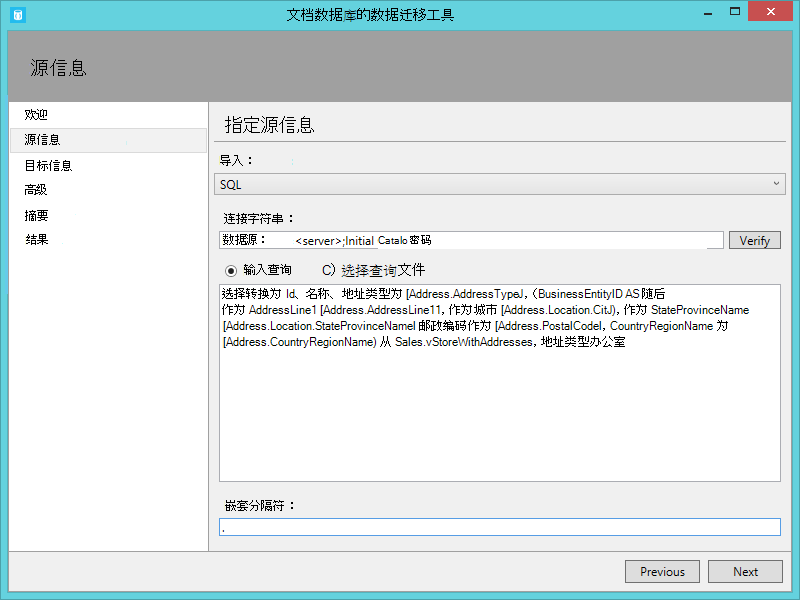
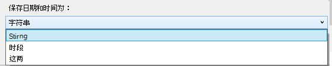

<properties
    pageTitle="为 DocumentDB 的数据库迁移工具 |Microsoft Azure"
    description="了解如何使用开放源代码 DocumentDB 数据迁移工具将数据从各种来源包括 MongoDB，SQL Server、 表存储、 Amazon DynamoDB，CSV 和 JSON 文件导入 DocumentDB。 JSON 转换为 CSV。"
    keywords="为 json，数据库迁移工具，csv 转换为 json 的 csv"
    services="documentdb"
    authors="andrewhoh"
    manager="jhubbard"
    editor="monicar"
    documentationCenter=""/>

<tags
    ms.service="documentdb"
    ms.workload="data-services"
    ms.tgt_pltfrm="na"
    ms.devlang="na"
    ms.topic="article"
    ms.date="10/06/2016"
    ms.author="anhoh"/>

# 使用数据库迁移工具将数据导入 DocumentDB

这篇文章演示了如何使用正式开放源代码 DocumentDB 数据迁移工具将数据导入到[Microsoft Azure DocumentDB](https://azure.microsoft.com/services/documentdb/)从各种来源，包括 JSON 文件、 CSV 文件、 SQL、 MongoDB，Azure 表存储、 Amazon DynamoDB 和 DocumentDB 集合。

阅读这篇文章之后, 您将能够回答以下问题︰  

-   如何可以导入 JSON 文件、 CSV 文件或 SQL Server 数据，MongoDB 数据到 DocumentDB？
-   如何可以导入数据从 Azure 表存储、 Amazon DynamoDB 和 HBase 到 DocumentDB？
-   如何将 DocumentDB 集合之间的数据迁移？

##系统必备组件

在这篇文章中的说明进行操作之前，确保您已经安装了以下产品︰

- [Microsoft.NET Framework 4.51](https://www.microsoft.com/download/developer-tools.aspx)或更高版本。

##DocumentDB 数据迁移工具概述

DocumentDB 数据迁移工具是开放源码解决方案，将数据导入 DocumentDB，从各种来源，包括︰

- JSON 文件
- MongoDB
- SQL Server
- CSV 文件
- Azure 表存储
- Amazon DynamoDB
- HBase
- DocumentDB 集合

导入工具包括一个图形用户界面 (dtui.exe)，同时还从命令行 (dt.exe) 驱动。 事实上，没有一个选项来设置通过用户界面导入后输出相关联的命令。 可以转换表格源的数据 （例如 SQL Server 或 CSV 文件），以便可以在导入期间创建层次关系 （子）。 继续阅读以了解有关源选项，示例命令行可导入每个源、 目标选项和查看导入结果。

##安装 DocumentDB 数据迁移工具

迁移工具源代码是在 GitHub 上[此存储库](https://github.com/azure/azure-documentdb-datamigrationtool)中可用，可以从[Microsoft 下载中心](http://www.microsoft.com/downloads/details.aspx?FamilyID=cda7703a-2774-4c07-adcc-ad02ddc1a44d)的已编译的版本。 您可以编译解决方案或只需下载并解压到您选择的目录的已编译的版本。 然后运行︰

- **Dtui.exe**︰ 图形界面的工具版本
- **Dt.exe**︰ 此工具的命令行版本

##将 JSON 文件导入

JSON 文件源导入程序选项允许您导入一个或多个单个文档的 JSON 文件或 JSON 文件，每个都包含一个数组的 JSON 文档。 添加文件夹，其中包含要导入的 JSON 文件，必须以递归方式搜索子文件夹中文件的选项。

下面是一些命令行示例导入 JSON 文件︰

    #Import a single JSON file
    dt.exe /s:JsonFile /s.Files:.\Sessions.json /t:DocumentDBBulk /t.ConnectionString:"AccountEndpoint=<DocumentDB Endpoint>;AccountKey=<DocumentDB Key>;Database=<DocumentDB Database>;" /t.Collection:Sessions /t.CollectionThroughput:2500

    #Import a directory of JSON files
    dt.exe /s:JsonFile /s.Files:C:\TESessions\*.json /t:DocumentDBBulk /t.ConnectionString:" AccountEndpoint=<DocumentDB Endpoint>;AccountKey=<DocumentDB Key>;Database=<DocumentDB Database>;" /t.Collection:Sessions /t.CollectionThroughput:2500

    #Import a directory (including sub-directories) of JSON files
    dt.exe /s:JsonFile /s.Files:C:\LastFMMusic\**\*.json /t:DocumentDBBulk /t.ConnectionString:" AccountEndpoint=<DocumentDB Endpoint>;AccountKey=<DocumentDB Key>;Database=<DocumentDB Database>;" /t.Collection:Music /t.CollectionThroughput:2500

    #Import a directory (single), directory (recursive), and individual JSON files
    dt.exe /s:JsonFile /s.Files:C:\Tweets\*.*;C:\LargeDocs\**\*.*;C:\TESessions\Session48172.json;C:\TESessions\Session48173.json;C:\TESessions\Session48174.json;C:\TESessions\Session48175.json;C:\TESessions\Session48177.json /t:DocumentDBBulk /t.ConnectionString:"AccountEndpoint=<DocumentDB Endpoint>;AccountKey=<DocumentDB Key>;Database=<DocumentDB Database>;" /t.Collection:subs /t.CollectionThroughput:2500

    #Import a single JSON file and partition the data across 4 collections
    dt.exe /s:JsonFile /s.Files:D:\\CompanyData\\Companies.json /t:DocumentDBBulk /t.ConnectionString:"AccountEndpoint=<DocumentDB Endpoint>;AccountKey=<DocumentDB Key>;Database=<DocumentDB Database>;" /t.Collection:comp[1-4] /t.PartitionKey:name /t.CollectionThroughput:2500

##从 MongoDB 导入

MongoDB 源导入选项允许您从一个单个的 MongoDB 集合导入和选择性地筛选使用一个查询的文档和/或使用投影修改文档结构。  

连接字符串是以标准的 MongoDB 格式︰

    mongodb://<dbuser>:<dbpassword>@<host>:<port>/<database>

> [AZURE.NOTE] 使用验证命令以确保可以访问在连接字符串字段中指定的 MongoDB 实例。

输入要导入的数据的集合的名称。 您还可以选择指定的智能标记或为查询提供一个文件 (如 {pop: {$gt: 5000}}) 和/或投影 (例如 {loc:0}) 来筛选和形状要导入的数据。

下面是从 MongoDB 导入某些命令行示例︰

    #Import all documents from a MongoDB collection
    dt.exe /s:MongoDB /s.ConnectionString:mongodb://<dbuser>:<dbpassword>@<host>:<port>/<database> /s.Collection:zips /t:DocumentDBBulk /t.ConnectionString:"AccountEndpoint=<DocumentDB Endpoint>;AccountKey=<DocumentDB Key>;Database=<DocumentDB Database>;" /t.Collection:BulkZips /t.IdField:_id /t.CollectionThroughput:2500

    #Import documents from a MongoDB collection which match the query and exclude the loc field
    dt.exe /s:MongoDB /s.ConnectionString:mongodb://<dbuser>:<dbpassword>@<host>:<port>/<database> /s.Collection:zips /s.Query:{pop:{$gt:50000}} /s.Projection:{loc:0} /t:DocumentDBBulk /t.ConnectionString:"AccountEndpoint=<DocumentDB Endpoint>;AccountKey=<DocumentDB Key>;Database=<DocumentDB Database>;" /t.Collection:BulkZipsTransform /t.IdField:_id/t.CollectionThroughput:2500

##MongoDB 导出文件导入

MongoDB 导出 JSON 文件源导入程序选项允许您导入一个或多个从 mongoexport 实用程序生成的 JSON 文件。  

添加文件夹，其中包含 MongoDB 导出 JSON 文件导入，可以以递归方式搜索子文件夹中文件的选项。

下面是从 MongoDB 导出 JSON 文件中导入一个命令行示例︰

    dt.exe /s:MongoDBExport /s.Files:D:\mongoemployees.json /t:DocumentDBBulk /t.ConnectionString:"AccountEndpoint=<DocumentDB Endpoint>;AccountKey=<DocumentDB Key>;Database=<DocumentDB Database>;" /t.Collection:employees /t.IdField:_id /t.Dates:Epoch /t.CollectionThroughput:2500

##从 SQL Server 导入

SQL 源导入程序选项允许您从单独的 SQL Server 数据库中导入并选择筛选要导入使用查询的记录。 此外，您可以通过指定嵌套分隔符 （详见片刻） 修改的文档结构。  

连接字符串的格式是标准 SQL 连接字符串的格式。

> [AZURE.NOTE] 使用验证命令以确保可以访问在连接字符串字段中指定的 SQL Server 实例。

嵌套的分隔符属性用于在导入过程中创建层次关系 （子文档）。 请考虑下面的 SQL 查询︰

*与 Id、 名称、 地址键入作为 [Address.AddressType]、 [Address.AddressLine1] 为 AddressLine1、 [Address.Location.City] 为城市、 [Address.Location.StateProvinceName] 为 StateProvinceName、 邮政编码为 [Address.PostalCode]、 [Address.CountryRegionName] 为 CountryRegionName Sales.vStoreWithAddresses，地址类型从选择强制转换 (BusinessEntityID AS varchar) = 主办公室*

它返回 （部分） 结果如下︰

请注意 Address.AddressType 和 Address.Location.StateProvinceName 等别名。 通过指定嵌套分隔符的 '。，导入工具导入过程中创建地址和 Address.Location 的子文档。 以下是 DocumentDB 中的生成文档的示例︰

*{"id":"956""Name":"更好地销售和服务"，"解决": {"地址类型":"主办公室"、"AddressLine1":"#500-75 O'Connor 街道"，"位置": {"城市":"渥太华"、"StateProvinceName":"安大略"}，"邮政编码":"CountryRegionName""K4B 1S2":"加拿大"}}*

下面是一些命令行示例，以从 SQL Server 中导入︰

    #Import records from SQL which match a query
    dt.exe /s:SQL /s.ConnectionString:"Data Source=<server>;Initial Catalog=AdventureWorks;User Id=advworks;Password=<password>;" /s.Query:"select CAST(BusinessEntityID AS varchar) as Id, * from Sales.vStoreWithAddresses WHERE AddressType='Main Office'" /t:DocumentDBBulk /t.ConnectionString:" AccountEndpoint=<DocumentDB Endpoint>;AccountKey=<DocumentDB Key>;Database=<DocumentDB Database>;" /t.Collection:Stores /t.IdField:Id /t.CollectionThroughput:2500

    #Import records from sql which match a query and create hierarchical relationships
    dt.exe /s:SQL /s.ConnectionString:"Data Source=<server>;Initial Catalog=AdventureWorks;User Id=advworks;Password=<password>;" /s.Query:"select CAST(BusinessEntityID AS varchar) as Id, Name, AddressType as [Address.AddressType], AddressLine1 as [Address.AddressLine1], City as [Address.Location.City], StateProvinceName as [Address.Location.StateProvinceName], PostalCode as [Address.PostalCode], CountryRegionName as [Address.CountryRegionName] from Sales.vStoreWithAddresses WHERE AddressType='Main Office'" /s.NestingSeparator:. /t:DocumentDBBulk /t.ConnectionString:" AccountEndpoint=<DocumentDB Endpoint>;AccountKey=<DocumentDB Key>;Database=<DocumentDB Database>;" /t.Collection:StoresSub /t.IdField:Id /t.CollectionThroughput:2500

##导入 CSV 文件-将转换为 JSON 的 CSV

CSV 文件源导入程序选项使您可以将一个或多个 CSV 文件导入。 在添加文件夹，其中包含要导入 CSV 文件时，您可以以递归方式搜索子文件夹中的文件的选择。

类似于 SQL 源，嵌套分隔符属性用于在导入期间创建层次关系 （子文档）。 行和数据行，请考虑下面的 CSV 标头︰

请注意 DomainInfo.Domain_Name 和 RedirectInfo.Redirecting 等别名。 通过指定嵌套分隔符的 '。，导入工具将导入期间创建 DomainInfo 和 RedirectInfo 的子文档。 以下是 DocumentDB 中的生成文档的示例︰

*{"DomainInfo": {"域名":"ACUS.GOV"、"Domain_Name_Address":"http://www.ACUS.GOV"}，"联邦机构":"管理会议的美国"、"RedirectInfo": {"重定向":"0"，"Redirect_Destination":""}，"id":"9cc565c5-ebcd-1c03-ebd3-cc3e2ecd814d"}*

导入工具会尝试推断 （用引号括起来的值都被视为字符串） 的不带引号值在 CSV 文件中的类型信息。  类型标识顺序如下︰ 编号、 日期、 布尔值。  

有两个其他需要注意的事项 CSV 导入︰

1.  默认情况下，不带引号的值始终为裁切的制表符和空格，而用引号括起来的值将按原样保留-是。 修剪用引号括起来的值复选框或使用 /s.TrimQuoted 命令行选项可覆盖这种行为。

2.  默认情况下，未加引号的空值将被视为 null 值。 可以重写此行为 （即被视为不带引号的空值"null"字符串） 将与不空带作为字符串复选框或使用 /s.NoUnquotedNulls 命令行选项。

这里是 CSV 导入命令行示例︰

    dt.exe /s:CsvFile /s.Files:.\Employees.csv /t:DocumentDBBulk /t.ConnectionString:"AccountEndpoint=<DocumentDB Endpoint>;AccountKey=<DocumentDB Key>;Database=<DocumentDB Database>;" /t.Collection:Employees /t.IdField:EntityID /t.CollectionThroughput:2500

##从 Azure 表存储中导入

Azure 表存储源导入程序选项允许您从各个 Azure 存储表导入并选择筛选要导入的表实体。  

Azure 表存储连接字符串的格式为︰

    DefaultEndpointsProtocol=<protocol>;AccountName=<Account Name>;AccountKey=<Account Key>;

> [AZURE.NOTE] 使用验证命令以确保可以访问在连接字符串字段中指定的 Azure 表存储实例。

输入 Azure 将从中导入数据的表的名称。 （可选） 您可以指定[筛选器](https://msdn.microsoft.com/library/azure/ff683669.aspx)。

Azure 表存储源导入程序选项具有以下附加选项︰

1. 包括内部字段
    2. All-包括所有内部域 （PartitionKey、 RowKey 和时间戳）
    3. 无-排除所有内部域
    4. RowKey-仅包含 RowKey 字段
3. 选择列
    1. Azure 表存储筛选器不支持的预测。 如果您想要只导入特定的 Azure 表实体属性，请将其添加到 [选中的列] 列表中。 所有其他实体属性将被忽略。

下面是从 Azure 表存储中导入一个命令行示例︰

    dt.exe /s:AzureTable /s.ConnectionString:"DefaultEndpointsProtocol=https;AccountName=<Account Name>;AccountKey=<Account Key>" /s.Table:metrics /s.InternalFields:All /s.Filter:"PartitionKey eq 'Partition1' and RowKey gt '00001'" /s.Projection:ObjectCount;ObjectSize  /t:DocumentDBBulk /t.ConnectionString:" AccountEndpoint=<DocumentDB Endpoint>;AccountKey=<DocumentDB Key>;Database=<DocumentDB Database>;" /t.Collection:metrics /t.CollectionThroughput:2500

##从 Amazon DynamoDB 导入

Amazon DynamoDB 源导入程序选项使您能够从单个 Amazon DynamoDB 表导入，或者筛选要导入的实体。 提供了几个模板，以便设置导入是尽可能简单。

Amazon DynamoDB 连接字符串的格式为︰

    ServiceURL=<Service Address>;AccessKey=<Access Key>;SecretKey=<Secret Key>;

> [AZURE.NOTE] 使用验证命令以确保可以访问在连接字符串字段中指定的 Amazon DynamoDB 实例。

下面是从 Amazon DynamoDB 导入一个命令行示例︰

    dt.exe /s:DynamoDB /s.ConnectionString:ServiceURL=https://dynamodb.us-east-1.amazonaws.com;AccessKey=<accessKey>;SecretKey=<secretKey> /s.Request:"{   """TableName""": """ProductCatalog""" }" /t:DocumentDBBulk /t.ConnectionString:"AccountEndpoint=<DocumentDB Endpoint>;AccountKey=<DocumentDB Key>;Database=<DocumentDB Database>;" /t.Collection:catalogCollection /t.CollectionThroughput:2500

##从 Azure Blob 存储导入的文件

JSON 文件，MongoDB 导出文件和 CSV 文件源导入程序选项允许您从 Azure Blob 存储导入一个或多个文件。 在指定后一个 Blob 容器 URL 以及帐户密钥，只需提供选择要导入的文件的正则表达式。

以下是从 Azure Blob 存储导入 JSON 文件的命令行示例︰

    dt.exe /s:JsonFile /s.Files:"blobs://<account key>@account.blob.core.windows.net:443/importcontainer/.*" /t:DocumentDBBulk /t.ConnectionString:"AccountEndpoint=<DocumentDB Endpoint>;AccountKey=<DocumentDB Key>;Database=<DocumentDB Database>;" /t.Collection:doctest

##DocumentDB 中的导入

DocumentDB 源导入程序选项允许您从一个或多个 DocumentDB 集合导入数据和 （可选） 筛选器使用一个查询的文档。  

DocumentDB 连接字符串的格式为︰

    AccountEndpoint=<DocumentDB Endpoint>;AccountKey=<DocumentDB Key>;Database=<DocumentDB Database>;

帐户连接字符串可从 Azure 门户的键刀片式服务器 DocumentDB，所述[如何管理 DocumentDB 帐户](documentdb-manage-account.md)，但是数据库的名称需要追加到连接字符串采用以下格式︰

    Database=<DocumentDB Database>;

> [AZURE.NOTE] 使用验证命令以确保可以访问在连接字符串字段中指定的 DocumentDB 实例。

要导入单个的 DocumentDB 集合中，输入要导入的数据的集合的名称。 要导入多个 DocumentDB 集合中，提供了一个正则表达式来匹配一个或多个集合的名称 (例如 collection01 | collection02 | collection03)。 （可选） 指定，也可以提供查询来筛选和形状的数据要导入的文件。

> [AZURE.NOTE] 由于集合字段接受的正则表达式，如果您要从单个名称中包含正则表达式字符集合导入，然后必须相应地转义这些字符。

DocumentDB 源导入程序选项具有下列高级的选项︰

1. 包括内部字段︰ 指定要包含在输出 （如 _rid、 _ts） DocumentDB 文档系统属性。
2. 失败时重试的次数︰ 指定重试连接到 DocumentDB 如果出现暂时性错误 （如网络连接中断） 的次数。
3. 重试间隔︰ 指定之间如果出现暂时性错误 （如网络连接中断） 到 DocumentDB 的连接重试等待多长时间。
4. 连接模式︰ 指定要使用 DocumentDB 连接模式。 可用的选项有︰ DirectTcp、 DirectHttps 和网关。 直接连接模式是更快，而网关模式是多个防火墙友好，因为它只使用端口 443。

> [AZURE.TIP] 导入工具将默认为 DirectTcp 连接模式。 如果您遇到防火墙问题，切换到连接模式网关，因为它只需要端口 443。

下面是从 DocumentDB 导入某些命令行示例︰

    #Migrate data from one DocumentDB collection to another DocumentDB collections
    dt.exe /s:DocumentDB /s.ConnectionString:"AccountEndpoint=<DocumentDB Endpoint>;AccountKey=<DocumentDB Key>;Database=<DocumentDB Database>;" /s.Collection:TEColl /t:DocumentDBBulk /t.ConnectionString:" AccountEndpoint=<DocumentDB Endpoint>;AccountKey=<DocumentDB Key>;Database=<DocumentDB Database>;" /t.Collection:TESessions /t.CollectionThroughput:2500

    #Migrate data from multiple DocumentDB collections to a single DocumentDB collection
    dt.exe /s:DocumentDB /s.ConnectionString:"AccountEndpoint=<DocumentDB Endpoint>;AccountKey=<DocumentDB Key>;Database=<DocumentDB Database>;" /s.Collection:comp1|comp2|comp3|comp4 /t:DocumentDBBulk /t.ConnectionString:"AccountEndpoint=<DocumentDB Endpoint>;AccountKey=<DocumentDB Key>;Database=<DocumentDB Database>;" /t.Collection:singleCollection /t.CollectionThroughput:2500

    #Export a DocumentDB collection to a JSON file
    dt.exe /s:DocumentDB /s.ConnectionString:"AccountEndpoint=<DocumentDB Endpoint>;AccountKey=<DocumentDB Key>;Database=<DocumentDB Database>;" /s.Collection:StoresSub /t:JsonFile /t.File:StoresExport.json /t.Overwrite /t.CollectionThroughput:2500

##从 HBase 导入

HBase 源导入程序选项允许您从一个 HBase 表导入数据，并可以选择筛选数据。 提供了几个模板，以便设置导入是尽可能简单。

HBase Stargate 连接字符串的格式为︰

    ServiceURL=<server-address>;Username=<username>;Password=<password>

> [AZURE.NOTE] 使用验证命令以确保可以访问在连接字符串字段中指定的 HBase 实例。

下面是从 HBase 中导入一个命令行示例︰

    dt.exe /s:HBase /s.ConnectionString:ServiceURL=<server-address>;Username=<username>;Password=<password> /s.Table:Contacts /t:DocumentDBBulk /t.ConnectionString:"AccountEndpoint=<DocumentDB Endpoint>;AccountKey=<DocumentDB Key>;Database=<DocumentDB Database>;" /t.Collection:hbaseimport

##导入到 DocumentDB （批量导入）

DocumentDB 大容量导入程序允许您从任何可用的源选项，使用 DocumentDB 存储过程效率的导入。 该工具支持导入到一个单分区的 DocumentDB 集合，以及 sharded 的导入数据，从而使得跨多个单分区 DocumentDB 集合分区。 数据分区的详细信息，请参阅[分区和 Azure DocumentDB 中的缩放](documentdb-partition-data.md)。 该工具将创建、 执行，然后从目标 collection(s) 中删除该存储的过程。  

DocumentDB 连接字符串的格式为︰

    AccountEndpoint=<DocumentDB Endpoint>;AccountKey=<DocumentDB Key>;Database=<DocumentDB Database>;

帐户连接字符串可从 Azure 门户的键刀片式服务器 DocumentDB，所述[如何管理 DocumentDB 帐户](documentdb-manage-account.md)，但是数据库的名称需要追加到连接字符串采用以下格式︰

    Database=<DocumentDB Database>;

> [AZURE.NOTE] 使用验证命令以确保可以访问在连接字符串字段中指定的 DocumentDB 实例。

要导入到单个集合，输入的数据将被导入并单击添加按钮集合的名称。 若要导入多个集合，请分别输入每个集合的名称或使用以下的语法来指定多个集合︰ *collection_prefix*[起始索引的结束索引]。 当指定通过上述语法的多个集合，请记住以下︰

1. 只有整数范围名称模式都受支持。 例如，指定集合 [0-3] 将产生以下集合︰ collection0，collection1，collection2，collection3。
2. 您可以使用缩略语︰ 集合 [3] 会发出一组相同的步骤 1 中提到的集合。
3. 可以提供多个替代。 例如，集合 [0-1] [0-9] 会生成 20 的集合名称，将使用前导零 (collection01，...02.03)。

已指定的集合名称，一旦选择的 collection(s) (400 RUs 到 10000 RUs) 所需的吞吐量。 最佳性能，请选择更高的吞吐量。 有关性能级别的详细信息，请参阅[DocumentDB 中的性能级别](documentdb-performance-levels.md)。

> [AZURE.NOTE] 性能吞吐量设置只适用于创建集。 如果指定的集合中已存在，则不能修改其吞吐量。

在导入到多个集合，则导入工具支持哈希基于分片。 在这种情况下，指定您想要使用分区键的文档属性 （如果分区键为空时，文档将 sharded 随机跨目标集合）。

（可选） 您可以指定哪些字段中导入源作 DocumentDB 文档 id 属性 （请注意，如果文档不包含该属性，然后导入工具将生成一个 GUID 作为 id 属性的值） 在导入过程。

导入过程中可用的大量的高级选项。 第一，而该工具包括默认批量导入的存储的过程 (BulkInsert.js)，您可以指定您自己的导入存储过程︰

 

此外时 （如在 SQL Server 或 MongoDB） 导入日期类型，, 您可以选择导入的三个选项︰

 

-   作为一个字符串值，保持字符串︰
-   作为纪元数字值保持时段︰
-   两者︰ 保留字符串和日期的数值。 此选项将创建一个子文档，例如:"date_joined": {"值":"2013年-10-21T21:17:25.2410000Z"、"日期": 1382390245}

DocumentDB 大容量导入程序具有下列附加的高级选项︰

1. 批处理︰ 工具默认大小为 50 批次大小。  如果要导入的文档很大，请考虑降低批数据的大小。 相反，如果要导入的文档较小，应考虑引发的批处理大小。
2. 最大值脚本大小 （字节）︰ 该工具默认大小为 512 KB 的最大值的脚本为
3. 禁用自动生成 Id︰ 如果要导入的每个文档包含 id 字段，然后选择此选项可以提高性能。 缺少一个唯一的 id 字段的文档将不会导入。
4. 更新现有文档︰ 工具默认为不替换现有文档 id 冲突。 选择此选项将允许具有匹配 id 覆盖现有文档。 此功能可用于更新现有文档的计划的数据迁移。
5. 失败时重试的次数︰ 指定重试连接到 DocumentDB 如果出现暂时性错误 （如网络连接中断） 的次数。
6. 重试间隔︰ 指定之间如果出现暂时性错误 （如网络连接中断） 到 DocumentDB 的连接重试等待多长时间。
7. 连接模式︰ 指定要使用 DocumentDB 连接模式。 可用的选项有︰ DirectTcp、 DirectHttps 和网关。 直接连接模式是更快，而网关模式是多个防火墙友好，因为它只使用端口 443。

> [AZURE.TIP] 导入工具将默认为 DirectTcp 连接模式。 如果您遇到防火墙问题，切换到连接模式网关，因为它只需要端口 443。

##导入到 DocumentDB （顺序记录导入）

DocumentDB 连续记录导入程序允许您从任何可用的源选项在记录的基础上导入。 如果您要导入到现有地图收藏已达到其限额的存储过程，那么可以选择此选项。 该工具支持导入到单个 （单分区和多分区） 也为 sharded 的 DocumentDB 集合导入，数据跨多个单分区和/或多分区 DocumentDB 集合分区。 数据分区的详细信息，请参阅[分区和 Azure DocumentDB 中的缩放](documentdb-partition-data.md)。

DocumentDB 连接字符串的格式为︰

    AccountEndpoint=<DocumentDB Endpoint>;AccountKey=<DocumentDB Key>;Database=<DocumentDB Database>;

帐户连接字符串可从 Azure 门户的键刀片式服务器 DocumentDB，所述[如何管理 DocumentDB 帐户](documentdb-manage-account.md)，但是数据库的名称需要追加到连接字符串采用以下格式︰

    Database=<DocumentDB Database>;

> [AZURE.NOTE] 使用验证命令以确保可以访问在连接字符串字段中指定的 DocumentDB 实例。

要导入到单个集合，输入的数据将被导入并单击添加按钮集合的名称。 若要导入多个集合，请分别输入每个集合的名称或使用以下的语法来指定多个集合︰ *collection_prefix*[起始索引的结束索引]。 当指定通过上述语法的多个集合，请记住以下︰

1. 只有整数范围名称模式都受支持。 例如，指定集合 [0-3] 将产生以下集合︰ collection0，collection1，collection2，collection3。
2. 您可以使用缩略语︰ 集合 [3] 会发出一组相同的步骤 1 中提到的集合。
3. 可以提供多个替代。 例如，集合 [0-1] [0-9] 会生成 20 的集合名称，将使用前导零 (collection01，...02.03)。

已指定的集合名称，一旦选择的 collection(s) (为 250000 RUs 400 RUs) 所需的吞吐量。 最佳性能，请选择更高的吞吐量。 有关性能级别的详细信息，请参阅[DocumentDB 中的性能级别](documentdb-performance-levels.md)。 任何导入到收藏集以吞吐量 > 10000 RUs 需要分区键。 如果您选择有 250000 多个 RUs，[请求增加 DocumentDB 帐户限制](documentdb-increase-limits.md)，请参阅。

> [AZURE.NOTE] 吞吐量设置只适用于创建集。 如果指定的集合中已存在，则不能修改其吞吐量。

在导入到多个集合，则导入工具支持哈希基于分片。 在这种情况下，指定您想要使用分区键的文档属性 （如果分区键为空时，文档将 sharded 随机跨目标集合）。

（可选） 您可以指定哪些字段中导入源作 DocumentDB 文档 id 属性 （请注意，如果文档不包含该属性，然后导入工具将生成一个 GUID 作为 id 属性的值） 在导入过程。

导入过程中可用的大量的高级选项。 首先时 （如在 SQL Server 或 MongoDB） 导入日期类型，, 您可以选择导入的三个选项︰

 

-   作为一个字符串值，保持字符串︰
-   作为纪元数字值保持时段︰
-   两者︰ 保留字符串和日期的数值。 此选项将创建一个子文档，例如:"date_joined": {"值":"2013年-10-21T21:17:25.2410000Z"、"日期": 1382390245}

DocumentDB-顺序记录导入程序具有以下附加的高级的选项︰

1. 并行请求数︰ 该工具的默认值为 2 的并行请求。 如果要导入的文档较小，应考虑引发的并行请求的数量。 请注意，是否过多地引发了这个数字，导入可能会遇到限制。
2. 禁用自动生成 Id︰ 如果要导入的每个文档包含 id 字段，然后选择此选项可以提高性能。 缺少一个唯一的 id 字段的文档将不会导入。
3. 更新现有文档︰ 工具默认为不替换现有文档 id 冲突。 选择此选项将允许具有匹配 id 覆盖现有文档。 此功能可用于更新现有文档的计划的数据迁移。
4. 失败时重试的次数︰ 指定重试连接到 DocumentDB 如果出现暂时性错误 （如网络连接中断） 的次数。
5. 重试间隔︰ 指定之间如果出现暂时性错误 （如网络连接中断） 到 DocumentDB 的连接重试等待多长时间。
6. 连接模式︰ 指定要使用 DocumentDB 连接模式。 可用的选项有︰ DirectTcp、 DirectHttps 和网关。 直接连接模式是更快，而网关模式是多个防火墙友好，因为它只使用端口 443。

> [AZURE.TIP] 导入工具将默认为 DirectTcp 连接模式。 如果您遇到防火墙问题，切换到连接模式网关，因为它只需要端口 443。

##当创建 DocumentDB 集合指定索引创建策略

如果您允许迁移工具导入过程中创建集合时，您可以指定集合的索引策略。 在高级选项部分中的 DocumentDB 批量导入，然后 DocumentDB 连续记录选项，定位到索引策略部分。

使用高级选项的索引策略，您可以选择索引的策略文件，手动输入索引创建策略，或选择从一组默认模板 （通过右键单击索引策略文本框中）。

该工具提供策略模板包括︰

- 默认值。 是相等对执行查询字符串和数字使用 ORDER BY、 范围和相等的查询时，此策略是最好的。 该策略具有较低的索引存储开销比范围。
- 范围。 此策略最好在您 ORDER BY，范围和相等的查询上使用数字和字符串。 该策略具有较高的索引存储开销，不是默认或哈希处理。

> [AZURE.NOTE] 如果不指定索引创建策略，则将应用默认策略。 有关索引创建策略的详细信息，请参阅[DocumentDB 索引创建策略](documentdb-indexing-policies.md)。

## 将导出到 JSON 文件

DocumentDB JSON 导出程序允许您将任何可用的源选项导出到 JSON 文件包含的 JSON 文档的数组。 该工具将处理，导出，也可以选择查看产生的迁移命令和运行命令自己。 生成的 JSON 文件可能会存储在本地或在 Azure Blob 存储。

您可以选择 prettify 生成 JSON，从而提高所得到的文档的大小同时使内容更多人类可读。

    Standard JSON export
    [{"id":"Sample","Title":"About Paris","Language":{"Name":"English"},"Author":{"Name":"Don","Location":{"City":"Paris","Country":"France"}},"Content":"Don's document in DocumentDB is a valid JSON document as defined by the JSON spec.","PageViews":10000,"Topics":[{"Title":"History of Paris"},{"Title":"Places to see in Paris"}]}]

    Prettified JSON export
    [
    {
    "id": "Sample",
    "Title": "About Paris",
    "Language": {
      "Name": "English"
    },
    "Author": {
      "Name": "Don",
      "Location": {
        "City": "Paris",
        "Country": "France"
      }
    },
    "Content": "Don's document in DocumentDB is a valid JSON document as defined by the JSON spec.",
    "PageViews": 10000,
    "Topics": [
      {
        "Title": "History of Paris"
      },
      {
        "Title": "Places to see in Paris"
      }
    ]
    }]

## 高级的配置

在高级的配置屏幕中，指定您希望编写任何错误日志文件的位置。 下列规则适用于此页︰

1.  如果未提供文件的名称，然后将在结果页上返回的所有错误。
2.  如果没有目录提供了一个文件名，然后文件将被创建 （或覆盖） 当前环境目录中。
3.  如果选择现有文件，则该文件将被覆盖，没有附加的选项。

然后，选择是否记录了所有，严重的或者不显示错误信息。 最后，决定在屏幕传输消息与它进行更新的频率。

    

## 确认导入设置并查看命令行

1. 后指定源信息和目标信息，高级的配置，查看迁移摘要，也可以查看/复制产生的迁移命令 （复制命令可用于自动执行导入操作）︰

    

    

2. 一旦您的源和目标选项满意后，单击**导入**。 因为导入过程中，将更新时间、 转移的计数和故障信息 （如果未提供的高级配置文件名称）。 完成后，您可以将导出的结果 (例如处理任何导入失败)。

    

3. 也可以启动新的导入，保留现有的设置 （如连接字符串信息，源和目标选择，等等），或者重新设置所有值。

    

## 下一步行动

- 若要了解有关 DocumentDB 的详细信息，请参阅[学习路线图](https://azure.microsoft.com/documentation/learning-paths/documentdb/)。
