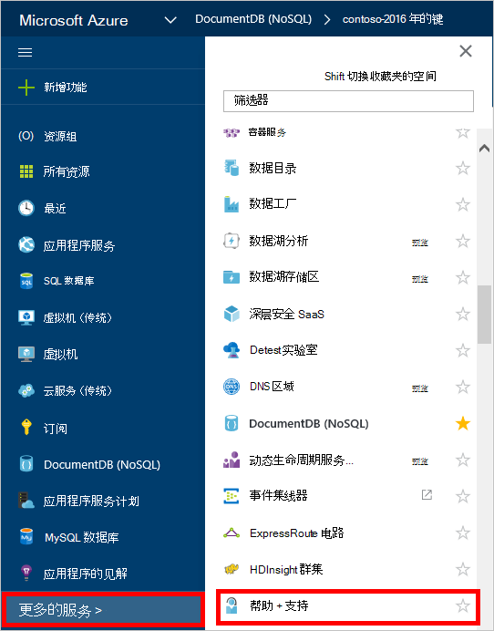
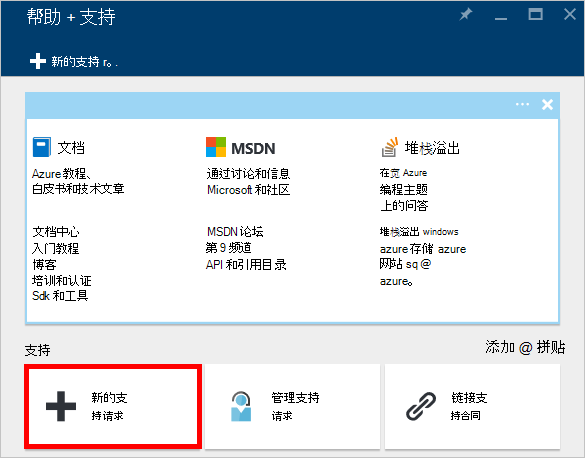
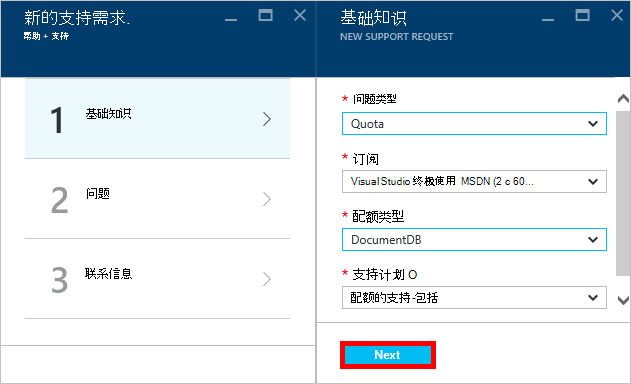
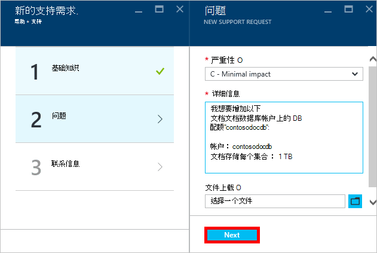
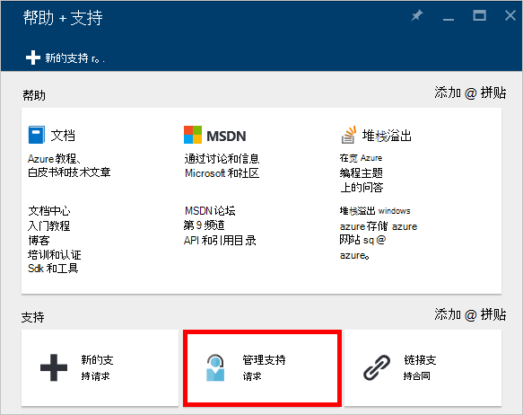

<properties
    pageTitle="请求增加 DocumentDB 帐户配额 |Microsoft Azure"
    description="了解如何申请对如文档存储和每个集合的吞吐量 DocumentDB 数据库配额的调整。"
    services="documentdb"
    authors="AndrewHoh"
    manager="jhubbard"
    editor="monicar"
    documentationCenter=""/>

<tags
    ms.service="documentdb"
    ms.workload="data-services"
    ms.tgt_pltfrm="na"
    ms.devlang="na"
    ms.topic="article"
    ms.date="08/25/2016"
    ms.author="anhoh"/>

# 请求增加的 DocumentDB 帐户限制

[Microsoft Azure DocumentDB](https://azure.microsoft.com/services/documentdb/)有一组默认的配额，可以通过联系 Azure 支持调整。  本文介绍如何申请的配额提高。

阅读这篇文章之后, 您将能够回答以下问题︰  

-   可以通过联系 Azure 支持调整 DocumentDB 数据库配额？
-   如何请求 DocumentDB 帐户配额调整？

##DocumentDB 帐户配额

下表描述了 DocumentDB 配额。 可以通过联系 Azure 支持调整有一个星号 （*） 的配额︰

[AZURE.INCLUDE [azure-documentdb-limits](../../includes/azure-documentdb-limits.md)]

##申请配额调整
下面的步骤演示如何申请配额调整。

1. 在[Azure 的门户](https://portal.azure.com)中，单击**其他服务**，然后单击**帮助 + 支持**。

    

2. 在**帮助 + 支持**刀片式服务器，请单击**新建支持请求**。

    

3. 在**请求的新支持**刀片式服务器，单击**基础知识**。 接下来，将**问题类型**到**配额**，**订阅**订阅承载您的 DocumentDB 帐户，**配额类型**设置为**DocumentDB**和**配额支持 — 包括****支持计划**。 然后，单击**下一步**。

    

4. 在**问题**刀片式服务器，选择严重性和**详细信息**中包含有关配额增加。 单击**下一步**。

    

5. 最后，填写您的联系信息中**的联系人信息**刀片式服务器并单击**创建**。

一旦创建了支持票，您将收到通过电子邮件的支持请求号码。  您还可以通过单击**帮助 + 支持**的刀片式服务器中的**管理支持请求**查看支持请求。

##下一步行动
- 若要了解有关 DocumentDB 的详细信息，请单击[此处](http://azure.com/docdb)。
