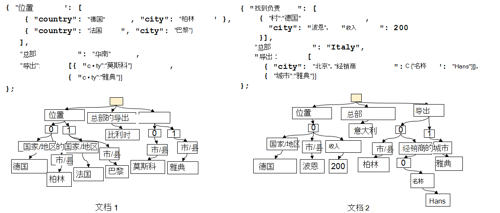
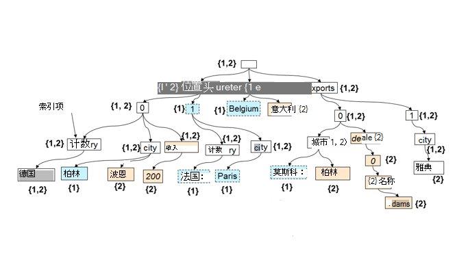

<properties 
    pageTitle="在 DocumentDB 中的自动索引 |Microsoft Azure" 
    description="了解如何自动索引工作在 Azure DocumentDB。" 
    services="documentdb" 
    authors="arramac" 
    manager="jhubbard" 
    editor="mimig" 
    documentationCenter=""/>

<tags 
    ms.service="documentdb" 
    ms.workload="data-services" 
    ms.tgt_pltfrm="na" 
    ms.devlang="na" 
    ms.topic="article" 
    ms.date="10/27/2016" 
    ms.author="arramac"/>
    
# 自动索引在 Azure DocumentDB

这篇文章节选["架构不可知索引使用 Azure DocumentDB"](http://www.vldb.org/pvldb/vol8/p1668-shukla.pdf)白皮书中，将会显示在[41st 的内部会议上非常大的数据库](http://www.vldb.org/2015/)之间 8 月 31 日-2015，9 月 4 日，正在研究如何引入索引在 Azure DocumentDB 的工作原理。 

在阅读本文之后, 您将回答以下问题︰

- DocumentDB 是如何推断从 JSON 文档架构的？
- 如何 DocumentDB does 跨不同的文档建立索引？
- DocumentDB 如何执行在规模较大的自动索引？

##DocumentDB 索引的工作原理

[Microsoft Azure DocumentDB](https://azure.microsoft.com/services/documentdb/)是真正无架构的数据库专门为 JSON。 不期望或要求任何架构或在规模较大的索引数据的辅助索引定义。 这使您可以快速定义并循环访问应用程序数据模型中使用 DocumentDB。 当您将文档添加到集合中，DocumentDB 自动索引所有文档属性，以便它们可为您提供给查询。 自动索引允许您存储属于完全任意架构而不用担心架构或辅助索引的文档。

目标是要消除的数据库和应用程序的编程模型之间的阻抗不匹配，与 DocumentDB 利用 JSON 的简单性，它没有架构规范。 它不作出任何假设文档，并允许在架构，并了解特定实例的值在改变一个 DocumentDB 集合中的文档。 与其他文档数据库，DocumentDB 的数据库引擎直接级别运行的 JSON 语法，剩余不可知的文档架构的概念和模糊之间的文档的结构和实例值的边界。 此中, 圈，使它与自动索引文档而无需架构或辅助索引。

在 DocumentDB 中索引利用 JSON 语法允许文档被**表示为树**的事实。 等待 JSON 文档表示为树，需要其父母的实际节点下面的文档的其余部分创建虚拟根节点。 JSON 文档中包括数组索引每个标签将成为树的一个节点。 下图显示了一个示例 JSON 文档和其相应的树表示形式。

>[AZURE.NOTE] 由于 JSON 是自我描述即每个文档包含架构 （元数据） 和数据，例如`{"locationId": 5, "city": "Moscow"}`可以发现有两个属性`locationId`， `city`，并且它们具有数值和字符串的属性值。 DocumentDB 是能够推断架构的文档并插入或替换，而无需您以往任何时候都无需定义架构或辅助索引时对它们进行索引。

**作为树的 JSON 文档︰**

例如，在上面所示的示例︰

- JSON 属性`{"headquarters": "Belgium"}`在上面的示例的属性对应于路径/总部/比利时。
- JSON 数组`{"exports": [{"city": “Moscow"}`，`{"city": Athens"}]}`对应路径`/exports/[]/city/Moscow`， `/exports/[]/city/Athens`。

使用自动索引，(1) （除非开发人员具有显式配置的索引策略中排除特定路径模式） 进行索引的文档树中的每个路径。 （2） 每个更新的 DocumentDB 集合的文档会导致更新结构的索引 （即原因添加或删除节点）。 自动索引的文档的主要要求之一是确保索引和查询具有深层嵌套结构的文档中，说出 10 个级别的成本，相同的键 / 值对一个级别深度所组成的平面的 JSON 文档。 因此规范化的路径表示形式是依据两个自动索引和查询子系统构建的基础。

处理两个重要含意统一的路径的架构和实例的值是逻辑上，只是与单个文档，显示，保存路径之间的映射的两个文档的索引，包含该路径的文档 id 还可以表示为树。 DocumentDB 使用这一事实来生成索引树，它表示集合中的单个文档的树全都被构造。 在 DocumentDB 集合中的索引树将随着随着时间的推移添加或更新到集合的新文档。

**DocumentDB 作为树的索引︰**

尽管架构自由，DocumentDB 的 SQL 和 JavaScript 查询语言提供关系预测和筛选器、 分层浏览整个文档、 空间操作和调用 Udf 完全用 JavaScript 编写。 DocumentDB 的查询运行时能够支持这些查询，因为它可以直接对该树形式表示的数据的索引操作。

默认的索引策略自动索引的所有文档的所有属性，并提供一致的查询 （即具有文档写入同步更新索引）。 DocumentDB 是如何支持一致更新索引树在规模较大的？ DocumentDB 使用优化的写，免费的锁定和日志结构化的索引维护技术。 这意味着 DocumentDB 可以支持持续的同时仍提供一致的查询的服务快速写入卷。 

DocumentDB 的索引的存储效率和处理多租户设计。 对于成本效率、 索引的磁盘上的存储开销是低水平和可预测性。 索引更新也在系统资源分配给每个 DocumentDB 集合的预算范围内执行。

##下一步行动
- 下载["架构不可知索引使用 Azure DocumentDB"](http://www.vldb.org/pvldb/vol8/p1668-shukla.pdf)，表现上非常大的数据库，41st 内部大会 8 月 31 日-于 2015 年 9 月 4 日。
- [与 DocumentDB SQL 查询](documentdb-sql-query.md)
- 了解如何自定义 DocumentDB 索引[此处](documentdb-indexing-policies.md)
 
