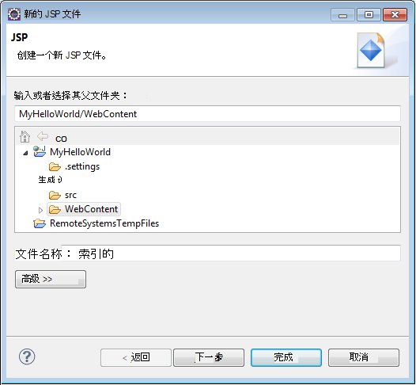
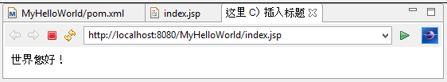

<properties
    pageTitle="Java 应用程序开发教程使用 DocumentDB |Microsoft Azure"
    description="此 Java web 应用程序教程演示了如何使用 Azure DocumentDB 服务来存储和访问托管在 Azure 网站上的 Java 应用程序中的数据。"
    keywords="应用程序开发、 数据库教程、 java 应用、 java web 应用程序教程、 documentdb、 azure、 Microsoft azure"
    services="documentdb"
    documentationCenter="java"
    authors="dennyglee"
    manager="jhubbard"
    editor="mimig"/>

<tags
    ms.service="documentdb"
    ms.devlang="java"
    ms.topic="hero-article"
    ms.tgt_pltfrm="NA"
    ms.workload="data-services"
    ms.date="08/24/2016"
    ms.author="denlee"/>

# 生成 Java web 应用程序使用 DocumentDB

> [AZURE.SELECTOR]
- [.NET](documentdb-dotnet-application.md)
- [Node.js](documentdb-nodejs-application.md)
- [Java](documentdb-java-application.md)
- [Python](documentdb-python-application.md)

此 Java web 应用程序教程演示了如何使用[Microsoft Azure DocumentDB](https://portal.azure.com/#gallery/Microsoft.DocumentDB)服务来存储和访问托管在 Azure 网站上的 Java 应用程序中的数据。 在本主题中，您将学习︰

- 如何构建 Eclipse 中的基本 JSP 应用程序。
- 如何使用[DocumentDB Java SDK](https://github.com/Azure/azure-documentdb-java)的 Azure DocumentDB 服务与合作。

此 Java 应用程序教程演示如何创建一个基于 web 的任务管理应用程序，您可以创建、 检索和将任务标记为已完成，，如下图中所示。 每个 ToDo 列表中的任务存储为 Azure DocumentDB 中的 JSON 文档。

> [AZURE.TIP] 此应用程序开发教程假定您使用 Java 的经验。 如果您不熟悉 Java 或[必备的工具](#Prerequisites)，我们建议从 GitHub 下载完整的[todo](https://github.com/Azure-Samples/documentdb-java-todo-app)项目并将其使用[在本文末尾的说明](#GetProject)建设。 它内置了，您可以查看本文深入了解项目的上下文中的代码。  

##此 Java web 应用程序教程的先决条件
此应用程序开发教程之前，您必须如下︰

- 活动的 Azure 帐户。 如果您没有帐户，您可以在几分钟创建免费的试用帐户。 有关详细信息，请参阅[Azure 免费试用版](https://azure.microsoft.com/pricing/free-trial/)。
- [Java 开发工具箱 (JDK) 7 +](http://www.oracle.com/technetwork/java/javase/downloads/index.html)。
- [日蚀式的 Java EE 开发 IDE。](http://www.eclipse.org/downloads/packages/eclipse-ide-java-ee-developers/lunasr1)
- [与 Java 运行时环境 （如 Tomcat 或 Jetty） 启用 Azure 网站。](../app-service-web/web-sites-java-get-started.md)

如果第一次安装这些工具，coreservlets.com 提供了在安装过程中的快速启动部分考察其[教程︰ 安装 TomCat7 并使用 Eclipse](http://www.coreservlets.com/Apache-Tomcat-Tutorial/tomcat-7-with-eclipse.html)文章。

##步骤 1︰ 创建一个 DocumentDB 数据库帐户

让我们首先创建一个 DocumentDB 帐户。 如果您已经有一个帐户，您可以跳到[步骤 2︰ 创建 Java JSP 应用程序](#CreateJSP)。

[AZURE.INCLUDE [documentdb-create-dbaccount](../../includes/documentdb-create-dbaccount.md)]

[AZURE.INCLUDE [documentdb-keys](../../includes/documentdb-keys.md)]

##步骤 2︰ 创建 Java JSP 应用程序

若要创建 JSP 应用程序︰

1. 首先，我们将首先创建一个 Java 项目。 启动 Eclipse，然后单击**文件**，单击**新建**，然后单击**动态 Web 项目**。 如果您看不到**动态 Web 项目**列为可用的项目，执行以下操作︰ 单击**文件**，单击**新建**、...单击**项目**，展开**Web**、**动态 Web 项目**，请单击，单击**下一步**。

    

2. 在**项目名称**框中，并在**目标运行时**下拉列表菜单中输入项目名称 （可选） 选择一个值 (如 Apache Tomcat v7.0)，然后单击**完成**。 选择目标运行时使您能够通过 Eclipse 中本地运行您的项目。
3. 在 Eclipse 中，在项目资源管理器视图中，展开您的项目。 用鼠标右键单击**网站**，单击**新建**，然后单击**JSP 文件**。
4. 在**新的 JSP 文件**对话框中，命名文件**index.jsp**。 下面的插图所示**网站**，作为保持其父文件夹，然后单击**下一步**。

    

5. 在**选择 JSP 模板**对话框中，出于本教程的目的选择**新的 JSP 文件 (html)**，，然后单击**完成**。

6. 当 index.jsp 文件打开在 Eclipse 中时，添加要显示的文字**Hello World ！** 在现有的<body>元素。 您更新<body>内容应类似于下面的代码︰

        <body>
            <% out.println("Hello World!"); %>
        </body>

8. 保存 index.jsp 文件。
9. 如果您在步骤 2 中设置目标运行时，您可以单击**项目**，然后**运行**您的 JSP 应用程序在本地运行︰

    

##步骤 3︰ 将安装 DocumentDB Java SDK ##

拉中 DocumentDB Java SDK 及其依赖项的最简单方法是通过[Apache Maven](http://maven.apache.org/)。

若要执行此操作，需要将项目转换为 maven 项目，通过完成以下步骤︰

1. 用鼠标右键单击您的项目在项目资源管理器中，**配置**请单击**将转换为 Maven 项目**。
2. 在**创建新 POM**窗口中，接受默认设置并单击**完成**。
3. 在**项目资源管理器**，打开 pom.xml 文件。
4. 在**依赖项**选项卡中**相关性**窗格中，单击**添加**。
4. 在**选择依赖项**窗口中，执行下列操作︰
 - 在**GroupId**框中，输入 com.microsoft.azure。
 - 在**项目 Id**框中输入 azure documentdb。
 - 在**版本**框中输入 1.5.1。

    

    或者直接到通过文本编辑器 pom.xml GroupId 和 ArtifactId 添加依赖项的 XML:

        <dependency>
            <groupId>com.microsoft.azure</groupId>
            <artifactId>azure-documentdb</artifactId>
            <version>1.5.1</version>
        </dependency>

5. 单击**确定**并 Maven 将安装 DocumentDB Java SDK。
6. 保存 pom.xml 文件。

##步骤 4︰ 在 Java 应用程序中使用 DocumentDB 服务

1. 首先，让我们定义的 TodoItem 对象︰

        @Data
        @Builder
        public class TodoItem {
            private String category;
            private boolean complete;
            private String id;
            private String name;
        }

    在此项目中，我们将使用[项目 Lombok](http://projectlombok.org/)生成的构造函数，getter、 资源库，并且生成器。 或者，可以手动编写此代码也可以让 IDE 生成它。

2. 若要调用 DocumentDB 服务，您必须实例化新的**DocumentClient**。 一般情况下，最好以重复使用**DocumentClient** -而不是构建新的客户机对于每个后续请求。 我们可以通过在**DocumentClientFactory**中包装客户端重用客户端。 这也是需要粘贴 URI 和主键的值保存到您在[步骤 1](#CreateDB)中的剪贴板。 替换 [您\_端点\_这里] 与 URI 和替换 [您\_键\_这里] 与主键。

        private static final String HOST = "[YOUR_ENDPOINT_HERE]";
        private static final String MASTER_KEY = "[YOUR_KEY_HERE]";

        private static DocumentClient documentClient;

        public static DocumentClient getDocumentClient() {
            if (documentClient == null) {
                documentClient = new DocumentClient(HOST, MASTER_KEY,
                        ConnectionPolicy.GetDefault(), ConsistencyLevel.Session);
            }

            return documentClient;
        }

3. 现在让我们创建抽象保持我们 ToDo 项添加到 DocumentDB 的数据访问对象 (DAO)。

    为了将 ToDo 项保存到集合中，客户端需要知道哪些数据库和集合来保持到 （引用自链接）。 一般情况下，最好以缓存的数据库和集合时可以避免其他往返数据库。

    下面的代码演示如何检索数据库和集合中，如果它存在，或如果它不存在，则创建一个新︰

        public class DocDbDao implements TodoDao {
            // The name of our database.
            private static final String DATABASE_ID = "TodoDB";

            // The name of our collection.
            private static final String COLLECTION_ID = "TodoCollection";

            // The DocumentDB Client
            private static DocumentClient documentClient = DocumentClientFactory
                    .getDocumentClient();

            // Cache for the database object, so we don't have to query for it to
            // retrieve self links.
            private static Database databaseCache;

            // Cache for the collection object, so we don't have to query for it to
            // retrieve self links.
            private static DocumentCollection collectionCache;

            private Database getTodoDatabase() {
                if (databaseCache == null) {
                    // Get the database if it exists
                    List<Database> databaseList = documentClient
                            .queryDatabases(
                                    "SELECT * FROM root r WHERE r.id='" + DATABASE_ID
                                            + "'", null).getQueryIterable().toList();

                    if (databaseList.size() > 0) {
                        // Cache the database object so we won't have to query for it
                        // later to retrieve the selfLink.
                        databaseCache = databaseList.get(0);
                    } else {
                        // Create the database if it doesn't exist.
                        try {
                            Database databaseDefinition = new Database();
                            databaseDefinition.setId(DATABASE_ID);

                            databaseCache = documentClient.createDatabase(
                                    databaseDefinition, null).getResource();
                        } catch (DocumentClientException e) {
                            // TODO: Something has gone terribly wrong - the app wasn't
                            // able to query or create the collection.
                            // Verify your connection, endpoint, and key.
                            e.printStackTrace();
                        }
                    }
                }

                return databaseCache;
            }

            private DocumentCollection getTodoCollection() {
                if (collectionCache == null) {
                    // Get the collection if it exists.
                    List<DocumentCollection> collectionList = documentClient
                            .queryCollections(
                                    getTodoDatabase().getSelfLink(),
                                    "SELECT * FROM root r WHERE r.id='" + COLLECTION_ID
                                            + "'", null).getQueryIterable().toList();

                    if (collectionList.size() > 0) {
                        // Cache the collection object so we won't have to query for it
                        // later to retrieve the selfLink.
                        collectionCache = collectionList.get(0);
                    } else {
                        // Create the collection if it doesn't exist.
                        try {
                            DocumentCollection collectionDefinition = new DocumentCollection();
                            collectionDefinition.setId(COLLECTION_ID);

                            collectionCache = documentClient.createCollection(
                                    getTodoDatabase().getSelfLink(),
                                    collectionDefinition, null).getResource();
                        } catch (DocumentClientException e) {
                            // TODO: Something has gone terribly wrong - the app wasn't
                            // able to query or create the collection.
                            // Verify your connection, endpoint, and key.
                            e.printStackTrace();
                        }
                    }
                }

                return collectionCache;
            }
        }

4. 下一步是编写一些代码来持久保存到该集合中的 TodoItems。 在此示例中，我们将使用[Gson](https://code.google.com/p/google-gson/)进行序列化和反序列化 TodoItem 普通旧 Java 对象 (Pojo)，到 JSON 文档。 [柳荫](http://jackson.codehaus.org/)或您自己的自定义序列化程序也会以序列化 Pojo 好替代方案。

        // We'll use Gson for POJO <=> JSON serialization for this example.
        private static Gson gson = new Gson();

        @Override
        public TodoItem createTodoItem(TodoItem todoItem) {
            // Serialize the TodoItem as a JSON Document.
            Document todoItemDocument = new Document(gson.toJson(todoItem));

            // Annotate the document as a TodoItem for retrieval (so that we can
            // store multiple entity types in the collection).
            todoItemDocument.set("entityType", "todoItem");

            try {
                // Persist the document using the DocumentClient.
                todoItemDocument = documentClient.createDocument(
                        getTodoCollection().getSelfLink(), todoItemDocument, null,
                        false).getResource();
            } catch (DocumentClientException e) {
                e.printStackTrace();
                return null;
            }

            return gson.fromJson(todoItemDocument.toString(), TodoItem.class);
        }

5. 如 DocumentDB 数据库和收藏，还引用文档通过自助链接。 下面的帮助程序函数，我们可以通过另一个属性 (如"id") 来检索文档，而不是自链接︰

        private Document getDocumentById(String id) {
            // Retrieve the document using the DocumentClient.
            List<Document> documentList = documentClient
                    .queryDocuments(getTodoCollection().getSelfLink(),
                            "SELECT * FROM root r WHERE r.id='" + id + "'", null)
                    .getQueryIterable().toList();

            if (documentList.size() > 0) {
                return documentList.get(0);
            } else {
                return null;
            }
        }

6. 我们可以在步骤 5 中使用的帮助程序方法按 id 检索 TodoItem JSON 文档并然后反序列化到 POJO:

        @Override
        public TodoItem readTodoItem(String id) {
            // Retrieve the document by id using our helper method.
            Document todoItemDocument = getDocumentById(id);

            if (todoItemDocument != null) {
                // De-serialize the document in to a TodoItem.
                return gson.fromJson(todoItemDocument.toString(), TodoItem.class);
            } else {
                return null;
            }
        }

7. 我们还可以使用 DocumentClient 集合或列表中的 TodoItems 使用 DocumentDB SQL 获取︰

        @Override
        public List<TodoItem> readTodoItems() {
            List<TodoItem> todoItems = new ArrayList<TodoItem>();

            // Retrieve the TodoItem documents
            List<Document> documentList = documentClient
                    .queryDocuments(getTodoCollection().getSelfLink(),
                            "SELECT * FROM root r WHERE r.entityType = 'todoItem'",
                            null).getQueryIterable().toList();

            // De-serialize the documents in to TodoItems.
            for (Document todoItemDocument : documentList) {
                todoItems.add(gson.fromJson(todoItemDocument.toString(),
                        TodoItem.class));
            }

            return todoItems;
        }

8. 有许多方法可以用 DocumentClient 更新文档。 在我们 Todo 列表的应用程序，我们希望能够切换是否 TodoItem 是完整。 这可以通过更新文档中的"完成"属性︰

        @Override
        public TodoItem updateTodoItem(String id, boolean isComplete) {
            // Retrieve the document from the database
            Document todoItemDocument = getDocumentById(id);

            // You can update the document as a JSON document directly.
            // For more complex operations - you could de-serialize the document in
            // to a POJO, update the POJO, and then re-serialize the POJO back in to
            // a document.
            todoItemDocument.set("complete", isComplete);

            try {
                // Persist/replace the updated document.
                todoItemDocument = documentClient.replaceDocument(todoItemDocument,
                        null).getResource();
            } catch (DocumentClientException e) {
                e.printStackTrace();
                return null;
            }

            return gson.fromJson(todoItemDocument.toString(), TodoItem.class);
        }

9. 最后，我们需要能够从我们的列表中删除 TodoItem。 若要做到这一点，我们可以使用的帮助器方法，我们前面编写检索自链接，然后告诉客户端可以将其删除︰

        @Override
        public boolean deleteTodoItem(String id) {
            // DocumentDB refers to documents by self link rather than id.

            // Query for the document to retrieve the self link.
            Document todoItemDocument = getDocumentById(id);

            try {
                // Delete the document by self link.
                documentClient.deleteDocument(todoItemDocument.getSelfLink(), null);
            } catch (DocumentClientException e) {
                e.printStackTrace();
                return false;
            }

            return true;
        }

##步骤 5︰ 布线的其余部分的 Java 应用程序开发项目放在一起

现在，我们已经完成了位-所有的左边是构建快速用户接口，并且其绑定到我们的 DAO 的乐趣。

1. 首先，让我们开始与生成控制器调用我们的 DAO:

        public class TodoItemController {
            public static TodoItemController getInstance() {
                if (todoItemController == null) {
                    todoItemController = new TodoItemController(TodoDaoFactory.getDao());
                }
                return todoItemController;
            }

            private static TodoItemController todoItemController;

            private final TodoDao todoDao;

            TodoItemController(TodoDao todoDao) {
                this.todoDao = todoDao;
            }

            public TodoItem createTodoItem(@NonNull String name,
                    @NonNull String category, boolean isComplete) {
                TodoItem todoItem = TodoItem.builder().name(name).category(category)
                        .complete(isComplete).build();
                return todoDao.createTodoItem(todoItem);
            }

            public boolean deleteTodoItem(@NonNull String id) {
                return todoDao.deleteTodoItem(id);
            }

            public TodoItem getTodoItemById(@NonNull String id) {
                return todoDao.readTodoItem(id);
            }

            public List<TodoItem> getTodoItems() {
                return todoDao.readTodoItems();
            }

            public TodoItem updateTodoItem(@NonNull String id, boolean isComplete) {
                return todoDao.updateTodoItem(id, isComplete);
            }
        }

    在更复杂的应用中，控制器可能存放在 DAO 的复杂的业务逻辑。

2. 接下来，我们将创建一个 servlet 将 HTTP 请求路由到该控制器︰

        public class TodoServlet extends HttpServlet {
            // API Keys
            public static final String API_METHOD = "method";

            // API Methods
            public static final String CREATE_TODO_ITEM = "createTodoItem";
            public static final String GET_TODO_ITEMS = "getTodoItems";
            public static final String UPDATE_TODO_ITEM = "updateTodoItem";

            // API Parameters
            public static final String TODO_ITEM_ID = "todoItemId";
            public static final String TODO_ITEM_NAME = "todoItemName";
            public static final String TODO_ITEM_CATEGORY = "todoItemCategory";
            public static final String TODO_ITEM_COMPLETE = "todoItemComplete";

            public static final String MESSAGE_ERROR_INVALID_METHOD = "{'error': 'Invalid method'}";

            private static final long serialVersionUID = 1L;
            private static final Gson gson = new Gson();

            @Override
            protected void doGet(HttpServletRequest request,
                    HttpServletResponse response) throws ServletException, IOException {

                String apiResponse = MESSAGE_ERROR_INVALID_METHOD;

                TodoItemController todoItemController = TodoItemController
                        .getInstance();

                String id = request.getParameter(TODO_ITEM_ID);
                String name = request.getParameter(TODO_ITEM_NAME);
                String category = request.getParameter(TODO_ITEM_CATEGORY);
                boolean isComplete = StringUtils.equalsIgnoreCase("true",
                        request.getParameter(TODO_ITEM_COMPLETE)) ? true : false;

                switch (request.getParameter(API_METHOD)) {
                case CREATE_TODO_ITEM:
                    apiResponse = gson.toJson(todoItemController.createTodoItem(name,
                            category, isComplete));
                    break;
                case GET_TODO_ITEMS:
                    apiResponse = gson.toJson(todoItemController.getTodoItems());
                    break;
                case UPDATE_TODO_ITEM:
                    apiResponse = gson.toJson(todoItemController.updateTodoItem(id,
                            isComplete));
                    break;
                default:
                    break;
                }

                response.getWriter().println(apiResponse);
            }

            @Override
            protected void doPost(HttpServletRequest request,
                    HttpServletResponse response) throws ServletException, IOException {
                doGet(request, response);
            }
        }

3. 我们需要向用户显示一个 Web 用户界面。 让我们来重新编写 index.jsp 我们之前创建︰

        <html>
        <head>
          <meta http-equiv="Content-Type" content="text/html; charset=ISO-8859-1">
          <meta http-equiv="X-UA-Compatible" content="IE=edge;" />
          <title>Azure DocumentDB Java Sample</title>

          <!-- Bootstrap -->
          <link href="//ajax.aspnetcdn.com/ajax/bootstrap/3.2.0/css/bootstrap.min.css" rel="stylesheet">

          
        </head>
        <body>
          <!-- Nav Bar -->
          

            

              

                <a class="navbar-brand" href="#">My Tasks</a>
              

            

          

          <!-- Body -->
          

            <h1>My ToDo List</h1>

            

            <!-- The ToDo List -->
            

              <table class="table table-bordered table-striped" id="todoItems">
                <thead>
                  <tr>
                    <th>Name</th>
                    <th>Category</th>
                    <th>Complete</th>
                  </tr>
                </thead>
                <tbody>
                </tbody>
              </table>

              <!-- Update Button -->
              

                <form class="form-horizontal" role="form">
                  <button type="button" class="btn btn-primary">Update Tasks</button>
                </form>
              

            

            

            <!-- Item Input Form -->
            

              <form class="form-horizontal" role="form">
                

                  <label for="inputItemName" class="col-sm-2">Task Name</label>
                  

                    <input type="text" class="form-control" id="inputItemName" placeholder="Enter name">
                  

                

                

                  <label for="inputItemCategory" class="col-sm-2">Task Category</label>
                  

                    <input type="text" class="form-control" id="inputItemCategory" placeholder="Enter category">
                  

                

                <button type="button" class="btn btn-primary">Add Task</button>
              </form>
            

          

          <!-- Placed at the end of the document so the pages load faster -->
          
          
          
        </body>
        </html>

4. 然后，最后，写一些客户端 Javascript 可以将 web 用户界面和 servlet 联系在一起︰

        var todoApp = {
          /*
           * API methods to call Java backend.
           */
          apiEndpoint: "api",

          createTodoItem: function(name, category, isComplete) {
            $.post(todoApp.apiEndpoint, {
                "method": "createTodoItem",
                "todoItemName": name,
                "todoItemCategory": category,
                "todoItemComplete": isComplete
              },
              function(data) {
                var todoItem = data;
                todoApp.addTodoItemToTable(todoItem.id, todoItem.name, todoItem.category, todoItem.complete);
              },
              "json");
          },

          getTodoItems: function() {
            $.post(todoApp.apiEndpoint, {
                "method": "getTodoItems"
              },
              function(data) {
                var todoItemArr = data;
                $.each(todoItemArr, function(index, value) {
                  todoApp.addTodoItemToTable(value.id, value.name, value.category, value.complete);
                });
              },
              "json");
          },

          updateTodoItem: function(id, isComplete) {
            $.post(todoApp.apiEndpoint, {
                "method": "updateTodoItem",
                "todoItemId": id,
                "todoItemComplete": isComplete
              },
              function(data) {},
              "json");
          },

          /*
           * UI Methods
           */
          addTodoItemToTable: function(id, name, category, isComplete) {
            var rowColor = isComplete ? "active" : "warning";

            todoApp.ui_table().append($("<tr>")
              .append($("<td>").text(name))
              .append($("<td>").text(category))
              .append($("<td>")
                .append($("<input>")
                  .attr("type", "checkbox")
                  .attr("id", id)
                  .attr("checked", isComplete)
                  .attr("class", "isComplete")
                ))
              .addClass(rowColor)
            );
          },

          /*
           * UI Bindings
           */
          bindCreateButton: function() {
            todoApp.ui_createButton().click(function() {
              todoApp.createTodoItem(todoApp.ui_createNameInput().val(), todoApp.ui_createCategoryInput().val(), false);
              todoApp.ui_createNameInput().val("");
              todoApp.ui_createCategoryInput().val("");
            });
          },

          bindUpdateButton: function() {
            todoApp.ui_updateButton().click(function() {
              // Disable button temporarily.
              var myButton = $(this);
              var originalText = myButton.text();
              $(this).text("Updating...");
              $(this).prop("disabled", true);

              // Call api to update todo items.
              $.each(todoApp.ui_updateId(), function(index, value) {
                todoApp.updateTodoItem(value.name, value.value);
                $(value).remove();
              });

              // Re-enable button.
              setTimeout(function() {
                myButton.prop("disabled", false);
                myButton.text(originalText);
              }, 500);
            });
          },

          bindUpdateCheckboxes: function() {
            todoApp.ui_table().on("click", ".isComplete", function(event) {
              var checkboxElement = $(event.currentTarget);
              var rowElement = $(event.currentTarget).parents('tr');
              var id = checkboxElement.attr('id');
              var isComplete = checkboxElement.is(':checked');

              // Toggle table row color
              if (isComplete) {
                rowElement.addClass("active");
                rowElement.removeClass("warning");
              } else {
                rowElement.removeClass("active");
                rowElement.addClass("warning");
              }

              // Update hidden inputs for update panel.
              todoApp.ui_updateForm().children("input[name='" + id + "']").remove();

              todoApp.ui_updateForm().append($("<input>")
                .attr("type", "hidden")
                .attr("class", "updateComplete")
                .attr("name", id)
                .attr("value", isComplete));

            });
          },

          /*
           * UI Elements
           */
          ui_createNameInput: function() {
            return $(".todoForm #inputItemName");
          },

          ui_createCategoryInput: function() {
            return $(".todoForm #inputItemCategory");
          },

          ui_createButton: function() {
            return $(".todoForm button");
          },

          ui_table: function() {
            return $(".todoList table tbody");
          },

          ui_updateButton: function() {
            return $(".todoUpdatePanel button");
          },

          ui_updateForm: function() {
            return $(".todoUpdatePanel form");
          },

          ui_updateId: function() {
            return $(".todoUpdatePanel .updateComplete");
          },

          /*
           * Install the TodoApp
           */
          install: function() {
            todoApp.bindCreateButton();
            todoApp.bindUpdateButton();
            todoApp.bindUpdateCheckboxes();

            todoApp.getTodoItems();
          }
        };

        $(document).ready(function() {
          todoApp.install();
        });

5. 超 ！ 现在剩下的就是测试应用程序。 本地方式运行应用程序并通过填写物料名称和类别并单击**添加任务**添加一些 Todo 项。

6. 该项目出现后，可以更新是否正是由于切换复选框，然后单击**更新任务**完成。

##第 6 步︰ 部署 Java 应用程序到 Azure 网站

Azure 网站使部署 Java 应用程序简单，只需将应用程序导出为一个 WAR 文件或者将其上载通过源代码管理 (如 GIT) 或 FTP。

1. 若要将应用程序导出为战争，您的项目在**项目资源管理器**中右键单击，单击**导出**，然后单击**WAR 文件**。
2. 在**战争导出**窗口中，执行下列操作︰
 - 在项目框中，输入 azure documentdb java 示例。
 - 在目标框中，选择要保存的 WAR 文件的目标。
 - 单击**完成**。

3. 现在，手中有一个 WAR 文件，您可以只需上载到 Azure 网站的**webapps**目录。 上传文件的说明，请参阅[添加到 Java 网站在 Azure 上的应用程序](../app-service-web/web-sites-java-add-app.md)。

    一旦 WAR 文件将上载到 webapps 目录，运行时环境将检测您已经添加并将自动加载。
4. 若要查看您完成的产品，请定位到 http://YOUR\_网站\_NAME.azurewebsites.net/azure-documentdb-java-sample/ 并添加您的任务的开始 ！

##从 GitHub 获取项目

在本教程中的所有示例都包括在 GitHub 上的[todo](https://github.com/Azure-Samples/documentdb-java-todo-app)项目。 要导入 Eclipse 的 todo 项目，确保您拥有软件和[先决条件](#Prerequisites)部分中列出的资源，然后请执行下列操作︰

1. 安装[项目 Lombok](http://projectlombok.org/)。 Lombok 用于在项目中生成的构造函数、 getter 和 setter。 一旦您下载的 lombok.jar 文件，双击它以将其安装或从命令行安装。
2. 如果 Eclipse 已打开，请将其关闭并重新启动以加载 Lombok。
3. 在 Eclipse 中，在**文件**菜单上，单击**导入**。
4. 在**导入**窗口中，单击**Git**，**从 Git 项目**中，请单击，然后单击**下一步**。
5. 在**选择存储库源**屏幕中，单击**克隆 URI**。
6. 在**源 Git 存储库**屏幕上，在**URI**框中，输入 https://github.com/Azure-Samples/documentdb-java-todo-app.git，，然后单击**下一步**。
7. 在**分支选择**屏幕中，确保该**主**被选中，然后单击**下一步**。
8. 在**本地目标**屏幕中，单击**浏览**选择一个文件夹存储库可以复制，然后单击**下一步**。
9. 在**选择要用于导入项目向导**屏幕中，确保**导入现有项目**被选中，然后单击**下一步**。
10. 在**导入项目**屏幕中，取消选择**DocumentDB**项目，然后单击**完成**。 DocumentDB 项目中包含 DocumentDB Java SDK，我们将改为添加为依赖项。
11. 在**项目资源管理器**中定位到 azure-documentdb-java-sample\src\com.microsoft.azure.documentdb.sample.dao\DocumentClientFactory.java 和主机和 MASTER_KEY 值替换 URI 和为您的 DocumentDB 帐户的主键，然后保存该文件。 有关详细信息，请参阅[第 1 步。创建一个 DocumentDB 数据库帐户](#CreateDB)。
12. 在**项目资源管理器**中右击**azure documentdb java 示例**，**生成路径**，请单击，然后单击**配置生成路径**。
13. 在**Java 构建路径**屏幕上，在右窗格中，选择**库**选项卡，然后单击**添加外部 JARs**。 导航到的位置的 lombok.jar 文件，并单击**打开**，然后单击**确定**。
14. 使用第 12 步再次打开**属性**窗口，然后在左窗格中单击**目标运行时**。
15. 在**目标运行时**屏幕上，单击**新建**，选择**Apache Tomcat 7.0 版**，然后单击**确定**。
16. 使用第 12 步再次打开**属性**窗口，然后在左窗格中单击**项目方面**。
17. 在**项目层面**屏幕上，**动态 Web 模块**和**Java**中，选择，然后单击**确定**。
18. 在屏幕底部的**服务器**选项卡上，右键单击**Tomcat v7.0 位于本地主机服务器**，然后单击**添加和删除**。
19. 在**添加和移除**窗口，将**azure documentdb java 示例**移动到**已配置**框中，然后单击**完成**。
20. 在**服务器**选项卡， **Tomcat v7.0 位于本地主机服务器**中，用鼠标右键单击，然后单击**重新启动**。
21. 在浏览器中，导航到 http://localhost:8080/azure-documentdb-java 的示例 / 然后开始添加到任务列表。 请注意，如果您更改了默认端口值，将 8080 更改为您所选的值。
22. 若要将项目部署到 Azure 的 web 站点，请参阅[第 6 步。您将应用部署到 Azure 网站](#Deploy)。

[1]: media/documentdb-java-application/keys.png
