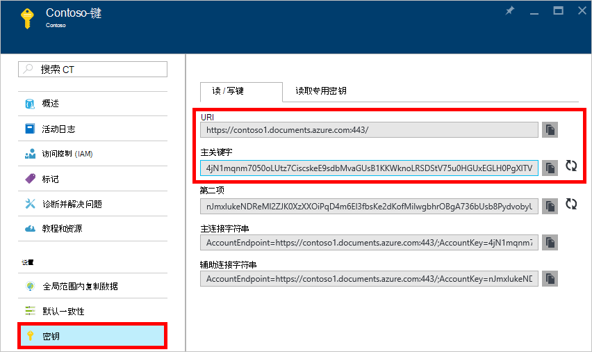
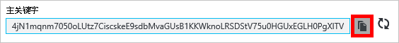
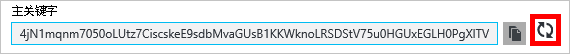
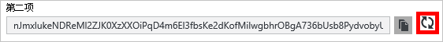
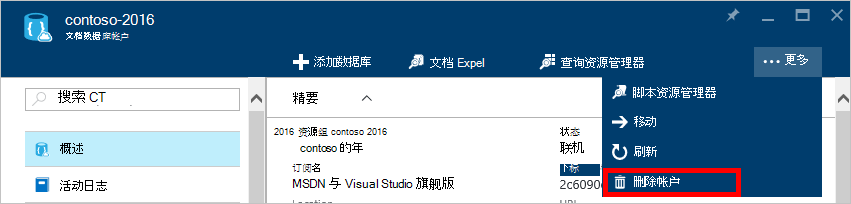
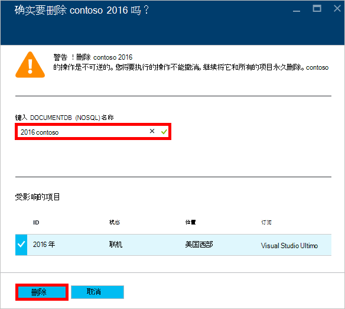

<properties
    pageTitle="通过 Azure 门户的 DocumentDB 帐户管理 |Microsoft Azure"
    description="了解如何管理您的 DocumentDB 帐户通过 Azure 门户。 查找有关使用 Azure 门户网站来查看、 复制、 删除和访问帐户的指南。"
    keywords="Azure 的门户网站，documentdb，azure，Microsoft azure"
    services="documentdb"
    documentationCenter=""
    authors="kirillg"
    manager="jhubbard"
    editor="cgronlun"/>

<tags
    ms.service="documentdb"
    ms.workload="data-services"
    ms.tgt_pltfrm="na"
    ms.devlang="na"
    ms.topic="article"
    ms.date="10/14/2016"
    ms.author="kirillg"/>

# 如何管理 DocumentDB 帐户

了解如何设置全局一致性、 处理的键，并删除在 Azure 的门户网站中的 DocumentDB 帐户。

## 管理 DocumentDB 一致性设置

选择合适的一致性级别取决于您的应用程序的语义。 您应熟悉中 DocumentDB 的可用的一致性级别通过读取[使用一致性级别要最大化可用性和性能的 DocumentDB] [consistency]。 DocumentDB 提供了一致性、 可用性和性能保证，每个级别一致性可用于您的数据库帐户。 具有强的一致性级别配置数据库帐户需要您的数据是有限到单个 Azure 区域并不是全局可用。 另一方面，宽松的一致性级别-有限的失效、 会话或最终启用您可以将任意数量的 Azure 区域与数据库帐户相关联。 以下简单的步骤向您展示了如何选择数据库帐户的默认一致性级别。 

### 若要指定为 DocumentDB 帐户的默认一致性

1. 在[Azure 的门户](https://portal.azure.com/)中，访问您的 DocumentDB 帐户。
2. 在帐户刀片式服务器，单击**默认值一致性**。
3. 在**默认一致性**刀片式服务器，选择新的一致性级别，然后单击**保存**。
    ![默认的会话一致性][5]

## 查看、 复制和重新生成访问密钥
创建一个 DocumentDB 帐户时，该服务生成两个 DocumentDB 帐户访问时可以用于身份验证的主机的访问键。 通过提供两个访问键，DocumentDB 可以重新生成密钥对您的 DocumentDB 帐户没有中断。 

在[Azure 的门户](https://portal.azure.com/)中，若要查看、 复制和重新生成访问密钥，并用它来访问您的 DocumentDB 帐户**DocumentDB 帐户**刀片式服务器上的资源菜单访问**键**刀片式服务器。

> [AZURE.NOTE] **键**刀片式服务器还包含可用于从[数据迁移工具](documentdb-import-data.md)连接到您的帐户的主要和次要的连接字符串。

只读的键也是此刀片式服务器上可用。 读取和查询是只读操作时创建，删除，并替换不可。

### 在 Azure 门户复制访问键

**键**刀片式服务器，请单击**复制**按钮右边的要复制的项。

### 重新生成访问密钥

为您的 DocumentDB 帐户定期以帮助保持您的连接更加安全，您应该更改访问键。 使您能够维护连接时重新生成的其他访问键使用一个访问键的 DocumentDB 帐户分配给两个访问键。

> [AZURE.WARNING] 重新生成访问密钥会影响依赖于当前密钥的任何应用程序。 使用访问键访问 DocumentDB 帐户的所有客户端必须更新以使用新的密钥。

如果您的应用程序或使用 DocumentDB 帐户的云服务，您将丢失连接如果您重新生成密钥，除非您将您的密钥。 以下步骤概述了涉及滚动您的密钥的过程。

1. 更新应用程序代码来引用辅助快捷键的 DocumentDB 帐户中的访问键。
2. 重新生成您的 DocumentDB 帐户的主访问键。 在[Azure 门户](https://portal.azure.com/)中，访问您的 DocumentDB 帐户。
3. 在**DocumentDB 帐户**刀片式服务器，单击**项**。
4. 在**键**刀片式服务器，请单击重新生成按钮，然后单击**确定**以确认您要生成一个新密钥。
    

5. 验证新的密钥是可供使用 （再生后大约 5 分钟） 后，请更新应用程序代码以引用新的主访问键中的访问键。
6. 重新生成辅助访问键。

    

> [AZURE.NOTE] 它可能需要几分钟才能使用新生成的密钥来访问您的 DocumentDB 帐户。

## 获取连接字符串

要检索您的连接字符串，请执行以下操作︰ 

1. 在[Azure 的门户](https://portal.azure.com)中，访问您的 DocumentDB 帐户。
2. 在资源菜单中单击**键**。
3. 单击**主连接字符串**或**辅助连接字符串**框旁的**复制**按钮。 

如果使用的[DocumentDB 数据库迁移工具](documentdb-import-data.md)的连接字符串，追加到连接字符串的末尾的数据库名称。 `AccountEndpoint=< >;AccountKey=< >;Database=< >`.

## 删除 DocumentDB 帐户
若要删除您不再使用 Azure 门户 DocumentDB 帐户，使用**DocumentDB 帐户**刀片式服务器上的**删除帐户**命令。

1. 在[Azure 的门户](https://portal.azure.com/)中，访问要删除的 DocumentDB 帐户。
2. 在**DocumentDB 帐户**刀片式服务器，请单击**多个**，，然后单击**删除帐户**。 或者，用鼠标右键单击数据库的名称，并单击**删除帐户**。
3. 结果确认刀片上, 键入以确认您要删除的帐户的 DocumentDB 帐户名。
4. 单击**删除**按钮。

## 下一步行动

了解如何[开始使用您的 DocumentDB 帐户](http://go.microsoft.com/fwlink/p/?LinkId=402364)。

若要了解有关 DocumentDB 的详细信息，请参阅[azure.com](http://go.microsoft.com/fwlink/?LinkID=402319&clcid=0x409)中的 Azure DocumentDB 文档。

<!--Image references-->
[1]: ./media/documentdb-manage-account/documentdb_add_region-1.png
[2]: ./media/documentdb-manage-account/documentdb_add_region-2.png
[3]: ./media/documentdb-manage-account/documentdb_change_write_region-1.png
[4]: ./media/documentdb-manage-account/documentdb_change_write_region-2.png
[5]: ./media/documentdb-manage-account/documentdb_change_consistency-1.png
[6]: ./media/documentdb-manage-account/chooseandsaveconsistency.png

<!--Reference style links - using these makes the source content way more readable than using inline links-->
[bcdr]: https://azure.microsoft.com/documentation/articles/best-practices-availability-paired-regions/
[consistency]: https://azure.microsoft.com/documentation/articles/documentdb-consistency-levels/
[azureregions]: https://azure.microsoft.com/en-us/regions/#services
[offers]: https://azure.microsoft.com/en-us/pricing/details/documentdb/
