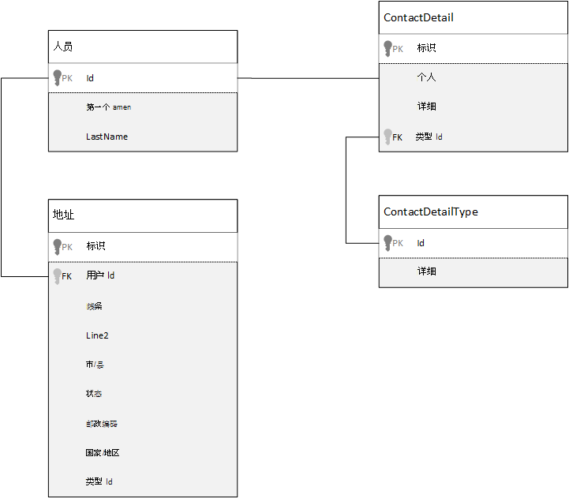
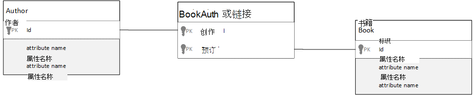

<properties 
    pageTitle="在 Azure DocumentDB 数据建模 |Microsoft Azure" 
    description="了解如何为 DocumentDB，使用 NoSQL 文档数据库的数据建模。" 
    keywords="数据建模"
    services="documentdb" 
    authors="kiratp" 
    manager="jhubbard" 
    editor="mimig1" 
    documentationCenter=""/>

<tags 
    ms.service="documentdb" 
    ms.workload="data-services" 
    ms.tgt_pltfrm="na" 
    ms.devlang="na" 
    ms.topic="article" 
    ms.date="08/05/2016" 
    ms.author="kipandya"/>

#在 DocumentDB 中的数据建模#
无架构的数据库，像 Azure DocumentDB，使其非常容易，欣然接受对数据模型更改您应该仍然开支一些时间来考虑有关数据。 

数据将如何保存？ 您的应用程序将如何检索和查询的数据？ 您的应用程序读取粗或写是很大的？ 

阅读这篇文章之后, 您将能够回答以下问题︰

- 如何应当考虑哪些文档数据库中的文档？
- 什么是数据建模以及为什么应该关注？ 
- 如何是不同于关系数据库建模文档数据库中的数据？
- 如何表达在非关系数据库的数据关系？
- 当嵌入数据和时链接到的数据？

##嵌入数据##
启动文档存储中的数据建模时如 DocumentDB，尝试您的实体被视为**独立的文档**在 JSON 中表示。

我们深入研究之前太更进一步，让我们重新采取几个步骤，去看看我们如何可能模型关系数据库，许多人已熟悉使用者中的某些内容。 下面的示例演示了如何一个人可能存储在关系数据库中。 

当使用关系数据库时，我们已经被讲授多年，以标准化、 规范化、 标准化。

规范化数据通常涉及采用图元，例如一个人，并将其分解为按下离散数据的程序段。 在上面的示例中，一个人可以有多个联系人的详细记录，以及多个地址记录。 我们甚至更进一步，通过进一步提取通用将分解的联系人详细信息的字段如下所示的类型。 相同的地址，每条记录都具有如*家庭*或*业务*类型 

指导部署到每个记录上**避免存储冗余数据**规范化数据时，而是引用数据。 在此示例中，读取一个人，其详细联系方式和地址，您需要使用联接来在运行时有效地聚合数据。

    SELECT p.FirstName, p.LastName, a.City, cd.Detail
    FROM Person p
    JOIN ContactDetail cd ON cd.PersonId = p.Id
    JOIN ContactDetailType on cdt ON cdt.Id = cd.TypeId
    JOIN Address a ON a.PersonId = p.Id

更新其详细联系方式和地址与一个人要求在许多各个表之间的写入操作。 

现在让我们看看如何，我们将模型作为独立实体的文档数据库中相同的数据。
        
    {
        "id": "1",
        "firstName": "Thomas",
        "lastName": "Andersen",
        "addresses": [
            {            
                "line1": "100 Some Street",
                "line2": "Unit 1",
                "city": "Seattle",
                "state": "WA",
                "zip": 98012
            }
        ],
        "contactDetails": [
            {"email: "thomas@andersen.com"},
            {"phone": "+1 555 555-5555", "extension": 5555}
        ] 
    }

使用上述方法现在**不规范**人员记录的位置我们有我们**嵌入**与给此人，如其详细联系方式和地址，在一个 JSON 文档的所有信息。
此外，我们要不局限于固定的架构，因为我们可以灵活地事情好像完全有不同形状的联系人详细信息。 

从数据库中检索一个完整的人记录现在是一个读取操作针对单个集合，并为单个文档。 更新用户记录，其详细联系方式和地址，也是对单个文档的一个写操作。

通过反规范化数据，应用程序可能需要发出更少的查询和更新完成常见的操作。 

###当嵌入

一般情况下，使用嵌入的数据建模时︰

- 有实体之间的**包含**关系。
- 实体之间有**一到几个**关系。
- 被嵌入的数据**很少更改**。
- 那里嵌入数据将不会增加**不受约束**。
- 还有是**整型**到数据文档中的嵌入的数据。

> [AZURE.NOTE] 通常非规范化的数据模型提供更好的**读取**性能。

###何时不嵌入

虽然文档数据库中的经验法则是使一切非正常化并嵌入到单个文档中的所有数据，这可能会导致某些情况下，应避免使用。

采用此 JSON 段。

    {
        "id": "1",
        "name": "What's new in the coolest Cloud",
        "summary": "A blog post by someone real famous",
        "comments": [
            {"id": 1, "author": "anon", "comment": "something useful, I'm sure"},
            {"id": 2, "author": "bob", "comment": "wisdom from the interwebs"},
            …
            {"id": 100001, "author": "jane", "comment": "and on we go ..."},
            …
            {"id": 1000000001, "author": "angry", "comment": "blah angry blah angry"},
            …
            {"id": ∞ + 1, "author": "bored", "comment": "oh man, will this ever end?"},
        ]
    }

这可能是如果我们建模典型博客或 CMS，系统嵌入的注释与公告实体将类似。 此示例中的问题是评论数组是**无界**，意味着可以有任意一个帖子的评论数目没有 （实际） 限制。 当文档的大小可能会显著增长，这将成为问题。

> [AZURE.TIP] DocumentDB 中的文档具有的最大大小。 对此的详细信息请参阅[DocumentDB 限制](documentdb-limits.md)。

文档的大小随着电线，以及读取和更新的文档，在规模较大，对传输数据的能力将受到影响。

在这种情况下会更好一些，请考虑下面的模型。
        
    Post document:
    {
        "id": "1",
        "name": "What's new in the coolest Cloud",
        "summary": "A blog post by someone real famous",
        "recentComments": [
            {"id": 1, "author": "anon", "comment": "something useful, I'm sure"},
            {"id": 2, "author": "bob", "comment": "wisdom from the interwebs"},
            {"id": 3, "author": "jane", "comment": "....."}
        ]
    }

    Comment documents:
    {
        "postId": "1"
        "comments": [
            {"id": 4, "author": "anon", "comment": "more goodness"},
            {"id": 5, "author": "bob", "comment": "tails from the field"},
            ...
            {"id": 99, "author": "angry", "comment": "blah angry blah angry"}
        ]
    },
    {
        "postId": "1"
        "comments": [
            {"id": 100, "author": "anon", "comment": "yet more"},
            ...
            {"id": 199, "author": "bored", "comment": "will this ever end?"}
        ]
    }

这款机型具有的三个最新评论中内嵌的张贴内容本身，它是数组具有固定的绑定此时间。 其他评论都分组在向一批 100 注释并存储在单独的文档中。 因为我们虚构的应用程序使用户可以一次加载 100 注释的批处理大小选择作为 100。  

嵌入的数据不是一个好主意的另一种情况是嵌入的数据跨文档通常使用，并且会经常更改时。 

采用此 JSON 段。

    {
        "id": "1",
        "firstName": "Thomas",
        "lastName": "Andersen",
        "holdings": [
            {
                "numberHeld": 100,
                "stock": { "symbol": "zaza", "open": 1, "high": 2, "low": 0.5 }
            },
            {
                "numberHeld": 50,
                "stock": { "symbol": "xcxc", "open": 89, "high": 93.24, "low": 88.87 }
            }
        ]
    }

这可能表示一个人的股票组合。 我们已选择要嵌入到项目组合中的每个文档中的股票信息。 在相关的数据被频繁更改的环境中，像股票交易应用程序、 嵌入频繁更改的数据将意味着您正在不断更新产品组合中的每个文档每次卖股票。

股票*zaza*可能卖几百个中一天的时间，成千上万的用户可能对他们的阵容有*zaza* 。 如以上就必须要多次更新数千包文档数据模型导致系统每一天，将不会扩展很好。 

##引用数据##

因此，嵌入数据很好地适用于很多情况下，但很显然当数据非正常化将导致更多的问题，不值得有方案。 所以我们现在该怎么办？ 

关系数据库不是唯一的地方，您可以在其中创建实体之间的关系。 文档数据库中可以有一个实际上与在其他文档中的数据相关的文档中的信息。 现在，我并不提倡甚至一分钟我们构建的系统，将更适合于在 DocumentDB，关系数据库或任何其他文档数据库，但简单关系是很好，非常有用。 

在下面我们选择以前使用的股票从本示例 JSON，但这一次我们引用而不是将其嵌入阵容上的存货项目。 这样一来，股票项目发生更改时经常在一天只需要更新的文档是单个股票的文档。 

    Person document:
    {
        "id": "1",
        "firstName": "Thomas",
        "lastName": "Andersen",
        "holdings": [
            { "numberHeld":  100, "stockId": 1},
            { "numberHeld":  50, "stockId": 2}
        ]
    }
    
    Stock documents:
    {
        "id": "1",
        "symbol": "zaza",
        "open": 1,
        "high": 2,
        "low": 0.5,
        "vol": 11970000,
        "mkt-cap": 42000000,
        "pe": 5.89
    },
    {
        "id": "2",
        "symbol": "xcxc",
        "open": 89,
        "high": 93.24,
        "low": 88.87,
        "vol": 2970200,
        "mkt-cap": 1005000,
        "pe": 75.82
    }
    

这种方法直接弊端不过是您的应用程序是否需要显示信息时显示一个人的阵容; 按每个股票在这种情况下需要对数据库加载每个股票单据的信息进行多个行程。 这里我们已经作出决定，以提高写入操作，这经常在一天中，发生这种情况，但反过来破坏有可能对此特定系统的性能影响较小的读操作的效率。

> [AZURE.NOTE] 规范化数据模型**可以要求更多的往返**于服务器。

### 外键呢？
目前尚没有约束的概念，因为外键或以其他方式，必须在文档中的任何文档间关系是有效的"薄弱环节"，数据库本身将不会验证。 如果您想要确保文档引用实际存在的数据，则需要在您的应用程序，或通过使用服务器端触发器或存储的过程在 DocumentDB 上执行此操作。

###当引用
一般情况下，使用规范化的数据建模时︰

- 表示**一个一对多**的关系。
- 表示**多对多**关系。
- 相关数据**频繁变化**。
- 无法将引用的数据**绑定**。

> [AZURE.NOTE] 通常规范化提供了更好的**写**性能。

###在其中放入关系？
关系的增长将有助于确定哪些存储引用的文档中。

如果我们看下建模出版商和图书 JSON。

    Publisher document:
    {
        "id": "mspress",
        "name": "Microsoft Press",
        "books": [ 1, 2, 3, ..., 100, ..., 1000]
    }

    Book documents:
    {"id": "1", "name": "DocumentDB 101" }
    {"id": "2", "name": "DocumentDB for RDBMS Users" }
    {"id": "3", "name": "Taking over the world one JSON doc at a time" }
    ...
    {"id": "100", "name": "Learn about Azure DocumentDB" }
    ...
    {"id": "1000", "name": "Deep Dive in to DocumentDB" }

如果每个出版商的书籍的数量很小的有限增长，然后将存储在发布服务器上文档的书籍引用可能会有用。 但是，如果每个出版商的书的数量是无限的然后这种数据模型将导致可变的增长数组，如在上面的示例发布文档。 

交换周围有点事情将导致仍表示相同的数据，但现在可以避免这些大型可变集合的模型中。

    Publisher document: 
    {
        "id": "mspress",
        "name": "Microsoft Press"
    }
    
    Book documents: 
    {"id": "1","name": "DocumentDB 101", "pub-id": "mspress"}
    {"id": "2","name": "DocumentDB for RDBMS Users", "pub-id": "mspress"}
    {"id": "3","name": "Taking over the world one JSON doc at a time"}
    ...
    {"id": "100","name": "Learn about Azure DocumentDB", "pub-id": "mspress"}
    ...
    {"id": "1000","name": "Deep Dive in to DocumentDB", "pub-id": "mspress"}

在上面的示例中，我们已在发布服务器上文档丢弃未绑定的集合。 而我们只是有对发布服务器上每个书籍文档的引用。

###如何建立多对多关系模型？
关系数据库在*多对多*关系经常与刚刚加入其他表中的记录组合在一起的联接表建模。 

您可能试图进行复制同样使用文档和生成类似于以下的数据模型。

    Author documents: 
    {"id": "a1", "name": "Thomas Andersen" }
    {"id": "a2", "name": "William Wakefield" }
    
    Book documents:
    {"id": "b1", "name": "DocumentDB 101" }
    {"id": "b2", "name": "DocumentDB for RDBMS Users" }
    {"id": "b3", "name": "Taking over the world one JSON doc at a time" }
    {"id": "b4", "name": "Learn about Azure DocumentDB" }
    {"id": "b5", "name": "Deep Dive in to DocumentDB" }
    
    Joining documents: 
    {"authorId": "a1", "bookId": "b1" }
    {"authorId": "a2", "bookId": "b1" }
    {"authorId": "a1", "bookId": "b2" }
    {"authorId": "a1", "bookId": "b3" }

这将起的作用。 但是，加载其本书籍，或者作者或与作者，加载一本书将始终需要至少两个其他数据库查询。 对加入文档并将另一个查询来提取实际文档要联接的一个查询。 

如果此联接表做的所有粘附在一起两个数据，然后为什么不放下它完全？
请考虑以下情况。

    Author documents:
    {"id": "a1", "name": "Thomas Andersen", "books": ["b1, "b2", "b3"]}
    {"id": "a2", "name": "William Wakefield", "books": ["b1", "b4"]}
    
    Book documents: 
    {"id": "b1", "name": "DocumentDB 101", "authors": ["a1", "a2"]}
    {"id": "b2", "name": "DocumentDB for RDBMS Users", "authors": ["a1"]}
    {"id": "b3", "name": "Learn about Azure DocumentDB", "authors": ["a1"]}
    {"id": "b4", "name": "Deep Dive in to DocumentDB", "authors": ["a2"]}

现在，如果我有一个作者，我立即知道他们所写的哪本书，相反如果我有簿文档加载我会知道的 author(s) id。 这可以节省您应用程序的服务器往返联接表减少对该中间查询。 

##混合数据模型##
我们现在已经了解嵌入 （或非正常化） 和引用 （或规范化） 的数据，每个都有其 upsides 和每个有威胁，正如我们所看到。 

并不总是需要是或不是害怕要有点事情混淆了。 

根据您的应用程序特定的使用模式和可能情况下嵌入混合工作负载和被引用的数据有意义并可能导致更简单的应用程序逻辑与更少的服务器往返在保持较高的性能。

请考虑下面的 JSON。 

    Author documents: 
    {
        "id": "a1",
        "firstName": "Thomas",
        "lastName": "Andersen",     
        "countOfBooks": 3,
        "books": ["b1", "b2", "b3"],
        "images": [
            {"thumbnail": "http://....png"}
            {"profile": "http://....png"}
            {"large": "http://....png"}
        ]
    },
    {
        "id": "a2",
        "firstName": "William",
        "lastName": "Wakefield",
        "countOfBooks": 1,
        "books": ["b1"],
        "images": [
            {"thumbnail": "http://....png"}
        ]
    }
    
    Book documents:
    {
        "id": "b1",
        "name": "DocumentDB 101",
        "authors": [
            {"id": "a1", "name": "Thomas Andersen", "thumbnailUrl": "http://....png"},
            {"id": "a2", "name": "William Wakefield", "thumbnailUrl": "http://....png"}
        ]
    },
    {
        "id": "b2",
        "name": "DocumentDB for RDBMS Users",
        "authors": [
            {"id": "a1", "name": "Thomas Andersen", "thumbnailUrl": "http://....png"},
        ]
    }

这里我们 （大部分） 后嵌入的模型的顶级文档中嵌入其他实体中的数据，但引用的其他数据。 

如果您看一下书籍文档，我们可以看到一些有趣当我们看一下作者的数组的字段。 *Id*字段即回头到作者的文档，标准的做法，在规范模型中，我们使用的字段，但我们还具有*名称*和*thumbnailUrl*。 我们可能只是一直在使用*id*并保持应用程序来获取它所需的任何其他信息从各自作者文档使用"链接"，但因为我们的应用程序显示作者的姓名和一个缩略图显示每本书我们可以往返通过保存到服务器列表中的书每作者中的**某些**数据非正常化。

当然，如果创作者的名称更改，或者他们想要更新我们必须去更新其照片每本书他们不断发布，但对于我们的应用程序，假定作者不更改它们的名称非常频繁，这是可接受的设计决策。  

在该示例中有**预先计算聚合**值的读取操作节约昂贵的处理。 在示例中，有些作者文档中嵌入的数据是在运行时计算的数据。 每次发布新简介册，书籍文档创建**和**countOfBooks 字段设置为基于存在特定作者的书籍文档数的计算值。 我们可以承受写上进行计算，以优化读都很不错在粗系统中读取此优化。

因为 DocumentDB 支持**多文档事务**，具有与预先计算的域模型的能力是成为可能。 许多 NoSQL 商店不能跨文档做交易记录，因此提倡设计决策，例如"总是嵌入的一切"，由于这种限制。 DocumentDB，您可以使用服务器端触发器或存储的过程，插入书籍和更新所有的 ACID 事务的作者。 现在您不**具有**嵌入一切到一个文档，只是为了确保您的数据保持一致。

##下一步行动

从这篇文章最大的优点是了解一个架构自由世界中的数据建模是与以往任何时候都一样重要。 

就像没有单一的方法来表示一种屏幕上的数据，没有一个方法建立数据模型。 您需要了解您的应用程序，则会产生消耗，和处理的数据。 然后，通过应用此处提供的准则的一些您可以设置有关创建满足您的应用程序的即时的模型。 当您的应用程序需要更改时，您可以利用的架构释放数据库欣然接受更改并易于演变数据模型的灵活性。 

若要了解有关 Azure DocumentDB 的详细信息，请参考服务的[文档](https://azure.microsoft.com/documentation/services/documentdb/)页中找到。 

要了解有关在 Azure DocumentDB 优化索引，请参阅[索引策略](documentdb-indexing-policies.md)上的文章。

若要了解如何到 shard 数据跨多个分区，请参阅[分区中 DocumentDB 的数据](documentdb-partition-data.md)。 

并且最后，建模数据和多租户应用程序分片指导，请参阅[扩展使用 Azure DocumentDB 多租户应用程序](http://blogs.msdn.com/b/documentdb/archive/2014/12/03/scaling-a-multi-tenant-application-with-azure-documentdb.aspx)。
 
