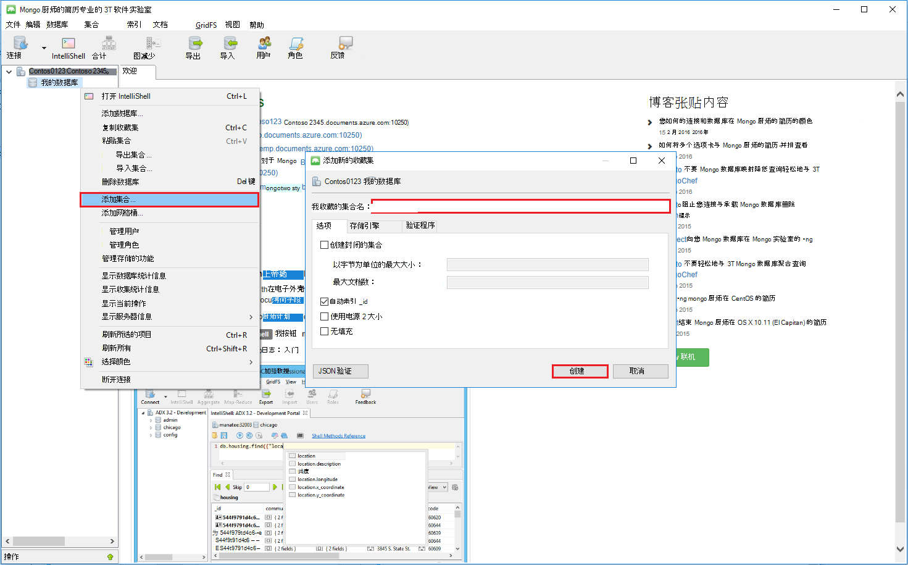

<properties 
    pageTitle="使用具有 MongoDB 的协议支持的 DocumentDB 帐户 MongoChef |Microsoft Azure" 
    description="了解如何使用 MongoChef 与 DocumentDB 帐户使用 MongoDB，现在可供预览的协议支持。" 
    keywords="mongochef"
    services="documentdb" 
    authors="AndrewHoh" 
    manager="jhubbard" 
    editor="" 
    documentationCenter=""/>

<tags 
    ms.service="documentdb" 
    ms.workload="data-services" 
    ms.tgt_pltfrm="na" 
    ms.devlang="na" 
    ms.topic="article" 
    ms.date="08/25/2016" 
    ms.author="anhoh"/>

# MongoChef 使用 MongoDB 的协议支持的 DocumentDB 帐户

要连接到使用 MongoChef 的 MongoDB 的协议支持的 Azure DocumentDB 帐户，您必须︰

- 下载并安装[MongoChef](http://3t.io/mongochef)
- 有您的 DocumentDB 帐户 MongoDB[连接字符串](documentdb-connect-mongodb-account.md)信息的协议支持

## 在 MongoChef 中创建连接  

MongoDB 的协议支持您的 DocumentDB 帐户添加 MongoChef 连接管理器，请执行以下步骤。

1. 检索与协议 MongoDB 连接信息的指导，支持您 DocumentDB[在此处](documentdb-connect-mongodb-account.md)。

    

2. 单击**连接**以打开连接管理器，然后单击**新建连接**

    
    
2. 在**新连接**窗口中，在**服务器**选项卡上，输入 DocumentDB 帐户协议支持 MongoDB 和端口的主机 (FQDN)。
    
    

3. 在**新连接**窗口中，在**身份验证**选项卡上选择身份验证模式**（MONGODB CR 或 SCARM-sha-1） 的标准**，输入用户名和密码。  接受默认的身份验证数据库 （管理员），或者提供您自己的值。

    

4. 在**新建连接**窗口中， **SSL**选项卡上，选中**使用 SSL 协议连接**复选框和**接受自行签署式 SSL 证书**单选按钮。

    

5. 单击**测试连接**按钮来验证连接信息，请单击**确定**以返回到新建连接窗口，然后单击**保存**。

    

## 使用 MongoChef 来创建数据库、 收集和文档  

若要创建一个数据库，收集和使用 MongoChef，文档，请执行以下步骤。

1. 在**连接管理器**中突出显示该连接，然后单击**连接**。

    

2. 右键单击主机，然后选择**添加数据库**。  提供数据库名称，然后单击**确定**。
    
    

3. 右击数据库并选择**添加的集合**。  提供一个集合名称，单击**创建**。

    

4. 单击**集合**菜单项，然后单击**添加文档**。

    

5. 在添加文档对话框中，粘贴以下项，然后单击**添加文档**。

        {
        "_id": "AndersenFamily",
        "lastName": "Andersen",
        "parents": [
            { "firstName": "Thomas" },
            { "firstName": "Mary Kay"}
        ],
        "children": [
        {
            "firstName": "Henriette Thaulow", "gender": "female", "grade": 5,
            "pets": [{ "givenName": "Fluffy" }]
        }
        ],
        "address": { "state": "WA", "county": "King", "city": "seattle" },
        "isRegistered": true
        }

    
6. 添加另一个文档中，这一次使用以下内容。

        {
        "_id": "WakefieldFamily",
        "parents": [
            { "familyName": "Wakefield", "givenName": "Robin" },
            { "familyName": "Miller", "givenName": "Ben" }
        ],
        "children": [
            {
                "familyName": "Merriam", 
                "givenName": "Jesse", 
                "gender": "female", "grade": 1,
                "pets": [
                    { "givenName": "Goofy" },
                    { "givenName": "Shadow" }
                ]
            },
            { 
                "familyName": "Miller", 
                "givenName": "Lisa", 
                "gender": "female", 
                "grade": 8 }
        ],
        "address": { "state": "NY", "county": "Manhattan", "city": "NY" },
        "isRegistered": false
        }

7. 执行示例查询。 例如，家族姓氏 '小姐' 搜索并返回父项和状态字段。

    
    

## 下一步行动

- DocumentDB 使用 MongoDB[样本](documentdb-mongodb-samples.md)的协议支持。

 
