<properties
    pageTitle="监视 DocumentDB 请求和存储 |Microsoft Azure"
    description="了解如何监视您的 DocumentDB 帐户为性能指标，如请求和服务器错误和使用情况指标，如存储消耗量。"
    services="documentdb"
    documentationCenter=""
    authors="mimig1"
    manager="jhubbard"
    editor="cgronlun"/>

<tags
    ms.service="documentdb"
    ms.workload="data-services"
    ms.tgt_pltfrm="na"
    ms.devlang="na"
    ms.topic="article"
    ms.date="10/17/2016"
    ms.author="mimig"/>

# DocumentDB 请求、 使用和存储监视

您可以监视 Azure DocumentDB 帐户在[Azure 的门户](https://portal.azure.com/)。 对于 DocumentDB 的每个帐户，提供了这两个性能指标，如请求和服务器错误和使用情况指标，如存储消耗量。

刀片式服务器帐户或新标准刀片上，可以检查指标。

## 查看指标刀片式服务器上的性能指标

1. 在新窗口中，打开[Azure 的门户网站](https://portal.azure.com/)**更多服务**单击**DocumentDB (NoSQL)**，和，然后单击要查看的性能指标的 DocumentDB 帐户的名称。
2. 在资源菜单上，单击**度量值**。

指标刀片式服务器将打开，并且您可以选择要查看的集合。 可以查看可用性、 请求、 吞吐量和存储度量和比较它们对 DocumentDB 服务级别协议。

## 查看帐户刀片式服务器上的性能指标
1.  在新窗口中，打开[Azure 的门户网站](https://portal.azure.com/)**更多服务**单击**DocumentDB (NoSQL)**，和，然后单击要查看的性能指标的 DocumentDB 帐户的名称。

2.  默认情况下，**监视**镜头显示下面的图块︰
    *   当天的请求总数。
    *   使用的存储空间。

    如果表格显示**没有可用的数据**，并且您认为您的数据库中没有数据，请参阅[疑难解答](#troubleshooting)部分。

    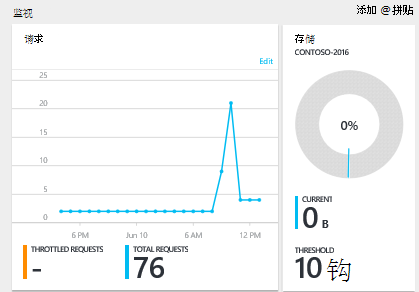

3.  单击**请求**或**存储**平铺打开详细的**规格，**刀片式服务器。
4.  **跃点数**刀片式服务器显示有关所选的度量值的详细信息。  顶部的刀片式服务器请求每小时，绘制的图形，并且在下面显示聚合值的调节和总请求的表。  公制刀片式服务器还会显示已定义，到出现在当前度量刀片式服务器的指标筛选警报的列表 （这种方式，如果您有大量的通知后，您将仅看到此处介绍相关的）。   

    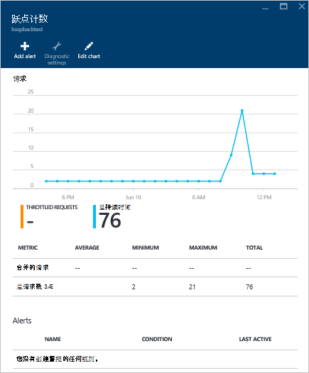

## 自定义门户中的性能度量标准视图

1.  要自定义在特定图表中显示的统计数据，请单击图表中**度量**刀片式服务器，将其打开，然后单击**编辑图表**。  
    

2.  在**编辑图表**刀片式服务器，有选项来修改显示在图表中，以及他们的时间范围内的度量标准。  
    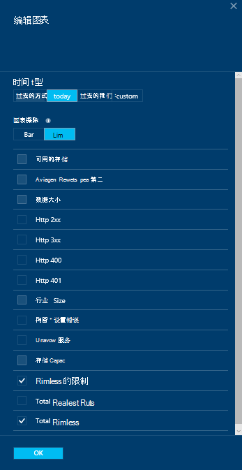

3.  若要更改显示在部件中的指标，只需选择或清除的可用的性能指标，然后单击**确定**在底部的刀片式服务器。  
4.  若要更改的时间范围，选择不同的范围 （例如，**自定义**）、，然后单击**确定**在底部的刀片式服务器。  

    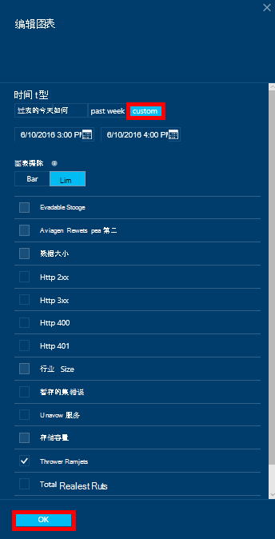

## 在门户中创建并排排列图表
Azure 门户允许您创建并排比较指标的图表。  

1.  首先，请右键单击您要复制并选择**自定义**的图表。

    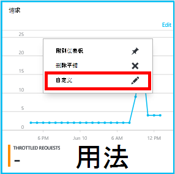

2.  单击要复制的部件，然后单击**完成自定义**的菜单上的**克隆**。

    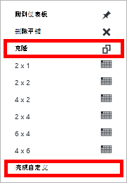  

您可能现在将这一部分视为任何其他指标的部分，自定义显示在部件中的指标和时间范围。  通过执行此操作，您可以同时看到两个不同的指标图表通过并行。  
    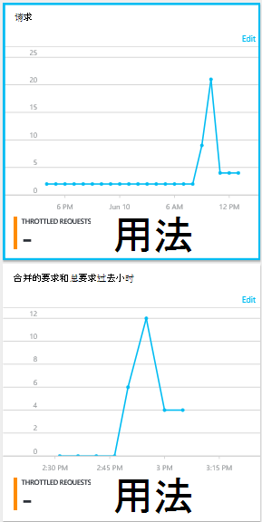  

## 设置在门户的通知
1.  在[Azure 的门户](https://portal.azure.com/)中，单击**更多服务**，单击**DocumentDB (NoSQL)**，然后单击您要为其设置性能指标预警的 DocumentDB 帐户的名称。

2.  在资源菜单中，单击要打开刀片式服务器预警规则的**预警规则**。  
    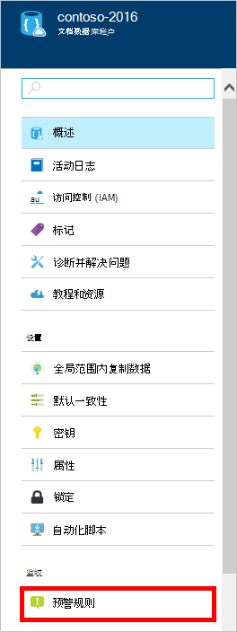

3.  在**预警规则**刀片式服务器，单击**添加通知**。  
    

4.  在**预警规则中添加**刀片式服务器，请指定︰
    *   您设置的预警规则的名称。
    *   新的预警规则的描述。
    *   指标预警规则。
    *   确定当警报激活条件、 阈值和时间段。 例如，在最后 15 分钟内服务器错误计数大于 5。
    *   是否服务管理员和 coadministrators 是通过电子邮件发送时将触发警报。
    *   警报通知的其他电子邮件地址。  
    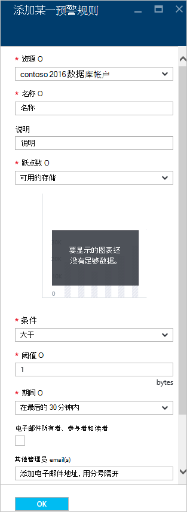

## 以编程方式监视 DocumentDB
在门户中，如帐户存储使用率和总请求可用帐户级别指标不可通过 DocumentDB Api。 但是，您可以使用 DocumentDB Api 检索集合级别的使用情况数据。 若要检索集合级别的数据，请执行以下操作︰

- 若要使用 REST API，[执行在该集合上的获取](https://msdn.microsoft.com/library/mt489073.aspx)。 在响应中 x ms 资源配额和 x ms 资源使用标头中返回集合的配额和用法信息。
- 若要使用.NET SDK，使用[DocumentClient.ReadDocumentCollectionAsync](https://msdn.microsoft.com/library/microsoft.azure.documents.client.documentclient.readdocumentcollectionasync.aspx)方法，它返回包含大量使用属性，如**CollectionSizeUsage**、 **DatabaseUsage**、 **DocumentUsage**，和[ResourceResponse](https://msdn.microsoft.com/library/dn799209.aspx) 。

若要访问其他度量，使用[Azure 监视器 SDK](https://www.nuget.org/packages/Microsoft.Azure.Insights)。 可以通过调用检索可用度量的定义︰

    https://management.azure.com/subscriptions/{SubscriptionId}/resourceGroups/{ResourceGroup}/providers/Microsoft.DocumentDb/databaseAccounts/{DocumentDBAccountName}/metricDefinitions?api-version=2015-04-08

查询以检索个人标准使用以下格式︰

    https://management.azure.com/subscriptions/{SubecriptionId}/resourceGroups/{ResourceGroup}/providers/Microsoft.DocumentDb/databaseAccounts/{DocumentDBAccountName}/metrics?api-version=2015-04-08&$filter=%28name.value%20eq%20%27Total%20Requests%27%29%20and%20timeGrain%20eq%20duration%27PT5M%27%20and%20startTime%20eq%202016-06-03T03%3A26%3A00.0000000Z%20and%20endTime%20eq%202016-06-10T03%3A26%3A00.0000000Z

有关详细信息，请参阅[通过 Azure 监视器 REST API 检索资源规格](https://blogs.msdn.microsoft.com/cloud_solution_architect/2016/02/23/retrieving-resource-metrics-via-the-azure-insights-api/)。 请注意"Azure Inights"已重命名"Azure 监视器"。  此日志项引用旧名称。

## 故障排除
如果您监视的拼贴显示**没有可用的数据**的消息，最近所做的请求，或向数据库中添加数据，则可以编辑该图块可以反映最新使用情况。

### 编辑方块刷新当前数据
1.  若要自定义显示在某一特定部分的度量标准，单击该图表以**公制**刀片式服务器，打开，然后单击**编辑图表**。  
    

2.  **编辑图表**刀片式服务器，在**时间范围**部分中，在**过去的工时**，请单击，然后单击**确定**。  
    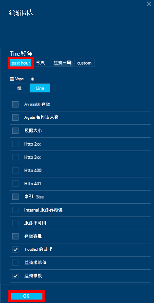

3.  您拼贴现在应该刷新显示您当前的数据和使用情况。  
    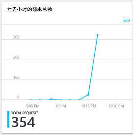

## 下一步行动
若要了解有关 DocumentDB 容量的详细信息，请参阅[管理 DocumentDB 容量](documentdb-manage.md)。
