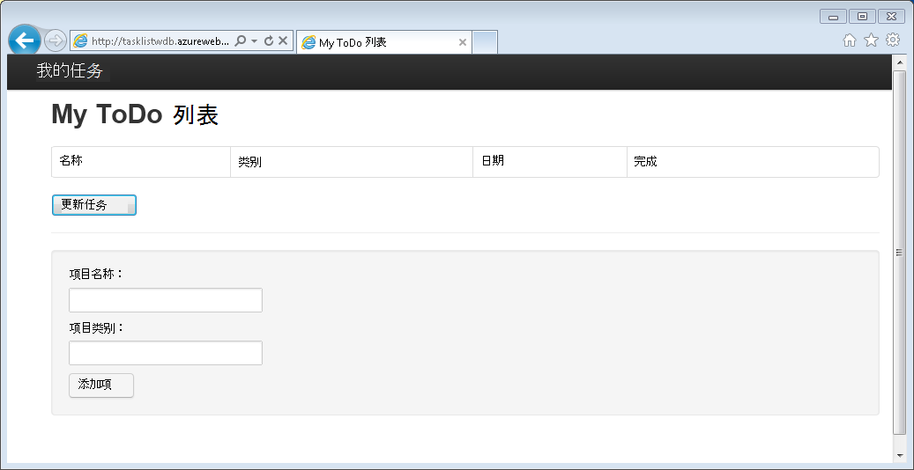
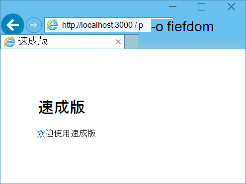
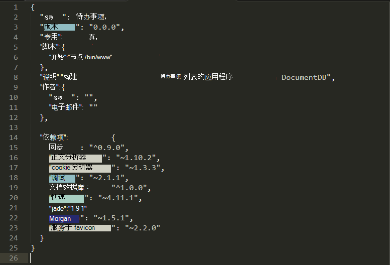
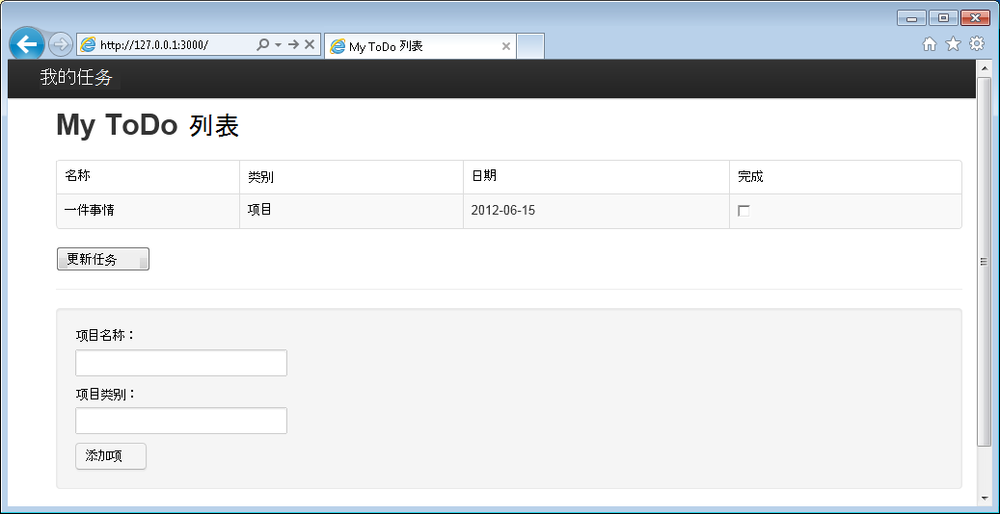

<properties 
    pageTitle="了解 DocumentDB Node.js 教程的 Node.js-|Microsoft Azure" 
    description="了解 Node.js ！ 教程从 Azure 网站上承载的 Node.js 速成版 web 应用程序将探讨如何使用 Microsoft Azure DocumentDB 来存储和访问数据。" 
    keywords="应用程序开发、 数据库教程，了解 node.js，node.js 教程、 documentdb、 azure，Microsoft azure"
    services="documentdb" 
    documentationCenter="nodejs" 
    authors="syamkmsft" 
    manager="jhubbard" 
    editor="cgronlun"/>

<tags 
    ms.service="documentdb" 
    ms.workload="data-services" 
    ms.tgt_pltfrm="na" 
    ms.devlang="nodejs" 
    ms.topic="hero-article" 
    ms.date="08/25/2016" 
    ms.author="syamk"/>

# 构建 Node.js web 应用程序使用 DocumentDB

> [AZURE.SELECTOR]
- [.NET](documentdb-dotnet-application.md)
- [Node.js](documentdb-nodejs-application.md)
- [Java](documentdb-java-application.md)
- [Python](documentdb-python-application.md)

此 Node.js 教程演示了如何使用 Azure DocumentDB 服务来存储和访问 Azure 网站上托管的 Node.js 速成版应用程序中的数据。

我们建议开始通过观看下面的视频，在其中，您将学习如何进行调配的 Azure DocumentDB 数据库帐户和 Node.js 应用程序中存储 JSON 文档。 

> [AZURE.VIDEO azure-demo-getting-started-with-azure-documentdb-on-nodejs-in-linux]

然后，返回到 Node.js 本教程中，您学习以下问题的答案︰

- 如何使用 DocumentDB 使用 documentdb npm 模块？
- 如何部署到 Azure 网站的 web 应用程序？

按照此数据库教程，您将生成一个简单的基于 web 的任务管理应用程序，允许创建、 检索和完成任务。 这些任务将存储为 Azure DocumentDB 中的 JSON 文档。

不要有时间来完成本教程，只是想要获得完整的解决方案？ 这不是问题，您可以从[GitHub][]获得完整的示例解决方案。

## 系统必备组件

> [AZURE.TIP] 本 Node.js 教程假设您有一些使用 Node.js 和 Azure 网站的经验。

在这篇文章中的说明进行操作之前，应确保您具备以下︰

- 活动的 Azure 帐户。 如果您没有帐户，您可以在几分钟创建免费的试用帐户。 有关详细信息，请参阅[Azure 免费试用版](https://azure.microsoft.com/pricing/free-trial/)。
- [Node.js][]版本 v0.10.29 或更高版本。
- [表示生成器](http://www.expressjs.com/starter/generator.html)(您可以安装此客户端通过`npm install express-generator -g`)
- [Git][]。

## 步骤 1︰ 创建一个 DocumentDB 数据库帐户

让我们首先创建一个 DocumentDB 帐户。 如果您已经有一个帐户，您可以跳到[步骤 2︰ 创建新的 Node.js 应用程序](#_Toc395783178)。

[AZURE.INCLUDE [documentdb-create-dbaccount](../../includes/documentdb-create-dbaccount.md)]

[AZURE.INCLUDE [documentdb-keys](../../includes/documentdb-keys.md)]

## 步骤 2︰ 了解如何创建新的 Node.js 应用程序

现在让我们来了解如何创建使用[表达](http://expressjs.com/)框架基本你好世界 Node.js 项目。

1. 打开您最喜爱的终端。

2. 使用快速生成器来生成新的应用程序名为**todo**。

        express todo

3. 打开新的**todo**目录并安装依赖项。

        cd todo
        npm install

4. 运行新应用程序。

        npm start

5. 您可以通过导航到[http://localhost:3000](http://localhost:3000)浏览器中查看新的应用程序。

    

## 步骤 3︰ 将安装附加模块

**Package.json**文件是在项目的根目录中创建的文件之一。 此文件包含所需的 Node.js 应用程序的其他模块的列表。 以后，当您部署此应用程序对 Azure 网站，此文件用于确定哪些模块需要安装在 Azure 来支持您的应用程序。 我们仍需要为本教程中安装两个更多的包。

1. 在终端，通过 npm**异步**模块的安装。

        npm install async --save

1. 通过 npm **documentdb**模块安装。 这是所有 DocumentDB 奇迹的地方的模块。

        npm install documentdb --save

3. 快速检查的**package.json**文件的应用程序应显示附加模块。 此文件将告诉 Azure 的包要下载并安装您的应用程序运行时。 它应类似于下面的示例。

    

    这将指示节点 （和以后 Azure） 应用程序依赖于这些附加模块。

## 步骤 4︰ 使用 DocumentDB 服务在一个节点的应用程序

这样就解决了所有的初始安装和配置，现在让我们获取下到为什么我们这里，就是要编写一些代码使用 Azure DocumentDB。

### 创建模型

1. 在项目目录中，创建一个名为**模型**的新目录。
2. 在**模型**目录中，创建一个名为**taskDao.js**的新文件。 此文件将包含我们的应用程序所创建的任务模型。
3. 在相同的**模型**目录中，创建另一个名为**docdbUtils.js**的新文件。 此文件将包含整个我们的应用程序，我们将使用一些有用、 可重用代码。 
4. 将下面的代码复制到**docdbUtils.js**

        var DocumentDBClient = require('documentdb').DocumentClient;
            
        var DocDBUtils = {
            getOrCreateDatabase: function (client, databaseId, callback) {
                var querySpec = {
                    query: 'SELECT * FROM root r WHERE r.id= @id',
                    parameters: [{
                        name: '@id',
                        value: databaseId
                    }]
                };
        
                client.queryDatabases(querySpec).toArray(function (err, results) {
                    if (err) {
                        callback(err);
        
                    } else {
                        if (results.length === 0) {
                            var databaseSpec = {
                                id: databaseId
                            };
        
                            client.createDatabase(databaseSpec, function (err, created) {
                                callback(null, created);
                            });
        
                        } else {
                            callback(null, results[0]);
                        }
                    }
                });
            },
        
            getOrCreateCollection: function (client, databaseLink, collectionId, callback) {
                var querySpec = {
                    query: 'SELECT * FROM root r WHERE r.id=@id',
                    parameters: [{
                        name: '@id',
                        value: collectionId
                    }]
                };             
                
                client.queryCollections(databaseLink, querySpec).toArray(function (err, results) {
                    if (err) {
                        callback(err);
        
                    } else {        
                        if (results.length === 0) {
                            var collectionSpec = {
                                id: collectionId
                            };
                            
                            client.createCollection(databaseLink, collectionSpec, function (err, created) {
                                callback(null, created);
                            });
        
                        } else {
                            callback(null, results[0]);
                        }
                    }
                });
            }
        };
                
        module.exports = DocDBUtils;

    > [AZURE.TIP] createCollection 采用可选的 requestOptions 参数，用于指定所提供类型的集合。 如果没有 requestOptions.offerType 提供值时则将使用默认的提供类型创建集合。
    >
    > DocumentDB 提供了类型的详细信息请参阅[DocumentDB 中的性能级别](documentdb-performance-levels.md) 
        
3. 保存并关闭**docdbUtils.js**文件。

4. **TaskDao.js**文件的开头添加以下代码，以引用**DocumentDBClient**和**docdbUtils.js**我们上面创建︰

        var DocumentDBClient = require('documentdb').DocumentClient;
        var docdbUtils = require('./docdbUtils');

4. 接下来，您将添加代码以定义和导出任务对象。 这是负责初始化我们任务的对象和设置，我们将使用的数据库和文档集合。

        function TaskDao(documentDBClient, databaseId, collectionId) {
          this.client = documentDBClient;
          this.databaseId = databaseId;
          this.collectionId = collectionId;
        
          this.database = null;
          this.collection = null;
        }
        
        module.exports = TaskDao;

5. 接下来，添加以下代码以定义其他方法对任务的对象允许与存储在 DocumentDB 中数据之间的交互。

        TaskDao.prototype = {
            init: function (callback) {
                var self = this;
        
                docdbUtils.getOrCreateDatabase(self.client, self.databaseId, function (err, db) {
                    if (err) {
                        callback(err);
                    } else {
                        self.database = db;
                        docdbUtils.getOrCreateCollection(self.client, self.database._self, self.collectionId, function (err, coll) {
                            if (err) {
                                callback(err);
        
                            } else {
                                self.collection = coll;
                            }
                        });
                    }
                });
            },
        
            find: function (querySpec, callback) {
                var self = this;
        
                self.client.queryDocuments(self.collection._self, querySpec).toArray(function (err, results) {
                    if (err) {
                        callback(err);
        
                    } else {
                        callback(null, results);
                    }
                });
            },
        
            addItem: function (item, callback) {
                var self = this;
        
                item.date = Date.now();
                item.completed = false;
        
                self.client.createDocument(self.collection._self, item, function (err, doc) {
                    if (err) {
                        callback(err);
        
                    } else {
                        callback(null, doc);
                    }
                });
            },
        
            updateItem: function (itemId, callback) {
                var self = this;
        
                self.getItem(itemId, function (err, doc) {
                    if (err) {
                        callback(err);
        
                    } else {
                        doc.completed = true;
        
                        self.client.replaceDocument(doc._self, doc, function (err, replaced) {
                            if (err) {
                                callback(err);
        
                            } else {
                                callback(null, replaced);
                            }
                        });
                    }
                });
            },
        
            getItem: function (itemId, callback) {
                var self = this;
        
                var querySpec = {
                    query: 'SELECT * FROM root r WHERE r.id = @id',
                    parameters: [{
                        name: '@id',
                        value: itemId
                    }]
                };
        
                self.client.queryDocuments(self.collection._self, querySpec).toArray(function (err, results) {
                    if (err) {
                        callback(err);
        
                    } else {
                        callback(null, results[0]);
                    }
                });
            }
        };

6. 保存并关闭**taskDao.js**文件。 

### 创建控制器

1. 在项目的**路由**目录中，创建一个名为**tasklist.js**的新文件。 
2. 将以下代码添加到**tasklist.js**中。 这样会加载 DocumentDBClient 和异步模块，由**tasklist.js**。 这还定义的**任务列表**功能，传递我们前面定义的**任务**对象的实例︰

        var DocumentDBClient = require('documentdb').DocumentClient;
        var async = require('async');
        
        function TaskList(taskDao) {
          this.taskDao = taskDao;
        }
        
        module.exports = TaskList;

3. 继续添加到**tasklist.js**文件添加到**showTasks、 addTask**和**completeTasks**所使用的方法︰
        
        TaskList.prototype = {
            showTasks: function (req, res) {
                var self = this;
        
                var querySpec = {
                    query: 'SELECT * FROM root r WHERE r.completed=@completed',
                    parameters: [{
                        name: '@completed',
                        value: false
                    }]
                };
        
                self.taskDao.find(querySpec, function (err, items) {
                    if (err) {
                        throw (err);
                    }
        
                    res.render('index', {
                        title: 'My ToDo List ',
                        tasks: items
                    });
                });
            },
        
            addTask: function (req, res) {
                var self = this;
                var item = req.body;
        
                self.taskDao.addItem(item, function (err) {
                    if (err) {
                        throw (err);
                    }
        
                    res.redirect('/');
                });
            },
        
            completeTask: function (req, res) {
                var self = this;
                var completedTasks = Object.keys(req.body);
        
                async.forEach(completedTasks, function taskIterator(completedTask, callback) {
                    self.taskDao.updateItem(completedTask, function (err) {
                        if (err) {
                            callback(err);
                        } else {
                            callback(null);
                        }
                    });
                }, function goHome(err) {
                    if (err) {
                        throw err;
                    } else {
                        res.redirect('/');
                    }
                });
            }
        };

4. 保存并关闭**tasklist.js**文件。
 
### 添加 config.js

1. 在项目目录中创建名为**config.js**的新文件。
2. 将以下内容添加到**config.js**。 这将定义配置设置和应用程序所需的值。

        var config = {}
        
        config.host = process.env.HOST || "[the URI value from the DocumentDB Keys blade on http://portal.azure.com]";
        config.authKey = process.env.AUTH_KEY || "[the PRIMARY KEY value from the DocumentDB Keys blade on http://portal.azure.com]";
        config.databaseId = "ToDoList";
        config.collectionId = "Items";
        
        module.exports = config;

3. 在**config.js**文件中，更新主机，并使用您的 DocumentDB 帐户对[Microsoft Azure 门户](https://portal.azure.com)上键刀片式服务器中的值的 AUTH_KEY 的值︰

4. 保存并关闭**config.js**文件。
 
### 修改 app.js

1. 在项目目录中，打开**app.js**文件。 速成版 web 应用程序创建时以前创建此文件。
2. 将下面的代码添加到**app.js**的顶部
    
        var DocumentDBClient = require('documentdb').DocumentClient;
        var config = require('./config');
        var TaskList = require('./routes/tasklist');
        var TaskDao = require('./models/taskDao');

3. 此代码将定义要使用配置文件，继续读完某些变量，不久我们将使用此文件中的值。
4. 替换在**app.js**文件中的以下两行︰

        app.use('/', routes);
        app.use('/users', users); 

      使用下面的代码段︰

        var docDbClient = new DocumentDBClient(config.host, {
            masterKey: config.authKey
        });
        var taskDao = new TaskDao(docDbClient, config.databaseId, config.collectionId);
        var taskList = new TaskList(taskDao);
        taskDao.init();
        
        app.get('/', taskList.showTasks.bind(taskList));
        app.post('/addtask', taskList.addTask.bind(taskList));
        app.post('/completetask', taskList.completeTask.bind(taskList));
        app.set('view engine', 'jade');

6. 这些行定义我们**TaskDao**对象的新实例，与 DocumentDB （使用**config.js**从读取的值） 的新连接，初始化任务对象然后将窗体的操作绑定到在我们**任务列表**的控制器上的方法。 

7. 最后，保存并关闭**app.js**文件，我们就要结束。
 
## 第 5 步︰ 生成的用户界面

现在让我们把注意力转向构建的用户界面，以便用户可以实际与我们的应用程序进行交互。 我们创建的速成版应用程序视图引擎的用作**Jade** 。 玉的详细信息请参阅[http://jade-lang.com/](http://jade-lang.com/)。

1. 在**视图**目录中的**layout.jade**文件用作其他**.jade**文件共用模板。 在此步骤中，您将修改即可使用[使用 Twitter 的引导](https://github.com/twbs/bootstrap)，这是一个工具包，可以轻松地设计好外观网站。 
2. 打开**layout.jade**文件中 [**视图**] 文件夹和内容替换为以下;
    
        doctype html
        html
          head
            title= title
            link(rel='stylesheet', href='//ajax.aspnetcdn.com/ajax/bootstrap/3.3.2/css/bootstrap.min.css')
            link(rel='stylesheet', href='/stylesheets/style.css')
          body
            nav.navbar.navbar-inverse.navbar-fixed-top
              div.navbar-header
                a.navbar-brand(href='#') My Tasks
            block content
            script(src='//ajax.aspnetcdn.com/ajax/jQuery/jquery-1.11.2.min.js')
            script(src='//ajax.aspnetcdn.com/ajax/bootstrap/3.3.2/bootstrap.min.js')

    这有效地介绍**Jade**引擎来呈现我们的应用程序的一些 HTML，并创建一个**块**称为**内容**，我们可以为我们的内容页提供布局。
    保存并关闭此**layout.jade**文件。

4. 现在打开**index.jade**文件，将使用我们的应用程序和文件的内容替换为以下视图︰

        extends layout
        
        block content
          h1 #{title}
          br
        
          form(action="/completetask", method="post")
            table.table.table-striped.table-bordered
              tr
                td Name
                td Category
                td Date
                td Complete
              if (typeof tasks === "undefined")
                tr
                  td
              else
                each task in tasks
                  tr
                    td #{task.name}
                    td #{task.category}
                    - var date  = new Date(task.date);
                    - var day   = date.getDate();
                    - var month = date.getMonth() + 1;
                    - var year  = date.getFullYear();
                    td #{month + "/" + day + "/" + year}
                    td
                      input(type="checkbox", name="#{task.id}", value="#{!task.completed}", checked=task.completed)
            button.btn(type="submit") Update tasks
          hr
          form.well(action="/addtask", method="post")
            label Item Name:
            input(name="name", type="textbox")
            label Item Category:
            input(name="category", type="textbox")
            br
            button.btn(type="submit") Add item

    这扩展了布局，并提供了我们前面看到的**layout.jade**文件中的**内容**占位符的内容。
    
    在该布局中，我们将创建两个 HTML 窗体。 
    第一个窗体包含一个表数据和一个按钮，使我们可以更新项目由过账到我们的控制器的**/completetask**方法。
    第二个窗体包含两个输入的字段和一个按钮，使得我们可以由过账到我们的控制器的**/addtask**方法创建一个新项。
    
    这应该是所有我们需要为我们的应用程序工作。

5. 在**public\stylesheets**目录中打开的**style.css**文件，用以下内容替换代码︰

        body {
          padding: 50px;
          font: 14px "Lucida Grande", Helvetica, Arial, sans-serif;
        }
        a {
          color: #00B7FF;
        }
        .well label {
          display: block;
        }
        .well input {
          margin-bottom: 5px;
        }
        .btn {
          margin-top: 5px;
          border: outset 1px #C8C8C8;
        }

    保存并关闭此**style.css**文件。

## 步骤 6︰ 在本地运行您的应用程序

1. 若要测试您的本地计算机上的应用程序，请运行`npm start`终端启动您的应用程序，并启动浏览器看起来像下图所示的页面中︰

    

2. 使用物料、 物料名称和类别所提供的字段来输入信息，，然后单击**添加项目**。

3. 页面应该更新显示的 ToDo 列表中新创建的项。

    

4. 为了完成任务，只需选中完整列中的复选框，然后单击**更新任务**。

## 第 7 步︰ 将应用程序开发项目部署到 Azure 网站

1. 如果尚未启用 Azure 网站的 git 存储库。 您可以找到有关如何执行此主题中的[本地 Git 部署到 Azure 应用程序服务](../app-service-web/app-service-deploy-local-git.md)的说明。

2. 添加远程 git Azure 网站。

        git remote add azure https://username@your-azure-website.scm.azurewebsites.net:443/your-azure-website.git

3. 通过推送到远程部署。

        git push azure master

4. 几秒钟后，git 将完成 web 应用程序发布和启动浏览器，可以看到在 Azure 中运行方便工作 ！

## 下一步行动

祝贺您 ！ 只需生成第一个 Node.js 表示 Web 应用程序使用 Azure DocumentDB 和发布到 Azure 网站。

完整的参考应用程序的源代码可以从[GitHub][]上下载。

有关详细信息，请参阅[Node.js 开发中心](https://azure.microsoft.com/develop/nodejs/)。

[Node.js]: http://nodejs.org/
[Git]: http://git-scm.com/
[Github]: https://github.com/Azure-Samples/documentdb-node-todo-app
 
