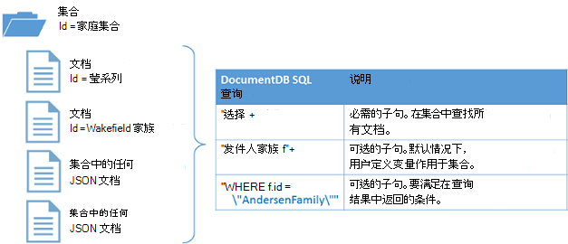

<properties
  pageTitle="NoSQL Node.js 教程 DocumentDB |Microsoft Azure"
  description="创建节点数据库和控制台应用程序使用 DocumentDB Node.js SDK NoSQL Node.js 教程。 DocumentDB 是用于 JSON 使用 NoSQL 数据库。"
    keywords="node.js 教程中，节点数据库"
  services="documentdb"
  documentationCenter="node.js"
  authors="AndrewHoh"
  manager="jhubbard"
  editor="monicar"/>

<tags
  ms.service="documentdb"
  ms.workload="data-services"
  ms.tgt_pltfrm="na"
  ms.devlang="node"
  ms.topic="hero-article"
  ms.date="08/11/2016"
  ms.author="anhoh"/>

# <a name="nosql-nodejs-tutorial-documentdb-nodejs-console-application"></a>NoSQL Node.js 教程︰ DocumentDB Node.js 控制台应用程序  

> [AZURE.SELECTOR]
- [.NET](documentdb-get-started.md)
- [Node.js](documentdb-nodejs-get-started.md)

Azure DocumentDB Node.js sdk 欢迎 Node.js 教程 ！ 完本教程后，您必须创建一个控制台应用程序和查询 DocumentDB 资源，包括节点数据库。

我们将介绍︰

- 创建和连接到一个 DocumentDB 帐户
- 您的应用程序设置
- 创建节点数据库
- 创建集合
- 创建 JSON 文档
- 查询集合
- 替换文档
- 删除文档
- 删除节点数据库

没有时间？ 不用担心！ 在[GitHub](https://github.com/Azure-Samples/documentdb-node-getting-started)上提供了完整的解决方案。 快速的说明，请参阅[获得完整的解决方案](#GetSolution)。

完成 Node.js 教程后，请使用投票按钮的顶部和底部的此页向我们提供反馈。 如果您希望我们直接与您联系，您可以随意在注释中包括您的电子邮件地址。

现在让我们开始吧 ！

## <a name="prerequisites-for-the-nodejs-tutorial"></a>先决条件 Node.js 教程

请确保您具有下列︰

- 活动的 Azure 帐户。 如果您没有，您可以注册[免费的 Azure 试用](https://azure.microsoft.com/pricing/free-trial/)。
- [Node.js](https://nodejs.org/)版本 v0.10.29 或更高版本。

## <a name="step-1-create-a-documentdb-account"></a>步骤 1︰ 创建一个 DocumentDB 帐户

让我们创建一个 DocumentDB 帐户。 如果您已经有您想要使用的帐户，您可以跳至[Node.js 应用程序安装程序](#SetupNode)。

[AZURE.INCLUDE [documentdb-create-dbaccount](../../includes/documentdb-create-dbaccount.md)]

## <a id="SetupNode"></a>步骤 2︰ 设置 Node.js 应用程序

1. 打开您最喜爱的终端。
2. 找到您想要保存 Node.js 应用程序的目录的文件夹。
3. 使用以下命令创建两个空的 JavaScript 文件︰
  - 窗口︰
      * ```fsutil file createnew app.js 0```
        * ```fsutil file createnew config.js 0```
  - Linux/OS x:
      * ```touch app.js```
        * ```touch config.js```
4. 通过 npm documentdb 模块安装。 使用下面的命令︰
    * ```npm install documentdb --save```

很好 ！ 既然您已完成设置后，让我们开始编写一些代码。

## <a id="Config"></a>步骤 3︰ 设置应用程序的配置

打开```config.js```在您喜爱的文本编辑器。

然后，复制并粘贴以下代码片段并设置属性， ```config.endpoint``` ， ```config.primaryKey``` DocumentDB 端点 uri 和主键。 在[Azure 门户](https://portal.azure.com)中找不到这两种这些配置。

![Node.js 教程-的 Azure 门户，使用突出显示活动中心、 键按钮突出显示在 DocumentDB 帐户刀片式服务器和键刀片式服务器的节点数据库上突出显示的 URI、 为主键和辅助键值显示的 DocumentDB 帐户，屏幕抓图][keys]

    // ADD THIS PART TO YOUR CODE
    var config = {}

    config.endpoint = "~your DocumentDB endpoint uri here~";
    config.primaryKey = "~your primary key here~";

复制和粘贴```database id```， ```collection id```，和```JSON documents```为您```config```下方对象在其中设置您```config.endpoint```和```config.authKey```属性。 如果您已经有了想要在数据库中存储的数据，您可以使用 DocumentDB 的[数据迁移工具](documentdb-import-data.md)而不是添加的文档定义。

    config.endpoint = "~your DocumentDB endpoint uri here~";
    config.primaryKey = "~your primary key here~";

    // ADD THIS PART TO YOUR CODE
    config.database = {
        "id": "FamilyDB"
    };

    config.collection = {
        "id": "FamilyColl"
    };

    config.documents = {
        "Andersen": {
            "id": "Anderson.1",
            "lastName": "Andersen",
            "parents": [{
                "firstName": "Thomas"
            }, {
                    "firstName": "Mary Kay"
                }],
            "children": [{
                "firstName": "Henriette Thaulow",
                "gender": "female",
                "grade": 5,
                "pets": [{
                    "givenName": "Fluffy"
                }]
            }],
            "address": {
                "state": "WA",
                "county": "King",
                "city": "Seattle"
            }
        },
        "Wakefield": {
            "id": "Wakefield.7",
            "parents": [{
                "familyName": "Wakefield",
                "firstName": "Robin"
            }, {
                    "familyName": "Miller",
                    "firstName": "Ben"
                }],
            "children": [{
                "familyName": "Merriam",
                "firstName": "Jesse",
                "gender": "female",
                "grade": 8,
                "pets": [{
                    "givenName": "Goofy"
                }, {
                        "givenName": "Shadow"
                    }]
            }, {
                    "familyName": "Miller",
                    "firstName": "Lisa",
                    "gender": "female",
                    "grade": 1
                }],
            "address": {
                "state": "NY",
                "county": "Manhattan",
                "city": "NY"
            },
            "isRegistered": false
        }
    };


数据库、 收集和定义文档将作为您的 DocumentDB ```database id```， ```collection id```，和文档的数据。

最后，导出您```config```对象，以便您可以引用在```app.js```文件。

            },
            "isRegistered": false
        }
    };

    // ADD THIS PART TO YOUR CODE
    module.exports = config;

##<a id="Connect"></a>步骤 4︰ 连接到一个 DocumentDB 帐户

打开您空```app.js```在文本编辑器中的文件。 复制并粘贴下面的代码以导入```documentdb```模块和您新创建```config```模块。

    // ADD THIS PART TO YOUR CODE
    "use strict";

    var documentClient = require("documentdb").DocumentClient;
    var config = require("./config");
    var url = require('url');

若要使用以前保存的代码复制并粘贴```config.endpoint```和```config.primaryKey```来创建新的 DocumentClient。

    var config = require("./config");
    var url = require('url');

    // ADD THIS PART TO YOUR CODE
    var client = new documentClient(config.endpoint, { "masterKey": config.primaryKey });

必须初始化 documentdb 客户端的代码，让我们看看如何使用 DocumentDB 资源。

## <a name="step-5-create-a-node-database"></a>步骤 5︰ 创建节点的数据库
复制并粘贴以下为找不到、 数据库 url 和集 url 设置 HTTP 状态代码。 这些 url 将 DocumentDB 客户机将如何找到合适的数据库和集合。

    var client = new documentClient(config.endpoint, { "masterKey": config.primaryKey });

    // ADD THIS PART TO YOUR CODE
    var HttpStatusCodes = { NOTFOUND: 404 };
    var databaseUrl = `dbs/${config.database.id}`;
    var collectionUrl = `${databaseUrl}/colls/${config.collection.id}`;

可以通过使用**DocumentClient**类的[createDatabase](https://azure.github.io/azure-documentdb-node/DocumentClient.html)函数创建一个[数据库](documentdb-resources.md#databases)。 数据库是跨集合划分文档存储的逻辑容器。

复制和粘贴在 app.js 文件中创建新的数据库**getDatabase**函数```id```中指定的```config```对象。 如果该函数将检查该数据库具有相同```FamilyRegistry```id 不存在。 如果它不存在，我们将返回而不是创建一个新数据库。

    var collectionUrl = `${databaseUrl}/colls/${config.collection.id}`;

    // ADD THIS PART TO YOUR CODE
    function getDatabase() {
        console.log(`Getting database:\n${config.database.id}\n`);

        return new Promise((resolve, reject) => {
            client.readDatabase(databaseUrl, (err, result) => {
                if (err) {
                    if (err.code == HttpStatusCodes.NOTFOUND) {
                        client.createDatabase(config.database, (err, created) => {
                            if (err) reject(err)
                            else resolve(created);
                        });
                    } else {
                        reject(err);
                    }
                } else {
                    resolve(result);
                }
            });
        });
    }

复制并粘贴下面，设置要添加帮助器函数**退出**退出消息并调用**getDatabase**函数将打印的**getDatabase**函数的代码。

                } else {
                    resolve(result);
                }
            });
        });
    }

    // ADD THIS PART TO YOUR CODE
    function exit(message) {
        console.log(message);
        console.log('Press any key to exit');
        process.stdin.setRawMode(true);
        process.stdin.resume();
        process.stdin.on('data', process.exit.bind(process, 0));
    }

    getDatabase()
    .then(() => { exit(`Completed successfully`); })
    .catch((error) => { exit(`Completed with error ${JSON.stringify(error)}`) });

在终端，找到您```app.js```文件并运行命令︰```node app.js```

祝贺您 ！ 您已成功创建的 DocumentDB 数据库。

##<a id="CreateColl"></a>第 6 步︰ 创建集合  

> [AZURE.WARNING] **CreateDocumentCollectionAsync**将创建一个新集合，具有定价的影响。 有关详细信息，请访问我们的[定价页](https://azure.microsoft.com/pricing/details/documentdb/)。

可以通过使用**DocumentClient**类的[createCollection](https://azure.github.io/azure-documentdb-node/DocumentClient.html)函数创建一个[集合](documentdb-resources.md#collections)。 集合是 JSON 文档和关联的 JavaScript 应用程序逻辑的容器。

复制和粘贴**getDatabase**函数来创建新的收藏集下的**getCollection**函数```id```中指定的```config```对象。 同样，我们将检查以确保集合具有相同```FamilyCollection```id 不存在。 如果它不存在，我们将返回而不是创建一个新的集合。

                } else {
                    resolve(result);
                }
            });
        });
    }

    // ADD THIS PART TO YOUR CODE
    function getCollection() {
        console.log(`Getting collection:\n${config.collection.id}\n`);

        return new Promise((resolve, reject) => {
            client.readCollection(collectionUrl, (err, result) => {
                if (err) {
                    if (err.code == HttpStatusCodes.NOTFOUND) {
                        client.createCollection(databaseUrl, config.collection, { offerThroughput: 400 }, (err, created) => {
                            if (err) reject(err)
                            else resolve(created);
                        });
                    } else {
                        reject(err);
                    }
                } else {
                    resolve(result);
                }
            });
        });
    }

复制并粘贴下面对**getDatabase**的调用执行的**getCollection**函数的代码。

    getDatabase()

    // ADD THIS PART TO YOUR CODE
    .then(() => getCollection())
    // ENDS HERE

    .then(() => { exit(`Completed successfully`); })
    .catch((error) => { exit(`Completed with error ${JSON.stringify(error)}`) });

在终端，找到您```app.js```文件并运行命令︰```node app.js```

祝贺您 ！ 您已成功创建一个 DocumentDB 集合。

##<a id="CreateDoc"></a>第 7 步︰ 创建一个文档
可以通过使用**DocumentClient**类的[createDocument](https://azure.github.io/azure-documentdb-node/DocumentClient.html)函数创建一个[文档](documentdb-resources.md#documents)。 文档是用户定义的 （任意） JSON 内容。 现在，您可以将文档插入 DocumentDB。

复制并粘贴下面的**getCollection**函数来创建包含 JSON 数据保存在文档的**getFamilyDocument**函数```config```对象。 同样，我们将检查以确保不存在具有相同 id 的文档。

                } else {
                    resolve(result);
                }
            });
        });
    }

    // ADD THIS PART TO YOUR CODE
    function getFamilyDocument(document) {
        let documentUrl = `${collectionUrl}/docs/${document.id}`;
        console.log(`Getting document:\n${document.id}\n`);

        return new Promise((resolve, reject) => {
            client.readDocument(documentUrl, { partitionKey: document.district }, (err, result) => {
                if (err) {
                    if (err.code == HttpStatusCodes.NOTFOUND) {
                        client.createDocument(collectionUrl, document, (err, created) => {
                            if (err) reject(err)
                            else resolve(created);
                        });
                    } else {
                        reject(err);
                    }
                } else {
                    resolve(result);
                }
            });
        });
    };

复制并粘贴下面对**getCollection**的调用执行的**getFamilyDocument**函数的代码。

    getDatabase()
    .then(() => getCollection())

    // ADD THIS PART TO YOUR CODE
    .then(() => getFamilyDocument(config.documents.Andersen))
    .then(() => getFamilyDocument(config.documents.Wakefield))
    // ENDS HERE

    .then(() => { exit(`Completed successfully`); })
    .catch((error) => { exit(`Completed with error ${JSON.stringify(error)}`) });

在终端，找到您```app.js```文件并运行命令︰```node app.js```

祝贺您 ！ 您已成功创建 DocumentDB 文档。


##<a id="Query"></a>步骤 8︰ 查询 DocumentDB 资源

DocumentDB 支持[丰富查询](documentdb-sql-query.md)存储在每个集合中的 JSON 文档。 下面的代码示例演示一个查询，您可以对文档运行在您的收藏中。

复制并粘贴下面的**getFamilyDocument**函数的**queryCollection**函数。 DocumentDB 支持类似于 SQL 的查询，如下所示。 在构建复杂查询的详细信息，敬请[查询运动场](https://www.documentdb.com/sql/demo)和[查询文档](documentdb-sql-query.md)。

                } else {
                    resolve(result);
                }
            });
        });
    }

    // ADD THIS PART TO YOUR CODE
    function queryCollection() {
        console.log(`Querying collection through index:\n${config.collection.id}`);

        return new Promise((resolve, reject) => {
            client.queryDocuments(
                collectionUrl,
                'SELECT VALUE r.children FROM root r WHERE r.lastName = "Andersen"'
            ).toArray((err, results) => {
                if (err) reject(err)
                else {
                    for (var queryResult of results) {
                        let resultString = JSON.stringify(queryResult);
                        console.log(`\tQuery returned ${resultString}`);
                    }
                    console.log();
                    resolve(results);
                }
            });
        });
    };


下图演示如何 DocumentDB SQL 查询语法调用针对集合您创建。



[FROM](documentdb-sql-query.md#from-clause)关键字是可选的查询，因为 DocumentDB 查询已作用于单个集合。 因此，"从家族 f"可以使用更换"从根 r"或任何其他变量命名为您选择。 DocumentDB 将推断该系列、 根或您选择的变量名称，默认情况下引用的当前集合。

复制并粘贴下面对**getFamilyDocument**的调用执行的**queryCollection**函数的代码。

    .then(() => getFamilyDocument(config.documents.Andersen))
    .then(() => getFamilyDocument(config.documents.Wakefield))

    // ADD THIS PART TO YOUR CODE
    .then(() => queryCollection())
    // ENDS HERE

    .then(() => { exit(`Completed successfully`); })
    .catch((error) => { exit(`Completed with error ${JSON.stringify(error)}`) });

在终端，找到您```app.js```文件并运行命令︰```node app.js```

祝贺您 ！ 您已成功查询 DocumentDB 文档。

##<a id="ReplaceDocument"></a>步骤 9︰ 替换的文档
DocumentDB 支持替换的 JSON 文档。

复制并粘贴下面的**queryCollection**函数的**replaceDocument**函数。

                    }
                    console.log();
                    resolve(result);
                }
            });
        });
    }

    // ADD THIS PART TO YOUR CODE
    function replaceFamilyDocument(document) {
        let documentUrl = `${collectionUrl}/docs/${document.id}`;
        console.log(`Replacing document:\n${document.id}\n`);
        document.children[0].grade = 6;

        return new Promise((resolve, reject) => {
            client.replaceDocument(documentUrl, document, (err, result) => {
                if (err) reject(err);
                else {
                    resolve(result);
                }
            });
        });
    };

复制并粘贴下面对**queryCollection**的调用执行的**replaceDocument**函数的代码。 此外，添加代码以调用**queryCollection**再次验证文档已成功更改。

    .then(() => getFamilyDocument(config.documents.Andersen))
    .then(() => getFamilyDocument(config.documents.Wakefield))
    .then(() => queryCollection())

    // ADD THIS PART TO YOUR CODE
    .then(() => replaceFamilyDocument(config.documents.Andersen))
    .then(() => queryCollection())
    // ENDS HERE

    .then(() => { exit(`Completed successfully`); })
    .catch((error) => { exit(`Completed with error ${JSON.stringify(error)}`) });

在终端，找到您```app.js```文件并运行命令︰```node app.js```

祝贺您 ！ 您已经成功地取代了 DocumentDB 文档。

##<a id="DeleteDocument"></a>第 10 步︰ 删除文档
DocumentDB 支持删除的 JSON 文档。

复制并粘贴下面的**replaceDocument**函数的**deleteDocument**函数。

                else {
                    resolve(result);
                }
            });
        });
    };

    // ADD THIS PART TO YOUR CODE
    function deleteFamilyDocument(document) {
        let documentUrl = `${collectionUrl}/docs/${document.id}`;
        console.log(`Deleting document:\n${document.id}\n`);

        return new Promise((resolve, reject) => {
            client.deleteDocument(documentUrl, (err, result) => {
                if (err) reject(err);
                else {
                    resolve(result);
                }
            });
        });
    };

复制并粘贴下面第二个**queryCollection**调用以执行**deleteDocument**函数的代码。

    .then(() => queryCollection())
    .then(() => replaceFamilyDocument(config.documents.Andersen))
    .then(() => queryCollection())

    // ADD THIS PART TO YOUR CODE
    .then(() => deleteFamilyDocument(config.documents.Andersen))
    // ENDS HERE

    .then(() => { exit(`Completed successfully`); })
    .catch((error) => { exit(`Completed with error ${JSON.stringify(error)}`) });

在终端，找到您```app.js```文件并运行命令︰```node app.js```

祝贺您 ！ 已成功删除 DocumentDB 文档。

##<a id="DeleteDatabase"></a>步骤 11︰ 删除节点的数据库

删除创建的数据库将删除数据库及其所有的子资源 （集合、 文档等）。

复制并粘贴下面的代码段 （函数**清理**），删除数据库和所有儿童资源。

                else {
                    resolve(result);
                }
            });
        });
    };

    // ADD THIS PART TO YOUR CODE
    function cleanup() {
        console.log(`Cleaning up by deleting database ${config.database.id}`);

        return new Promise((resolve, reject) => {
            client.deleteDatabase(databaseUrl, (err) => {
                if (err) reject(err)
                else resolve(null);
            });
        });
    }

复制并粘贴下面对**deleteDocument**的调用来执行**清理**功能的代码。

    .then(() => deleteFamilyDocument(config.documents.Andersen))

    // ADD THIS PART TO YOUR CODE
    .then(() => cleanup())
    // ENDS HERE

    .then(() => { exit(`Completed successfully`); })
    .catch((error) => { exit(`Completed with error ${JSON.stringify(error)}`) });

##<a id="Run"></a>第 12 步︰ 运行 Node.js 应用程序一起 ！

完全，调用您的函数序列应如下所示︰

    getDatabase()
    .then(() => getCollection())
    .then(() => getFamilyDocument(config.documents.Andersen))
    .then(() => getFamilyDocument(config.documents.Wakefield))
    .then(() => queryCollection())
    .then(() => replaceFamilyDocument(config.documents.Andersen))
    .then(() => queryCollection())
    .then(() => deleteFamilyDocument(config.documents.Andersen))
    .then(() => cleanup())
    .then(() => { exit(`Completed successfully`); })
    .catch((error) => { exit(`Completed with error ${JSON.stringify(error)}`) });

在终端，找到您```app.js```文件并运行命令︰```node app.js```

您应看到您获取已启动的应用程序的输出。 输出应该与下面的示例文本相匹配。

    Getting database:
    FamilyDB

    Getting collection:
    FamilyColl

    Getting document:
    Anderson.1

    Getting document:
    Wakefield.7

    Querying collection through index:
    FamilyColl
        Query returned [{"firstName":"Henriette Thaulow","gender":"female","grade":5,"pets":[{"givenName":"Fluffy"}]}]

    Replacing document:
    Anderson.1

    Querying collection through index:
    FamilyColl
        Query returned [{"firstName":"Henriette Thaulow","gender":"female","grade":6,"pets":[{"givenName":"Fluffy"}]}]

    Deleting document:
    Anderson.1

    Cleaning up by deleting database FamilyDB
    Completed successfully
    Press any key to exit

祝贺您 ！ 您已经创建了您已经完成了 Node.js 教程，让第一个 DocumentDB 控制台应用程序 ！

## <a id="GetSolution"></a>获取完整的 Node.js 教程解决方案
若要生成包含本文中的所有示例的 GetStarted 解决方案，您将需要︰

-   [DocumentDB 帐户][documentdb-create-account]。
-   在 GitHub 上可用的[GetStarted](https://github.com/Azure-Samples/documentdb-node-getting-started)解决方案。

通过 npm **documentdb**模块安装。 使用下面的命令︰
* ```npm install documentdb --save```

接下来，在```config.js```文件时，更新的 config.endpoint 和 config.authKey 的值，如中所述[步骤 3︰ 设置您的应用程序配置](#Config)。

## <a name="next-steps"></a>下一步行动

-   想要一个更复杂的 Node.js 样本？ 请参阅[生成 Node.js web 应用程序使用 DocumentDB](documentdb-nodejs-application.md)。
-  了解如何[监视 DocumentDB 帐户](documentdb-monitor-accounts.md)。
-  对[查询运动场](https://www.documentdb.com/sql/demo)在我们的示例数据集运行查询。
-  了解有关在[文档页中找到 DocumentDB](https://azure.microsoft.com/documentation/services/documentdb/)的发展部分的编程模型。

[documentdb-create-account]: documentdb-create-account.md
[documentdb-manage]: documentdb-manage.md

[keys]: media/documentdb-nodejs-get-started/node-js-tutorial-keys.png
