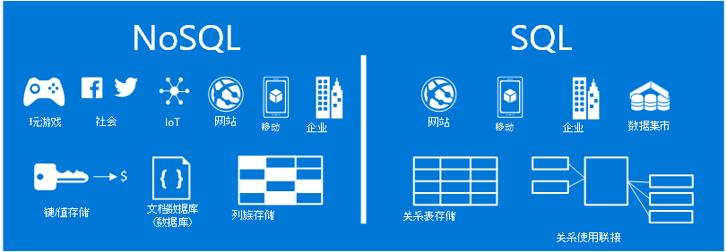
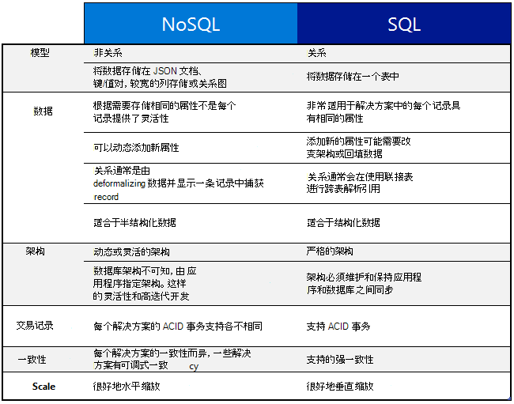

<properties
    pageTitle="何时使用 NoSQL vs SQL |Microsoft Azure"
    description="比较使用 NoSQL 非关系解决方案与 SQL 的解决方案的好处。 了解 Microsoft Azure NoSQL 服务或 SQL Server 最佳之一是否适合您的方案。"
    keywords="nosql vs sql，何时使用 NoSQL，sql vs nosql"
    services="documentdb"
    documentationCenter=""
    authors="mimig1"
    manager="jhubbard"
    editor=""/>

<tags
    ms.service="documentdb"
    ms.workload="data-services"
    ms.tgt_pltfrm="na"
    ms.devlang="dotnet"
    ms.topic="article" 
    ms.date="06/24/2016"
    ms.author="mimig"/>

# NoSQL vs SQL

20 余年，SQL Server 和关系数据库 (RDBMS) 已被转到数据库。 但是，迫切的需要处理更高卷和种类上较快速率的数据已更改为应用程序开发人员提供的数据存储需要的性质。 为了使这种情况下，NoSQL 数据库，使存储在规模较大的非结构化和异构数据得到普及。 

NoSQL 是一个数据库从 SQL 数据库完全不同的类别。 NoSQL 常用来指代"而不是 SQL"或包含"不只 SQL"的数据管理方法的数据管理系统。 有许多在 NoSQL 类别中，包括文档数据库、 键值存储、 列族商店和游戏、 社交，与受欢迎的图形数据库和 IoT 应用程序的技术。

本文的目的是帮助您了解 SQL，NoSQL 之间的差异，为您提供从 Microsoft 提供的 NoSQL 和 SQL 的简介。  

## 何时使用 NoSQL？

让我们假设您正在构建一个新的社交服务网站。 用户可以创建张贴内容，并向其中添加图片、 视频和音乐。 其他用户可以对帖子发表评论并提供点 （喜欢） 进行评级的帖子。 登录页将具有源的用户可以共享，并与之交互的公告。 

那么，如何将此数据存储 如果您熟悉 SQL，您可以开始绘制如下所示︰

到目前为止，所以没什么问题，但是现在考虑单个 post 和如何显示它的结构。 如果您想要在网站或应用程序上显示开机自检和关联的图像、 音频、 视频、 评论、 点、 和用户信息，必须将执行八个表连接，只是为了检索内容的查询。 现在，假设动态加载并显示在屏幕上的帖子的流，可以轻松地预测，它将需要数千个查询和联接多，完成任务。

现在您可以使用像 SQL Server 关系解决方案来存储数据的但还有另一个选项，可简化方法 NoSQL 选项。 通过将转换到 JSON 文档发布如下并将其存储在 DocumentDB，Azure NoSQL 文档数据库服务，可以提高性能并检索一个查询并不连接整自检。 它是更简单、 更直观，并导致更多的性能。

    {
        "id":"ew12-res2-234e-544f",
        "title":"post title",
        "date":"2016-01-01",
        "body":"this is an awesome post stored on NoSQL",
        "createdBy":User,
        "images":["http://myfirstimage.png","http://mysecondimage.png"],
        "videos":[
            {"url":"http://myfirstvideo.mp4", "title":"The first video"},
            {"url":"http://mysecondvideo.mp4", "title":"The second video"}
        ],
        "audios":[
            {"url":"http://myfirstaudio.mp3", "title":"The first audio"},
            {"url":"http://mysecondaudio.mp3", "title":"The second audio"}
        ]
    }

此外，这些数据可以通过公告 id 允许自然扩张，并利用 NoSQL 比例特征数据进行分区。 此外 NoSQL 系统允许开发人员拧松一致性并提供高度可用的应用程序。  最后，此解决方案不需要开发人员可以定义、 管理和维护数据层允许快速迭代中的架构。

然后，可以生成其他 Azure 服务使用此解决方案︰

- 可以通过 web 应用程序使用[azure 搜索](https://azure.microsoft.com/services/search/)，使用户能够搜索的帖子。
- 可以使用[azure 应用程序服务](https://azure.microsoft.com/services/app-service/)主机应用程序和后台进程。
- [Azure Blob 存储](https://azure.microsoft.com/services/storage/)可用于存储完整的用户配置文件，包括图像。
- 可以使用[SQL azure 数据库](https://azure.microsoft.com/services/sql-database/)来存储大量的数据，如登录信息和数据的使用情况分析。
- [Azure 机器学习](https://azure.microsoft.com/services/machine-learning/)可以用于生成知识和智能，可以向过程提供反馈，并帮助向适当的用户提供适当的内容。

该社交服务网站只是一种使用 NoSQL 数据库作业的适当的数据模型的一个方案。 如果您有兴趣阅读有关这种情况下，如何在社交媒体应用程序中的 DocumentDB 模型数据的详细信息，请参阅[将社会与 DocumentDB](documentdb-social-media-apps.md)。 

## NoSQL vs SQL 比较

下表比较了 NoSQL 和 SQL 的主要区别。 

如果使用 NoSQL 数据库最适合您的要求，继续下一节以了解有关可从 Azure NoSQL 服务。 如果 SQL 数据库最适合您的需要，否则，跳到[Microsoft SQL 服务是什么？](#what-are-the-microsoft-sql-offerings)

## Microsoft Azure NoSQL 产品有哪些？

Azure 具有四个完全管理 NoSQL 服务︰ 

- [Azure DocumentDB](https://azure.microsoft.com/services/documentdb/)
- [Azure 表存储](https://azure.microsoft.com/services/storage/)
- [作为 HDInsight 的一部分 azure HBase](https://azure.microsoft.com/services/hdinsight/)
- [Azure 的 Redis 高速缓存](https://azure.microsoft.com/services/cache/)

以下的比较图映射出对每个服务的关键区别。 最能准确描述最符合您的应用程序的需要？ 

如果一个或多个这些服务可能会满足您应用程序的需要，了解与以下资源︰ 

- [DocumentDB 学习路径](https://azure.microsoft.com/documentation/learning-paths/documentdb/)和[DocumentDB 使用案例](documentdb-use-cases.md)
- [开始使用 Azure 表存储](../storage/storage-dotnet-how-to-use-tables.md)
- [HDInsight 在 HBase 是什么](../hdinsight/hdinsight-hbase-overview.md)
- [Redis 学习路径的缓存](https://azure.microsoft.com/documentation/learning-paths/redis-cache/)

然后转到[下一步行动](#next-steps)的免费试用版的信息。

## Microsoft SQL 产品有哪些？

Microsoft 提供了五个 SQL 产品︰ 

- [SQL azure 数据库](https://azure.microsoft.com/services/sql-database/)
- [SQL Server 在 Azure 的虚拟机上](https://azure.microsoft.com/services/virtual-machines/sql-server/)
- [SQL Server](https://www.microsoft.com/server-cloud/products/sql-server-2016/)
- [SQL azure 数据仓库 （预览）](https://azure.microsoft.com/services/sql-data-warehouse/)
- [分析平台系统 （内部装置）](https://www.microsoft.com/en-us/server-cloud/products/analytics-platform-system/)

如果您有兴趣在 SQL Server 上的虚拟机或 SQL 数据库中，然后读取[云 SQL Server 选项中选择︰ Azure SQL (PaaS) 数据库或在 Azure Vm (IaaS) 上的 SQL Server](../sql-database/sql-database-paas-vs-sql-server-iaas.md)以了解更多有关这两个之间的差异。

如果 SQL 听起来是最好的选择，然后转到[SQL Server](https://www.microsoft.com/server-cloud/products/) ，以了解有关 Microsoft SQL 产品和服务所提供。

然后转到[下一步行动](#next-steps)免费试用版和评估链接。

## 下一步行动

我们邀请您来了解更多有关我们的 SQL 和 NoSQL 产品的免费试用。 

- 对于所有的 Azure 服务，您可以注册[免费试用一个月](https://azure.microsoft.com/pricing/free-trial/)和接收 200 美元在 Azure 服务上花费。
    - [Azure DocumentDB](https://azure.microsoft.com/services/documentdb/)
    - [作为 HDInsight 的一部分 azure HBase](https://azure.microsoft.com/services/hdinsight/)
    - [Azure 的 Redis 高速缓存](https://azure.microsoft.com/services/cache/)
    - [SQL azure 数据仓库 （预览）](https://azure.microsoft.com/services/sql-data-warehouse/)
    - [SQL azure 数据库](https://azure.microsoft.com/services/sql-database/)
    - [Azure 表存储](https://azure.microsoft.com/services/storage/)

- 可以启动一个[评估版本的虚拟机上的 SQL Server 2016年](https://azure.microsoft.com/marketplace/partners/microsoft/sqlserver2016ctp33evaluationwindowsserver2012r2/)或下载[评估版的 SQL Server](https://www.microsoft.com/en-us/evalcenter/evaluate-sql-server-2016)。
    - [SQL Server](https://www.microsoft.com/server-cloud/products/sql-server-2016/)
    - [SQL Server 在 Azure 的虚拟机上](https://azure.microsoft.com/services/virtual-machines/sql-server/)

