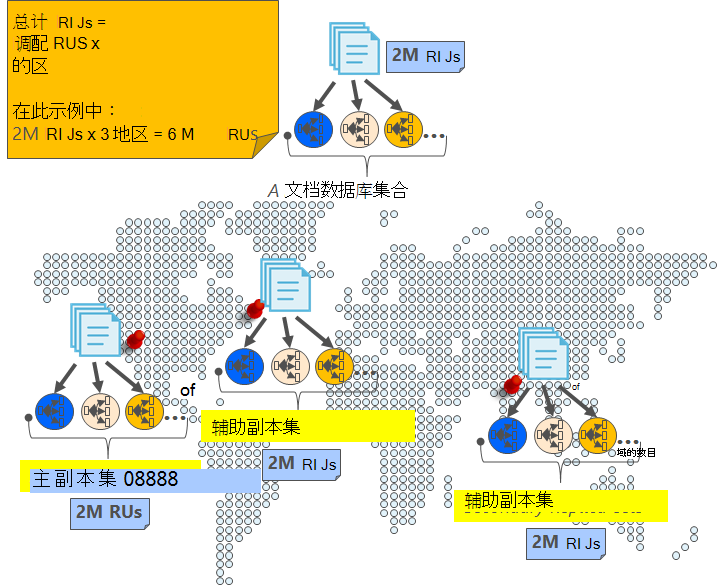
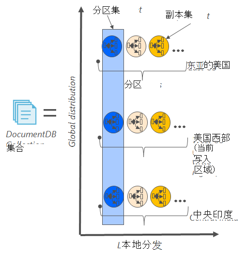
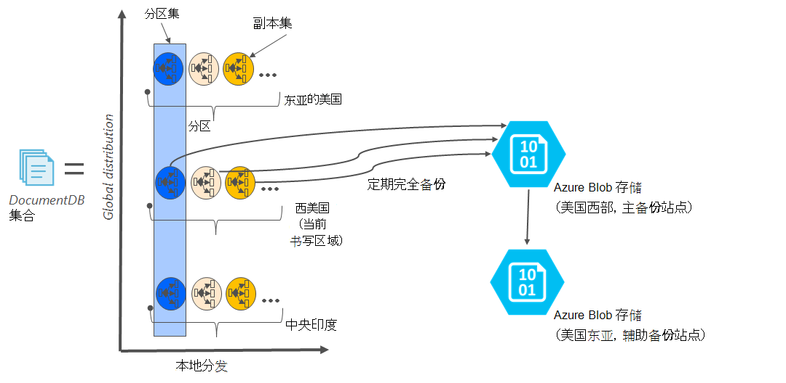

<properties
    pageTitle="在线备份和恢复与 DocumentDB |Microsoft Azure"
    description="了解如何执行与 Azure DocumentDB NoSQL 数据库的自动备份和恢复。"
    keywords="备份和还原联机备份"
    services="documentdb"
    documentationCenter=""
    authors="RahulPrasad16"
    manager="jhubbard"
    editor="monicar"/>

<tags
    ms.service="documentdb"
    ms.workload="data-services"
    ms.tgt_pltfrm="na"
    ms.devlang="multiple"
    ms.topic="article"
    ms.date="09/23/2016"
    ms.author="raprasa"/>

# 自动联机备份和恢复与 DocumentDB 

Azure DocumentDB 定期自动执行备份您的所有数据。 不影响性能或可用性 NoSQL 数据库操作的情况下进行自动备份。 所有备份分别都存储在另一个存储服务，以及这些备份全局范围内复制针对地区的灾难恢复能力。 自动备份适用于方案中，当您不小心删除了您的 DocumentDB 集合，以后需要数据恢复或灾难恢复解决方案。  

本文开始介绍的数据冗余和可用性中 DocumentDB，，然后讨论了备份。 

## 高可用性功能，DocumentDB-概述

DocumentDB 被设计为[全球分布](documentdb-distribute-data-globally.md)，它使您能够跨多个 Azure 区域以及策略驱动的故障转移和透明多主页 Api 扩展吞吐量。 作为数据库系统，它提供了[99.99%的可用性服务级别协议](https://azure.microsoft.com/support/legal/sla/documentdb/v1_0/)，DocumentDB 中的所有写操作可以确认给客户端之前被持久提交到本地磁盘的复制副本的本地数据中心内的仲裁。 请注意，DocumentDB 的高可用性依赖于本地存储并不依赖于任何外部存储技术。 此外，如果数据库帐户与多个 Azure 的区域，以及其他区域间复制您写入。 为了在低延迟扩展吞吐量和访问数据，可以有很多阅读随意使用数据库帐户相关联的区域。 在每个读的地区，整个副本集持久保持 （复制的） 数据。  

下面的关系图中所示，单个 DocumentDB 集合被[水平分区](documentdb-partition-data.md)。 在下面的图表中，用圆表示"分区"，并且每个分区副本集通过高可用性。 这是本地分发内单个 Azure 区域 （由 X 轴）。 此外，每个分区 （包含其对应的副本集） 然后全局分布与您的数据库帐户 （例如，在这三个图的区域 – 美国东、 西美国和印度中央） 相关联的多个区域。 "分区组"是全球分布实体组成的 （由 Y 轴） 每个区域中数据的多个副本。 您可以为数据库帐户相关联的区域分配优先级和 DocumentDB 透明地将故障转移到在发生灾难时的下一个区域。 您可以手动模拟来测试您的应用程序的端到端可用性的故障转移。  

下图说明了具有 DocumentDB 功能的冗余程度高。

## 完整的、 自动的在线备份

天哪，我删除我的集合或数据库 ！ 与 DocumentDB，不仅数据，而且数据的备份还会高冗余和复原到地区性灾难。 这些自动的备份当前采取大约每四个小时。 

在不影响性能或可用性的数据库操作的情况下进行备份。 DocumentDB 在后台采用备份，而无需占用您调配的 RUs 或性能影响并不会影响 NoSQL 数据库的可用性。 

与 DocumentDB 中存储数据，自动备份存储在 Azure Blob 存储服务。 为保证低延迟/高效上载，备份的快照会上载到 Azure Blob 存储在同一个地区作为您的 DocumentDB 数据库帐户的当前写入区域的实例。 针对地区性灾难恢复能力，在 Azure Blob 存储备份数据的每个快照再次复制通过到另一个区域的地理冗余存储 (GRS)。 下图显示在美国西部的远程 Azure Blob 存储帐户备份 （与所有三个主分区中西部的美国，在本例中） 整个 DocumentDB 集合 GRS 然后复制到东亚的美国。 

下图阐释了 GRS Azure 存储中的所有 DocumentDB 实体定期完全备份。

## 指定快照的保留期

如上面所述，我们会定期拍摄快照的数据和每个我们的法规遵从性要求，我们保留最新的快照到它最终获取清除前 90 天。 如果集合或帐户被删除，则 DocumentDB 存储 90 天内最后一次备份。

## 从联机备份还原数据库

以防意外删除数据，则可以[文件支持票](https://portal.azure.com/?#blade/Microsoft_Azure_Support/HelpAndSupportBlade)或[调用 Azure 支持](https://azure.microsoft.com/support/options/)从上一次自动备份中还原数据。 对于您要还原的备份的特定快照，DocumentDB 要求该快照的备份周期的持续时间内与我们至少可用时数据。

## 下一步行动

若要复制 NoSQL 数据库中多个数据中心，请参阅[分发全局与 DocumentDB 数据](documentdb-distribute-data-globally.md)。 

到文件联系 Azure 支持，[文件从 Azure 门户的票证](https://portal.azure.com/?#blade/Microsoft_Azure_Support/HelpAndSupportBlade)。