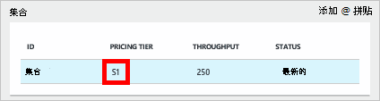
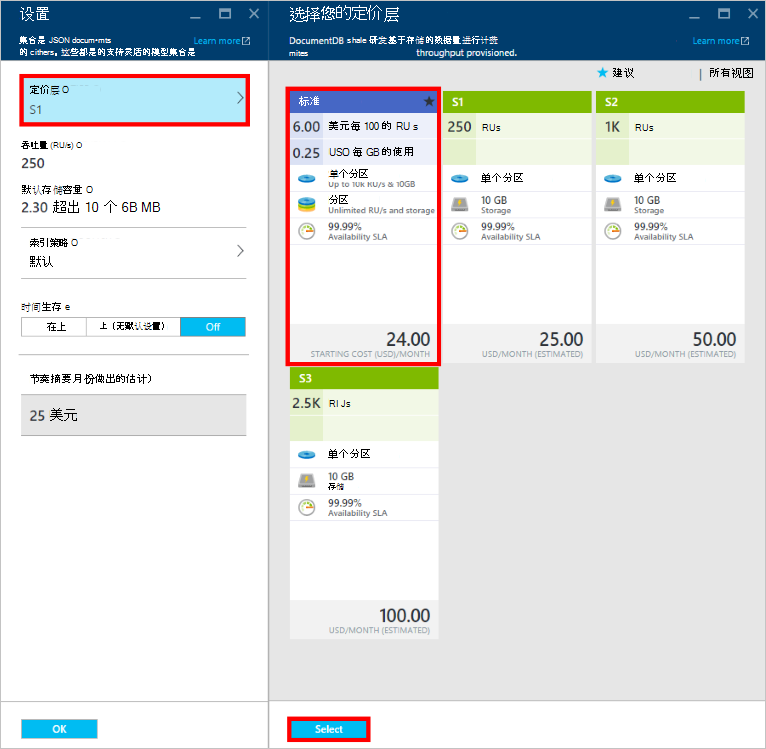
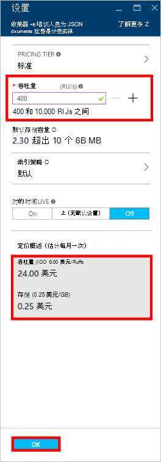
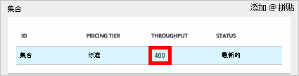

<properties
    pageTitle="在 DocumentDB 的性能级别 |Microsoft Azure"
    description="了解有关如何在 DocumentDB 的性能级别使您能够保留在每个集合的基础上的吞吐量。"
    services="documentdb"
    authors="mimig1"
    manager="jhubbard"
    editor="monicar"
    documentationCenter=""/>

<tags
    ms.service="documentdb"
    ms.workload="data-services"
    ms.tgt_pltfrm="na"
    ms.devlang="na"
    ms.topic="article"
    ms.date="08/26/2016"
    ms.author="mimig"/>

# 在 DocumentDB 的性能级别

本文概述了在[Microsoft Azure DocumentDB](https://azure.microsoft.com/services/documentdb/)的性能级别。

阅读这篇文章之后, 您将能够回答以下问题︰  

-   性能级别是什么？
-   吞吐量是如何保留数据库帐户？
-   如何结合性能级别工作？
-   我如何在结算的性能级别？

## 性能级别简介

标准帐户下创建的每个 DocumentDB 集合配置关联的性能级别。 在数据库中的每个集合可以有不同的性能级别使您可以指定更大的吞吐量为频繁访问的集合和更低的吞吐量不经常访问的集合。 DocumentDB 支持两个用户定义的性能级别和预定义的性能级别。  

每个性能级别都有关联的[请求单元 (RU)](documentdb-request-units.md)速率限制。 这是将留待根据其性能级别，集合的吞吐量，可供使用该集合以独占方式。

<table border="0" cellspacing="0" cellpadding="0">
    <tbody>
        <tr>
            <td valign="top">

</td>
            <td valign="top">
详细信息
</td>
            <td valign="top">
吞吐量限制
</td>
            <td valign="top">
存储限制
</td>
            <td valign="top">
版本
</td>
            <td valign="top">
Api
</td>            
        </tr>
        <tr>
            <td valign="top">
用户定义的性能
</td>
            <td valign="top">
存储测量基础上的使用情况，以 gb 为单位。

单位为 100 RU/s 的吞吐量
</td>
            <td valign="top">
不受限制。 400-250000 申请单位/s，默认情况下 （通过请求更高）
</td>
            <td valign="top">
不受限制。 默认情况下 （通过请求更高） 的 250 GB 
</td>
            <td valign="top">
V2
</td>
            <td valign="top">
API 2015-12-16 和更高版本
</td>  
        </tr>
        <tr>
            <td valign="top">
预定义的性能
</td>
            <td valign="top">
预留的 10 GB 存储。

S1 = 250 RU/s，S2 = 1000 RU/s，S3 = 2500 RU/s
</td>
            <td valign="top">
每秒 2500 RU
</td>
            <td valign="top">
10 GB
</td>
            <td valign="top">
V1
</td>
            <td valign="top">
任何
</td>  
        </tr>        
    </tbody>
</table>                

DocumentDB 允许一组丰富的数据库操作，包括查询、 查询的用户定义函数 (Udf)，存储过程和触发器。 与每一种操作相关联的处理成本的差异取决于 CPU、 I/O 和内存完成该操作所需。 相反的考虑和管理硬件资源，您可以请求单元看作一个度量值的资源要求来执行各种数据库操作和应用程序的请求提供服务。

可以通过[Microsoft Azure 门户](https://portal.azure.com)、 [REST API](https://msdn.microsoft.com/library/azure/mt489078.aspx)或任何[DocumentDB Sdk](https://msdn.microsoft.com/library/azure/dn781482.aspx)创建集合。 DocumentDB Api 允许您指定集合的性能级别。

> [AZURE.NOTE] 可以通过 Api 或[Microsoft Azure 门户](https://portal.azure.com/)调整集合的性能级别。 性能级别都将更改需要在 3 分钟内完成。

## 设置集合的性能级别
创建集合后，集合保留基于指定的性能级别的 RUs 完全分配。

请注意，这两种用户定义的和预定义的性能级别，与 DocumentDB 操作基于预留的吞吐量。 通过创建一个集合，应用程序保留和保留的吞吐量，无论多少，吞吐量积极使用计费方式。 具有用户定义的性能级别存储测量基于消耗量，但是使用预定义的性能级别，10 GB 的存储空间被保留，集合创建的时间。  

在创建集合后，就可以通过 DocumentDB Sdk 或通过 Azure 传统门户的性能级别。

> [AZURE.IMPORTANT] DocumentDB 标准集合计费每小时的速度，使用最少一小时的货款将到您创建的每个集合。

调整在一小时之内集合的性能级别时，如果您将记帐小时过程中设置的最高性能级别。 例如，如果您增加您的性能级别，上午 8:53 集将收取在上午 8:00 开始的新级别。 同样，如果在上午 8:53 降低性能级别，新的费率将应用在上午 9:00。

申请单位是保留每个集合基于设置的性能级别。 申请单位消耗量计算为每秒速率。 直到率降为该集合的保留级别将被控制在集合超过资源调配的请求单元速率 （或性能级别） 的应用程序。 如果您的应用程序要求更高的吞吐量，可以提高每个集合的性能级别。

> [AZURE.NOTE] 当您的应用程序超过一个或多个集合的性能级别时，则请求将被控制在每个集合的基础上。 这意味着，虽然其他人可能会阻止某些应用程序请求可能会成功。 建议添加少量的重试次数时才能处理请求流量高峰的限制。

## 使用性能级别
DocumentDB 集合允许您基于查询模式和应用程序的性能需求对数据进行分组。 DocumentDB 的自动索引和查询支持，是很常见的布置在同一集合中的异构文档。 在决定是否应使用独立的集合关键的考虑因素包括︰

- 查询-集合是执行查询的范围。 如果您需要通过一套文档查询，最有效的阅读的模式来自于单个集合中的配置文档。
- 所有交易记录的交易记录 – 作用于单个集合中。 如果您有必须在单个存储的过程或触发器内更新的文档，必须将它们存储在同一个集合中。 更具体地说，一个集合内的分区键是事务边界。 请有关更多详细信息，参阅[DocumentDB 中的分区](documentdb-partition-data.md)。
- 性能隔离 – 集合都有关联的性能级别。 这样可以确保每个集合具有可预知的性能，通过保留 RUs。 可以将数据分配给不同的集合，具有不同的性能级别，根据访问频率。

> [AZURE.IMPORTANT] 请务必了解您将货款在整个标准费率基础创建的应用程序集的数目。

我们建议，可以使您的应用程序使用的数目较少的收藏集，除非有大存储或吞吐量要求。 请确保您已充分了解创建新收藏集的应用程序模式。 您可以选择保留集合创建作为处理应用程序外部的管理措施。 同样，调整集合的性能级别将更改记帐时间集合的每小时费率。 如果应用程序动态地调整它们，则应监视集合的性能级别。

## 从 S1，S2，S3 改为用户定义的性能

按照以下步骤更改到 Azure 门户中的用户定义的吞吐量级别使用预定义的吞吐量级别。 通过使用用户定义的吞吐量级别，您可以根据需要定制吞吐量。 然后，如果您仍在使用的 S1 帐户，则可以增加到 400 RU/s 只需几次单击默认吞吐量从 250 的 RU s。

有关定价的更改相关的用户定义的和预定义吞吐量的详细信息，请参阅博客文章[DocumentDB︰ 所有需要了解的有关使用新的定价选项](https://azure.microsoft.com/blog/documentdb-use-the-new-pricing-options-on-your-existing-collections/)。

> [AZURE.VIDEO changedocumentdbcollectionperformance]

1. 在浏览器中，导航到[**Azure 的门户**](https://portal.azure.com)。
2. 单击**浏览** -> **DocumentDB 帐户**，然后选择要修改的 DocumentDB 帐户。   
3. 在**数据库**镜头中，选择要修改的数据库，然后在**数据库**刀片式服务器，选择要修改的集合。 使用预定义的吞吐量帐户有一个价格的 S1、 S2 或 S3 层。

      

4. 在**集合**刀片式服务器，单击**更多**，然后**设置**在顶栏。   
5. 在**设置**刀片式服务器，请单击**定价层**和注意，每个计划的每月成本估计会显示**选择您定价层**刀片式服务器中。 若要更改与用户定义的吞吐量，单击**标准**，然后单击**选择**来保存所做的更改。

      

6. 在**设置**刀片式服务器，**定价层**更改为**标准**，**吞吐量 （RU/秒）**框中显示的默认值为 400。 设置 400 到 10000 个[请求单位](documentdb-request-units.md)之间的吞吐量 /second (RU/s)。 **定价摘要**页面底部会自动更新以提供所需的每月成本估计。 单击**确定**以保存所做的更改。

    

7. 重新打开**数据库**刀片式服务器，您可以验证新集合的吞吐量。

    

如果您确定您需要更大的吞吐量 （大于 10000 的 RU s） 或更多的存储 （大于 10 GB） 您可以创建一个分区。 若要创建一个分区，请参阅[创建集合](documentdb-create-collection.md)。

>[AZURE.NOTE] 更改集合的性能级别可能需要多达 2 分钟。

## 更改使用.NET SDK 的性能级别

更改集合的性能级别的另一种方法是通过我们的 Sdk。 本部分只介绍更改集合的性能级别使用[.NET SDK](https://msdn.microsoft.com/library/azure/dn948556.aspx)我们，但我们其他[Sdk](https://msdn.microsoft.com/library/azure/dn781482.aspx)的类似过程。 如果您不熟悉我们的.NET SDK，请访问我们的[入门教程](documentdb-get-started.md)。

下面是用于更改优惠吞吐量为每秒 50000 请求单位代码段︰

    //Fetch the resource to be updated
    Offer offer = client.CreateOfferQuery()
                      .Where(r => r.ResourceLink == collection.SelfLink)    
                      .AsEnumerable()
                      .SingleOrDefault();

    // Set the throughput to 5000 request units per second
    offer = new OfferV2(offer, 5000);

    //Now persist these changes to the database by replacing the original resource
    await client.ReplaceOfferAsync(offer);

    // Set the throughput to S2
    offer = new Offer(offer);
    offer.OfferType = "S2";

    //Now persist these changes to the database by replacing the original resource
    await client.ReplaceOfferAsync(offer);

> [AZURE.NOTE] 第二配有每下 10000 个请求单位的集合可以提供与用户定义的吞吐量和随时预定义的吞吐量 （S1、 S2、 S3） 之间迁移。 集合，其中每 10000 个请求单位上面配有第二次不能转换为预定义的吞吐量级别。

请访问[MSDN](https://msdn.microsoft.com/library/azure/microsoft.azure.documents.client.documentclient.aspx)查看其他示例，并了解更多有关我们提供方法︰

- [**ReadOfferAsync**](https://msdn.microsoft.com/library/azure/microsoft.azure.documents.client.documentclient.readofferasync.aspx)
- [**ReadOffersFeedAsync**](https://msdn.microsoft.com/library/azure/microsoft.azure.documents.client.documentclient.readoffersfeedasync.aspx)
- [**ReplaceOfferAsync**](https://msdn.microsoft.com/library/azure/microsoft.azure.documents.client.documentclient.replaceofferasync.aspx)
- [**CreateOfferQuery**](https://msdn.microsoft.com/library/azure/microsoft.azure.documents.linq.documentqueryable.createofferquery.aspx)

## 更改集合中的吞吐量

如果您已经在使用用户定义的性能，您可以通过以下方法更改集合的吞吐量。 如果您需要从 S1、 S2 或 S3 性能级别 （预定义的性能） 更改为用户定义的性能，请参阅[从 S1、 S2、 S3 到用户定义的性能变化](#changing-performance-levels-using-the-azure-portal)。

1. 在浏览器中，导航到[**Azure 的门户**](https://portal.azure.com)。
2. 单击**浏览** -> **DocumentDB 帐户**，然后选择要修改的 DocumentDB 帐户。   
3. 在**DocumentDB 帐户**刀片式服务器，**数据库**镜头，在选择要修改的数据库，然后在**数据库**刀片式服务器，选择要修改的集合。
4. 在**集合**刀片式服务器，在顶栏中单击**设置**。   
5. 在**设置**刀片式服务器，增加**的吞吐量 (RU/s)**中的值，然后单击**确定**以保存所做的更改。 **定价摘要**底部刀片式服务器的更新，以显示单个区域在该集合中的新估计每月成本。

    

如果你不确定大小以提高吞吐量，请参阅[估算吞吐量需要](documentdb-request-units.md#estimating-throughput-needs)和[请求单位计算器](https://www.documentdb.com/capacityplanner)。

## 下一步行动

若要了解有关定价和使用 Azure DocumentDB 管理数据的详细信息，请浏览这些资源︰

- [DocumentDB 的定价](https://azure.microsoft.com/pricing/details/documentdb/)
- [管理 DocumentDB 容量](documentdb-manage.md)
- [在 DocumentDB 中的数据建模](documentdb-modeling-data.md)
- [在 DocumentDB 的数据分区](documentdb-partition-data.md)
- [申请单位](http://go.microsoft.com/fwlink/?LinkId=735027)

若要了解有关 DocumentDB 的详细信息，请参阅 Azure DocumentDB[文档](https://azure.microsoft.com/documentation/services/documentdb/)。

规模和性能测试与 DocumentDB 有关入门，请参阅[性能和规模测试使用 Azure DocumentDB](documentdb-performance-testing.md)。

[1]: ./media/documentdb-performance-levels/documentdb-change-collection-performance7-9.png
[2]: ./media/documentdb-performance-levels/documentdb-change-collection-performance10-11.png
