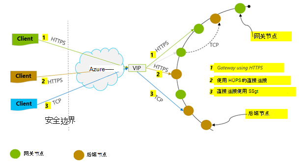
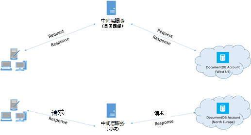

<properties 
    pageTitle="性能提示 DocumentDB |Microsoft Azure" 
    description="了解客户端配置选项以提高 Azure DocumentDB 数据库性能"
    keywords="如何提高数据库的性能"
    services="documentdb" 
    authors="mimig1" 
    manager="jhubbard" 
    editor="" 
    documentationCenter=""/>

<tags 
    ms.service="documentdb" 
    ms.workload="data-services" 
    ms.tgt_pltfrm="na" 
    ms.devlang="na" 
    ms.topic="article" 
    ms.date="10/17/2016" 
    ms.author="mimig"/>

# DocumentDB 的性能提示

Azure DocumentDB 是快速、 灵活分布式的数据库，它可以无缝扩展以保证的延迟和吞吐量。 不需要进行重大的体系结构更改或编写复杂的代码，以扩展您的数据库与 DocumentDB。 向上和向下缩放是与单个 API 呼叫或[SDK 方法调用](documentdb-performance-levels.md#changing-performance-levels-using-the-net-sdk)一样简单。 但是，由于 DocumentDB 通过网络调用是客户端优化可实现最佳性能。

因此，如果您在问"如何提高数据库性能？" 请考虑以下选项︰

## 网络连接

1. **连接策略︰ 使用直接连接模式**
    
    客户端连接到 Azure DocumentDB 的方式有着重要的意义上的性能，尤其是观察到的客户端的延迟。 有两个主要配置设置可用于配置客户端连接策略 – 连接*模式*和[连接*协议*](#connection-protocol)。  有两种可用模式︰

    1. 网关模式 （默认设置）
    2. 直接模式

    由于 DocumentDB 是一个分布式的存储系统，DocumentDB 资源，如集合划分在多个计算机之间，每个分区复制以实现高可用性。 在路由表中，这也是作为资源内部可用保留逻辑到物理地址的翻译。

    在网关模式下，DocumentDB 网关计算机执行此路由，从而允许客户端代码简单、 紧凑。 客户端应用程序发出请求 DocumentDB 网关计算机上，其翻译逻辑中对后端节点的物理地址的请求 URI 并相应地转发请求到。  与此相反，直接模式在客户端必须维护 – 和定期刷新 – 此路由表的副本以及直接连接到后端的 DocumentDB 节点。

    网关模式支持在所有 SDK 平台上，配置的默认。  如果您的应用程序在企业网络内运行使用严格的防火墙限制，网关模式将是最佳的选择，因为它使用标准的 HTTPS 端口和一个终结点。 性能代价，但是，是网关模式涉及其他网络跃点，每次读取或写入到 DocumentDB 数据。   因此，直接模式提供较少的网络跃点更好的性能。

2. **连接策略︰ 使用 TCP 协议**

    在利用直接模式，有两个可用的协议选项︰

    - TCP
    - HTTPS

    DocumentDB 提供一个简单和通过 HTTPS 打开 RESTful 编程模型。 此外，它提供了高效的 TCP 协议，它在其通信模型中也是 RESTful 并且可通过.NET 客户端 SDK。 直接 TCP 和 HTTPS 使用 SSL 进行初始身份验证和加密通信。 为了获得最佳性能，使用 TCP 协议在可能的情况。 

    当使用 TCP 在网关模式时，TCP 端口 443 的 DocumentDB 端口，并且 10250 MongoDB API 端口。 在使用时 TCP 直接模式，以及网关端口，您需要确保端口 10000 到 20000 之间的范围是打开的因为 DocumentDB 使用动态的 TCP 端口。 如果这些端口未处于打开状态，并且您尝试使用 TCP，则您将收到 503 服务不可用错误。 

    ConnectionPolicy 参数与 DocumentClient 实例的构造期间配置的连接模式。 如果使用直接模式，则还可以在 ConnectionPolicy 参数设置协议。

        var serviceEndpoint = new Uri("https://contoso.documents.net");
        var authKey = new "your authKey from Azure Mngt Portal";
        DocumentClient client = new DocumentClient(serviceEndpoint, authKey, 
        new ConnectionPolicy
        {
            ConnectionMode = ConnectionMode.Direct,
            ConnectionProtocol = Protocol.Tcp
        });

    如果使用网关模式中直接模式下，才支持 TCP，因为始终使用 HTTPS 协议与网关进行通信，并在 ConnectionPolicy 协议值将被忽略。

    

3. **调用 OpenAsync 以避免启动第一次请求的等待时间**

    默认情况下，第一次请求必须等待时间较长因为它获取地址路由表。 若要避免在首次请求此启动延迟，应调用 OpenAsync() 一次初始化过程，如下所示。

        await client.OpenAsync();

4. **配置性能同 Azure 的地区中的客户端**

    在可能的情况下，将放置在同一个地区的 DocumentDB 数据库调用 DocumentDB 的任何应用程序。 对于近似的比较，DocumentDB 调用中的同一个区域内 1-2 毫秒内完成，但西部和美国的东海岸之间的延迟 > 50 毫秒。 此延迟可能会请求以请求根据请求从客户端传递到 Azure 数据中心边界与所采用的路由。 最低的可能延迟通过确保调用应用程序位于同一个 Azure 地区作为调配 DocumentDB 终结点。 有关可用区域的列表，请参见[Azure 区域](https://azure.microsoft.com/regions/#services)。

    

5. **增加线程/任务的数量**

    由于在网络上进行了对 DocumentDB 的调用，您可能需要不同的请求的并行度，以便客户端应用程序所花的两次请求之间等待的时间非常少。 例如，如果您正在使用。NET 的[任务并行库](https://msdn.microsoft.com//library/dd460717.aspx)，创建数百个读取或写入到 DocumentDB 的任务顺序。

## SDK 用法

1. **安装最新 SDK**

    不断被 DocumentDB Sdk 得到改进，以提供最佳的性能。 请参阅[DocumentDB SDK](documentdb-sdk-dotnet.md)页，以确定最新 SDK 评估改进。 

2. **您的应用程序的生存期内使用单独的 DocumentDB 客户端**
  
    注意，每个 DocumentClient 实例是线程安全的执行高效的连接管理和直接模式在操作时，高速缓存地址。 要允许高效的连接管理和更好的性能，通过 DocumentClient，建议使用应用程序的生存期内每个 AppDomain 的 DocumentClient 的一个实例。

3. **增加每台主机的 System.Net MaxConnections**

    DocumentDB 请求默认情况下，通过 HTTPS/其余部分进行，并受到每个主机名或 IP 地址的默认连接限制。 您可能需要将 MaxConnections 设置为更高的值 (100-1000)，以便客户端库可以利用多个同时连接到 DocumentDB。 在.NET SDK 1.8.0 及以上， [ServicePointManager.DefaultConnectionLimit](https://msdn.microsoft.com/library/system.net.servicepointmanager.defaultconnectionlimit.aspx)的默认值为 50，若要更改值，可以将[Documents.Client.ConnectionPolicy.MaxConnectionLimit](https://msdn.microsoft.com/en-us/library/azure/microsoft.azure.documents.client.connectionpolicy.maxconnectionlimit.aspx)设置为较高的值。  

4. **优化分区集的并行查询**

     DocumentDB.NET SDK 版本 1.9.0 以上支持并行查询，使您能够查询分区并行集合 （请参阅[使用 Sdk](documentdb-partition-data.md#working-with-the-sdks)以及相关的[代码示例](https://github.com/Azure/azure-documentdb-dotnet/blob/master/samples/code-samples/Queries/Program.cs)了解详细信息）。 并行查询旨在改善对应串行查询延迟和吞吐量。 并行查询提供用户可以调整以自定义适合他们的需求，（a) MaxDegreeOfParallelism 的两个参数︰ 要控制分区的最大数量，不是可以查询在并行和 （b) MaxBufferedItemCount︰ 来控制预读取的结果数目。 
    
    （a)***调整 MaxDegreeOfParallelism\: *** 
   通过查询并行的多个分区的并行查询的工作原理。 但是，相对于该查询按顺序提取各个分区收集的数据。 因此，将 MaxDegreeOfParallelism 设置为分区数有最大机会获得大多数性能查询，提供所有其它系统条件保持不变。 如果您不知道的分区数，可以将 MaxDegreeOfParallelism 设置为高的值，并且系统将选择 MaxDegreeOfParallelism 作为最小值 （数量的分区，用户提供的输入）。 
    
    值得注意的是并行查询产生的最佳优势，如果将数据均匀地分布在相对于该查询的所有分区。 如果分区分区的集合了全部或大部分由查询返回的数据集中在几个分区 （最坏的情况中的一个分区），然后将这些分区的出现瓶颈的查询性能的方法。 
    
    （b)***调整 MaxBufferedItemCount\: *** 
   并行查询旨在由客户端在处理当前批处理的结果时，预取结果。 预取有助于总体滞后时间改进的查询。 MaxBufferedItemCount 是使用参数来限制的预读取的结果。 通过设置为预期返回的结果数的 MaxBufferedItemCount （或更多），查询以从预取获得的最大好处。 
    
    注意，预取而不考虑 MaxDegreeOfParallelism，同样的方式工作，没有单个的所有分区中的数据的缓冲区。  

5. **打开服务器端 GC**
    
    在某些情况下，可能会帮助减少垃圾回收的频率。 在.NET 中，设置为 true 的[gcServer](https://msdn.microsoft.com/library/ms229357.aspx) 。

6. **按 RetryAfter 的时间间隔执行延迟**
 
    在性能测试过程中应增加负载，直到较小的请求率得到遏制。 如果限制，客户端应用程序应当在油门上的延迟服务器指定的重试间隔。 尊重的延迟可以确保您花费极少的等待重试之间的时间。 重试策略支持将包含在版本 1.8.0 或更 DocumentDB [.NET](documentdb-sdk-dotnet.md)和[Java](documentdb-sdk-java.md)，以及版本 1.9.0 和上面的[Node.js](documentdb-sdk-node.md) ， [Python](documentdb-sdk-python.md)。 有关详细信息，请参阅[Exceeding 保留的吞吐量限制](documentdb-request-units.md#exceeding-reserved-throughput-limits)和[RetryAfter](https://msdn.microsoft.com/library/microsoft.azure.documents.documentclientexception.retryafter.aspx)。

7. **您的客户端负载扩展**

    如果您要测试的高吞吐量级别 (> 50000 RU/s)，客户端应用程序可能会由于计算机设置上限出 CPU 或网络利用率上的瓶颈。 如果达到这一点，您可以继续推动进一步的 DocumentDB 帐户通过外扩跨多个服务器的客户端应用程序。

8. **缓存文档 Uri 低读取延迟**

    缓存文档 Uri 尽可能最佳的读性能。

9. **可以调整为更好的性能的查询/读取源页大小**

    执行批量的读取时使用读取文档送纸功能 (例如，ReadDocumentFeedAsync) 或结果集是否过大时发出 DocumentDB SQL 查询，以分段的方式返回结果。 默认情况下，在 100 个项目的 1 MB 数据块中返回结果，取决于哪种限制是命中第一。 

    以减少检索所有适用的结果所需网络往返，可以增加页面大小使用 x-ms-最大的项目-计数请求标头，为多达 1000年。 情况下您需要显示只有几个结果，例如，如果您的用户界面或应用程序 API 返回只有 10 结果一次，还可以减少页面大小为 10，以降低消耗为读取和查询吞吐量。

    您还可以设置使用可用的 DocumentDB Sdk 的页面大小。  例如︰
    
        IQueryable<dynamic> authorResults = client.CreateDocumentQuery(documentCollection.SelfLink, "SELECT p.Author FROM Pages p WHERE p.Title = 'About Seattle'", new FeedOptions { MaxItemCount = 1000 });

10. **增加线程/任务的数量**

    请参阅在网络连接部分中[增加线程/任务的数量](#increase-threads)。

## 索引策略

1. **使用更快的高峰时间摄入率为惰性索引**

    DocumentDB 允许您指定 – 在集合级别 – 索引创建策略，以便您可以选择是否或不进行自动索引的集合中的文档。  此外，您也可以选择同步 （一致） 和异步 (Lazy) 索引更新之间。 默认情况下，对每个插入、 替换或删除的集合的文档同步更新索引。 同步模式下，接受相同的[一致性级别](documentdb-consistency-levels.md)，而无需任何延迟"追赶"的索引的文档读取的查询。
    
    迟缓索引可能考虑为猝发，在其中写入数据的方案，并且想要分摊到索引内容需要较长的一段时间的工作。 惰性索引还可以有效地使用资源调配的吞吐量和最小滞后时间与高峰时期的服务于写入请求。 请务必注意，启用迟缓索引时，查询结果将为最终统一为 DocumentDB 帐户配置的一致性级别无关。

    因此，一致 （IndexingPolicy.IndexingMode 设置为一致） 的索引模式会导致最高申请单位费用每次写入，而迟缓索引的模式 （IndexingPolicy.IndexingMode 设置为迟缓） 和没有编制索引 （IndexingPolicy.Automatic 设置为 False） 时写的有零索引的成本。

2. **从写速度更快的索引中排除未使用的路径**

    DocumentDB 的索引策略还允许您指定要包含或排除利用索引路径 （IndexingPolicy.IncludedPaths 和 IndexingPolicy.ExcludedPaths） 的索引的文档路径。 使用索引路径索引的成本直接关联到的索引的唯一路径的数量可以提供改进的写性能和较低的索引存储在其中预先已知查询模式的方案。  例如，下面的代码演示如何排除整个一节的文档 （也 子树） 从索引使用"*"通配符。

        var collection = new DocumentCollection { Id = "excludedPathCollection" };
        collection.IndexingPolicy.IncludedPaths.Add(new IncludedPath { Path = "/*" });
        collection.IndexingPolicy.ExcludedPaths.Add(new ExcludedPath { Path = "/nonIndexedContent/*");
        collection = await client.CreateDocumentCollectionAsync(UriFactory.CreateDatabaseUri("db"), excluded);

    有关详细信息，请参阅[DocumentDB 索引创建策略](documentdb-indexing-policies.md)。

## 吞吐量

1. **测量和调整为较低的请求单位每秒使用情况**

    DocumentDB 提供了一组丰富的数据库操作，包括与 Udf、 存储的过程和触发器 — 所有操作在数据库集合中的文档的关系和分层查询。 与每一种操作相关联的成本差异取决于 CPU、 IO 和完成该操作所需的内存。 而不是考虑和管理硬件资源，您可以将请求单位 (RU) 的视为单个度量值执行各种数据库操作和应用程序的请求提供服务所需的资源。

    [申请单位](documentdb-request-units.md)提供了根据您购买的产能单位数量的每个数据库帐户。 申请单位消耗量计为每秒的速率。 应用程序超过其帐户受到限制，直到率降为帐户保留级别资源调配的请求单元速率。 如果您的应用程序要求更高的吞吐量，您可以购买额外的容量单位。

    查询的复杂性会影响多少请求单位所使用的操作。 谓词的数目、 性质的谓词、 数量的 Udf 和所有源数据集的大小会影响查询操作的成本。

    测量任何操作的开销 （创建、 更新或删除），检查 x ms 申请费用头 (或等效的 RequestCharge 属性，例如在 ResourceResponse<T>或 FeedResponse<T> .NET SDK 中) 来测量由这些操作请求单位数。

        // Measure the performance (request units) of writes
        ResourceResponse<Document> response = await client.CreateDocumentAsync(collectionSelfLink, myDocument);
        Console.WriteLine("Insert of document consumed {0} request units", response.RequestCharge);
        // Measure the performance (request units) of queries
        IDocumentQuery<dynamic> queryable = client.CreateDocumentQuery(collectionSelfLink, queryString).AsDocumentQuery();
        while (queryable.HasMoreResults)
             {
                  FeedResponse<dynamic> queryResponse = await queryable.ExecuteNextAsync<dynamic>();
                  Console.WriteLine("Query batch consumed {0} request units", queryResponse.RequestCharge);
             }
        
    此标头中返回的申请费用是您已设置的吞吐量的一小部分 (即 2000 RUs / 秒)。 例如，如果上面的查询返回 1000年 1 KB 的文档，操作的成本将是 1000年。 在这种情况下，在一秒钟内服务器采用只有两个这样的请求，就启用阻止后续的请求。 有关详细信息，请参阅[请求部门](documentdb-request-units.md)和[申请单位计算器](https://www.documentdb.com/capacityplanner)。

2. **处理速率限制请求速率过大**

    当客户端尝试超过帐户保留的吞吐量时，有不会在服务器性能下降和无需使用的保留级别以上的吞吐量。 服务器将预先结束 RequestRateTooLarge （HTTP 状态代码 429） 的请求，并返回指示的时间，以毫秒为单位，在重试该请求之前，用户必须等待 x-ms-重试-之后-ms 头。
 
        HTTP Status 429,
        Status Line: RequestRateTooLarge
        x-ms-retry-after-ms :100

    Sdk 所有隐式捕获此响应、 尊重服务器指定重试之后头，然后重试请求。 正在多个客户端同时访问您的帐户，除非下次重试将会成功。

    如果您有多个客户端累积以上请求速率的持续工作，当前设置为 9 内部客户端的默认重试次数可能无法满足需要;在这种情况下，客户端应用程序引发，状态码为 429 DocumentClientException。 可以通过设置 RetryOptions ConnectionPolicy 实例上更改的默认重试次数。 默认情况下，状态码为 429 DocumentClientException 返回累计等待时间为 30 秒后，如果请求继续请求速率上操作。 出现这种情况甚至在当前重试计数小于最大重试计数，它是 9 或用户定义的值的默认值。

    自动重试行为有助于改进可恢复性并对大多数应用程序的可用性，而帐户可能来自发生矛盾，特别是在测量延迟执行性能基准测试时。  如果实验达到服务器限制，从而使客户端 SDK 以静默方式重试将达到峰值的客户端观察到的滞后时间。 若要避免性能试验过程中的延迟高峰，测量每个操作所返回的费用，并确保他们请求保留的请求速率下工作。 有关详细信息，请参阅[申请单位](documentdb-request-units.md)。
   
3. **设计为较小的文档，以更高的吞吐量的**

    给定操作请求费用 （即请求处理成本） 是直接相关的文档大小。 对大型文档操作成本比对小型文档的操作的详细信息。

## 一致性级别

1. **更好地读取延迟的使用较弱一致性级别**

    DocumentDB 应用程序的性能调优是一致性级别时，需要考虑的另一个重要因素。 用于读取和写入操作，一致性级别的选择对性能产生影响。 您可以在数据库帐户配置默认一致性级别，选择的一致性级别将应用于所有集合 （跨所有数据库） 的 DocumentDB 帐户内。 根据写操作请求延迟观察到的一致性级别更改的影响。 由于使用了更强的一致性级别，将增加写入延迟程度。 另一方面，在吞吐量方面观察到的一致性级别上读取操作的影响。 较弱的一致性级别允许更高读取吞吐量由客户端实现。

    默认情况下所有读取和对用户定义资源发出的查询将都使用的数据库帐户上指定的默认一致性级别。 但是，可以通过指定 x ms 一致性级别请求标头来降低特定的读取查询请求的一致性级别。 有关详细信息，请参阅[DocumentDB 中的一致性级别](documentdb-consistency-levels.md)。

## 下一步行动

用来评估高性能方案几个客户端计算机上的 DocumentDB 示例应用程序，请参阅[性能和可扩展性，使用 Azure DocumentDB 进行测试](documentdb-performance-testing.md)。

此外，设计规模和高性能应用程序的详细信息，请参阅[分区和 Azure DocumentDB 中的缩放](documentdb-partition-data.md)。
