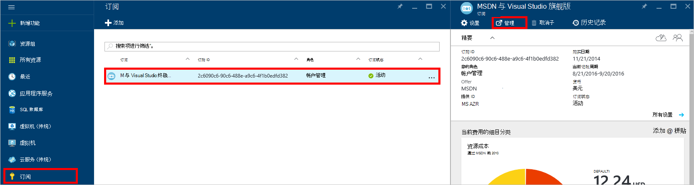

<properties
    pageTitle="DocumentDB 门户问题进行故障排除 |Microsoft Azure"
    description="找出解决问题的 DocumentDB Azure 门户。" 
    services="documentdb"
    documentationCenter=""
    authors="mimig1"
    manager="jhubbard"
    editor="monicar"/>

<tags
    ms.service="documentdb"
    ms.workload="data-services"
    ms.tgt_pltfrm="na"
    ms.devlang="na"
    ms.topic="article"
    ms.date="08/29/2016"
    ms.author="mimig"/>

# Azure DocumentDB 门户的故障排除技巧

本文介绍如何解决在 Azure 的门户网站中的 DocumentDB 问题。 

## 丢失了资源

**症状**︰ 从您的门户刀片服务器丢失的数据库或集合了。

**解决方案**︰ 降低应用程序的使用，要在该集合的最大吞吐量配额下运行。 

**说明**︰ 门户是像任何其他，对 DocumentDB 数据库和集合进行调用的应用程序。 如果您的请求现在都由于正在从单独的应用程序发出的调用被遏制，门户网站可能也被控制，导致不显示在门户的资源。 要解决此问题，请解决使用高吞吐量的原因，然后刷新门户刀片。 [吞吐量](documentdb-performance-tips.md#throughput)[性能提示](documentdb-performance-tips.md)文章节中找不到如何测量和较低的吞吐量使用率信息。
 
## 无法加载页面或刀片式服务器

**症状**︰ 无法显示页面和门户中的刀片式服务器。

**解决方案**︰ 降低应用程序的使用，要在该集合的最大吞吐量配额下运行。 

**说明**︰ 门户是像任何其他，对 DocumentDB 数据库和集合进行调用的应用程序。 如果您的请求现在都由于正在从单独的应用程序发出的调用被遏制，门户网站可能也被控制，导致不显示在门户的资源。 要解决此问题，请解决使用高吞吐量的原因，然后刷新门户刀片。 [吞吐量](documentdb-performance-tips.md#throughput)[性能提示](documentdb-performance-tips.md)文章节中找不到如何测量和较低的吞吐量使用率信息。

## 添加集合按钮处于禁用状态

**症状**︰ 数据库刀片式服务器，在**添加收藏**按钮处于禁用状态。

**说明**︰ 如果 Azure 订购与福利贷方，如免费信用提供从 MSDN 订阅，并且为每月使用所有您的信用，不能在 DocumentDB 中创建任何其他收藏集。

**解决方案**︰ 删除从您的帐户的支出限制。

1. 在 Azure 的门户中，Jumpbar，在单击**订阅**，单击订阅与 DocumentDB 数据库，然后在**订阅**刀片式服务器，单击**管理**。 
    

2. 在新的浏览器窗口中，您将看到您有没有剩余的贷方。 单击**删除支出限制**按钮去花费仅当前记帐期间或无限期。 完成向导后，可以添加或确认您的信用卡信息。 
    

 
## 查询资源管理器完成但出现错误

请参阅[疑难解答查询资源管理器](documentdb-query-collections-query-explorer.md#troubleshoot)。

## 没有监视图块中可用的数据

请参阅[疑难解答监视拼贴](documentdb-monitor-accounts.md#troubleshooting)。

## 返回在文档资源管理器中的文档

请参阅[疑难解答文档资源管理器](documentdb-view-json-document-explorer.md#troubleshoot)。

## 下一步行动

如果您仍然遇到在门户中的问题，请发电子邮件[askdocdb@microsoft.com](mailto:askdocdb@microsoft.com)的协助或文件支持要求在门户中通过单击**浏览****帮助 + 的支持**，然后单击**创建支持请求**。
