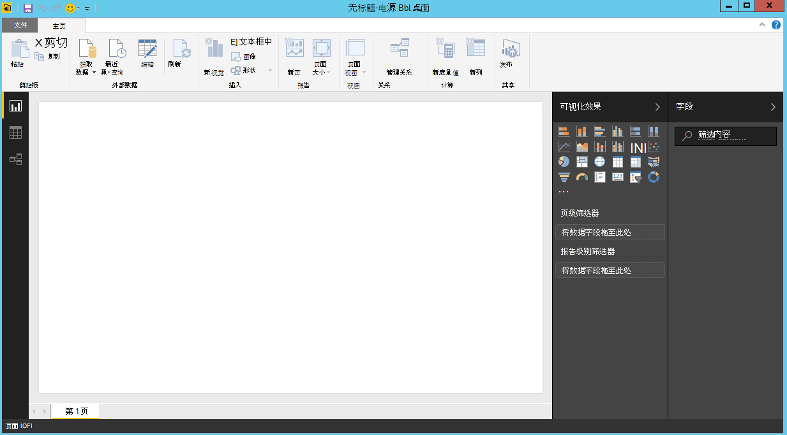
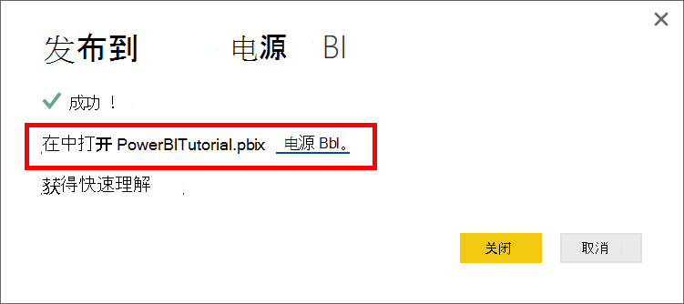

<properties
    pageTitle="DocumentDB 连接器电源 BI 教程 |Microsoft Azure"
    description="使用本教程中电源双导入 JSON，创建富有远见的报告，以及可视化数据使用 DocumentDB 和双电源连接器。"
    keywords="电源 bi 教程，直观地显示数据，电源 bi 接头"
    services="documentdb"
    authors="h0n"
    manager="jhubbard"
    editor="mimig"
    documentationCenter=""/>

<tags
    ms.service="documentdb"
    ms.workload="data-services"
    ms.tgt_pltfrm="na"
    ms.devlang="na"
    ms.topic="article"
    ms.date="09/22/2016"
    ms.author="hawong"/>

# DocumentDB 电源 BI 教程︰ 可视化数据使用双电源连接器

[PowerBI.com](https://powerbi.microsoft.com/)是一种联机服务，您可以创建并共享仪表板和报表数据对您和您的组织非常重要的。  电源双桌面是创作工具，使您可以从各种数据源中检索数据、 合并和转换的数据、 创建功能强大的报告和可视化效果，并将报表发布到电源 BI 的专用的报告。  与电源双桌面的最新版本，您现在可以连接到您的 DocumentDB 帐户通过 DocumentDB 接口的电源 BI。   

在电源双本教程中，我们遍历的步骤连接到电源双桌面中的 DocumentDB 帐户、 导航到我们想要提取的数据使用的导航器的集合，将 JSON 数据转换为表格格式使用电源双桌面查询编辑器，并生成并发布到 PowerBI.com。

完成后此电源 BI 教程，您将能够回答以下问题︰  

-   如何生成数据的报表从 DocumentDB 使用电源双桌面？
-   如何连接到电源双桌面的 DocumentDB 帐户？
-   如何检索电源双桌面中集合中的数据？
-   如何转换电源双桌面中的嵌套的 JSON 数据？
-   如何发布和共享 PowerBI.com 在我的报告吗？

## 系统必备组件

在本教程中电源 BI 按照说明操作之前，确保您具有下列︰

- [最新版本的电源双桌面](https://powerbi.microsoft.com/desktop)。
- 给我们演示客户或 Azure DocumentDB 帐户中的数据的访问。
    - 本教程中演示的火山数据填充演示科目。 此演示帐户不受任何 sla 要求，并且应仅用于演示目的。  我们保留权利，若要修改此演示科目包括但不是限于终止帐户、 更改键、 限制访问、 更改和删除这些数据，而无须事先通知或原因。
        - URL: https://analytics.documents.azure.com
        - 读取专用密钥︰ MSr6kt7Gn0YRQbjd6RbTnTt7VHc5ohaAFu7osF0HdyQmfR + YhwCH2D2jcczVIR1LNK3nMPNBD31losN7lQ/fkw = =
    - 或者，若要创建您自己的帐户，请参阅[创建 DocumentDB 数据库帐户使用 Azure 的门户](https://azure.microsoft.com/documentation/articles/documentdb-create-account/)。 若要获取示例火山相似内容的数据在本教程中使用 （但不包含 GeoJSON 块），请参阅[NOAA 网站](https://www.ngdc.noaa.gov/nndc/struts/form?t=102557&s=5&d=5)然后再导入数据使用[DocumentDB 数据迁移工具](https://azure.microsoft.com/documentation/articles/documentdb-import-data/)。

若要共享您在 PowerBI.com 的报告，您必须在 PowerBI.com 帐户。  要了解更多电源双自由和电源 BI 专业人员，请访问[https://powerbi.microsoft.com/pricing](https://powerbi.microsoft.com/pricing)。

## 让我们开始吧
在本教程中，我们假设您正在研究世界各地的火山 geologist。  火山的数据存储在 DocumentDB 帐户和 JSON 文档看上去像下面的一个。

    {
        "Volcano Name": "Rainier",
        "Country": "United States",
        "Region": "US-Washington",
        "Location": {
            "type": "Point",
            "coordinates": [
            -121.758,
            46.87
            ]
        },
        "Elevation": 4392,
        "Type": "Stratovolcano",
        "Status": "Dendrochronology",
        "Last Known Eruption": "Last known eruption from 1800-1899, inclusive"
    }

要从 DocumentDB 帐户检索火山的数据可视化交互式电源 BI 报表如下所示的数据。

现在试一试吗？ 我们开始吧。

1. 在您的工作站上运行电源双桌面。
2. 一旦启动电源双桌面，将显示*欢迎*屏幕。

    

3. 直接从*欢迎*屏幕中可以**获取数据**，请参阅**最新的源**或**打开的其他报表**。  单击位于右上角的 X 关闭屏幕。 显示电源双桌面的**报表**视图。

    

4. 选择**主**功能区，然后单击**获取数据**。  应显示**获取数据**窗口中。

5. 在**Azure**上单击，选择**Microsoft Azure DocumentDB （测试版）**，然后单击**连接**。  应显示**Azure DocumentDB 连接**窗口。

    

6. 指定您想要检索的数据，如下所示，，然后单击**确定**的 DocumentDB 帐户端点 URL。 可以从 Azure 门户**[键](documentdb-manage-account.md#keys)**刀片式服务器中的 URI 框检索 URL 或可以使用演示科目，URL 是这种情况下`https://analytics.documents.azure.com`。 

    这些字段为可选字段时保留数据库名称、 集合名称和 SQL 语句为空。  相反，我们将使用导航器以选择数据库和集合以确定数据的来源。

    

7. 如果您第一次连接到此终结点，您将会提示输入帐户密码。  可以从 Azure 的门户中，**[只读项](documentdb-manage-account.md#keys)**刀片式服务器中的**主键**框检索该密钥，也可以使用演示科目，此时键`RcEBrRI2xVnlWheejXncHId6QRcKdCGQSW6uSUEgroYBWVnujW3YWvgiG2ePZ0P0TppsrMgscoxsO7cf6mOpcA==`。 输入帐户密码，然后单击**连接**。

    我们建议您在生成报表时使用只读的键。  这可以防止潜在的安全风险为主要密钥的不必要的公开。 只读的关键是从 Azure 门户的[键](documentdb-manage-account.md#keys)刀片式服务器可用，也可以使用上面提供的演示帐户信息。

    

8. 当帐户成功连接时，将显示**导航**。  **导航器**将显示在该帐户下的数据库的列表。
9. 单击并展开对报表的数据将来自何处，数据库，如果您正在使用的演示科目，选择**volcanodb**。   

10. 现在，选择将检索的数据的集合。 如果您使用的演示科目，选择**volcano1**。

    预览窗格中显示**记录**项的列表。  文档由电源双中的**记录**类型。 同样，在文档内的嵌套的 JSON 块也是**记录**。

    

11. 单击**编辑**启动查询编辑器，以便我们可以转换数据。

## 拼合和将 JSON 文档转换
1. 在电源双向查询编辑器中，您应该看到在中心窗格中的**文档**列。

2. 单击展开器在**文档**列标题的右侧。  将显示上下文菜单，其中的字段的列表。  选择您为您的报表，例如，火山名称、 国家/地区、 地区、 位置、 提升、 类型、 状态和最后一个知道的剧增，需要的字段，然后单击**确定**。

    

3. 中心窗格中将显示与所选的字段结果的预览。

    

4. 在我们的示例中，位置属性是文档中的 GeoJSON 块。  如您所见，位置由电源双桌面中的**记录**类型。  
5. 单击展开器位置列标题的右侧。  类型和坐标字段的上下文菜单将出现。  让我们选择坐标字段并单击**确定**。

    

6. 现在，中心窗格中显示**列表**类型的坐标列。  在开始本教程所示，在本教程中的 GeoJSON 数据是点类型的纬度和经度坐标数组中记录的值。

    坐标 [0] 元素表示经度，而坐标 [1] 表示纬度。
    

7. 要平面化坐标数组，我们将创建名为 LatLong 的**自定义列**。  选择**添加列**功能区，然后单击**添加自定义列**。  应显示窗口中**添加自定义列**。

8. 提供的名称的新列，例如 LatLong。

9. 接下来，指定新列的自定义公式。  对于我们的示例中，我们会将纬度和经度值用逗号隔开，如下所示使用下面的公式︰ `Text.From([Document.Location.coordinates]{1})&","&Text.From([Document.Location.coordinates]{0})`。 单击**确定**。

    在数据分析的表达式 (DAX) 包括 DAX 的函数的详细信息，请访问[DAX 基本电源双桌面中](https://support.powerbi.com/knowledgebase/articles/554619-dax-basics-in-power-bi-desktop)。

    

10. 现在，中心窗格中将显示新的 LatLong 列由逗号分隔的纬度和经度值填充。

    

    如果在新列中收到错误，请确保查询设置下的应用的步骤匹配如下图︰

    

    如果您的步骤不同，删除额外的步骤并尝试再次添加自定义列。 

11. 我们现在已经完成拼合到表格式的数据。  可以利用所有可用在查询编辑器中对形状的功能和在 DocumentDB 的数据转换。  如果您使用此示例，通过更改**主**功能区上的**数据类型**为**整数**提升更改数据类型。

    

12. 单击**关闭并应用**保存的数据模型。

    

## 生成报告
电源双桌面报表视图是您可以开始创建报表，若要可视化的数据。  您可以通过拖放到**报表**画布的字段来创建报告。

在报表视图中，您会找到︰

 1. **字段**窗格中，这是在您将看到的数据模型与可用于报表的字段列表。

 2. **可视化效果**窗格中。 报表可以包含一个或多个可视化效果。  选取管接头从**可视化效果**窗格中您需要的视觉类型。

 3. **报告**画布上，这是您将为您的报表生成视觉效果。

 4. **报告**页中。 在电源双桌面，您可以添加多个报表中的页。

下图显示创建一个简单的交互式地图查看报表的基本步骤。

1. 对于我们的示例中，我们将创建显示每个火山的位置的映射视图。  在**可视化效果**窗格中，单击作为突出显示在上面的抓图中可视化映射类型。  您应该看到在**报告**画布上绘制的地图视觉类型。  **可视化效果**窗格还应显示一组映射视觉类型相关的属性。

2. 现在，拖放 LatLong 字段从**字段**窗格中**可视化效果**窗格的**位置**属性。
3. 接下来，将拖放到**图例**属性火山名称字段。  

4. 然后，拖动并将**Size**属性提升域。  

5. 现在应该可以看到地图可视化显示指示关联到火山的仰角的气泡的大小与位置的每个火山的气泡式一套。

6. 现在，您已创建基本报表。  通过添加多个可视化效果，您可以进一步自定义报表。  在我们的例子中，我们添加了火山类型切片器将使交互式报表。  

    

## 发布和共享报表
若要共享您的报表，您必须在 PowerBI.com 帐户。

1. 在电源双桌面，单击**主**功能区。
2. 单击**发布**。  系统将提示您为您的 PowerBI.com 帐户输入的用户名称和密码。
3. 一旦已经过身份验证的凭据，则将报表发布到您所选的目标。
4. 单击**电源 BI 在打开 PowerBITutorial.pbix**查看和共享报表上 PowerBI.com。

    

## 在 PowerBI.com 中创建仪表板

既然您已经有一个报告，可以上 PowerBI.com 共享它

发布到 PowerBI.com 电源双桌面从报表时，它生成的**报告**和**数据集**在 PowerBI.com 租户。 例如，发布名为**PowerBITutorial**到 PowerBI.com 的报告后，您将在 PowerBI.com 上看到 PowerBITutorial 的**报告**和**数据集**的节中。

   

若要创建可共享的仪表板，请单击 PowerBI.com 报告上的**针实时网页**按钮。

   

然后按照[针瓷砖从报表](https://powerbi.microsoft.com/documentation/powerbi-service-pin-a-tile-to-a-dashboard-from-a-report/#pin-a-tile-from-a-report)中的说明进行操作，以创建新的仪表板。 

此外可以在创建仪表板之前执行特别修改报告。 但是，建议使用电源双桌面执行的修改和重新发布到 PowerBI.com 报告。

## 在 PowerBI.com 中刷新数据

有两种方法来刷新数据时，ad hoc 和计划。

为特别的刷新，只需单击 eclipses （...） 的**数据集**，例如 PowerBITutorial。 您应该看到包括**立即刷新**的操作的列表。 单击**[立即刷新]**以刷新数据。

进行定时刷新，执行以下操作。

1. 在操作列表中，请单击**计划刷新**。 
    

2. 在**设置**页中，展开**数据源凭据**。 

3. 单击**编辑凭据**。 

    配置弹出式菜单将出现。 

4. 输入密钥才能连接到该数据集的 DocumentDB 帐户，然后单击**登录**。 

5. 展开**计划刷新**并设置的计划想要刷新数据集。 
  
6. 单击**应用**并完成设置定时刷新。

## 下一步行动
- 有关电源 BI 的详细信息，请参阅[开始使用双电源](https://powerbi.microsoft.com/documentation/powerbi-service-get-started/)。
- 若要了解有关 DocumentDB 的详细信息，请参阅[登录页的 DocumentDB 文档](https://azure.microsoft.com/documentation/services/documentdb/)。
