<properties
    pageTitle="Python Flask 开发 Web 应用程序与 DocumentDB |Microsoft Azure"
    description="查看数据库教程，说明如何使用 DocumentDB 来存储和访问位于 Azure 的 Python Flask web 应用程序中的数据。 查找应用程序开发的解决方案。" 
    keywords="应用程序开发、 数据库教程，python flask，python 的 web 应用程序、 python web 开发、 documentdb、 azure、 Microsoft azure"
    services="documentdb"
    documentationCenter="python"
    authors="syamkmsft"
    manager="jhubbard"
    editor="cgronlun"/>

<tags
    ms.service="documentdb"
    ms.workload="data-management"
    ms.tgt_pltfrm="na"
    ms.devlang="python"
    ms.topic="hero-article"
    ms.date="08/25/2016"
    ms.author="syamk"/>

# <a name="python-flask-web-application-development-with-documentdb"></a>与 DocumentDB 的 Python Flask Web 应用程序开发

> [AZURE.SELECTOR]
- [.NET](documentdb-dotnet-application.md)
- [Node.js](documentdb-nodejs-application.md)
- [Java](documentdb-java-application.md)
- [Python](documentdb-python-application.md)

本教程展示如何使用 Azure DocumentDB 来存储和访问数据从 Python web 应用程序驻留在 Azure 上，假定您有一些使用 Python 和 Azure 网站的前期经验。

本教程中数据库包括︰

1. 创建和设置 DocumentDB 帐户。
2. 创建一个 Python MVC 应用程序。
3. 连接到并使用 Azure DocumentDB 从 web 应用程序。
4. Web 应用程序部署到 Azure 网站。

按照本教程中，您将生成一个简单的投票应用程序，您可以投票的民意测验。

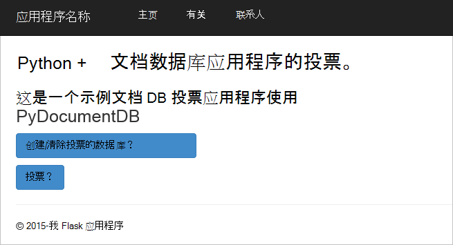


## <a name="database-tutorial-prerequisites"></a>数据库教程的系统必备组件

在这篇文章中的说明进行操作之前，应确保您已经安装了以下产品︰

- 活动的 Azure 帐户。 如果您没有帐户，您可以在几分钟创建免费的试用帐户。 有关详细信息，请参阅[Azure 免费试用版](https://azure.microsoft.com/pricing/free-trial/)。
- [Visual Studio 2013年](http://www.visualstudio.com/)或更高版本，或[Visual Studio 速成版]()，它是免费的版本。 在本教程中的说明进行操作是专门为编写 Visual Studio 2015年。 
- 从[GitHub](http://microsoft.github.io/PTVS/)的 Visual Studio 的 Python 工具。 本教程使用 VS 2015 Python 工具。 
- Visual Studio，2.4 或更高版本的 azure Python SDK 可从[azure.com](https://azure.microsoft.com/downloads/)。 我们使用 Python 2.7 Microsoft Azure SDK。
- Python 2.7 从[python.org][2]。 我们使用 Python 2.7.11。 

> [AZURE.IMPORTANT] 如果您第一次安装 Python 2.7，请确保在自定义 Python 2.7.11 屏幕中，选择**添加到路径的 python.exe**。
> 
>    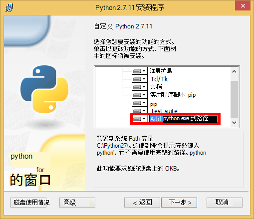

- Microsoft Visual C++ 编译器从[Microsoft 下载中心]的 Python 2.7 为[3]。

## <a name="step-1-create-a-documentdb-database-account"></a>步骤 1︰ 创建一个 DocumentDB 数据库帐户

让我们首先创建一个 DocumentDB 帐户。 如果您已经有一个帐户，您可以跳到[步骤 2︰ 创建新的 Python Flask web 应用程序](#step-2:-create-a-new-python-flask-web-application)。

[AZURE.INCLUDE [documentdb-create-dbaccount](../../includes/documentdb-create-dbaccount.md)]

<br/>
我们现在将指导如何创建了一个 Python Flask web 应用从零开始。

## <a name="step-2-create-a-new-python-flask-web-application"></a>步骤 2︰ 创建新的 Python Flask web 应用程序

1. 在 Visual Studio 中，在**文件**菜单上，指向**新建**，然后单击**项目**。

    出现**新建项目**对话框。

2. 在左窗格中，展开**模板**，然后**Python**，，然后单击**Web**。 

3. 在中心窗格中，然后在**名称**框类型**教程**，选择**Flask Web 项目**，然后单击**确定**。 请记住，Python 包名称应全部为小写， [Python 代码的风格指南](https://www.python.org/dev/peps/pep-0008/#package-and-module-names)中所述。

    对于那些熟悉 Python Flask，就可以帮助您更快地构建在 Python 中的 web 应用程序的 web 应用程序开发框架。

    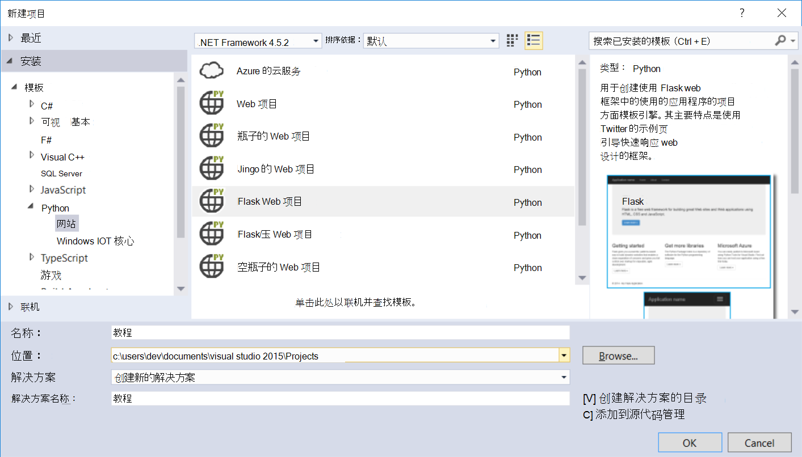

4. 在**Visual Studio 的 Python 工具**窗口中，单击**安装到虚拟环境**。 

    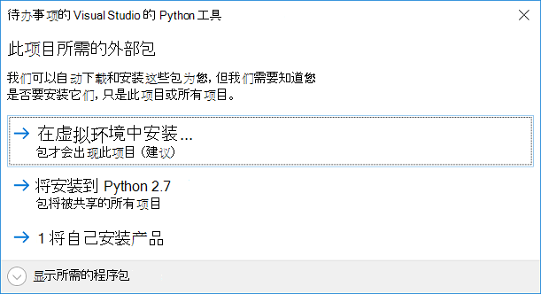

5. 在**添加虚拟环境**窗口中，接受默认设置并使用 Python 2.7 作为基本的环境，因为 PyDocumentDB 当前不支持 Python 3.x，然后单击**创建**。 这将设置为您的项目所需的 Python 虚拟环境。

    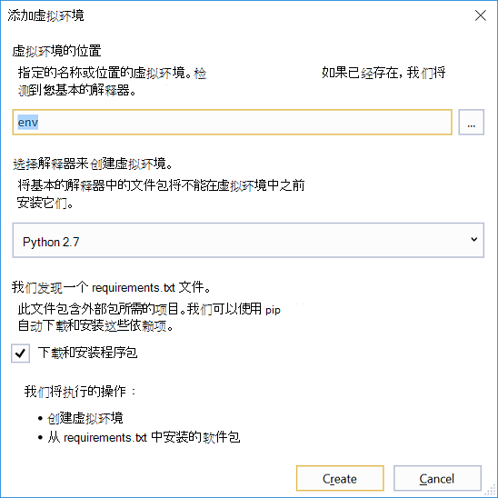

    输出窗口显示`Successfully installed Flask-0.10.1 Jinja2-2.8 MarkupSafe-0.23 Werkzeug-0.11.5 itsdangerous-0.24 'requirements.txt' was installed successfully.`环境已成功安装。

## <a name="step-3-modify-the-python-flask-web-application"></a>步骤 3︰ 修改 Python Flask web 应用程序

### <a name="add-the-python-flask-packages-to-your-project"></a>向项目中添加 Python Flask 包

您的项目设置后，您需要将所需的 Flask 程序包添加到您的项目，包括 pydocumentdb，DocumentDB 的 Python 包。

1. 在解决方案资源管理器中打开名为**requirements.txt**的文件和内容替换为以下︰

        flask==0.9
        flask-mail==0.7.6
        sqlalchemy==0.7.9
        flask-sqlalchemy==0.16
        sqlalchemy-migrate==0.7.2
        flask-whooshalchemy==0.55a
        flask-wtf==0.8.4
        pytz==2013b
        flask-babel==0.8
        flup
        pydocumentdb>=1.0.0

2. 将**requirements.txt**文件保存。 
3. 在解决方案资源管理器，右键单击**信封**，然后单击**从 requirements.txt 安装**。

    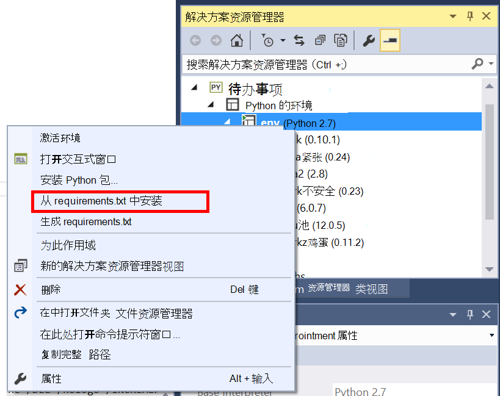

    成功安装后，输出窗口显示以下信息︰

        Successfully installed Babel-2.3.2 Tempita-0.5.2 WTForms-2.1 Whoosh-2.7.4 blinker-1.4 decorator-4.0.9 flask-0.9 flask-babel-0.8 flask-mail-0.7.6 flask-sqlalchemy-0.16 flask-whooshalchemy-0.55a0 flask-wtf-0.8.4 flup-1.0.2 pydocumentdb-1.6.1 pytz-2013b0 speaklater-1.3 sqlalchemy-0.7.9 sqlalchemy-migrate-0.7.2

    > [AZURE.NOTE] 在极少数情况下，您可能会看到输出窗口中的故障。 如果发生这种情况，请检查错误如果与清理。 有时，清理失败，但仍将成功 （向上滚动在输出窗口以验证此） 安装。 您可以检查您的安装方法是[验证的虚拟环境](#verify-the-virtual-environment)。 如果安装失败，但成功验证，则确定以继续。

### <a name="verify-the-virtual-environment"></a>验证虚拟环境

让我们确保一切都已正确安装。

1. 通过按下**ctrl 键**生成解决方案+**班次**+**B**。
2. 一旦生成成功，按**f5 键**启动该网站。 此启动 Flask 开发服务器和 web 浏览器。 您应该看到以下页面。

    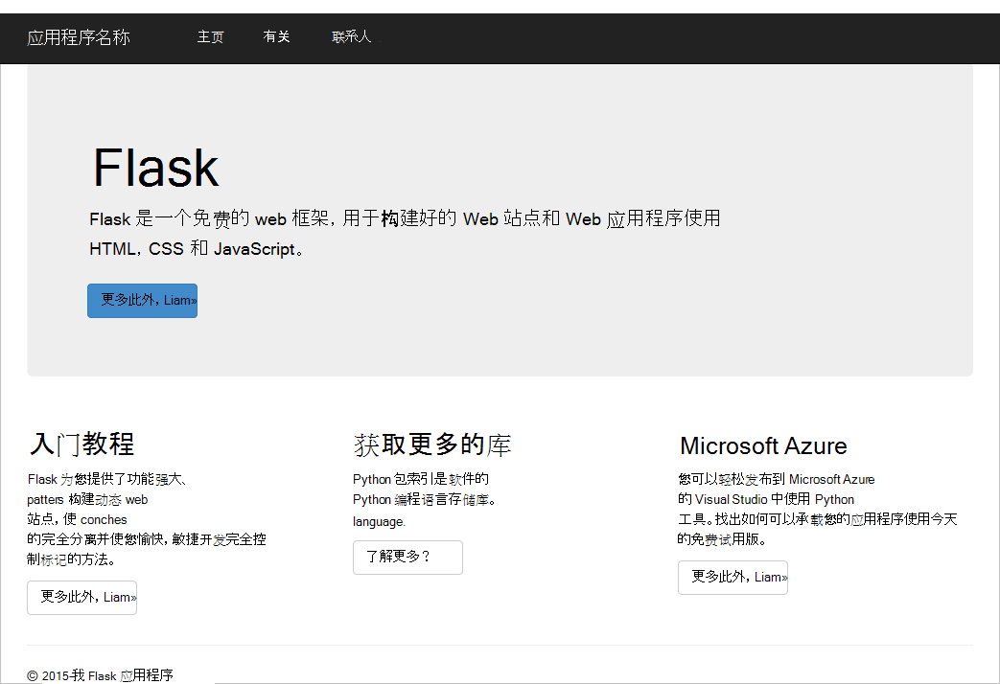

3. 停止调试时按下**shift 键**的网站+在 Visual Studio 中的**f5 键**。

### <a name="create-database-collection-and-document-definitions"></a>创建数据库、 收集和文档定义

现在让我们添加新文件和更新其他用户通过创建应用程序投票。

1. 在解决方案资源管理器中右击该**教程**项目，单击**添加**，然后单击**新项目**。 选择**空的 Python 文件**并命名文件**forms.py**。  
2. 将以下代码添加到 forms.py 文件中，然后再保存文件。

```python
from flask.ext.wtf import Form
from wtforms import RadioField

class VoteForm(Form):
    deploy_preference  = RadioField('Deployment Preference', choices=[
        ('Web Site', 'Web Site'),
        ('Cloud Service', 'Cloud Service'),
        ('Virtual Machine', 'Virtual Machine')], default='Web Site')
```


### <a name="add-the-required-imports-to-viewspy"></a>向 views.py 添加所需的导入

1. 在解决方案资源管理器中，展开**教程**文件夹，并打开**views.py**文件。 
2. 添加以下将语句导入到顶部的**views.py**文件中，然后保存该文件。 这些导入 DocumentDB 的 PythonSDK 和 Flask 包。

    ```python
    from forms import VoteForm
    import config
    import pydocumentdb.document_client as document_client
    ```


### <a name="create-database-collection-and-document"></a>创建数据库、 收集和文档

- 仍在**views.py**，将下面的代码添加文件的末尾。 这负责创建窗体所使用的数据库。 不要删除任何**views.py**中的现有代码。 这只是追加到结尾。

```python
@app.route('/create')
def create():
    """Renders the contact page."""
    client = document_client.DocumentClient(config.DOCUMENTDB_HOST, {'masterKey': config.DOCUMENTDB_KEY})

    # Attempt to delete the database.  This allows this to be used to recreate as well as create
    try:
        db = next((data for data in client.ReadDatabases() if data['id'] == config.DOCUMENTDB_DATABASE))
        client.DeleteDatabase(db['_self'])
    except:
        pass

    # Create database
    db = client.CreateDatabase({ 'id': config.DOCUMENTDB_DATABASE })

    # Create collection
    collection = client.CreateCollection(db['_self'],{ 'id': config.DOCUMENTDB_COLLECTION })

    # Create document
    document = client.CreateDocument(collection['_self'],
        { 'id': config.DOCUMENTDB_DOCUMENT,
          'Web Site': 0,
          'Cloud Service': 0,
          'Virtual Machine': 0,
          'name': config.DOCUMENTDB_DOCUMENT 
        })

    return render_template(
       'create.html',
        title='Create Page',
        year=datetime.now().year,
        message='You just created a new database, collection, and document.  Your old votes have been deleted')
```

> [AZURE.TIP] **CreateCollection**方法采用可选的**RequestOptions**作为第三个参数。 这可以用来提供为指定类型的集合。 如果没有 offerType 提供值，则将使用默认的提供类型创建集合。 DocumentDB 提供了类型的详细信息，请参阅[DocumentDB 中的性能级别](documentdb-performance-levels.md)。


### <a name="read-database-collection-document-and-submit-form"></a>读取数据库、 回收、 文档，并将提交窗体

- 仍在**views.py**，将下面的代码添加文件的末尾。 这负责设置窗体中，读取数据库、 收集和文档。 不要删除任何**views.py**中的现有代码。 这只是追加到结尾。

```python
@app.route('/vote', methods=['GET', 'POST'])
def vote(): 
    form = VoteForm()
    replaced_document ={}
    if form.validate_on_submit(): # is user submitted vote  
        client = document_client.DocumentClient(config.DOCUMENTDB_HOST, {'masterKey': config.DOCUMENTDB_KEY})

        # Read databases and take first since id should not be duplicated.
        db = next((data for data in client.ReadDatabases() if data['id'] == config.DOCUMENTDB_DATABASE))

        # Read collections and take first since id should not be duplicated.
        coll = next((coll for coll in client.ReadCollections(db['_self']) if coll['id'] == config.DOCUMENTDB_COLLECTION))

        # Read documents and take first since id should not be duplicated.
        doc = next((doc for doc in client.ReadDocuments(coll['_self']) if doc['id'] == config.DOCUMENTDB_DOCUMENT))

        # Take the data from the deploy_preference and increment our database
        doc[form.deploy_preference.data] = doc[form.deploy_preference.data] + 1
        replaced_document = client.ReplaceDocument(doc['_self'], doc)

        # Create a model to pass to results.html
        class VoteObject:
            choices = dict()
            total_votes = 0

        vote_object = VoteObject()
        vote_object.choices = {
            "Web Site" : doc['Web Site'],
            "Cloud Service" : doc['Cloud Service'],
            "Virtual Machine" : doc['Virtual Machine']
        }
        vote_object.total_votes = sum(vote_object.choices.values())

        return render_template(
            'results.html', 
            year=datetime.now().year, 
            vote_object = vote_object)

    else :
        return render_template(
            'vote.html', 
            title = 'Vote',
            year=datetime.now().year,
            form = form)
```


### <a name="create-the-html-files"></a>创建 HTML 文件

1. 在解决方案资源管理器的**教程**文件夹中，右键单击**模板**文件夹，单击**添加**，然后单击**新项**。 
2. 选择**HTML 页**，然后在名称框中键入**create.html**。 
3. 重复步骤 1 和 2 以创建两个附加的 HTML 文件︰ results.html 和 vote.html。
4. 将以下代码添加到**create.html**在`<body>`元素。 它将显示一条消息指出我们创建新的数据库、 收集和文档。

    ```html
    
    
    <h2>{{ title }}.</h2>
    <h3>{{ message }}</h3>
    <p><a href="{{ url_for('vote') }}" class="btn btn-primary btn-large">Vote &raquo;</a></p>
    
    ```

5. 将以下代码添加到**results.html**在`<body`> 元素。 它显示轮询的结果。

    ```html
    
    
    <h2>Results of the vote</h2>
        <br />
        
    
    <div class="row">
        <div class="col-sm-5">{{choice}}</div>
            <div class="col-sm-5">
                <div class="progress">
                    <div class="progress-bar" role="progressbar" aria-valuenow="{{vote_object.choices[choice]}}" aria-valuemin="0" aria-valuemax="{{vote_object.total_votes}}" style="width: {{(vote_object.choices[choice]/vote_object.total_votes)*100}}%;">
                                {{vote_object.choices[choice]}}
                </div>
            </div>
            </div>
    </div>
    
    
    <br />
    <a class="btn btn-primary" href="{{ url_for('vote') }}">Vote again?</a>
    
    ```

6. 将以下代码添加到**vote.html**在`<body`> 元素。 它显示轮询并接受投票结果。 注册投票，该控件通过传递到 views.py 我们将识别投票强制转换，并相应地添加文档。

    ```html
    
    
    <h2>What is your favorite way to host an application on Azure?</h2>
    <form action="" method="post" name="vote">
        {{form.hidden_tag()}}
            {{form.deploy_preference}}
            <button class="btn btn-primary" type="submit">Vote</button>
    </form>
    
    ```

7. 在**模板**文件夹中，用以下内容替换**index.html**的内容。 这将作为您的应用程序的登录页。
    
    ```html
    
    
    <h2>Python + DocumentDB Voting Application.</h2>
    <h3>This is a sample DocumentDB voting application using PyDocumentDB</h3>
    <p><a href="{{ url_for('create') }}" class="btn btn-primary btn-large">Create/Clear the Voting Database &raquo;</a></p>
    <p><a href="{{ url_for('vote') }}" class="btn btn-primary btn-large">Vote &raquo;</a></p>
    
    ```

### <a name="add-a-configuration-file-and-change-the-initpy"></a>添加配置文件并更改\_\_初始化\_\_.py

1. 在解决方案资源管理器中右击该**教程**项目**添加**单击**新项**，选择**空的 Python 文件**，和，然后命名文件**config.py**。 该配置文件被必需的 Flask 中的窗体。 您可以使用它来提供机密密钥。 此项不需要此教程不过。

2. 将以下代码添加到 config.py 中，您将需要更改的值**DOCUMENTDB\_主机**和**DOCUMENTDB\_键**的下一步。

    ```python
    CSRF_ENABLED = True
    SECRET_KEY = 'you-will-never-guess'
    
    DOCUMENTDB_HOST = 'https://YOUR_DOCUMENTDB_NAME.documents.azure.com:443/'
    DOCUMENTDB_KEY = 'YOUR_SECRET_KEY_ENDING_IN_=='
    
    DOCUMENTDB_DATABASE = 'voting database'
    DOCUMENTDB_COLLECTION = 'voting collection'
    DOCUMENTDB_DOCUMENT = 'voting document'
    ```

3. 在[Azure 的门户网站](https://portal.azure.com/)中，导航到**项**刀片式服务器通过单击**浏览**， **DocumentDB 帐户**，双击该帐户以使用，该名称，然后单击**重点**区域中的**密钥**按钮。 中**键**刀片式服务器， **URI**值其复制并粘贴到**config.py**文件中，为值**DOCUMENTDB\_主机**属性。 
4. 返回的 Azure 的门户中**键**刀片式服务器，,**辅助键**，**主键**的值其复制并粘贴到**config.py**文件中，为值**DOCUMENTDB\_键**属性。
5. 在**\_\_初始化\_\_.py**文件中添加以下行。 

        app.config.from_object('config')

    因此，文件的内容是︰

    ```python
    from flask import Flask
    app = Flask(__name__)
    app.config.from_object('config')
    import tutorial.views
    ```

6. 后添加的所有文件，解决方案资源管理器应该如下所示︰

    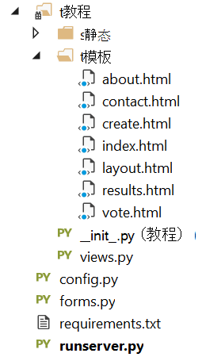


## <a name="step-4-run-your-web-application-locally"></a>步骤 4︰ 在本地运行 web 应用程序

1. 通过按下**ctrl 键**生成解决方案+**班次**+**B**。
2. 一旦生成成功，按**f5 键**启动该网站。 在屏幕上，您应看到以下。

    

3. 单击**创建或清除投票数据库**生成数据库。

    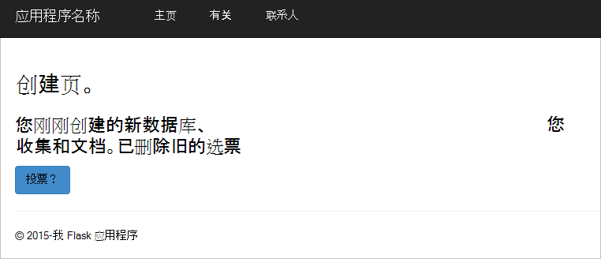

4. 然后，单击**投票**并选择您的选项。

    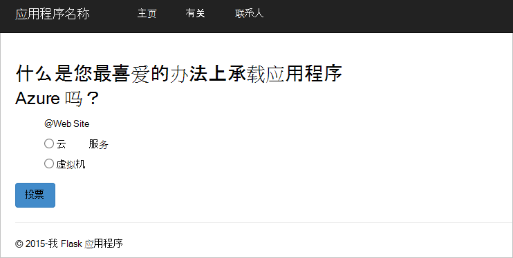

5. 强制转换的每一票，为其增加相应的计数器。

    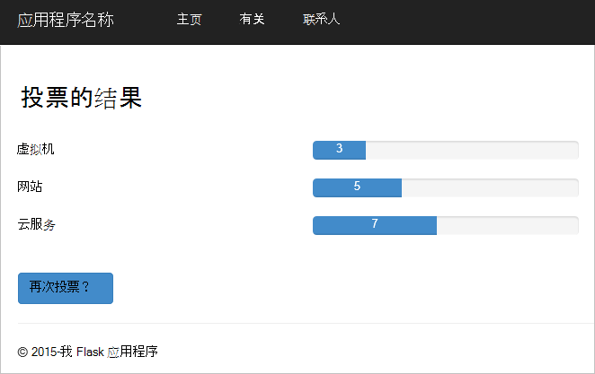

6. 停止通过按 Shift + F5 调试该项目。

## <a name="step-5-deploy-the-web-application-to-azure-websites"></a>步骤 5︰ 部署到 Azure 网站的 web 应用程序

现在，有完整的应用程序 DocumentDB 对正常工作，我们要将此部署到 Azure 网站。

1. 用鼠标右键单击解决方案资源管理器中的项目 (请确保您不仍在本地运行) 并选择**发布**。  

    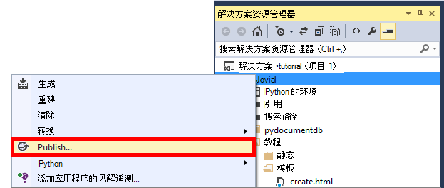

2. 在**发布网站**窗口中，选择**Microsoft Azure Web 应用程序**，，然后单击**下一步**。

    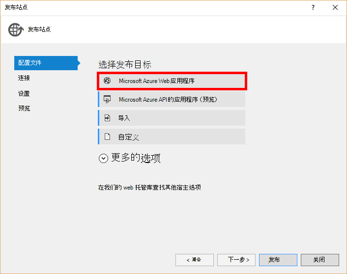

3. 在**Microsoft Azure Web 应用程序窗口**窗口中，单击**新建**。

    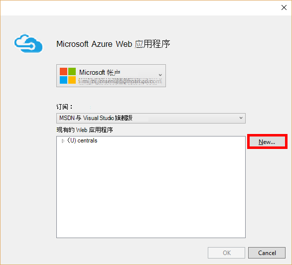

4. 在**创建 Microsoft Azure 站点**窗口中，输入**Web 应用程序名称**、**应用程序服务计划**、**资源组**和**区域**，然后单击**创建**。

    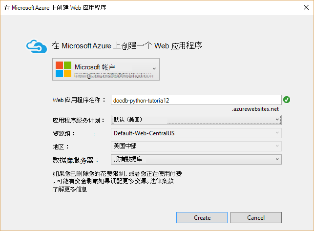

5. 在**发布网站**窗口中，单击**发布**。

    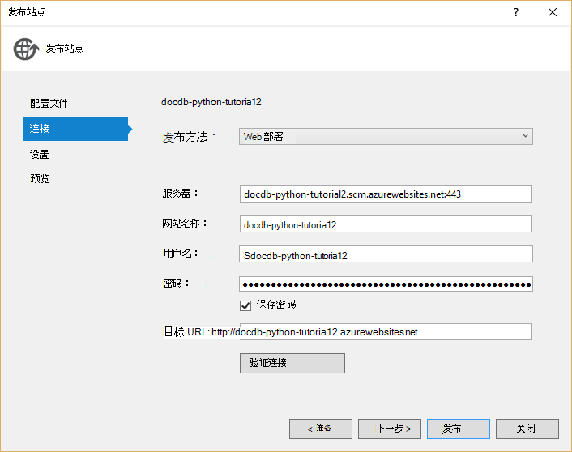

3. 几秒钟后，Visual Studio 将完成 web 应用程序发布和启动浏览器，可以看到在 Azure 中运行方便工作 ！

## <a name="troubleshooting"></a>故障排除

如果这是首个 Python 应用程序已经在您的计算机运行，请确保 PATH 变量中包含以下文件夹 （或等效的安装位置）︰

    C:\Python27\site-packages;C:\Python27\;C:\Python27\Scripts;

如果您收到错误的投票页面上您命名项目以外的**教程**，请确保**\_\_初始化\_\_.py**引用行中正确的项目名称︰ `import tutorial.view`。

## <a name="next-steps"></a>下一步行动

祝贺您 ！ 在刚完成第一个 Python web 应用程序使用 Azure DocumentDB 并发布到 Azure 网站。

我们更新和改进本主题经常根据您的反馈意见。  一旦完成本教程，请在顶部和底部的此页面，请使用投票按钮，请确保包含您的反馈意见改进您想要查看所做的事情。 如果您希望我们直接与您联系，您可以随意在注释中包括您的电子邮件地址。

若要将其他功能添加到 web 应用程序，查看[DocumentDB Python SDK](documentdb-sdk-python.md)中提供的 Api。

关于 Azure，Visual Studio，Python 的详细信息，请参阅[Python 开发中心](https://azure.microsoft.com/develop/python/)。 

其他 Python Flask 教程，请参阅[Flask 万像素的教程中，一部分 i︰ 你好，世界 ！](http://blog.miguelgrinberg.com/post/the-flask-mega-tutorial-part-i-hello-world)。 

  [Visual Studio Express]: http://www.visualstudio.com/products/visual-studio-express-vs.aspx
  [2]: https://www.python.org/downloads/windows/
  [3]: https://www.microsoft.com/download/details.aspx?id=44266
  [Microsoft Web Platform Installer]: http://www.microsoft.com/web/downloads/platform.aspx
  [Azure portal]: http://portal.azure.com
