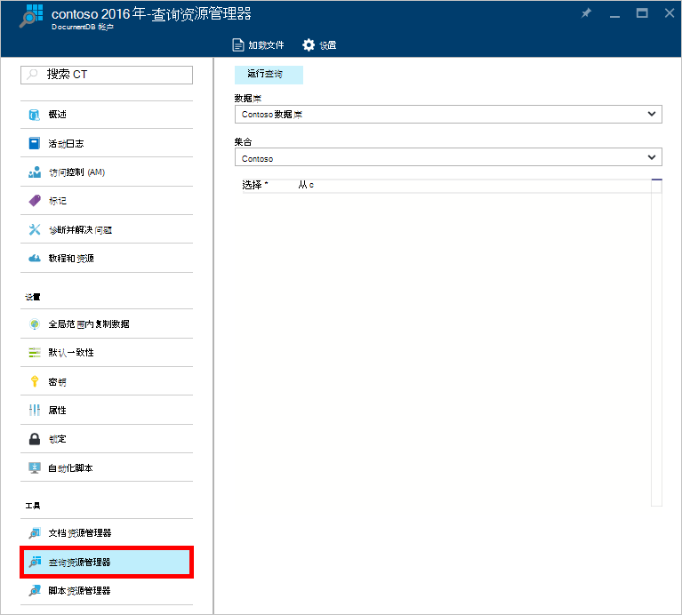
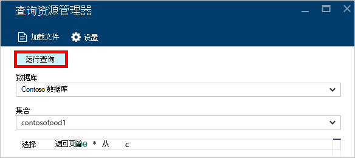
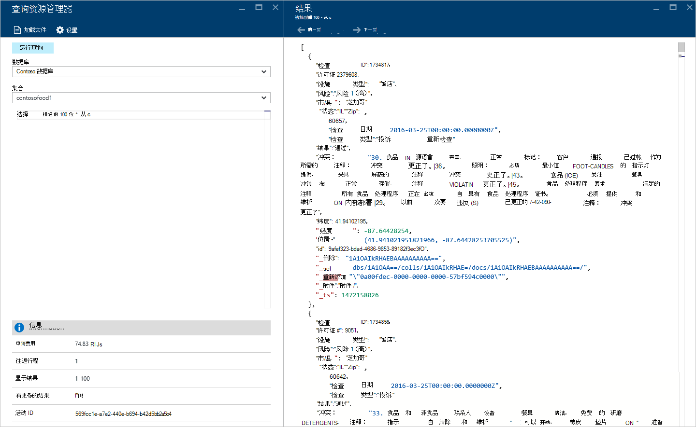
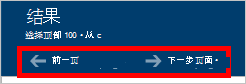
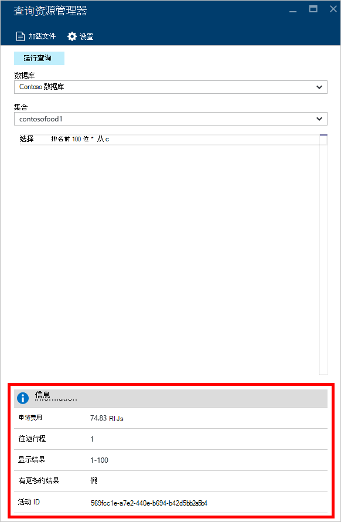
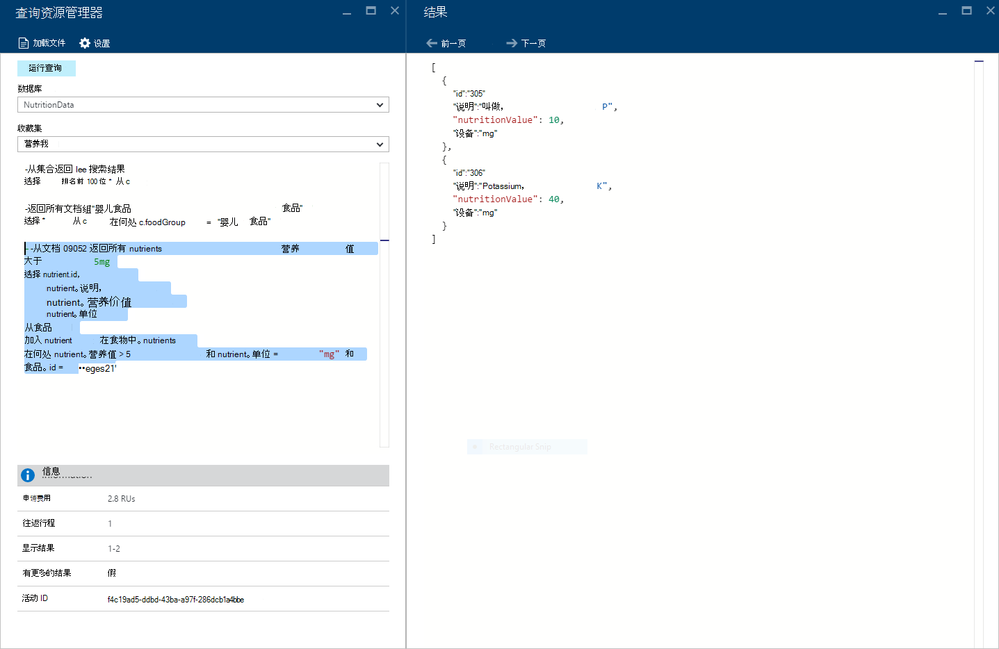
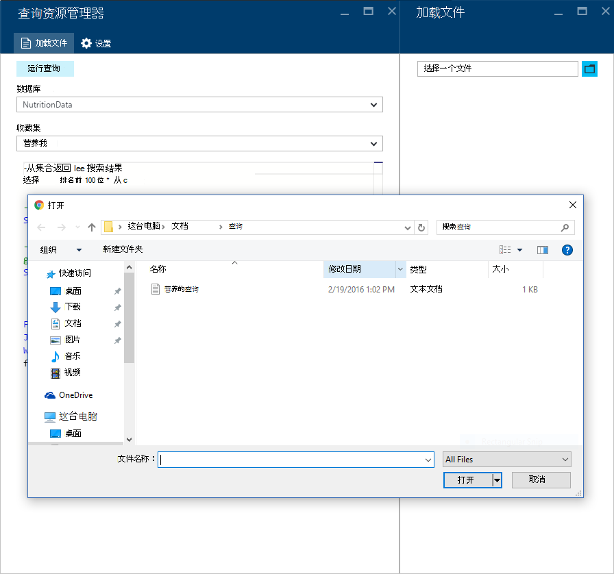
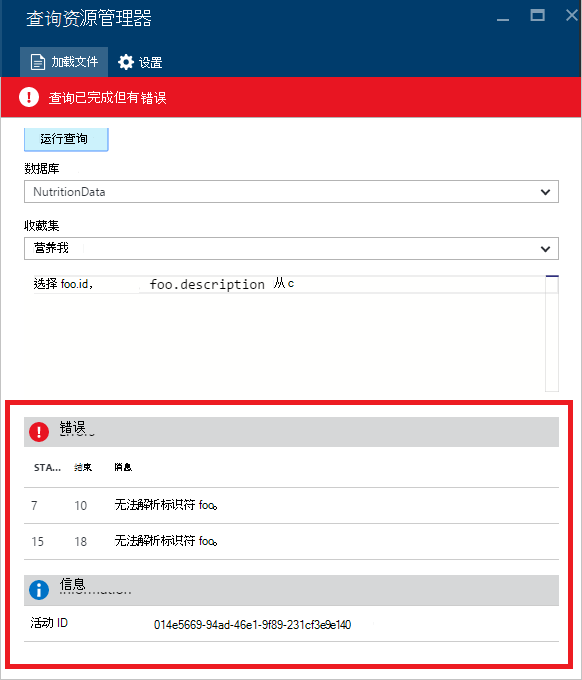

<properties
    pageTitle="DocumentDB 查询资源管理器︰ 一个 SQL 查询编辑器 |Microsoft Azure"
    description="了解 DocumentDB 查询浏览器，一个 SQL 查询编辑器中编写 SQL 查询和在 NoSQL DocumentDB 集合上运行它们的 Azure 门户。"
    keywords="编写 sql 查询，sql 查询编辑器"
    services="documentdb"
    authors="kirillg"
    manager="jhubbard"
    editor="monicar"
    documentationCenter=""/>

<tags
    ms.service="documentdb"
    ms.workload="data-services"
    ms.tgt_pltfrm="na"
    ms.devlang="na"
    ms.topic="article"
    ms.date="08/30/2016"
    ms.author="kirillg"/>

# 编写、 编辑和运行 SQL 查询使用查询资源管理器的 DocumentDB 

这篇文章概括介绍了[Microsoft Azure DocumentDB](https://azure.microsoft.com/services/documentdb/)查询浏览器使您能够编写、 编辑和对[DocumentDB 集合](documentdb-create-collection.md)运行 SQL 查询 Azure 门户工具。

1. 在 Azure 的门户中，在 Jumpbar 中，请单击**DocumentDB (NoSQL)**。 如果**DocumentDB (NoSQL)**不可见，单击**其他服务**，然后单击**DocumentDB (NoSQL)**。

2. 在资源菜单上，单击**查询资源管理器**。 

    

3. 在**查询浏览器**刀片式服务器，从下拉列表中，选择查询的**数据库**和**集合**并键入要运行的查询。 

    **数据库**和**收藏集**下拉列表中预先填充您启动查询资源管理器的上下文。 

    默认查询的`SELECT TOP 100 * FROM c`提供。  您可以接受默认的查询或构建查询使用 SQL 查询语言[SQL 查询创建表](documentdb-sql-query-cheat-sheet.md)或[SQL 查询和 SQL 语法](documentdb-sql-query.md)的文章中所述。

    单击**运行查询**以查看结果。

    

4. **结果**刀片式服务器显示该查询的输出结果。 

    

## 处理结果

默认情况下，查询资源管理器中的 100 集返回结果。  如果您的查询将产生 100 多个结果，只需使用**下一页**和**上一页**命令浏览结果集。

成功查询**信息**窗格包含指标如申请费用，往返行程进行了查询，结果目前显示，套的数量以及是否有多个结果，则可以访问为**下一页**命令，通过上文所述。

## 使用多个查询

如果您正在使用多个查询，并希望它们之间快速切换，可以**查询浏览器**刀片式服务器，查询文本框中输入的所有查询然后并突出显示您想要运行，然后单击**运行查询**以查看结果。

## 从文件中的查询添加到 SQL 查询编辑器

您可以加载**加载文件**命令使用现有文件的内容。

## 疑难解答

如果查询完成时有错误，查询资源管理器中将显示可以帮助进行故障排除工作的错误的列表。

## 运行 DocumentDB SQL 查询外部门户

在 Azure 门户网站查询浏览器是只是一种方法，对 DocumentDB 运行 SQL 查询。 您还可以运行使用[REST API](https://msdn.microsoft.com/library/azure/dn781481.aspx)或[客户端 Sdk](documentdb-sdk-dotnet.md)的 SQL 查询。 有关使用其他方法的详细信息，请参阅[执行 SQL 查询](documentdb-sql-query.md#executing-sql-queries)

## 下一步行动

若要了解有关 DocumentDB SQL 语法查询浏览器支持的详细信息，请参阅[SQL 查询和 SQL 语法](documentdb-sql-query.md)文章或打印出的[SQL 查询内容便笺](documentdb-sql-query-cheat-sheet.md)。
您可能还可以享受试验可在其中测试出在线使用示例数据集的查询[查询运动场](https://www.documentdb.com/sql/demo)。
