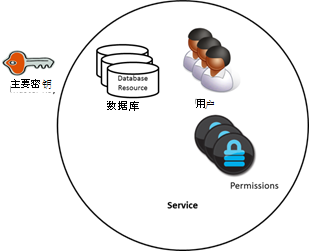
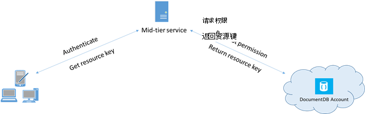

<properties 
    pageTitle="了解如何安全地访问数据在 DocumentDB |Microsoft Azure" 
    description="了解有关访问控制的概念，在 DocumentDB，包括主密钥、 只读键、 用户和权限。" 
    services="documentdb" 
    authors="kiratp" 
    manager="jhubbard" 
    editor="monicar" 
    documentationCenter=""/>

<tags 
    ms.service="documentdb" 
    ms.workload="data-services" 
    ms.tgt_pltfrm="na" 
    ms.devlang="na" 
    ms.topic="article" 
    ms.date="09/19/2016" 
    ms.author="kipandya"/>

# 保护对 DocumentDB 数据的访问

本文概述了保护存储在[Microsoft Azure DocumentDB](https://azure.microsoft.com/services/documentdb/)中数据的访问。

阅读完本概述之后, 您将能够回答以下问题︰  

-   DocumentDB 主要密钥有哪些？
-   DocumentDB 只读参数有哪些？
-   DocumentDB 资源标记有哪些？
-   如何使用 DocumentDB 用户和权限若要保护对 DocumentDB 数据？

## 访问控制的概念 DocumentDB

DocumentDB 提供第一类的概念，以便控制访问 DocumentDB 资源。  为了完成本主题，DocumentDB 资源分为两类︰

- 管理资源
    - 帐户
    - 数据库
    - 用户
    - 权限
- 应用程序资源
    - 集合
    - 提供
    - 文档
    - 附件
    - 存储的过程
    - 触发器
    - 用户定义的函数

在这两类的上下文中，DocumentDB 支持三种类型的访问控制角色︰ 管理员、 只读管理员和数据库用户帐户。  对于每个访问控制角色的权限是︰
 
- 帐户管理员︰ 完全访问权限的所有资源 （管理和应用程序） 在给定的 DocumentDB 帐户内。
- 只读的管理员︰ 只读访问权限的所有资源 （管理和应用程序在给定的 DocumentDB 帐户内。 
- 数据库用户︰ DocumentDB 与一组特定的 DocumentDB 数据库资源 （如集合、 文档、 脚本） 相关联的用户资源。  可以有一个或更多的用户资源与给定的数据库中，并且每个用户的资源可能有一个或多个与其关联的权限。

上述类别和记住的资源后，DocumentDB 的访问控制模型定义了访问构造的三种类型︰

- 主密钥︰ 在 DocumentDB 帐户的创建，创建两个主密钥 （主和次）。  这些注册表项启用完全管理访问权限的 DocumentDB 帐户内的所有资源。

- 只读的键︰ DocumentDB 帐户的创建后, 两个只读 （主和次） 创建的注册表项。  这些注册表项启用只读访问 DocumentDB 帐户内的所有资源。

- 资源标记︰ 资源标记是与 DocumentDB 权限资源，用于捕获关系数据库的用户和权限之间该用户具有对特定 DocumentDB 应用程序资源 （如集合、 文档）。

## 使用 DocumentDB 主和只读的键

如前所述，DocumentDB 主密钥将提供 DocumentDB 帐户内的所有资源的完全管理访问，而只读的密钥允许读取访问权限的帐户内的所有资源。  下面的代码片段说明了如何使用 DocumentDB 帐户终结点和主密钥来实例化 DocumentClient 和创建新的数据库。 

    //Read the DocumentDB endpointUrl and authorization keys from config.
    //These values are available from the Azure Classic Portal on the DocumentDB Account Blade under "Keys".
    //NB > Keep these values in a safe and secure location. Together they provide Administrative access to your DocDB account.
    
    private static readonly string endpointUrl = ConfigurationManager.AppSettings["EndPointUrl"];
    private static readonly SecureString authorizationKey = ToSecureString(ConfigurationManager.AppSettings["AuthorizationKey"]);
        
    client = new DocumentClient(new Uri(endpointUrl), authorizationKey);
    
    // Create Database
    Database database = await client.CreateDatabaseAsync(
        new Database
        {
            Id = databaseName
        });

## DocumentDB 资源标记概述

您可以使用资源标记 （通过创建 DocumentDB 用户和权限） 当您要为不能信任为主密钥与客户端提供对您的 DocumentDB 帐户中的资源的访问。 您的 DocumentDB 主机密钥包括同时主要和辅助键，其中每个授予对您的帐户和所有它的资源的管理访问权限。 公开或者主机键打开恶意或疏忽使用的可能性为您的帐户。 

同样，DocumentDB 只读项当然-DocumentDB 帐户内提供读取访问权限的所有资源的权限的资源，除了，而且不能用来提供更细粒度访问特定的 DocumentDB 资源。

DocumentDB 资源标记提供了安全的替代方法，允许客户端读取、 写入和删除资源在您的 DocumentDB 帐户根据您已授予的权限，而无需主机或读只能关键。

这是一种典型设计模式，从而使得资源标记可以申请、 生成和传递给客户端︰

1. 中间层服务设置为提供移动应用程序共享用户的照片。
2. 中间层服务所拥有的 DocumentDB 帐户主密钥。
3. 在最终用户的移动设备上安装的照片应用程序。 
4. 在登录时，照片应用程序建立与中间层服务的用户的标识。 身份建立这种机制完全由应用程序。
5. 一旦建立起了身份，中间层服务请求基于标识的权限。
6. 中间层服务将资源标记发送回电话应用程序。
7. 电话应用程序可以继续使用该资源标记来直接访问 DocumentDB 资源定义的资源的标记和间隔由资源标记允许的权限。 
8. 资源标记过期，后续请求将收到 401 未经授权的异常。  此时，电话应用程序重新建立身份并请求一个新的资源标记。

## 使用 DocumentDB 的用户和权限
DocumentDB 用户资源是与 DocumentDB 数据库相关联。  每个数据库都可以包含零个或多个 DocumentDB 用户。  下面的代码段演示如何创建一个 DocumentDB 用户资源。

    //Create a user.
    User docUser = new User
    {
        Id = "mobileuser"
    };

    docUser = await client.CreateUserAsync(UriFactory.CreateDatabaseUri("db"), docUser);

> [AZURE.NOTE] DocumentDB 中的每个用户都有一个 PermissionsLink 属性，用于检索与该用户相关的权限列表中。

DocumentDB 权限资源是与 DocumentDB 用户相关联。  每个用户都可以包含零个或多个 DocumentDB 权限。  权限资源提供访问一个用户试图访问某个特定的应用程序资源时所需的安全令牌。
有两个可能提供的资源的权限的可访问性级别︰

- 所有︰ 用户在资源上具有完全权限
- 已阅读︰ 用户只能读取资源的内容，但不能执行写、 更新或删除操作的资源。

> [AZURE.NOTE] 要运行 DocumentDB 的存储的过程的用户必须具有所有权限的集合将在其中运行该存储的过程。

下面的代码段显示了如何创建资源的权限、 读取权限的资源的资源标记和上述步骤中创建的用户相关联的权限。

    // Create a permission.
    Permission docPermission = new Permission
    {
        PermissionMode = PermissionMode.Read,
        ResourceLink = documentCollection.SelfLink,
        Id = "readperm"
    };
            
  docPermission = 等待客户端。CreatePermissionAsync （UriFactory.CreateUserUri （"数据库"、"用户"），docPermission）;Console.WriteLine (docPermission.Id +"已标记:"+ docPermission.Token);
  
如果为您的集合中，则该权限集指定了分区键，文档和附件资源还必须包括 ResourceLink 以及 ResourcePartitionKey。

为方便地获得与特定用户关联的所有权限资源，DocumentDB 使可用权限源为每个用户对象。  下面的代码段演示如何检索与上述步骤中创建的用户相关联的权限，构造的权限列表中，并实例化新的 DocumentClient，代表用户。

    //Read a permission feed.
    FeedResponse<Permission> permFeed = await client.ReadPermissionFeedAsync(
      UriFactory.CreateUserUri("db", "myUser"));

    List<Permission> permList = new List<Permission>();
      
    foreach (Permission perm in permFeed)
    {
        permList.Add(perm);
    }
            
    DocumentClient userClient = new DocumentClient(new Uri(endpointUrl), permList);

> [AZURE.TIP] 资源标记有 1 小时的默认有效时间跨度。  令牌生存期，但是，可以明确指定，最多 5 个小时。

## 下一步行动

- 若要了解有关 DocumentDB 的详细信息，请单击[此处](http://azure.com/docdb)。
- 若要了解有关管理主和只读的密钥，请单击[此处](documentdb-manage-account.md)。
- 若要了解如何构造 DocumentDB 授权令牌，请单击[此处](https://msdn.microsoft.com/library/azure/dn783368.aspx)
 
