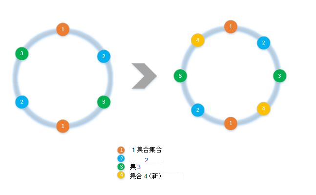
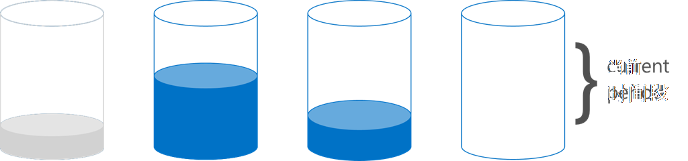

<properties 
    pageTitle="如何实现客户端与 Sdk 分区 |Microsoft Azure" 
    description="了解如何跨多个集合使用 Azure DocumentDB Sdk 分区 (shard) 数据和工艺要求" 
    services="documentdb" 
    authors="arramac" 
    manager="jhubbard" 
    editor="cgronlun" 
    documentationCenter=""/>

<tags 
    ms.service="documentdb" 
    ms.workload="data-services" 
    ms.tgt_pltfrm="na" 
    ms.devlang="na" 
    ms.topic="article" 
    ms.date="10/27/2016" 
    ms.author="arramac"/>

# <a name="how-to-partition-data-using-client-side-support-in-documentdb"></a>如何在 DocumentDB 中使用客户端支持的分区数据

Azure DocumentDB 支持[自动分区的集合](documentdb-partition-data.md)。 但是，没有使用的情况下十分有利，可严格控制精细划分问题。 为了减少所需的分区任务的模板代码，我们在.NET 中，Node.js，它更容易构建应用程序跨多个集合扩容的 Java Sdk 添加功能。

在本文中，我们来看看类和.NET SDK 和如何使用它们来开发分区的应用程序中的接口。 像 Java，Node.js Python 其他 Sdk 支持客户端分区类似方法和接口。

## <a name="client-side-partitioning-with-the-documentdb-sdk"></a>客户端分区 DocumentDB sdk

我们更加细化分区之前，让我们回顾一下一些基本的 DocumentDB 概念相关的分区。 Azure DocumentDB 数据库的每个帐户包含一套数据库，每个包含多个集合，其中每个可以包含存储的过程、 触发器、 Udf、 文档和相关的附件。 集合可以是单分区或分区本身，并且具有以下特点︰

- 集合提供性能隔离。 因此，没有在整理在同一集合中的类似文档中可以提高性能。 例如，对于时间系列数据，可能想要放置数据的位置对上个月，经常要查询，有更高配置的吞吐量集中而较旧的数据放置在具有低调配吞吐量的集合。
- ACID 事务即存储过程和触发器不能跨集合。 交易记录的内部集合中的单个分区密钥值范围内。
- 集合不会强制架构，因此它们可以使用相同类型或不同类型的 JSON 文档。

从版本[1.5.x 的 Azure DocumentDB Sdk](documentdb-sdk-dotnet.md)，您可以执行直接对数据库的文档操作。 在内部[DocumentClient](https://msdn.microsoft.com/library/azure/microsoft.azure.documents.client.documentclient.aspx)请求路由到相应的集合数据库的使用已指定 PartitionResolver。

>[AZURE.NOTE] [服务器端分区](documentdb-partition-data.md)REST API 2015-12-16 和 Sdk 1.6.0+ 中引入成为简单的使用案例的客户端的分区解析程序方法。 客户端分区但是更灵活，并可跨分区键控制性能隔离、 从多个分区，读取结果时控制的并行度和使用范围/空间划分与哈希方法。

例如，在.NET 中，每个 PartitionResolver 类是具有以下三种方法- [GetPartitionKey](https://msdn.microsoft.com/library/azure/microsoft.azure.documents.client.ipartitionresolver.getpartitionkey.aspx)、 [ResolveForCreate](https://msdn.microsoft.com/library/azure/microsoft.azure.documents.client.ipartitionresolver.resolveforcreate.aspx)和[ResolveForRead](https://msdn.microsoft.com/library/azure/microsoft.azure.documents.client.ipartitionresolver.resolveforread.aspx)的[IPartitionResolver](https://msdn.microsoft.com/library/azure/microsoft.azure.documents.client.ipartitionresolver.aspx)接口的具体实现。 LINQ 查询和 ReadFeed 迭代器的 ResolveForRead 方法内部使用循环访问所有匹配请求的分区键的集合。 同样，创建的 ResolveForCreate 方法可将路由到适当的分区创建的操作使用。 没有替换所需的更改、 删除和读取，因为它们使用文档已经包含了对相应集合的引用。

Sdk 还包含支持两个规范的分区技术、 哈希和范围查询，通过[HashPartitionResolver](https://msdn.microsoft.com/library/azure/microsoft.azure.documents.partitioning.hashpartitionresolver.aspx)和[RangePartitionResolver](https://msdn.microsoft.com/library/azure/mt126047.aspx)的两个类。 可以使用这些类可以轻松地添加到您的应用程序的逻辑分区。  

## <a name="add-partitioning-logic-and-register-the-partitionresolver"></a>添加分区的逻辑并注册 PartitionResolver 

下面是显示如何创建[HashPartitionResolver](https://msdn.microsoft.com/library/azure/microsoft.azure.documents.partitioning.hashpartitionresolver.aspx)和 DocumentClient 数据库中注册的代码段。

```cs
// Create some collections to partition data.
DocumentCollection collection1 = await client.CreateDocumentCollectionAsync(...);
DocumentCollection collection2 = await client.CreateDocumentCollectionAsync(...);

// Initialize a HashPartitionResolver using the "UserId" property and the two collection self-links.
HashPartitionResolver hashResolver = new HashPartitionResolver(
    u => ((UserProfile)u).UserId, 
    new string[] { collection1.SelfLink, collection2.SelfLink });

// Register the PartitionResolver with the database.
this.client.PartitionResolvers[database.SelfLink] = hashResolver;

```

## <a name="create-documents-in-a-partition"></a>在一个分区中创建的文档  

PartitionResolver 注册后，您可以执行创建并直接对数据库查询，如下所示。 在此示例中，SDK 使用 PartitionResolver 来提取用户 Id 和哈希处理，然后使用该值来路由到正确的集合创建操作。

```cs
Document johnDocument = await this.client.CreateDocumentAsync(
    database.SelfLink, new UserProfile("J1", "@John", Region.UnitedStatesEast));
Document ryanDocument = await this.client.CreateDocumentAsync(
    database.SelfLink, new UserProfile("U4", "@Ryan", Region.AsiaPacific, UserStatus.AppearAway));
```

## <a name="create-queries-against-partitions"></a>针对分区创建查询  

您可以查询通过传入数据库分区键中使用[CreateDocumentQuery](https://msdn.microsoft.com/library/azure/microsoft.azure.documents.linq.documentqueryable.createdocumentquery.aspx)方法。 查询返回单个结果集在数据库中所有映射到分区键的集合。  

```cs
// Query for John's document by ID - uses PartitionResolver to restrict the query to the partitions 
// containing @John. Again the query uses the database self link, and relies on the hash resolver 
// to route the appropriate collection.
var query = this.client.CreateDocumentQuery<UserProfile>(
    database.SelfLink, null, partitionResolver.GetPartitionKey(johnProfile))
    .Where(u => u.UserName == "@John");
johnProfile = query.AsEnumerable().FirstOrDefault();
```

## <a name="create-queries-against-all-collections-in-the-database"></a>在数据库中创建对所有集合的查询 

此外可以查询数据库中的所有集合中，并以如下所示，通过跳过的分区关键参数对结果进行枚举。

```cs
// Query for all "Available" users. Here since there is no partition key, the query is serially executed 
// across each partition/collection and returns a single result-set. 
query = this.client.CreateDocumentQuery<UserProfile>(database.SelfLink)
    .Where(u => u.Status == UserStatus.Available);
foreach (UserProfile activeUser in query)
{
    Console.WriteLine(activeUser);
}
```

## <a name="hash-partition-resolver"></a>哈希分区的冲突解决程序
使用哈希分区，分区指派基于值的哈希函数，使您能够均匀地分布到请求和数据的分区数。 这种方法通常用于数据生产或消耗从大量不同的客户端，并可用于存储用户配置文件、 目录项和 IoT （"Internet 的事物"） 遥测数据的分区。 在一个集合中的 DocumentDB 的服务器端分区支持也使用哈希分区。

**哈希分区︰**


跨*N*集合分区方案的简单的哈希值将采用任何文档，计算*hash(d) mod N*以确定它已放在哪个集合。 但这种简单的技术问题是，它不起作用时添加新的集合，或删除集合，因为这将需要获取 reshuffled 的几乎所有数据。 [一致性哈希](http://citeseerx.ist.psu.edu/viewdoc/summary?doi=10.1.1.23.3738) 是通过实现哈希方案的过程添加或删除集合中所需移动的数据量减到最小，解决了这一已知算法。

[HashPartitionResolver](https://msdn.microsoft.com/library/azure/microsoft.azure.documents.partitioning.hashpartitionresolver.aspx)类实现了逻辑通过[IHashGenerator](https://msdn.microsoft.com/library/azure/microsoft.azure.documents.partitioning.ihashgenerator.aspx)接口中指定的哈希函数生成一致性哈希环。 默认情况下，HashPartitionResolver 使用 MD5 哈希函数，但您可以换这出用散列实现。 HashPartitionResolver 内部创建 16 哈希或"虚拟节点"中的每个集合的哈希环为跨集合，实现文档的分布更均匀，但可以改变均衡与大量的客户端计算的数据偏斜度这个数字。

**与 HashPartitionResolver 一致哈希︰**


## <a name="range-partition-resolver"></a>范围分区的冲突解决程序

在按范围分区，分区分配基于分区键是否在某一范围内。 这通常用于分区的时间戳属性 (例如，于 2015 年 4 月 1 日之间于 2015 年 4 月 14 日 eventTime)。 [RangePartitionResolver](https://msdn.microsoft.com/library/azure/mt126047.aspx)类可以帮助您维护范围之间的映射\<T\>和自助链接的集合。 

[系列\<T\>](https://msdn.microsoft.com/library/azure/mt126048.aspx)是一个简单的类，用于管理范围实现 IComparable 任何类型\<T\>和 IEquatable\<T\>喜欢字符串或数字。 用于读取并创建，您可以传递任何任意范围内和冲突解决程序来标识与所请求的范围相交的分区中的区域标识所有候选集合。 执行对时间序列数据的范围查询时，此功能会很有用。

**范围分区︰**  

  

范围是不仅仅是一个离散值，有时称为"查找分区"时，按范围分区的一种特殊情况。 这通常用于为按区域 （例如斯堪的纳维亚的分区包含挪威，丹麦，瑞典） 分区或分区承租人在多租户应用程序。

## <a name="samples"></a>示例 

看看[DocumentDB 分区样本 Github 项目](https://github.com/Azure/azure-documentdb-dotnet/tree/287acafef76ad223577759b0170c8f08adb45755/samples/code-samples/Partitioning)包含有关如何使用这些 PartitionResolvers 和扩展这些代码段来实现您自己的冲突解决程序以适应特定的用例，如下所示︰ 

* 如何为 GetPartitionKey 中指定的任意 lambda 表达式并使用它来实现复合分区键或以不同的方式划分不同类型的对象。
* 如何创建简单[LookupPartitionResolver](https://github.com/Azure/azure-documentdb-dotnet/blob/287acafef76ad223577759b0170c8f08adb45755/samples/code-samples/Partitioning/Partitioners/LookupPartitionResolver.cs)使用手动查找表进行分区。 此模式通常用于分区基于离散值，如地区、 租户 ID 或应用程序名称。
* 如何创建集合基于一个定义命名方案、 IndexingPolicy 和需要注册针对新集合的存储的过程模板自动创建的[ManagedPartitionResolver](https://github.com/Azure/azure-documentdb-dotnet/blob/287acafef76ad223577759b0170c8f08adb45755/samples/code-samples/Partitioning/Partitioners/ManagedHashPartitionResolver.cs) 。
* 如何创建方案较[SpilloverPartitionResolver](https://github.com/Azure/azure-documentdb-dotnet/blob/287acafef76ad223577759b0170c8f08adb45755/samples/code-samples/Partitioning/Partitioners/SpilloverPartitionResolver.cs)如旧集合填满只是创建新的收藏集。
* 如何序列化和反 PartitionResolver 状态序列化 json 格式，以便您可以共享进程之间以及跨关机。 可以保存这些配置文件中或甚至在 DocumentDB 集合中。
* 动态添加和移除到分区的数据库分区的一个[DocumentClientHashPartitioningManager](https://github.com/Azure/azure-documentdb-dotnet/blob/287acafef76ad223577759b0170c8f08adb45755/samples/code-samples/Partitioning/Util/DocumentClientHashPartitioningManager.cs)类基于一致性哈希。 内部使用[TransitionHashPartitionResolver](https://github.com/Azure/azure-documentdb-dotnet/blob/287acafef76ad223577759b0170c8f08adb45755/samples/code-samples/Partitioning/Partitioners/TransitionHashPartitionResolver.cs)到路由读取和写入使用的四种模式-读取旧的分区方案 (ReadCurrent)，新的迁移过程 (ReadNext) 合并来自两个 (ReadBoth) 的结果或 （无） 在迁移期间将不可用。

这些示例是开放源代码，我们鼓励您提交请求请求与其他 DocumentDB 开发中获益的贡献。 请参阅有关如何参与指导的[贡献的准则](https://github.com/Azure/azure-documentdb-net/blob/master/Contributing.md)。  

>[AZURE.NOTE] 创建集合是速率有限的 DocumentDB，因此此处所示的示例方法可能需要几分钟才能完成。

##<a name="faq"></a>常见问题
**DocumentDB 支持服务器端分区？**

是的 DocumentDB 支持[服务器端分区](documentdb-partition-data.md)。 DocumentDB 还支持客户端分区通过客户端分区解析器更高级的用例。

**何时应使用服务器端与客户端的分区？**
对于大多数使用情况下，我们建议使用服务器端的分区，因为它处理管理任务，如数据分区和路由请求。 但是，如果您需要范围分区，或具有不同值的分区键之间的性能隔离专用的用例，然后客户端分区可能是最好的方法。

**如何添加或删除集合到我的分区方案？**

看一下如何实现重新分区的示例 DocumentClientHashPartitioningManager 示例项目中的实现。

**如何保持不变或与其他客户端共享我的分区配置？**

可以将序列化为 json 格式的分区程序状态，存储在配置文件中或甚至在 DocumentDB 的集合中。 请看一个示例的示例项目中的 RunSerializeDeserializeSample 方法。

**如何链接各种分区技术？**

您可以通过实现一个或多个现有冲突解决程序在内部使用自己 IPartitionResolver 链接 PartitionResolvers。 看看 TransitionHashPartitionResolver 示例的示例项目中。

##<a name="references"></a>引用
* [服务器端 DocumentDB 中的分区](documentdb-partition-data.md)
* [DocumentDB 集合和性能级别](documentdb-performance-levels.md)
* [分区在 Github 代码示例](https://github.com/Azure/azure-documentdb-dotnet/tree/287acafef76ad223577759b0170c8f08adb45755/samples/code-samples/Partitioning)
* [在 MSDN DocumentDB.NET SDK 文档](https://msdn.microsoft.com/library/azure/dn948556.aspx)
* [DocumentDB.NET 示例](https://github.com/Azure/azure-documentdb-net)
* [DocumentDB 限制](documentdb-limits.md)
* [DocumentDB 博客上性能提示](https://azure.microsoft.com/blog/2015/01/20/performance-tips-for-azure-documentdb-part-1-2/)
 
